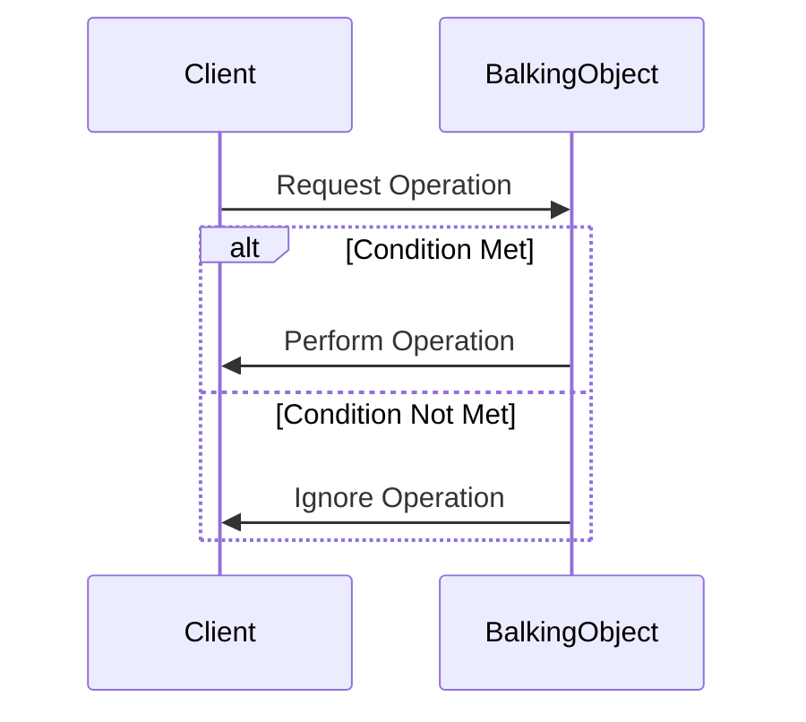

## 6.2.3 Use Cases and Examples

The Balking Pattern is a concurrency design pattern that ensures certain operations are executed only when specific conditions are met. This pattern is particularly useful in scenarios where performing an operation under inappropriate conditions could lead to resource wastage or inconsistent states. Let's delve into practical examples and explore how the Balking Pattern can be effectively implemented in Python.

### Resource Initialization

One of the most common use cases for the Balking Pattern is resource initialization. Consider a scenario where a database connection needs to be established. It's crucial that this connection is made only once to avoid redundant connections that could lead to resource exhaustion.

#### Example: Database Connection

```python
import threading

class DatabaseConnection:
    _instance = None
    _lock = threading.Lock()

    def __new__(cls):
        if cls._instance is None:
            with cls._lock:
                if cls._instance is None:
                    print("Establishing new database connection...")
                    cls._instance = super(DatabaseConnection, cls).__new__(cls)
                    # Simulate connection establishment
                    cls._instance.connection = cls._initialize_connection()
        return cls._instance

    @staticmethod
    def _initialize_connection():
        # Simulate a database connection setup
        return "Database Connection Established"

db1 = DatabaseConnection()
db2 = DatabaseConnection()

print(db1.connection)
print(db2.connection)
```

In this example, the `DatabaseConnection` class ensures that only one instance of the connection is created. The use of a lock (`_lock`) prevents race conditions in a multi-threaded environment, ensuring that the connection is established only once.

#### Benefits

- **Resource Efficiency**: Prevents the creation of multiple connections, saving system resources.
- **Consistency**: Ensures that all parts of the application use the same database connection, maintaining data consistency.

### Configuration Loading

Another practical application of the Balking Pattern is in loading configuration files. Configuration files should be loaded only once during the application's lifecycle to avoid unnecessary reloading and potential inconsistencies.

#### Example: Configuration Loader

```python
import threading

class ConfigurationLoader:
    _config = None
    _lock = threading.Lock()

    @classmethod
    def load_config(cls, filepath):
        if cls._config is None:
            with cls._lock:
                if cls._config is None:
                    print(f"Loading configuration from {filepath}...")
                    cls._config = cls._read_file(filepath)
        return cls._config

    @staticmethod
    def _read_file(filepath):
        # Simulate reading a configuration file
        return {"setting1": "value1", "setting2": "value2"}

config1 = ConfigurationLoader.load_config("config.yaml")
config2 = ConfigurationLoader.load_config("config.yaml")

print(config1)
print(config2)
```

Here, the `ConfigurationLoader` class ensures that the configuration file is read only once. The use of a lock ensures thread safety, preventing multiple threads from loading the configuration simultaneously.

#### Benefits

- **Performance**: Reduces the overhead of repeatedly reading configuration files.
- **Simplicity**: Simplifies the code by managing configuration loading in a centralized manner.

### Request Rate Limiting

In scenarios where requests need to be processed at a controlled rate, the Balking Pattern can be used to ignore requests that exceed a certain threshold. This is particularly useful in web servers or APIs to prevent overloading.

#### Example: Rate Limiter

```python
import time
import threading

class RateLimiter:
    _last_request_time = None
    _lock = threading.Lock()
    _rate_limit = 2  # seconds

    @classmethod
    def handle_request(cls):
        current_time = time.time()
        with cls._lock:
            if cls._last_request_time is None or (current_time - cls._last_request_time) >= cls._rate_limit:
                cls._last_request_time = current_time
                print("Processing request...")
                return True
            else:
                print("Request ignored due to rate limiting.")
                return False

RateLimiter.handle_request()
time.sleep(1)
RateLimiter.handle_request()
time.sleep(2)
RateLimiter.handle_request()
```

In this example, the `RateLimiter` class uses the Balking Pattern to process requests only if they are spaced out by at least `_rate_limit` seconds. This prevents the system from being overwhelmed by too many requests in a short period.

#### Benefits

- **System Stability**: Protects the system from being overwhelmed by excessive requests.
- **Controlled Access**: Ensures that resources are accessed at a manageable rate.

### Benefits of the Balking Pattern

The Balking Pattern offers several advantages:

- **Prevents Resource Wastage**: By ensuring operations are performed only when necessary, it conserves resources.
- **Simplifies Code**: Reduces the need for complex state management by encapsulating the conditions under which operations are performed.
- **Enhances Performance**: By avoiding unnecessary actions, it improves the overall performance of the application.

### Encouraging Thoughtful Application

When considering the use of the Balking Pattern, it's important to identify operations in your application that only make sense under certain conditions. Here are some guidelines:

- **Identify Conditional Operations**: Look for operations that have preconditions. If these preconditions are not met, the operation should be ignored.
- **Implement Clean Handling**: Use the Balking Pattern to handle these cases cleanly, ensuring that your code remains maintainable and efficient.
- **Consider Thread Safety**: In multi-threaded environments, ensure that your implementation is thread-safe to prevent race conditions.

### Try It Yourself

To deepen your understanding, try modifying the examples provided:

- **Database Connection**: Experiment with simulating a failure in connection establishment and see how the pattern handles it.
- **Configuration Loading**: Add a mechanism to reload the configuration if a certain condition is met (e.g., configuration file changes).
- **Rate Limiter**: Adjust the rate limit and observe how it affects request processing.

### Visualizing the Balking Pattern

To better understand the flow of the Balking Pattern, let's visualize it using a sequence diagram:



**Diagram Description**: This sequence diagram illustrates the decision-making process in the Balking Pattern. The `Client` requests an operation from the `BalkingObject`. If the condition is met, the operation is performed; otherwise, it is ignored.

### Knowledge Check

Before we conclude, let's reinforce what we've learned:

- **What is the primary purpose of the Balking Pattern?**
  - To ensure operations are performed only when specific conditions are met.
- **Why is thread safety important in the Balking Pattern?**
  - To prevent race conditions and ensure consistent behavior in multi-threaded environments.
- **How does the Balking Pattern improve system performance?**
  - By avoiding unnecessary operations, it conserves resources and enhances performance.

### Conclusion

The Balking Pattern is a powerful tool in the developer's toolkit, particularly in scenarios where operations should only be executed under certain conditions. By applying this pattern thoughtfully, you can create more efficient, maintainable, and robust applications.

Remember, this is just the beginning. As you progress, you'll discover more opportunities to apply the Balking Pattern and other design patterns in your projects. Keep experimenting, stay curious, and enjoy the journey!

## Quiz Time!



### What is the primary purpose of the Balking Pattern?

- [x] To ensure operations are performed only when specific conditions are met.
- [ ] To execute operations as soon as possible.
- [ ] To handle exceptions in operations.
- [ ] To optimize memory usage.

> **Explanation:** The Balking Pattern is used to ensure operations are performed only when specific conditions are met, preventing unnecessary actions.

### In the context of the Balking Pattern, why is thread safety important?

- [x] To prevent race conditions.
- [ ] To improve execution speed.
- [ ] To reduce memory usage.
- [ ] To enhance user interface responsiveness.

> **Explanation:** Thread safety is crucial to prevent race conditions and ensure consistent behavior in multi-threaded environments.

### How does the Balking Pattern improve system performance?

- [x] By avoiding unnecessary operations.
- [ ] By increasing the speed of all operations.
- [ ] By reducing the number of threads.
- [ ] By optimizing memory allocation.

> **Explanation:** The Balking Pattern improves performance by avoiding unnecessary operations, conserving resources.

### Which of the following is a use case for the Balking Pattern?

- [x] Resource Initialization
- [ ] Sorting Algorithms
- [ ] Data Encryption
- [ ] User Authentication

> **Explanation:** Resource Initialization is a common use case for the Balking Pattern, ensuring resources are initialized only once.

### What is a benefit of using the Balking Pattern in configuration loading?

- [x] Reduces overhead of repeated file reads.
- [ ] Increases file read speed.
- [ ] Enhances data encryption.
- [ ] Simplifies user authentication.

> **Explanation:** The Balking Pattern reduces the overhead of repeated file reads by loading configuration files only once.

### How does the Balking Pattern handle request rate limiting?

- [x] By ignoring requests that exceed a certain threshold.
- [ ] By processing all requests immediately.
- [ ] By queuing requests for later processing.
- [ ] By prioritizing requests based on importance.

> **Explanation:** The Balking Pattern handles request rate limiting by ignoring requests that exceed a certain threshold, preventing system overload.

### What should you consider when implementing the Balking Pattern in a multi-threaded environment?

- [x] Thread safety
- [ ] Memory usage
- [ ] User interface design
- [ ] Network latency

> **Explanation:** Thread safety is crucial when implementing the Balking Pattern in a multi-threaded environment to prevent race conditions.

### Which of the following is NOT a benefit of the Balking Pattern?

- [ ] Prevents resource wastage
- [ ] Simplifies code
- [x] Increases code complexity
- [ ] Enhances performance

> **Explanation:** The Balking Pattern simplifies code and enhances performance by preventing resource wastage, not increasing code complexity.

### What is a common scenario where the Balking Pattern is applied?

- [x] Configuration Loading
- [ ] Data Compression
- [ ] Image Processing
- [ ] Machine Learning

> **Explanation:** Configuration Loading is a common scenario where the Balking Pattern is applied, ensuring configurations are loaded only once.

### True or False: The Balking Pattern can be used to manage user authentication.

- [ ] True
- [x] False

> **Explanation:** The Balking Pattern is not typically used for user authentication; it is more suited for operations that should only occur under specific conditions, like resource initialization or configuration loading.


