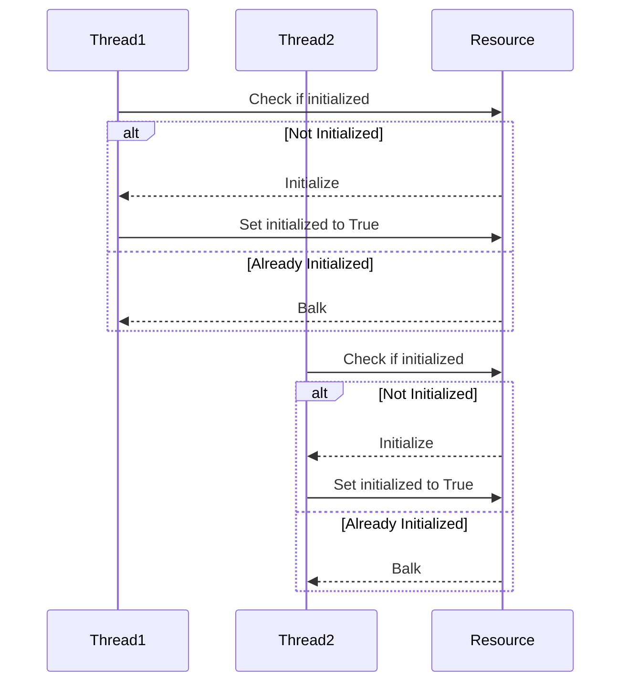

## 6.2 Balking Pattern

In the world of concurrent programming, managing resources efficiently is crucial. The **Balking Pattern** is a concurrency design pattern that helps manage operations by ignoring requests when an object is not in an appropriate state to handle them. This pattern is particularly useful in scenarios where it's more efficient to reject a request than to process it, thereby avoiding unnecessary processing and resource consumption.

### Intent and Motivation

The primary intent of the Balking Pattern is to prevent certain operations from proceeding when the object is not in a suitable state. This is achieved by checking the state of the object before performing any operation and "balking" or rejecting the request if the conditions are not met.

#### Motivation

Consider a scenario where multiple threads attempt to initialize a resource. If the resource is already initialized, any further initialization attempts are redundant and can lead to wasted computational resources or even errors. The Balking Pattern provides a way to handle such situations by allowing only the first successful initialization and ignoring subsequent attempts.

### Structure of the Balking Pattern

The Balking Pattern is structured around the concept of state checking. Before performing an operation, the object's state is checked to determine if the operation should proceed. If the state is not appropriate, the operation is ignored.

#### Conditions Leading to Balking

1. **Resource Initialization**: If a resource is already initialized, further initialization requests are balked.
2. **State Transitions**: If an object is in a transitional state where operations are not allowed, requests are balked.
3. **Concurrency Control**: In multi-threaded environments, if a resource is being accessed or modified by another thread, concurrent requests are balked.

#### State Checking

The state of the object is typically represented by a boolean flag or an enumeration. Before performing an operation, this state is checked. If the state indicates that the operation should not proceed, the request is ignored.

### Python Example: Resource Initialization

Let's implement a class that initializes a resource only if it hasn't been initialized yet. We'll also demonstrate how to handle multiple threads attempting to initialize the resource concurrently.

```python
import threading
import time

class Resource:
    def __init__(self):
        self.initialized = False
        self.lock = threading.Lock()

    def initialize(self):
        with self.lock:
            if self.initialized:
                print("Initialization already done. Balking...")
                return
            # Simulate resource initialization
            print("Initializing resource...")
            time.sleep(2)
            self.initialized = True
            print("Resource initialized.")

def worker(resource):
    print("Thread attempting to initialize resource.")
    resource.initialize()

resource = Resource()

threads = [threading.Thread(target=worker, args=(resource,)) for _ in range(5)]

for thread in threads:
    thread.start()

for thread in threads:
    thread.join()
```

### Explanation of the Example

- **Resource Class**: This class contains a boolean flag `initialized` to track the state of the resource and a `lock` to ensure thread safety.
- **initialize Method**: This method checks if the resource is already initialized. If it is, the method prints a message and returns immediately, effectively balking the request.
- **Threading**: Multiple threads attempt to initialize the resource concurrently. The use of a lock ensures that only one thread can perform the initialization at a time.

### Benefits and Challenges

#### Benefits

1. **Avoids Redundant Work**: By balking unnecessary operations, the pattern prevents redundant work and resource consumption.
2. **Simplifies Design**: Handling certain requests early by balking them simplifies the overall design and logic of the application.

#### Challenges

1. **Thread Safety**: Ensuring that state checks are thread-safe is crucial. This often requires the use of locks or other synchronization mechanisms.
2. **Communication**: Deciding how to communicate to the client that the operation was balked can be challenging. This might involve logging, raising exceptions, or returning specific values.

### Best Practices

- **Use Locks**: Employ locks or other synchronization mechanisms to protect state checks and updates, ensuring thread safety.
- **Document Balking**: Clearly document when and why an operation might be balked, providing guidance to other developers using the code.
- **Graceful Handling**: Implement graceful handling of balked requests, such as retry mechanisms or alternative actions.

### Encouraging Application

The Balking Pattern is particularly useful in resource-constrained environments where avoiding unnecessary operations can lead to significant performance improvements. It is also beneficial in initialization and caching mechanisms, where redundant operations can be costly.

### Try It Yourself

Encourage experimentation by suggesting modifications to the code examples. Try changing the sleep duration in the `initialize` method to simulate different initialization times. Observe how the pattern handles concurrent initialization attempts and how the lock ensures thread safety.

### Visualizing the Balking Pattern

To better understand the Balking Pattern, let's visualize the process using a sequence diagram.



### Knowledge Check

- **Question**: What is the primary purpose of the Balking Pattern?
- **Answer**: To prevent certain operations from proceeding when the object is not in a suitable state.

- **Question**: How does the Balking Pattern ensure thread safety?
- **Answer**: By using locks or other synchronization mechanisms to protect state checks and updates.

### Summary

The Balking Pattern is a powerful tool in the arsenal of concurrency design patterns. By efficiently managing operations and ignoring requests when an object is not in an appropriate state, it helps avoid redundant work and simplifies the design of concurrent applications. Remember, this is just the beginning. As you progress, you'll discover more patterns and techniques to enhance your concurrent programming skills. Keep experimenting, stay curious, and enjoy the journey!

## Quiz Time!



### What is the primary purpose of the Balking Pattern?

- [x] To prevent certain operations from proceeding when the object is not in a suitable state.
- [ ] To allow all operations to proceed regardless of the object's state.
- [ ] To ensure that operations are always executed in parallel.
- [ ] To manage memory allocation efficiently.

> **Explanation:** The Balking Pattern is designed to prevent operations from proceeding when the object is not in a suitable state, thereby avoiding unnecessary processing.

### How does the Balking Pattern ensure thread safety?

- [x] By using locks or other synchronization mechanisms to protect state checks and updates.
- [ ] By allowing multiple threads to access the resource simultaneously.
- [ ] By ignoring all requests regardless of the object's state.
- [ ] By using a single-threaded approach to handle requests.

> **Explanation:** The Balking Pattern ensures thread safety by using locks or other synchronization mechanisms to protect state checks and updates, preventing race conditions.

### What happens when a request is balked?

- [x] The request is ignored, and no further action is taken.
- [ ] The request is processed regardless of the object's state.
- [ ] The request is queued for later processing.
- [ ] The request is redirected to another resource.

> **Explanation:** When a request is balked, it is ignored, and no further action is taken, preventing unnecessary processing.

### In the provided Python example, what is the purpose of the `lock`?

- [x] To ensure that only one thread can initialize the resource at a time.
- [ ] To allow multiple threads to initialize the resource simultaneously.
- [ ] To prevent any thread from initializing the resource.
- [ ] To queue requests for resource initialization.

> **Explanation:** The `lock` ensures that only one thread can initialize the resource at a time, providing thread safety.

### What is a common use case for the Balking Pattern?

- [x] Resource initialization and caching mechanisms.
- [ ] Real-time data processing.
- [ ] High-frequency trading systems.
- [ ] Video game development.

> **Explanation:** The Balking Pattern is commonly used in resource initialization and caching mechanisms to avoid redundant operations.

### What should be documented when using the Balking Pattern?

- [x] When and why an operation might be balked.
- [ ] The exact time each operation is executed.
- [ ] The number of threads accessing the resource.
- [ ] The memory usage of each operation.

> **Explanation:** It is important to document when and why an operation might be balked to provide guidance to other developers using the code.

### What is a potential challenge when implementing the Balking Pattern?

- [x] Ensuring that state checks are thread-safe.
- [ ] Allowing all operations to proceed regardless of the object's state.
- [ ] Managing memory allocation efficiently.
- [ ] Ensuring that all requests are processed in parallel.

> **Explanation:** A potential challenge when implementing the Balking Pattern is ensuring that state checks are thread-safe, often requiring the use of locks or other synchronization mechanisms.

### How can balked requests be handled gracefully?

- [x] Implement retry mechanisms or alternative actions.
- [ ] Ignore them without any notification.
- [ ] Queue them for later processing.
- [ ] Redirect them to another resource.

> **Explanation:** Balked requests can be handled gracefully by implementing retry mechanisms or alternative actions, providing a better user experience.

### What is the role of the `initialize` method in the Python example?

- [x] To initialize the resource if it hasn't been initialized yet.
- [ ] To process all requests regardless of the resource's state.
- [ ] To queue requests for later processing.
- [ ] To prevent any initialization from occurring.

> **Explanation:** The `initialize` method is responsible for initializing the resource if it hasn't been initialized yet, balking any further initialization attempts.

### True or False: The Balking Pattern is useful in resource-constrained environments.

- [x] True
- [ ] False

> **Explanation:** True. The Balking Pattern is useful in resource-constrained environments where avoiding unnecessary operations can lead to significant performance improvements.


