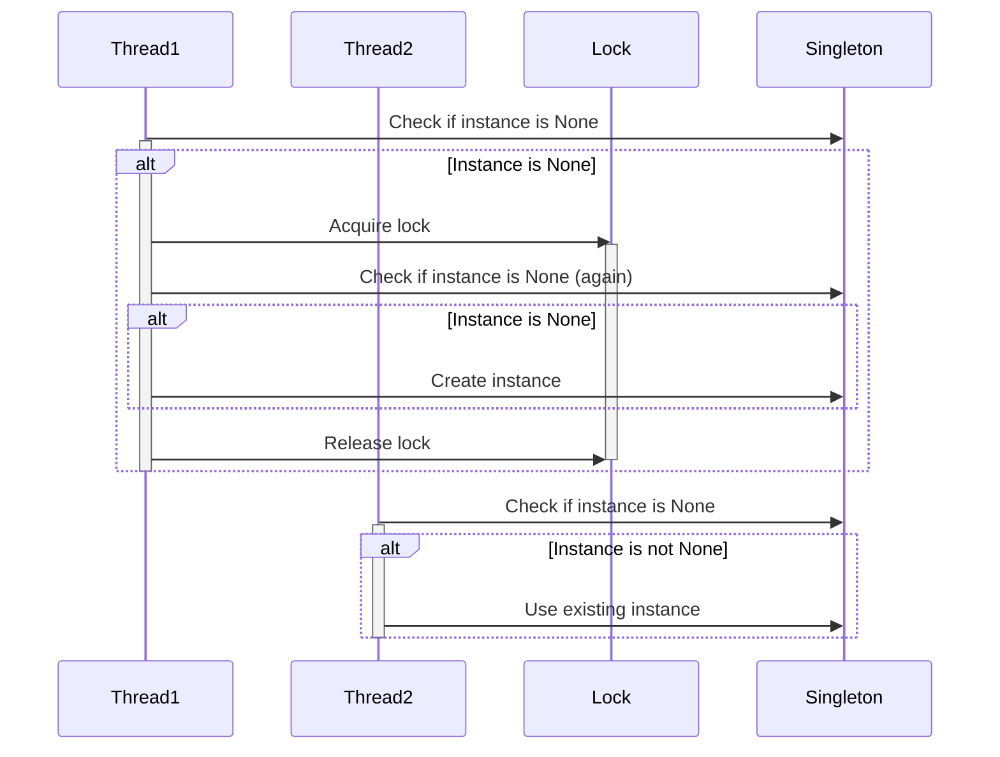

## 6.3.1 Implementing Double-Checked Locking in Python

In the realm of concurrent programming, ensuring that shared resources are accessed safely by multiple threads is a crucial aspect of designing robust systems. One common scenario is the lazy initialization of a resource, where we want to delay the creation of an object until it is needed, but also ensure that it is created only once, even in a multi-threaded environment. This is where the Double-Checked Locking (DCL) pattern comes into play. In this section, we will delve into the implementation of the Double-Checked Locking pattern in Python, providing detailed steps, code examples, and insights into Python-specific considerations.

### Understanding Double-Checked Locking

Double-Checked Locking is a design pattern used to reduce the overhead of acquiring a lock by first testing the locking criterion (the "lock hint") without actually acquiring the lock. Only if the check indicates that locking is required does the actual locking logic proceed. This pattern is particularly useful in scenarios where the lock is expensive to acquire and the operation protected by the lock is rarely needed.

#### Key Steps in Double-Checked Locking

1. **Initialization Check**: Before acquiring the lock, check if the instance is already created.
2. **Lock Acquisition**: If not, acquire a lock to prevent other threads from entering the initialization block.
3. **Second Check**: After acquiring the lock, check again if the instance has been initialized by another thread.
4. **Instance Creation**: If the instance is still not initialized, create it.

### Implementing Double-Checked Locking in Python

Let's walk through the implementation of a singleton class using the Double-Checked Locking pattern in Python.

#### Step-by-Step Implementation

1. **Initialization Check**: We start by checking if the instance is already created. This is done outside the lock to avoid unnecessary locking overhead.

2. **Lock Acquisition**: If the instance is not created, we acquire a lock. This ensures that no other thread can enter the critical section where the instance is created.

3. **Second Check**: Once the lock is acquired, we perform a second check to see if the instance has been created by another thread while the current thread was waiting for the lock.

4. **Instance Creation**: If the instance is still not created, we proceed to create it.

Here's how you can implement this in Python:

```python
import threading

class Singleton:
    _instance = None
    _lock = threading.Lock()

    def __new__(cls, *args, **kwargs):
        # First check (no locking)
        if cls._instance is None:
            with cls._lock:
                # Second check (with locking)
                if cls._instance is None:
                    cls._instance = super(Singleton, cls).__new__(cls, *args, **kwargs)
        return cls._instance

singleton1 = Singleton()
singleton2 = Singleton()

print(singleton1 is singleton2)  # Output: True
```

**Explanation of the Code:**

- **Initialization Check**: The first `if` statement checks if `_instance` is `None`. This check is performed without acquiring the lock to avoid unnecessary locking overhead.
- **Lock Acquisition**: The `with cls._lock:` statement acquires the lock, ensuring that only one thread can execute the block of code that follows.
- **Second Check**: Inside the locked block, we perform a second check to ensure that `_instance` is still `None`. This is necessary because another thread might have created the instance while the current thread was waiting for the lock.
- **Instance Creation**: If the instance is still not created, we proceed to create it using `super(Singleton, cls).__new__(cls, *args, **kwargs)`.

### Python-Specific Considerations

Python's Global Interpreter Lock (GIL) simplifies some aspects of threading by ensuring that only one thread executes Python bytecode at a time. However, the GIL does not eliminate the need for locks in certain cases, especially when dealing with shared resources or when performing operations that involve multiple steps.

#### Atomic Operations in Python

In CPython, access to simple variables is atomic. This means that operations like reading or writing a single variable are thread-safe. However, operations involving multiple steps, such as checking and setting a variable, are not atomic and require explicit synchronization.

### Synchronization Concerns

When implementing the Double-Checked Locking pattern, it is crucial to ensure that instance creation and assignment are thread-safe. This is achieved by using locks to synchronize access to the shared resource.

#### Using `@classmethod` or Module-Level Variables

In some cases, using a `@classmethod` or module-level variables can simplify the implementation of the Double-Checked Locking pattern. This approach can be particularly useful when the singleton instance needs to be accessed across different parts of the application.

Here's an example using a `@classmethod`:

```python
import threading

class Singleton:
    _instance = None
    _lock = threading.Lock()

    @classmethod
    def get_instance(cls):
        if cls._instance is None:
            with cls._lock:
                if cls._instance is None:
                    cls._instance = cls()
        return cls._instance

singleton1 = Singleton.get_instance()
singleton2 = Singleton.get_instance()

print(singleton1 is singleton2)  # Output: True
```

### Testing Tips

To ensure that your implementation of the Double-Checked Locking pattern is robust, it is important to test it under concurrent conditions. Here are some tips for testing:

- **Stress-Testing with Multiple Threads**: Create multiple threads that attempt to access the singleton instance simultaneously. This will help identify any race conditions or synchronization issues.
- **Using the `threading` Module**: The `threading` module in Python provides tools for creating and managing threads. Use this module to simulate concurrent access to the singleton instance.

Here's an example of how you can stress-test your implementation:

```python
import threading

def access_singleton():
    instance = Singleton.get_instance()
    print(f"Accessed instance: {instance}")

threads = [threading.Thread(target=access_singleton) for _ in range(10)]

for thread in threads:
    thread.start()

for thread in threads:
    thread.join()
```

### Visualizing Double-Checked Locking

To better understand the flow of the Double-Checked Locking pattern, let's visualize it using a sequence diagram.



**Diagram Explanation:**

- **Thread1** checks if the instance is `None`. Since it is, Thread1 acquires the lock.
- After acquiring the lock, Thread1 checks again if the instance is `None` and creates it.
- **Thread2** checks if the instance is `None`. Since it is not, Thread2 uses the existing instance.

### Knowledge Check

Before we wrap up, let's reinforce some key points:

- **Why is the second check necessary?** The second check ensures that the instance is not created multiple times by different threads.
- **What role does the lock play?** The lock ensures that only one thread can execute the critical section where the instance is created.
- **How does Python's GIL affect threading?** The GIL ensures that only one thread executes Python bytecode at a time, but it does not eliminate the need for locks when dealing with shared resources.

### Try It Yourself

Experiment with the code examples provided in this section. Try modifying the implementation to see how different approaches affect the behavior of the singleton instance. For example, you can:

- Remove the second check and observe the potential for multiple instance creation.
- Use a different synchronization mechanism, such as a `RLock`, and see how it affects the implementation.

### Conclusion

Implementing the Double-Checked Locking pattern in Python requires careful consideration of synchronization and thread safety. By following the steps outlined in this section, you can ensure that your singleton instances are created safely and efficiently in a multi-threaded environment. Remember, this is just the beginning. As you progress, you'll build more complex and interactive systems. Keep experimenting, stay curious, and enjoy the journey!

## Quiz Time!



### What is the primary purpose of the Double-Checked Locking pattern?

- [x] To ensure thread-safe lazy initialization of a singleton instance.
- [ ] To improve the performance of multi-threaded applications.
- [ ] To eliminate the need for locks in concurrent programming.
- [ ] To simplify the implementation of singleton classes.

> **Explanation:** The Double-Checked Locking pattern is primarily used to ensure that a singleton instance is initialized in a thread-safe manner, without incurring the overhead of acquiring a lock every time the instance is accessed.

### In the Double-Checked Locking pattern, why is the second check necessary after acquiring the lock?

- [x] To ensure that the instance has not been created by another thread while waiting for the lock.
- [ ] To improve the performance of the locking mechanism.
- [ ] To verify that the lock has been acquired successfully.
- [ ] To simplify the implementation of the singleton class.

> **Explanation:** The second check is necessary to ensure that the instance has not been created by another thread while the current thread was waiting for the lock. This prevents multiple instances from being created.

### How does Python's Global Interpreter Lock (GIL) affect threading?

- [x] It ensures that only one thread executes Python bytecode at a time.
- [ ] It eliminates the need for locks in concurrent programming.
- [ ] It allows multiple threads to execute Python bytecode simultaneously.
- [ ] It simplifies the implementation of multi-threaded applications.

> **Explanation:** Python's GIL ensures that only one thread executes Python bytecode at a time, which simplifies some aspects of threading but does not eliminate the need for locks when dealing with shared resources.

### Which module in Python provides tools for creating and managing threads?

- [x] `threading`
- [ ] `multiprocessing`
- [ ] `concurrent.futures`
- [ ] `asyncio`

> **Explanation:** The `threading` module in Python provides tools for creating and managing threads, allowing developers to implement concurrent programming patterns.

### What is the role of the lock in the Double-Checked Locking pattern?

- [x] To ensure that only one thread can execute the critical section where the instance is created.
- [ ] To improve the performance of the singleton class.
- [ ] To eliminate the need for the second check.
- [ ] To simplify the implementation of the singleton class.

> **Explanation:** The lock ensures that only one thread can execute the critical section where the instance is created, preventing multiple instances from being created.

### Which of the following is an atomic operation in CPython?

- [x] Reading a single variable
- [ ] Checking and setting a variable
- [ ] Performing arithmetic operations
- [ ] Accessing a list element

> **Explanation:** In CPython, reading or writing a single variable is atomic, meaning it is thread-safe. However, operations involving multiple steps, such as checking and setting a variable, are not atomic.

### What is the benefit of using a `@classmethod` for implementing a singleton?

- [x] It allows the singleton instance to be accessed across different parts of the application.
- [ ] It eliminates the need for locks in the implementation.
- [ ] It simplifies the implementation of the singleton class.
- [ ] It improves the performance of the singleton class.

> **Explanation:** Using a `@classmethod` allows the singleton instance to be accessed across different parts of the application, providing a centralized way to manage the instance.

### What is a potential issue if the second check is removed from the Double-Checked Locking pattern?

- [x] Multiple instances of the singleton may be created.
- [ ] The performance of the singleton class may decrease.
- [ ] The implementation of the singleton class may become more complex.
- [ ] The lock may not be acquired successfully.

> **Explanation:** If the second check is removed, multiple instances of the singleton may be created by different threads, as the first check is not sufficient to ensure thread safety.

### How can you stress-test the implementation of the Double-Checked Locking pattern?

- [x] Create multiple threads that attempt to access the singleton instance simultaneously.
- [ ] Remove the lock and observe the behavior of the singleton class.
- [ ] Use a different synchronization mechanism, such as a `RLock`.
- [ ] Simplify the implementation of the singleton class.

> **Explanation:** Stress-testing the implementation by creating multiple threads that attempt to access the singleton instance simultaneously can help identify any race conditions or synchronization issues.

### True or False: The Double-Checked Locking pattern eliminates the need for locks in concurrent programming.

- [ ] True
- [x] False

> **Explanation:** False. The Double-Checked Locking pattern does not eliminate the need for locks. It reduces the overhead of acquiring a lock by first testing the locking criterion without actually acquiring the lock.


