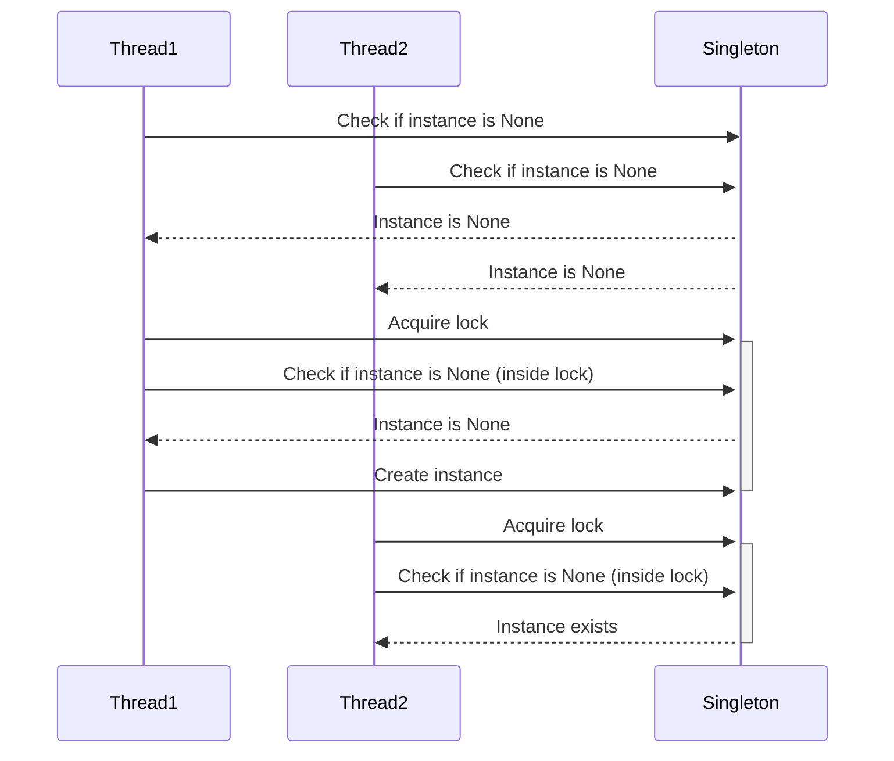

## 6.3.2 Thread Safety in Singleton

In the realm of software design patterns, the Singleton pattern is a well-known solution for ensuring that a class has only one instance and provides a global point of access to it. However, when working in a multi-threaded environment, ensuring that only one instance of the Singleton is created becomes a challenge. This section delves into the importance of thread safety in Singleton patterns, explores common pitfalls, and provides strategies for implementing a thread-safe Singleton in Python.

### Importance of Thread Safety in Singleton Patterns

In a concurrent environment, multiple threads may attempt to create an instance of a Singleton simultaneously. Without proper synchronization, this can lead to the creation of multiple instances, violating the Singleton principle. This issue is known as a race condition, where the outcome depends on the non-deterministic timing of events.

#### What Can Go Wrong Without Thread Safety?

Consider a scenario where two threads, Thread A and Thread B, simultaneously check if an instance of the Singleton exists. If the instance does not exist, both threads proceed to create a new instance. This results in two instances of the Singleton, which can lead to inconsistent behavior and resource conflicts.

### Code Example: Race Condition in Singleton

```python
class Singleton:
    _instance = None

    def __new__(cls, *args, **kwargs):
        if not cls._instance:
            cls._instance = super(Singleton, cls).__new__(cls, *args, **kwargs)
        return cls._instance

import threading

def create_singleton():
    singleton = Singleton()
    print(f"Singleton instance ID: {id(singleton)}")

threads = [threading.Thread(target=create_singleton) for _ in range(10)]

for thread in threads:
    thread.start()

for thread in threads:
    thread.join()
```

In this example, running the code may result in multiple instance IDs being printed, indicating that multiple Singleton instances were created.

### Ensuring Thread Safety: Double-Checked Locking

One common approach to ensure thread safety in Singleton patterns is the double-checked locking mechanism. This technique involves checking if an instance exists twice: once without locking and once with locking. This minimizes the performance cost of acquiring a lock.

#### Implementing Double-Checked Locking in Python

```python
import threading

class ThreadSafeSingleton:
    _instance = None
    _lock = threading.Lock()

    def __new__(cls, *args, **kwargs):
        if not cls._instance:
            with cls._lock:
                if not cls._instance:
                    cls._instance = super(ThreadSafeSingleton, cls).__new__(cls, *args, **kwargs)
        return cls._instance
```

In this implementation, the lock is only acquired if the instance is `None`, and a second check is performed within the lock to ensure that no other thread has created an instance in the meantime.

### Alternatives to Double-Checked Locking

While double-checked locking is a popular method, there are alternative approaches to implementing a thread-safe Singleton in Python.

#### Using Metaclasses

Metaclasses in Python can be used to control the creation of class instances, making them a suitable tool for implementing Singletons.

```python
class SingletonMeta(type):
    _instances = {}

    def __call__(cls, *args, **kwargs):
        if cls not in cls._instances:
            cls._instances[cls] = super(SingletonMeta, cls).__call__(*args, **kwargs)
        return cls._instances[cls]

class Singleton(metaclass=SingletonMeta):
    pass
```

In this example, the `SingletonMeta` metaclass ensures that only one instance of the `Singleton` class is created.

#### Implementing Singleton as a Module

In Python, modules are single-instance by nature. By implementing a Singleton as a module, you leverage Python's module system to ensure a single instance.

```python

class Singleton:
    def __init__(self):
        self.value = None

singleton_instance = Singleton()
```

By importing `singleton_instance` from `singleton_module`, you ensure that all parts of your application use the same instance.

### Best Practices for Thread-Safe Singleton Implementation

1. **Keep It Simple**: Avoid overcomplicating the Singleton implementation. Use the simplest approach that meets your requirements.

2. **Use Existing Libraries**: Consider using libraries or decorators that provide Singleton functionality out of the box.

3. **Test Thoroughly**: Implement unit tests to verify that only one instance is created, even under high concurrency.

4. **Simulate High-Concurrency Scenarios**: Use tools to simulate concurrent access and ensure that your Singleton implementation holds up under stress.

### Testing Thread Safety in Singleton

Testing is crucial to ensure that your Singleton implementation is thread-safe. Use unit tests to simulate concurrent access and verify that only one instance is created.

```python
import unittest
import threading

class TestSingleton(unittest.TestCase):
    def test_singleton_thread_safety(self):
        instances = []

        def create_instance():
            instance = ThreadSafeSingleton()
            instances.append(instance)

        threads = [threading.Thread(target=create_instance) for _ in range(100)]

        for thread in threads:
            thread.start()

        for thread in threads:
            thread.join()

        # Assert that all instances have the same ID
        self.assertTrue(all(id(instance) == id(instances[0]) for instance in instances))

if __name__ == "__main__":
    unittest.main()
```

### Visualizing Singleton with Double-Checked Locking

To better understand the flow of the double-checked locking mechanism, let's visualize it using a sequence diagram.



This diagram illustrates how the double-checked locking mechanism ensures that only one instance of the Singleton is created, even when multiple threads attempt to create an instance simultaneously.

### Encouraging Experimentation

To deepen your understanding of thread-safe Singleton patterns, try modifying the code examples provided. Experiment with different synchronization mechanisms or implement your own Singleton pattern using a different approach.

### References and Further Reading

- [Python's Global Interpreter Lock (GIL)](https://docs.python.org/3/glossary.html#term-global-interpreter-lock)
- [Threading in Python](https://docs.python.org/3/library/threading.html)
- [Python Metaclasses](https://realpython.com/python-metaclasses/)

### Knowledge Check

Before moving on, take a moment to reflect on what you've learned. Consider the following questions:

- Why is thread safety important in Singleton patterns?
- What are the potential pitfalls of not ensuring thread safety?
- How does double-checked locking help in creating a thread-safe Singleton?
- What are some alternative approaches to implementing a Singleton in Python?

### Embrace the Journey

Remember, mastering design patterns is a journey. As you continue to explore and implement these patterns, you'll gain a deeper understanding of their nuances and applications. Keep experimenting, stay curious, and enjoy the process!

## Quiz Time!



### Why is thread safety important in Singleton patterns?

- [x] To prevent multiple instances from being created in a concurrent environment.
- [ ] To ensure the Singleton class has multiple instances.
- [ ] To allow each thread to have its own instance.
- [ ] To simplify the Singleton implementation.

> **Explanation:** Thread safety is crucial in Singleton patterns to prevent multiple instances from being created when multiple threads try to access the Singleton simultaneously.

### What can happen if a Singleton is not thread-safe?

- [x] Multiple instances may be created.
- [ ] The Singleton will become immutable.
- [ ] The Singleton will not be accessible.
- [ ] The Singleton will automatically become thread-safe.

> **Explanation:** Without thread safety, race conditions can occur, leading to the creation of multiple instances.

### What is double-checked locking?

- [x] A technique to minimize locking overhead by checking the instance twice.
- [ ] A method to ensure multiple instances are created.
- [ ] A way to lock the Singleton permanently.
- [ ] A process to remove locks from the Singleton.

> **Explanation:** Double-checked locking checks the instance twice, once without locking and once with locking, to minimize the performance cost.

### How can metaclasses help in implementing a Singleton?

- [x] By controlling the creation of class instances.
- [ ] By allowing multiple instances to be created.
- [ ] By making the Singleton immutable.
- [ ] By simplifying the Singleton's interface.

> **Explanation:** Metaclasses can control instance creation, ensuring only one instance is created.

### What is a benefit of using modules for Singleton implementation?

- [x] Modules are inherently single-instance in Python.
- [ ] Modules allow multiple instances by default.
- [ ] Modules simplify the Singleton's interface.
- [ ] Modules make the Singleton immutable.

> **Explanation:** In Python, modules are single-instance by nature, making them suitable for Singleton implementation.

### What is a best practice for implementing a thread-safe Singleton?

- [x] Keep the implementation simple.
- [ ] Use complex locking mechanisms.
- [ ] Avoid using any synchronization.
- [ ] Ensure each thread has its own instance.

> **Explanation:** Keeping the implementation simple helps avoid unnecessary complexity and potential errors.

### How can you test a Singleton for thread safety?

- [x] Simulate high-concurrency scenarios.
- [ ] Avoid testing under concurrent conditions.
- [ ] Use only a single thread for testing.
- [ ] Ensure each test creates a new instance.

> **Explanation:** Simulating high-concurrency scenarios helps verify that only one instance is created.

### What is a potential drawback of double-checked locking?

- [x] It can be complex to implement correctly.
- [ ] It always results in multiple instances.
- [ ] It prevents any instance from being created.
- [ ] It simplifies the Singleton's interface.

> **Explanation:** Double-checked locking can be complex and error-prone if not implemented correctly.

### Why might you choose to use a library for Singleton implementation?

- [x] To leverage existing, well-tested solutions.
- [ ] To ensure the Singleton is not thread-safe.
- [ ] To create multiple instances by default.
- [ ] To avoid using any synchronization.

> **Explanation:** Libraries often provide well-tested solutions that handle Singleton creation and thread safety.

### True or False: Double-checked locking is the only way to ensure thread safety in Singleton patterns.

- [ ] True
- [x] False

> **Explanation:** Double-checked locking is one method, but there are other approaches, such as using metaclasses or modules.


