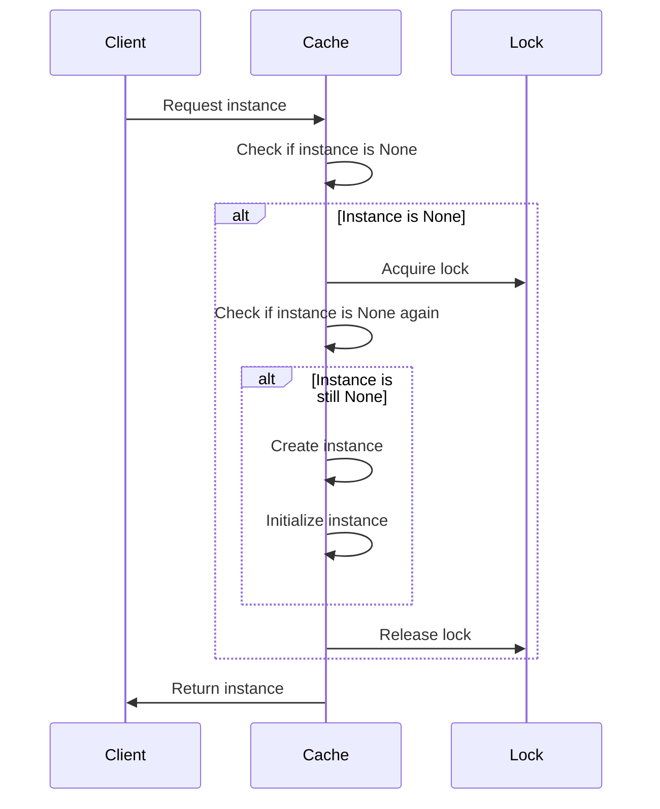

## 6.3.3 Use Cases and Examples

The Double-Checked Locking (DCL) pattern is a concurrency design pattern used to reduce the overhead of acquiring a lock by first testing the locking criterion without actually acquiring the lock. This pattern is particularly useful in scenarios where the cost of acquiring a lock is high and the lock is often uncontended. In this section, we will explore practical use cases where double-checked locking is necessary, provide examples, and discuss the benefits and trade-offs of using this pattern.

### Practical Use Cases

#### 1. Caching Systems

**Lazy Initialization of Caches**

In caching systems, resources are often expensive to create and should only be initialized when absolutely necessary. Double-checked locking can be used to ensure that a cache is initialized only once and only when it is needed. This approach avoids the overhead of locking every time the cache is accessed.

**Example:**

```python
import threading

class Cache:
    _instance = None
    _lock = threading.Lock()

    def __new__(cls):
        if cls._instance is None:
            with cls._lock:
                if cls._instance is None:
                    cls._instance = super(Cache, cls).__new__(cls)
                    cls._instance.initialize_cache()
        return cls._instance

    def initialize_cache(self):
        # Simulate an expensive operation
        print("Initializing cache...")
        self.data = {"key": "value"}

    def get_data(self, key):
        return self.data.get(key)

cache = Cache()
print(cache.get_data("key"))
```

In this example, the `Cache` class uses double-checked locking to ensure that the cache is initialized only once. The `initialize_cache` method is called only when the cache is first accessed, ensuring efficient use of resources.

#### 2. Configuration Managers

**Ensuring Singleton Configuration Access**

Configuration managers often need to read settings from a file or a database. It is crucial to ensure that only one instance of the configuration manager is created to avoid inconsistencies. Double-checked locking can be used to achieve this.

**Example:**

```python
import threading

class ConfigurationManager:
    _instance = None
    _lock = threading.Lock()

    def __new__(cls):
        if cls._instance is None:
            with cls._lock:
                if cls._instance is None:
                    cls._instance = super(ConfigurationManager, cls).__new__(cls)
                    cls._instance.load_configuration()
        return cls._instance

    def load_configuration(self):
        # Simulate loading configuration
        print("Loading configuration...")
        self.settings = {"setting1": "value1", "setting2": "value2"}

    def get_setting(self, key):
        return self.settings.get(key)

config_manager = ConfigurationManager()
print(config_manager.get_setting("setting1"))
```

Here, the `ConfigurationManager` class ensures that the configuration is loaded only once, even in a multi-threaded environment. This prevents multiple reads from the configuration source, which could lead to performance degradation or inconsistencies.

#### 3. Connection Pools

**Initializing Database Connection Pools**

Connection pools are used to manage a pool of database connections. Initializing a pool can be resource-intensive, and it is important to ensure that the pool is initialized only once. Double-checked locking can be used to control this initialization.

**Example:**

```python
import threading

class ConnectionPool:
    _instance = None
    _lock = threading.Lock()

    def __new__(cls):
        if cls._instance is None:
            with cls._lock:
                if cls._instance is None:
                    cls._instance = super(ConnectionPool, cls).__new__(cls)
                    cls._instance.initialize_pool()
        return cls._instance

    def initialize_pool(self):
        # Simulate initializing a connection pool
        print("Initializing connection pool...")
        self.connections = ["conn1", "conn2", "conn3"]

    def get_connection(self):
        return self.connections.pop()

pool = ConnectionPool()
print(pool.get_connection())
```

In this example, the `ConnectionPool` class uses double-checked locking to ensure that the pool is initialized only once. This ensures that the pool is ready for use without unnecessary overhead.

### Benefits and Trade-offs

#### Benefits

- **Performance Improvement**: By avoiding unnecessary locking, double-checked locking can significantly improve performance, especially in scenarios where the lock is often uncontended.
- **Efficient Resource Use**: The pattern ensures that resources are initialized only when necessary, leading to efficient use of system resources.

#### Trade-offs

- **Increased Code Complexity**: Implementing double-checked locking can increase code complexity, making it harder to read and maintain.
- **Potential for Subtle Threading Bugs**: If not implemented correctly, double-checked locking can introduce subtle threading bugs, such as race conditions.

### When to Use Double-Checked Locking

- **Performance Gain Justifies Complexity**: Use double-checked locking when the performance gain from avoiding unnecessary locking justifies the added complexity.
- **Evaluate Simpler Patterns First**: Before implementing double-checked locking, consider simpler thread-safe patterns, such as using a `threading.Lock` without double-checking, to determine if they meet your performance requirements.

### Visualizing Double-Checked Locking

To better understand the flow of double-checked locking, let's visualize the process using a sequence diagram.



This diagram illustrates the double-checked locking process, where the client requests an instance, and the cache checks if the instance is `None`. If it is, a lock is acquired, and the check is performed again before creating and initializing the instance.

### Try It Yourself

To deepen your understanding of double-checked locking, try modifying the examples provided:

1. **Add More Complexity**: Introduce additional methods to the `Cache`, `ConfigurationManager`, or `ConnectionPool` classes and ensure they are thread-safe.
2. **Simulate Multi-threading**: Use Python's `threading` module to simulate multiple threads accessing the same instance and observe the behavior.
3. **Experiment with Alternatives**: Replace double-checked locking with a simpler locking mechanism and compare the performance.

### Knowledge Check

- **What are the key benefits of using double-checked locking?**
- **What are the potential risks associated with double-checked locking?**
- **In which scenarios is double-checked locking most beneficial?**

### Summary

Double-checked locking is a powerful pattern for optimizing performance and resource use in multi-threaded applications. While it introduces complexity, its benefits can outweigh the trade-offs in scenarios where performance is critical. By understanding when and how to use this pattern, you can make informed decisions that enhance the efficiency and reliability of your applications.

---

## Quiz Time!



### What is the primary benefit of using double-checked locking?

- [x] Performance improvement by avoiding unnecessary locking
- [ ] Simplifying code structure
- [ ] Ensuring thread safety without locks
- [ ] Reducing memory usage

> **Explanation:** Double-checked locking improves performance by reducing the overhead of acquiring a lock when it is not necessary.

### Which of the following is a potential trade-off of using double-checked locking?

- [x] Increased code complexity
- [ ] Decreased performance
- [ ] Simpler code maintenance
- [ ] Reduced resource usage

> **Explanation:** Double-checked locking can increase code complexity, making it harder to maintain.

### In which scenario is double-checked locking most beneficial?

- [x] When the performance gain justifies the added complexity
- [ ] When simplicity is more important than performance
- [ ] When thread safety is not a concern
- [ ] When memory usage needs to be minimized

> **Explanation:** Double-checked locking is beneficial when the performance gain from avoiding unnecessary locking outweighs the complexity it introduces.

### What is a common use case for double-checked locking?

- [x] Lazy initialization of caches
- [ ] Simplifying algorithm design
- [ ] Reducing code redundancy
- [ ] Enhancing user interface responsiveness

> **Explanation:** Double-checked locking is commonly used for lazy initialization of caches to improve performance.

### Which pattern should be considered before implementing double-checked locking?

- [x] Simpler thread-safe patterns
- [ ] Observer pattern
- [ ] Factory pattern
- [ ] Strategy pattern

> **Explanation:** Simpler thread-safe patterns should be considered first to determine if they meet performance requirements without the complexity of double-checked locking.

### What is a key feature of double-checked locking?

- [x] Checking the locking criterion before acquiring the lock
- [ ] Acquiring a lock every time a resource is accessed
- [ ] Avoiding the use of locks altogether
- [ ] Using multiple locks for different resources

> **Explanation:** Double-checked locking involves checking the locking criterion before acquiring the lock to avoid unnecessary locking.

### How does double-checked locking improve resource efficiency?

- [x] By delaying initialization until necessary
- [ ] By initializing resources at startup
- [ ] By using more memory for caching
- [ ] By reducing the number of threads

> **Explanation:** Double-checked locking delays initialization until necessary, leading to efficient use of resources.

### What is a potential risk of incorrect implementation of double-checked locking?

- [x] Subtle threading bugs
- [ ] Increased memory usage
- [ ] Simplified code structure
- [ ] Enhanced performance

> **Explanation:** Incorrect implementation of double-checked locking can lead to subtle threading bugs, such as race conditions.

### True or False: Double-checked locking is always the best choice for thread-safe initialization.

- [ ] True
- [x] False

> **Explanation:** Double-checked locking is not always the best choice; simpler thread-safe patterns should be considered first.

### Which diagram type is useful for visualizing the double-checked locking process?

- [x] Sequence diagram
- [ ] Class diagram
- [ ] Flowchart
- [ ] State diagram

> **Explanation:** A sequence diagram is useful for visualizing the process of double-checked locking, showing the interactions between components.


