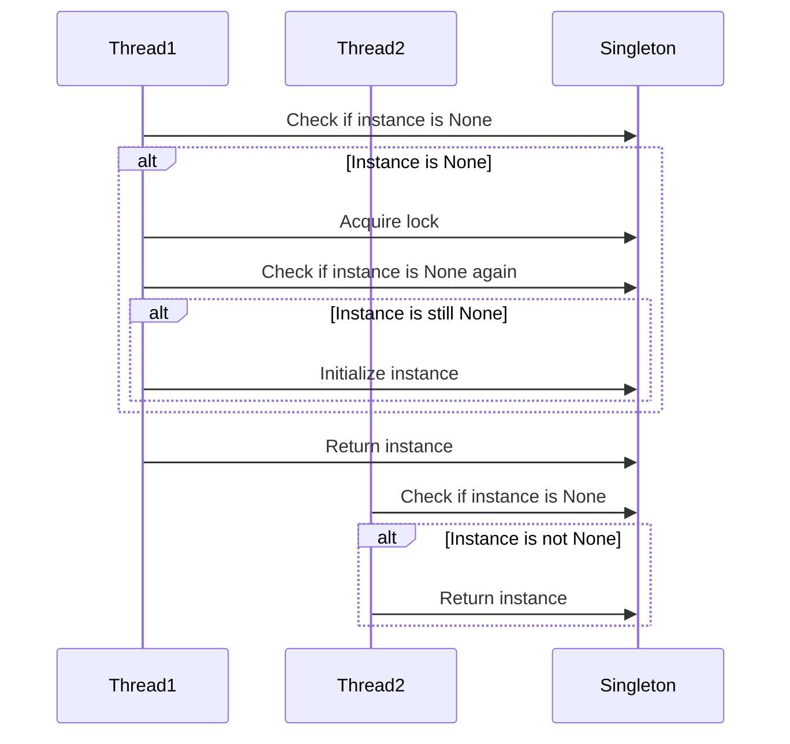

## 6.3 Double-Checked Locking Pattern

Concurrency in programming is a complex yet essential aspect of modern software development, especially when dealing with performance-critical applications. The Double-Checked Locking Pattern is a concurrency design pattern aimed at reducing the overhead of acquiring a lock by checking the locking criterion both before and after the lock is acquired. This pattern is particularly useful in scenarios where you need to ensure that a resource, such as a singleton instance, is initialized only once in a thread-safe manner.

### Purpose and Typical Use Cases

The primary purpose of the Double-Checked Locking Pattern is to minimize the performance cost associated with synchronization. In multi-threaded applications, acquiring and releasing locks can be expensive operations. By checking whether the resource needs to be initialized before acquiring the lock, we can avoid unnecessary synchronization, thereby improving performance.

#### Use Cases

1. **Thread-Safe Singleton Initialization**: The most common use case for the Double-Checked Locking Pattern is in the implementation of a singleton class. A singleton ensures that a class has only one instance and provides a global point of access to it. In a multi-threaded environment, it is crucial to ensure that the singleton instance is created only once, even if multiple threads attempt to access it simultaneously.

2. **Lazy Initialization**: This pattern can also be applied to scenarios where resources are initialized lazily, i.e., only when they are needed. This can be beneficial in reducing the startup time of an application and conserving resources until they are actually required.

### Structure of the Double-Checked Locking Pattern

The Double-Checked Locking Pattern involves a two-step verification process to ensure that a resource is initialized safely and efficiently. Here's a breakdown of the steps involved:

1. **Initial Check**: Before acquiring the lock, check if the resource (e.g., singleton instance) is already initialized. If it is, return the resource immediately, avoiding the need for synchronization.

2. **Lock Acquisition and Second Check**: If the resource is not initialized, acquire a lock to ensure that no other thread can initialize the resource simultaneously. Once the lock is acquired, perform a second check to see if the resource is still uninitialized. This second check is crucial because another thread might have initialized the resource between the first check and the lock acquisition.

3. **Resource Initialization**: If the resource is still uninitialized after acquiring the lock, proceed to initialize it. This ensures that the resource is created only once, even in a multi-threaded environment.

### Python Example: Implementing a Singleton with Double-Checked Locking

Let's implement a singleton class using the Double-Checked Locking Pattern in Python. We'll use the `threading.Lock` for synchronization.

```python
import threading

class Singleton:
    _instance = None
    _lock = threading.Lock()

    def __new__(cls, *args, **kwargs):
        if cls._instance is None:
            with cls._lock:
                if cls._instance is None:
                    cls._instance = super(Singleton, cls).__new__(cls, *args, **kwargs)
        return cls._instance

singleton1 = Singleton()
singleton2 = Singleton()

print(singleton1 is singleton2)  # Output: True
```

#### Explanation

- **Initial Check**: We first check if `_instance` is `None`. If it is not `None`, the singleton instance has already been created, and we can return it immediately.
  
- **Lock Acquisition**: If `_instance` is `None`, we acquire the lock using `with cls._lock:`. This ensures that only one thread can execute the block of code that follows.

- **Second Check and Initialization**: Inside the locked block, we perform a second check to ensure `_instance` is still `None`. If it is, we proceed to create the singleton instance using `super(Singleton, cls).__new__(cls, *args, **kwargs)`.

### Potential Issues with Double-Checked Locking

While the Double-Checked Locking Pattern is a powerful tool for optimizing performance, it is not without its pitfalls. In some programming languages, issues related to memory models can cause this pattern to fail. However, Python's Global Interpreter Lock (GIL) simplifies some concurrency concerns, making this pattern more reliable in Python than in languages like Java or C++.

#### Memory Model Concerns

In languages with more complex memory models, such as Java, the Double-Checked Locking Pattern can fail due to issues with instruction reordering and visibility of changes across threads. These issues can lead to a situation where a thread sees a partially constructed object, which can cause unexpected behavior.

#### Python's GIL

Python's GIL ensures that only one thread executes Python bytecode at a time, which simplifies many concurrency issues. However, it also means that Python's threading is not truly concurrent on multi-core systems. Despite this, the GIL does not eliminate the need for synchronization in all cases, especially when dealing with I/O-bound operations or when using external libraries that release the GIL.

### Best Practices for Using Double-Checked Locking

1. **Use Volatile or Synchronized Variables**: In languages that support it, use volatile or synchronized variables to ensure that changes to the resource are visible to all threads. In Python, this is less of a concern due to the GIL, but it's still good practice to ensure that the resource is properly synchronized.

2. **Ensure Atomicity**: Make sure that the resource initialization is atomic, meaning it cannot be interrupted by other threads. This is typically achieved by placing the initialization code within a synchronized block.

3. **Thorough Testing**: Given the complexity of concurrency issues, it's crucial to thoroughly test your implementation of the Double-Checked Locking Pattern. Use tools like Python's `unittest` or `pytest` to create test cases that simulate multi-threaded access to the resource.

4. **Consider Alternatives**: In some cases, simpler synchronization techniques may be sufficient. For example, using a simple lock around the entire resource initialization process may be easier to implement and understand, especially if the performance impact is negligible.

### Cautious Use of Double-Checked Locking

While the Double-Checked Locking Pattern can be an effective way to optimize performance, it should be used with caution. Here are some considerations to keep in mind:

- **Complexity vs. Benefit**: Weigh the complexity of implementing and maintaining the Double-Checked Locking Pattern against the performance benefits it provides. In some cases, the added complexity may not be justified.

- **Alternative Approaches**: Consider alternative approaches, such as using Python's `threading.RLock` for reentrant locks or the `concurrent.futures` module for managing thread pools. These alternatives can provide simpler and more robust solutions for certain concurrency problems.

- **Language-Specific Concerns**: Be aware of language-specific concerns, such as Python's GIL, that may affect the behavior of the Double-Checked Locking Pattern. Understanding these nuances can help you make informed decisions about when and how to use this pattern.

### Try It Yourself

To deepen your understanding of the Double-Checked Locking Pattern, try modifying the example code provided above:

1. **Add Logging**: Insert logging statements to track when the singleton instance is created and when the lock is acquired. This can help you visualize the flow of execution in a multi-threaded environment.

2. **Simulate Concurrent Access**: Create multiple threads that attempt to access the singleton instance simultaneously. Use Python's `threading` module to manage these threads and observe how the pattern ensures that only one instance is created.

3. **Experiment with Alternatives**: Implement a simple lock-based singleton without double-checked locking and compare its performance with the double-checked version. This can help you understand the trade-offs involved in using this pattern.

### Visualizing the Double-Checked Locking Pattern

To better understand the flow of the Double-Checked Locking Pattern, let's visualize the process using a sequence diagram.



### Conclusion

The Double-Checked Locking Pattern is a valuable tool in the arsenal of concurrency patterns, offering a way to optimize performance by reducing unnecessary synchronization. While it is particularly useful for implementing thread-safe singletons, it requires careful consideration and thorough testing to ensure its correctness. By understanding the nuances of this pattern and the context in which it is applied, you can make informed decisions about when and how to use it in your Python applications.

Remember, this is just the beginning. As you progress, you'll encounter more complex concurrency challenges. Keep experimenting, stay curious, and enjoy the journey of mastering design patterns in Python!

## Quiz Time!



### What is the primary purpose of the Double-Checked Locking Pattern?

- [x] To reduce the overhead of acquiring a lock by checking the locking criterion before and after the lock is acquired.
- [ ] To ensure that a class has only one instance.
- [ ] To simplify the implementation of thread-safe code.
- [ ] To eliminate the need for synchronization in multi-threaded applications.

> **Explanation:** The Double-Checked Locking Pattern aims to minimize the performance cost associated with synchronization by checking if a resource needs to be initialized both before and after acquiring a lock.

### In which scenario is the Double-Checked Locking Pattern most commonly used?

- [x] Thread-safe singleton initialization
- [ ] Implementing complex algorithms
- [ ] Managing database connections
- [ ] Handling user input in GUI applications

> **Explanation:** The Double-Checked Locking Pattern is most commonly used in implementing thread-safe singletons, ensuring that a singleton instance is created only once in a multi-threaded environment.

### What is the role of the second check in the Double-Checked Locking Pattern?

- [x] To ensure that the resource is still uninitialized after acquiring the lock
- [ ] To release the lock if the resource is already initialized
- [ ] To improve the performance of the pattern
- [ ] To handle exceptions that may occur during initialization

> **Explanation:** The second check ensures that the resource is still uninitialized after acquiring the lock, preventing multiple threads from initializing the resource simultaneously.

### Which Python feature simplifies some concurrency concerns in the Double-Checked Locking Pattern?

- [x] Global Interpreter Lock (GIL)
- [ ] List comprehensions
- [ ] Decorators
- [ ] Context managers

> **Explanation:** Python's Global Interpreter Lock (GIL) simplifies some concurrency concerns by ensuring that only one thread executes Python bytecode at a time.

### What is a potential issue with the Double-Checked Locking Pattern in some programming languages?

- [x] Memory model issues can cause the pattern to fail
- [ ] It is not compatible with object-oriented programming
- [ ] It requires too much memory
- [ ] It cannot be used with dynamic typing

> **Explanation:** In some programming languages, memory model issues such as instruction reordering and visibility of changes across threads can cause the Double-Checked Locking Pattern to fail.

### What is a best practice when using the Double-Checked Locking Pattern?

- [x] Ensure that the instance creation is atomic and visible to all threads
- [ ] Use it for all singleton implementations
- [ ] Avoid using locks altogether
- [ ] Implement it without testing

> **Explanation:** Ensuring that the instance creation is atomic and visible to all threads is a best practice when using the Double-Checked Locking Pattern to prevent concurrency issues.

### Why should the Double-Checked Locking Pattern be used with caution?

- [x] It adds complexity and may not always provide significant performance benefits
- [ ] It is not supported in Python
- [ ] It is only useful for single-threaded applications
- [ ] It cannot be tested

> **Explanation:** The Double-Checked Locking Pattern should be used with caution because it adds complexity and may not always provide significant performance benefits compared to simpler synchronization techniques.

### What is an alternative approach to using the Double-Checked Locking Pattern in Python?

- [x] Using a simple lock around the entire resource initialization process
- [ ] Using list comprehensions for initialization
- [ ] Avoiding the use of singletons
- [ ] Implementing the pattern in C++

> **Explanation:** An alternative approach to using the Double-Checked Locking Pattern in Python is to use a simple lock around the entire resource initialization process, which may be easier to implement and understand.

### How can you test the Double-Checked Locking Pattern in Python?

- [x] Use Python's `unittest` or `pytest` to create test cases that simulate multi-threaded access
- [ ] Test it in a single-threaded environment
- [ ] Use print statements to debug
- [ ] Avoid testing as it is not necessary

> **Explanation:** To test the Double-Checked Locking Pattern in Python, you can use Python's `unittest` or `pytest` to create test cases that simulate multi-threaded access to the resource.

### True or False: Python's GIL eliminates the need for synchronization in all cases.

- [ ] True
- [x] False

> **Explanation:** False. While Python's GIL simplifies some concurrency concerns, it does not eliminate the need for synchronization in all cases, especially when dealing with I/O-bound operations or external libraries that release the GIL.


