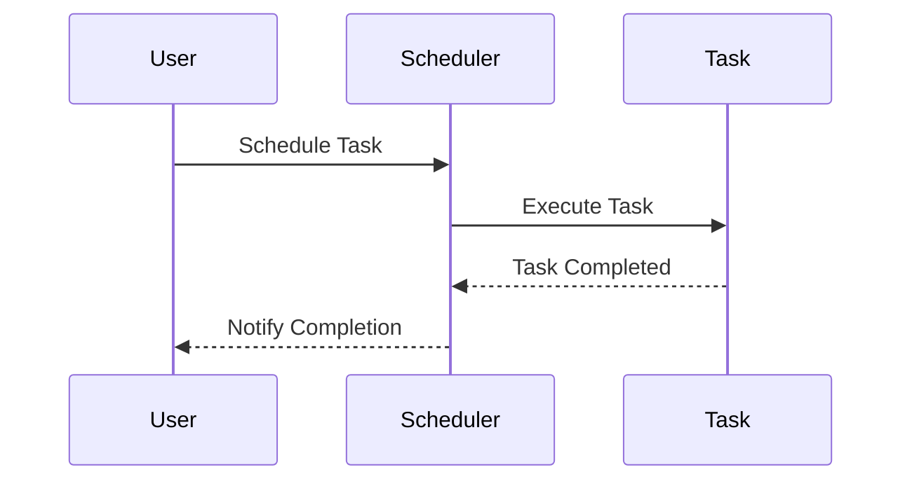

## 6.4.1 Implementing Scheduler in Python

In this section, we delve into implementing schedulers in Python, a crucial component for managing and executing tasks efficiently in concurrent programming. We'll explore various approaches using Python's built-in modules and libraries, such as `sched`, `asyncio`, and `threading`. Each method offers unique advantages and is suitable for different scenarios, from simple task scheduling to complex asynchronous operations.

### Introduction to Task Scheduling

Task scheduling is a fundamental aspect of software development, especially in applications requiring concurrent execution of operations. It involves planning and executing tasks at specific times or intervals, ensuring efficient resource utilization and optimal performance.

Python provides several tools for implementing schedulers, allowing developers to choose the most appropriate method based on their application's requirements. Let's explore these tools step-by-step.

### Using the `sched` Module

The `sched` module in Python is a simple and straightforward way to schedule tasks. It provides a general-purpose event scheduler that can be used to execute functions at a specified time.

#### Step-by-Step Guide to Using `sched`

1. **Create a Scheduler Instance**

   Begin by importing the `sched` module and creating a scheduler instance. The scheduler requires a time function and a delay function, typically `time.time` and `time.sleep`.

   ```python
   import sched
   import time

   scheduler = sched.scheduler(time.time, time.sleep)
   ```

2. **Schedule Tasks**

   Use the `enter()` or `enterabs()` methods to schedule tasks. `enter()` schedules a task relative to the current time, while `enterabs()` schedules it at an absolute time.

   ```python
   def print_message(message):
       print(f"Task executed: {message}")

   # Schedule a task to run after 5 seconds
   scheduler.enter(5, 1, print_message, argument=("Hello, World!",))
   ```

3. **Run the Scheduler's Event Loop**

   Execute the scheduled tasks by running the scheduler's event loop with the `run()` method.

   ```python
   print("Starting scheduler...")
   scheduler.run()
   ```

#### Example: Scheduling Multiple Tasks

Here's an example illustrating how to schedule multiple tasks with different priorities:

```python
import sched
import time

def task(name):
    print(f"Executing task: {name}")

scheduler = sched.scheduler(time.time, time.sleep)

scheduler.enter(2, 1, task, argument=("Task 1",))
scheduler.enter(1, 2, task, argument=("Task 2",))
scheduler.enter(3, 1, task, argument=("Task 3",))

print("Starting scheduler...")
scheduler.run()
```

In this example, "Task 2" runs first due to its higher priority, despite being scheduled later than "Task 1".

### Using `asyncio` for Asynchronous Scheduling

The `asyncio` module is designed for writing concurrent code using the `async`/`await` syntax. It is ideal for I/O-bound and high-level structured network code.

#### Step-by-Step Guide to Using `asyncio`

1. **Define Async Tasks**

   Define asynchronous tasks using `async def`. These tasks can perform non-blocking operations.

   ```python
   import asyncio

   async def async_task(name, delay):
       await asyncio.sleep(delay)
       print(f"Async task {name} executed after {delay} seconds")
   ```

2. **Schedule Tasks**

   Use `asyncio.create_task()` or `asyncio.ensure_future()` to schedule tasks. These functions return a `Task` object that represents the execution of a coroutine.

   ```python
   async def main():
       task1 = asyncio.create_task(async_task("Task 1", 2))
       task2 = asyncio.create_task(async_task("Task 2", 1))

       await task1
       await task2

   asyncio.run(main())
   ```

3. **Run the Event Loop**

   Use `asyncio.run()` to execute the main coroutine, which manages the event loop.

#### Example: Running Periodic Tasks

Here's an example demonstrating how to run a task periodically using `asyncio`:

```python
import asyncio

async def periodic_task(interval):
    while True:
        print("Periodic task executed")
        await asyncio.sleep(interval)

async def main():
    await asyncio.gather(
        periodic_task(3),
        periodic_task(5)
    )

asyncio.run(main())
```

In this example, two periodic tasks run concurrently, one every 3 seconds and another every 5 seconds.

### Using `Threading` and `Timer`

The `threading` module provides a way to execute tasks in separate threads, allowing for parallel execution. The `Timer` class is particularly useful for scheduling tasks to run after a delay.

#### Step-by-Step Guide to Using `Threading.Timer`

1. **Utilize `threading.Timer` for Delayed Execution**

   Create a `Timer` object to execute a function after a specified delay.

   ```python
   from threading import Timer

   def delayed_task():
       print("Delayed task executed")

   timer = Timer(5, delayed_task)
   timer.start()
   ```

2. **Handle Concurrent Tasks**

   When using threads, it's crucial to manage access to shared resources to avoid race conditions. Use synchronization primitives like `Locks` and `Semaphores`.

   ```python
   from threading import Lock

   lock = Lock()

   def thread_safe_task():
       with lock:
           print("Thread-safe task executed")
   ```

#### Example: Scheduling Repeated Tasks

Here's an example of scheduling a task to run repeatedly using `threading.Timer`:

```python
from threading import Timer

def repeat_task(interval):
    print("Repeated task executed")
    Timer(interval, repeat_task, [interval]).start()

repeat_task(3)
```

### Handling Concurrent Tasks

When dealing with concurrent tasks, it's essential to ensure thread-safe operations, especially when accessing shared resources. Python provides several synchronization primitives to help manage concurrency:

- **Locks**: Use `Lock` to ensure that only one thread accesses a resource at a time.
- **Semaphores**: Use `Semaphore` to limit the number of threads that can access a resource simultaneously.
- **Event**: Use `Event` to signal between threads.

#### Example: Using Locks for Thread Safety

```python
from threading import Thread, Lock

counter = 0
lock = Lock()

def increment():
    global counter
    with lock:
        counter += 1
        print(f"Counter: {counter}")

threads = [Thread(target=increment) for _ in range(5)]

for thread in threads:
    thread.start()

for thread in threads:
    thread.join()
```

In this example, a lock ensures that only one thread can increment the counter at a time, preventing race conditions.

### Error Handling and Task Cancellation

Handling errors and managing task cancellation are crucial aspects of task scheduling. Let's explore how to implement these features in Python.

#### Error Handling in Tasks

To handle exceptions within tasks, use try-except blocks. This ensures that errors are caught and managed appropriately.

```python
import asyncio

async def faulty_task():
    try:
        raise ValueError("An error occurred")
    except ValueError as e:
        print(f"Error handled: {e}")

asyncio.run(faulty_task())
```

#### Task Cancellation

To cancel a scheduled task, use the `cancel()` method on the task object. This is particularly useful in `asyncio` when you need to stop a task before it completes.

```python
import asyncio

async def long_running_task():
    try:
        await asyncio.sleep(10)
        print("Task completed")
    except asyncio.CancelledError:
        print("Task was cancelled")

async def main():
    task = asyncio.create_task(long_running_task())
    await asyncio.sleep(1)
    task.cancel()
    await task

asyncio.run(main())
```

In this example, the task is cancelled after 1 second, demonstrating how to stop a task gracefully.

### Try It Yourself

Experiment with the code examples provided in this section. Try modifying the delay times, task priorities, or adding new tasks to see how the scheduler behaves. For instance, you can:

- Change the delay in the `sched` example to see how it affects task execution order.
- Modify the interval in the `asyncio` periodic task example to run tasks at different frequencies.
- Add more threads in the `threading` example to observe how locks prevent race conditions.

### Visualizing Task Scheduling

To better understand the flow of task scheduling, let's visualize the process using a sequence diagram.



This diagram illustrates the interaction between a user, the scheduler, and a task. The user schedules a task, the scheduler executes it, and upon completion, the user is notified.

### References and Further Reading

- [Python `sched` Module Documentation](https://docs.python.org/3/library/sched.html)
- [Python `asyncio` Module Documentation](https://docs.python.org/3/library/asyncio.html)
- [Python `threading` Module Documentation](https://docs.python.org/3/library/threading.html)

### Knowledge Check

- What are the key differences between `sched`, `asyncio`, and `threading` for task scheduling?
- How can you ensure thread safety when using `threading`?
- What are some common use cases for task cancellation in `asyncio`?

### Embrace the Journey

Remember, mastering task scheduling in Python is a journey. As you progress, you'll discover more advanced techniques and optimizations. Keep experimenting, stay curious, and enjoy the process of learning and applying these powerful tools in your projects.

## Quiz Time!



### What is the primary purpose of the `sched` module in Python?

- [x] To schedule tasks for future execution
- [ ] To handle asynchronous I/O operations
- [ ] To manage thread execution
- [ ] To perform mathematical calculations

> **Explanation:** The `sched` module is used for scheduling tasks to be executed at a later time.

### Which method is used to schedule a task with an absolute time in the `sched` module?

- [ ] enter()
- [x] enterabs()
- [ ] schedule()
- [ ] delay()

> **Explanation:** The `enterabs()` method schedules a task to run at an absolute time.

### How do you define an asynchronous task in Python using `asyncio`?

- [ ] def task():
- [x] async def task():
- [ ] def async task():
- [ ] task async():

> **Explanation:** Asynchronous tasks are defined using the `async def` syntax in Python.

### Which function is used to run the event loop in `asyncio`?

- [ ] run_loop()
- [ ] execute()
- [x] asyncio.run()
- [ ] start()

> **Explanation:** The `asyncio.run()` function is used to execute the event loop in `asyncio`.

### What is the purpose of the `Timer` class in the `threading` module?

- [ ] To perform mathematical calculations
- [x] To execute a function after a delay
- [ ] To handle asynchronous I/O operations
- [ ] To manage thread execution

> **Explanation:** The `Timer` class is used to execute a function after a specified delay.

### How can you ensure thread safety when accessing shared resources in Python?

- [ ] By using async/await
- [ ] By using the `sched` module
- [x] By using Locks and Semaphores
- [ ] By using the `math` module

> **Explanation:** Locks and Semaphores are used to ensure thread safety when accessing shared resources.

### What happens when you call the `cancel()` method on a task in `asyncio`?

- [ ] The task is executed immediately
- [x] The task is stopped before completion
- [ ] The task is delayed
- [ ] The task is duplicated

> **Explanation:** The `cancel()` method stops a task before it completes.

### Which method is used to schedule a task in `asyncio`?

- [ ] schedule_task()
- [ ] enter()
- [x] asyncio.create_task()
- [ ] task()

> **Explanation:** The `asyncio.create_task()` method is used to schedule tasks in `asyncio`.

### What is the role of the `Lock` class in the `threading` module?

- [ ] To perform mathematical calculations
- [ ] To handle asynchronous I/O operations
- [x] To ensure that only one thread accesses a resource at a time
- [ ] To manage task execution

> **Explanation:** The `Lock` class ensures that only one thread can access a resource at a time, preventing race conditions.

### True or False: The `asyncio` module is best suited for CPU-bound tasks.

- [ ] True
- [x] False

> **Explanation:** The `asyncio` module is designed for I/O-bound tasks, not CPU-bound tasks.


