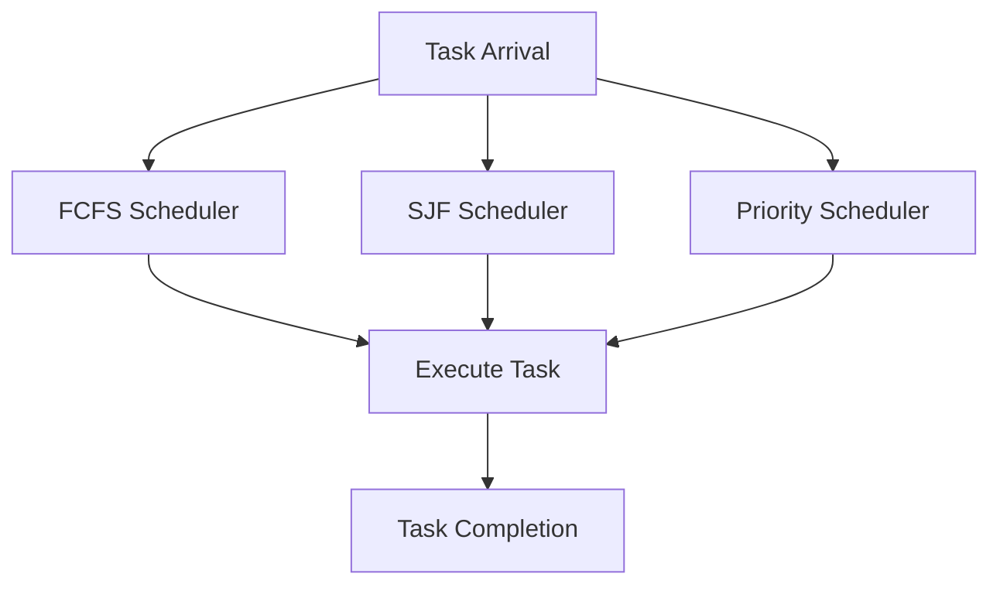

## 6.4.2 Task Scheduling

In the realm of software development, task scheduling is a critical component that determines the efficiency and responsiveness of applications. Task scheduling involves prioritizing and ordering task execution to optimize performance, ensuring that tasks are executed in a manner that meets the desired criteria of fairness, efficiency, and responsiveness. In this section, we will explore different scheduling algorithms, provide examples of their implementation in Python, discuss their implications, and highlight key considerations for effective task scheduling.

### Understanding Task Scheduling

Task scheduling is a fundamental aspect of operating systems and concurrent programming. It involves deciding which tasks should be executed by the CPU and in what order. The goal is to maximize CPU utilization, minimize response time, and ensure that all tasks are completed efficiently. Different scheduling algorithms have been developed to achieve these goals, each with its own strengths and weaknesses.

### Scheduling Algorithms

Let's delve into some common scheduling algorithms that are widely used in software development:

#### First-Come, First-Served (FCFS)

The First-Come, First-Served (FCFS) algorithm is the simplest form of task scheduling. In this approach, tasks are executed in the order they arrive. This means that the first task to arrive is the first to be executed, and so on. FCFS is easy to implement and understand, but it has some drawbacks, such as the potential for long waiting times for tasks that arrive later.

**Example of FCFS Implementation in Python:**

```python
from queue import Queue

class FCFS_Scheduler:
    def __init__(self):
        self.queue = Queue()

    def add_task(self, task):
        self.queue.put(task)

    def execute_tasks(self):
        while not self.queue.empty():
            task = self.queue.get()
            print(f"Executing task: {task}")
            # Simulate task execution
            task.run()

class Task:
    def __init__(self, name):
        self.name = name

    def run(self):
        print(f"Task {self.name} is running.")

scheduler = FCFS_Scheduler()
scheduler.add_task(Task("Task 1"))
scheduler.add_task(Task("Task 2"))
scheduler.add_task(Task("Task 3"))
scheduler.execute_tasks()
```

In this example, tasks are added to a queue and executed in the order they are added. This straightforward approach is suitable for systems where task arrival times are predictable and waiting times are not a concern.

#### Shortest Job First (SJF)

The Shortest Job First (SJF) algorithm prioritizes tasks with the shortest execution times. This approach aims to minimize the average waiting time for tasks by executing shorter tasks first. However, SJF can lead to starvation of longer tasks if shorter tasks keep arriving.

**Example of SJF Implementation in Python:**

```python
import heapq

class SJF_Scheduler:
    def __init__(self):
        self.tasks = []

    def add_task(self, task, execution_time):
        heapq.heappush(self.tasks, (execution_time, task))

    def execute_tasks(self):
        while self.tasks:
            execution_time, task = heapq.heappop(self.tasks)
            print(f"Executing task: {task} with execution time: {execution_time}")
            # Simulate task execution
            task.run()

scheduler = SJF_Scheduler()
scheduler.add_task(Task("Task 1"), 5)
scheduler.add_task(Task("Task 2"), 2)
scheduler.add_task(Task("Task 3"), 1)
scheduler.execute_tasks()
```

In this implementation, tasks are stored in a heap, with the execution time as the key. This ensures that tasks with shorter execution times are executed first.

#### Priority Scheduling

Priority Scheduling assigns a priority value to each task, and tasks with higher priority values are executed first. This approach is useful in systems where certain tasks are more critical than others. However, it can lead to starvation of low-priority tasks if high-priority tasks keep arriving.

**Example of Priority Scheduling Implementation in Python:**

```python
from queue import PriorityQueue

class Priority_Scheduler:
    def __init__(self):
        self.queue = PriorityQueue()

    def add_task(self, task, priority):
        self.queue.put((-priority, task))  # Use negative priority for max-heap behavior

    def execute_tasks(self):
        while not self.queue.empty():
            priority, task = self.queue.get()
            print(f"Executing task: {task} with priority: {-priority}")
            # Simulate task execution
            task.run()

scheduler = Priority_Scheduler()
scheduler.add_task(Task("Task 1"), 1)
scheduler.add_task(Task("Task 2"), 3)
scheduler.add_task(Task("Task 3"), 2)
scheduler.execute_tasks()
```

In this example, tasks are stored in a priority queue, with the priority value as the key. Higher priority tasks are executed first, ensuring that critical tasks are not delayed.

### Implications of Task Scheduling

Task scheduling has significant implications for system performance and responsiveness. Let's discuss some of these implications:

- **Starvation of Low-Priority Tasks**: In Priority Scheduling, there is a risk that low-priority tasks may never get executed if high-priority tasks keep arriving. This can lead to starvation, where certain tasks are perpetually delayed.

- **Impact on System Performance**: The choice of scheduling algorithm can have a profound impact on system performance. For example, SJF can minimize average waiting time, but it may not be suitable for real-time systems where task execution times are unpredictable.

- **Fairness and Efficiency**: Balancing fairness and efficiency is a key consideration in task scheduling. While FCFS is fair in the sense that tasks are executed in the order they arrive, it may not be the most efficient in terms of minimizing waiting times.

### Key Considerations for Task Scheduling

When designing a task scheduling system, it's important to consider the following factors:

- **Balancing Fairness and Efficiency**: Striking a balance between fairness and efficiency is crucial. While some algorithms prioritize efficiency, they may do so at the expense of fairness.

- **Ensuring Critical Tasks Are Not Delayed**: In systems where certain tasks are critical, it's important to ensure that these tasks are not delayed. Priority Scheduling can be useful in such scenarios, but care must be taken to prevent starvation of lower-priority tasks.

- **Adaptability to Changing Conditions**: Task scheduling systems should be adaptable to changing conditions, such as varying task arrival rates and execution times. This may involve dynamically adjusting priorities or switching between different scheduling algorithms.

### Try It Yourself

To deepen your understanding of task scheduling, try modifying the code examples provided above. Here are some suggestions:

- **Experiment with Different Task Arrival Orders**: Change the order in which tasks are added to the scheduler and observe how it affects execution order and waiting times.

- **Implement a Round Robin Scheduler**: Round Robin is another scheduling algorithm where each task is given a fixed time slice for execution. Implement this algorithm and compare its performance with FCFS, SJF, and Priority Scheduling.

- **Simulate a Real-World Scenario**: Create a simulation of a real-world scenario, such as a print queue or a network server, and implement different scheduling algorithms to see how they perform.

### Visualizing Task Scheduling

To better understand the flow of task scheduling, let's visualize the process using Mermaid.js diagrams.



**Diagram Description**: This diagram illustrates the flow of tasks through different scheduling algorithms. Tasks arrive and are processed by the FCFS, SJF, or Priority Scheduler, leading to task execution and completion.

### Further Reading

For more information on task scheduling and concurrency patterns, consider exploring the following resources:

- [Python's `queue` module documentation](https://docs.python.org/3/library/queue.html)
- [Operating System Concepts by Abraham Silberschatz](https://www.os-book.com/)
- [Concurrency in Python: A Guide to Multithreading, Multiprocessing, and Asyncio](https://realpython.com/python-concurrency/)

### Knowledge Check

Before we conclude, let's reinforce our understanding with some questions:

- What are the advantages and disadvantages of the FCFS scheduling algorithm?
- How does the SJF algorithm minimize average waiting time?
- What are the potential risks of using Priority Scheduling?
- How can task scheduling impact system performance and responsiveness?

### Conclusion

Task scheduling is a vital component of software development that requires careful consideration of various factors, including fairness, efficiency, and adaptability. By understanding different scheduling algorithms and their implications, we can design systems that are both responsive and efficient. Remember, this is just the beginning. As you continue your journey, you'll encounter more complex scheduling scenarios and develop a deeper understanding of concurrency patterns. Keep experimenting, stay curious, and enjoy the journey!

## Quiz Time!



### What is the primary goal of task scheduling?

- [x] To optimize performance and responsiveness
- [ ] To increase the number of tasks
- [ ] To decrease system complexity
- [ ] To eliminate task dependencies

> **Explanation:** Task scheduling aims to optimize performance and responsiveness by prioritizing and ordering task execution.

### Which scheduling algorithm executes tasks in the order they arrive?

- [x] First-Come, First-Served (FCFS)
- [ ] Shortest Job First (SJF)
- [ ] Priority Scheduling
- [ ] Round Robin

> **Explanation:** FCFS executes tasks in the order they arrive, making it a simple and fair scheduling algorithm.

### What is a potential drawback of the Shortest Job First (SJF) algorithm?

- [x] Starvation of longer tasks
- [ ] Increased waiting time
- [ ] Complexity in implementation
- [ ] Lack of fairness

> **Explanation:** SJF can lead to starvation of longer tasks if shorter tasks keep arriving, as it prioritizes tasks with shorter execution times.

### How does Priority Scheduling determine the order of task execution?

- [x] By assigning priority values to tasks
- [ ] By task arrival time
- [ ] By task execution time
- [ ] By task dependencies

> **Explanation:** Priority Scheduling assigns priority values to tasks, executing higher-priority tasks first.

### What is a key consideration when designing a task scheduling system?

- [x] Balancing fairness and efficiency
- [ ] Increasing task complexity
- [ ] Reducing the number of tasks
- [ ] Eliminating task dependencies

> **Explanation:** Balancing fairness and efficiency is crucial in task scheduling to ensure that all tasks are executed in a timely manner.

### Which Python module is commonly used for implementing Priority Scheduling?

- [x] `queue.PriorityQueue`
- [ ] `threading`
- [ ] `multiprocessing`
- [ ] `asyncio`

> **Explanation:** The `queue.PriorityQueue` module is commonly used for implementing Priority Scheduling in Python.

### What is a potential risk of using Priority Scheduling?

- [x] Starvation of low-priority tasks
- [ ] Increased system complexity
- [ ] Decreased task execution speed
- [ ] Lack of adaptability

> **Explanation:** Priority Scheduling can lead to starvation of low-priority tasks if high-priority tasks keep arriving.

### How can task scheduling impact system performance?

- [x] By optimizing CPU utilization and minimizing response time
- [ ] By increasing the number of tasks
- [ ] By reducing system complexity
- [ ] By eliminating task dependencies

> **Explanation:** Task scheduling impacts system performance by optimizing CPU utilization and minimizing response time.

### What is the benefit of using a heap in the SJF algorithm?

- [x] It allows efficient retrieval of the shortest task
- [ ] It increases task complexity
- [ ] It reduces system complexity
- [ ] It eliminates task dependencies

> **Explanation:** Using a heap in the SJF algorithm allows efficient retrieval of the shortest task, minimizing average waiting time.

### True or False: Task scheduling is only relevant in operating systems.

- [ ] True
- [x] False

> **Explanation:** Task scheduling is relevant in various domains, including software development, where it optimizes task execution and system performance.


