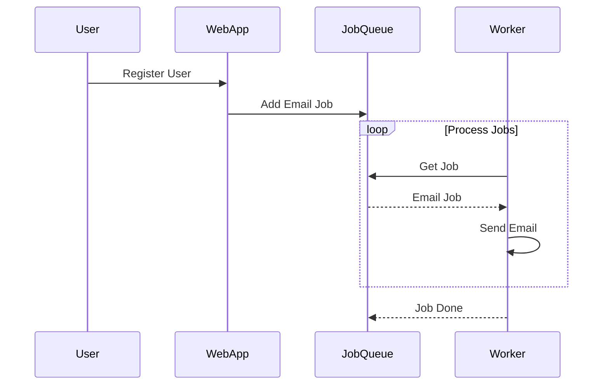

## 6.4.3 Use Cases and Examples

In this section, we delve into the practical applications of the Scheduler pattern in Python. The Scheduler pattern is a powerful tool for managing task execution and resource allocation efficiently. By exploring real-world scenarios, we can better understand how to leverage this pattern to automate and optimize various processes. Let's examine some common use cases and provide detailed examples to illustrate the Scheduler pattern in action.

### Job Queues in Web Applications

Web applications often need to perform tasks that are not directly related to user interactions, such as sending emails, processing images, or generating reports. These tasks can be offloaded to a job queue, allowing the application to handle them asynchronously and improve responsiveness.

#### Example: Handling Background Tasks

Consider a web application that needs to send a welcome email to new users upon registration. Instead of sending the email immediately, which could delay the response to the user, we can use a job queue to handle this task in the background.

```python
import time
import threading
from queue import Queue

def send_email(email_address):
    print(f"Sending email to {email_address}")
    time.sleep(2)  # Simulate email sending delay
    print(f"Email sent to {email_address}")

job_queue = Queue()

def worker():
    while True:
        email_address = job_queue.get()
        if email_address is None:
            break
        send_email(email_address)
        job_queue.task_done()

thread = threading.Thread(target=worker)
thread.start()

job_queue.put("user1@example.com")
job_queue.put("user2@example.com")

job_queue.join()

job_queue.put(None)
thread.join()
```

In this example, we use Python's `queue.Queue` to create a job queue and `threading.Thread` to process jobs asynchronously. This approach allows the web application to remain responsive while handling background tasks efficiently.

### Automated Data Processing

Data processing pipelines often require scheduling tasks such as extracting, transforming, and loading (ETL) data. The Scheduler pattern can automate these tasks, ensuring they run at specified intervals without manual intervention.

#### Example: Scheduling ETL Jobs

Let's create a simple ETL job scheduler using the `schedule` library, which allows us to define jobs and their execution intervals easily.

```python
import schedule
import time

def extract_data():
    print("Extracting data...")
    # Simulate data extraction
    time.sleep(1)
    print("Data extracted.")

def transform_data():
    print("Transforming data...")
    # Simulate data transformation
    time.sleep(1)
    print("Data transformed.")

def load_data():
    print("Loading data...")
    # Simulate data loading
    time.sleep(1)
    print("Data loaded.")

schedule.every().hour.do(extract_data)
schedule.every().hour.do(transform_data)
schedule.every().hour.do(load_data)

while True:
    schedule.run_pending()
    time.sleep(1)
```

In this example, we define three ETL functions and schedule them to run every hour using the `schedule` library. The scheduler continuously checks for pending jobs and executes them at the specified intervals.

### System Maintenance Tasks

System maintenance tasks, such as backups, clean-ups, or updates, are essential for ensuring the smooth operation of applications and systems. The Scheduler pattern can automate these tasks, reducing the need for manual intervention and minimizing the risk of human error.

#### Example: Running Backups at Scheduled Intervals

Let's create a simple backup scheduler that runs a backup script at a specified time each day.

```python
import schedule
import time
import subprocess

def run_backup():
    print("Running backup...")
    # Simulate running a backup script
    subprocess.run(["echo", "Backup completed."])
    print("Backup completed.")

schedule.every().day.at("02:00").do(run_backup)

while True:
    schedule.run_pending()
    time.sleep(1)
```

In this example, we use the `schedule` library to run a backup script at 2:00 AM every day. The `subprocess.run` function simulates executing a backup script, demonstrating how the Scheduler pattern can automate system maintenance tasks.

### Observed Benefits

The Scheduler pattern offers several benefits, including:

- **Improved System Reliability**: By automating tasks, the Scheduler pattern reduces the risk of human error and ensures tasks are executed consistently and reliably.
- **Efficient Resource Utilization**: The pattern allows tasks to be scheduled during off-peak hours, optimizing resource usage and minimizing impact on system performance.
- **Automated Task Management**: The Scheduler pattern simplifies task management by automating repetitive tasks, freeing up time for more critical activities.

### Encouraging Experimentation

To fully grasp the potential of the Scheduler pattern, we encourage you to experiment with building your own schedulers. Here are some ideas to get you started:

- **Personal Task Scheduler**: Create a scheduler to automate personal tasks, such as sending reminders or organizing files.
- **Integrate Scheduling into Existing Applications**: Enhance existing applications by integrating scheduling capabilities to automate routine tasks.
- **Explore Advanced Scheduling Libraries**: Investigate advanced scheduling libraries, such as `APScheduler`, to handle more complex scheduling requirements.

### Visualizing the Scheduler Pattern

To better understand the flow of the Scheduler pattern, let's visualize a typical scheduling process using a Mermaid.js diagram.



**Diagram Description**: This sequence diagram illustrates the process of handling background tasks using the Scheduler pattern. The user registers on the web application, which adds an email job to the job queue. The worker processes jobs from the queue, sending emails asynchronously.

### Try It Yourself

Now that we've explored the Scheduler pattern and its applications, it's time to try it yourself. Here are some suggestions to get you started:

- **Modify the Examples**: Experiment with the provided code examples by changing the scheduling intervals or adding new tasks.
- **Build a Custom Scheduler**: Create a custom scheduler for a specific use case, such as monitoring system health or automating data analysis.
- **Integrate with External Services**: Explore integrating your scheduler with external services, such as APIs or databases, to automate more complex workflows.

### Conclusion

The Scheduler pattern is a versatile tool for automating and optimizing task execution in various applications. By exploring real-world use cases and examples, we've demonstrated how this pattern can enhance system reliability, improve resource utilization, and simplify task management. Remember, this is just the beginning. As you continue to experiment and integrate scheduling into your projects, you'll discover even more possibilities for automation and efficiency.

## Quiz Time!



### Which library is used in the examples to schedule tasks?

- [ ] threading
- [x] schedule
- [ ] asyncio
- [ ] subprocess

> **Explanation:** The `schedule` library is used to define and run scheduled tasks in the examples provided.

### What is the primary benefit of using a job queue in web applications?

- [ ] To increase server load
- [x] To handle background tasks asynchronously
- [ ] To improve database performance
- [ ] To reduce code complexity

> **Explanation:** Job queues allow web applications to handle background tasks asynchronously, improving responsiveness and user experience.

### In the ETL job example, how often are the jobs scheduled to run?

- [ ] Every minute
- [x] Every hour
- [ ] Every day
- [ ] Every week

> **Explanation:** The ETL jobs are scheduled to run every hour using the `schedule.every().hour.do()` method.

### What function is used to simulate running a backup script in the system maintenance example?

- [ ] os.system
- [ ] subprocess.call
- [x] subprocess.run
- [ ] threading.Thread

> **Explanation:** The `subprocess.run` function is used to simulate executing a backup script in the example.

### What is a key advantage of automating system maintenance tasks?

- [ ] Increased manual intervention
- [x] Reduced risk of human error
- [ ] Higher resource consumption
- [ ] Slower task execution

> **Explanation:** Automating system maintenance tasks reduces the risk of human error and ensures consistent execution.

### Which of the following is NOT a benefit of the Scheduler pattern?

- [ ] Improved system reliability
- [ ] Efficient resource utilization
- [ ] Automated task management
- [x] Increased code complexity

> **Explanation:** The Scheduler pattern simplifies task management and improves reliability and resource utilization, without increasing code complexity.

### How can you experiment with the Scheduler pattern?

- [x] Modify the provided examples
- [x] Build a custom scheduler
- [x] Integrate with external services
- [ ] Avoid using it in real applications

> **Explanation:** Experimenting with the Scheduler pattern involves modifying examples, building custom schedulers, and integrating with external services.

### What does the sequence diagram illustrate?

- [ ] Database interactions
- [ ] User authentication
- [x] Background task processing
- [ ] API requests

> **Explanation:** The sequence diagram illustrates the process of handling background tasks using the Scheduler pattern.

### What is the purpose of the `job_queue.task_done()` method in the job queue example?

- [ ] To add a new job to the queue
- [x] To indicate that a job has been processed
- [ ] To remove a job from the queue
- [ ] To start a new worker thread

> **Explanation:** The `job_queue.task_done()` method is used to indicate that a job has been processed and can be removed from the queue.

### True or False: The Scheduler pattern can only be used for web applications.

- [ ] True
- [x] False

> **Explanation:** False. The Scheduler pattern can be used in various applications, including web applications, data processing, and system maintenance tasks.


