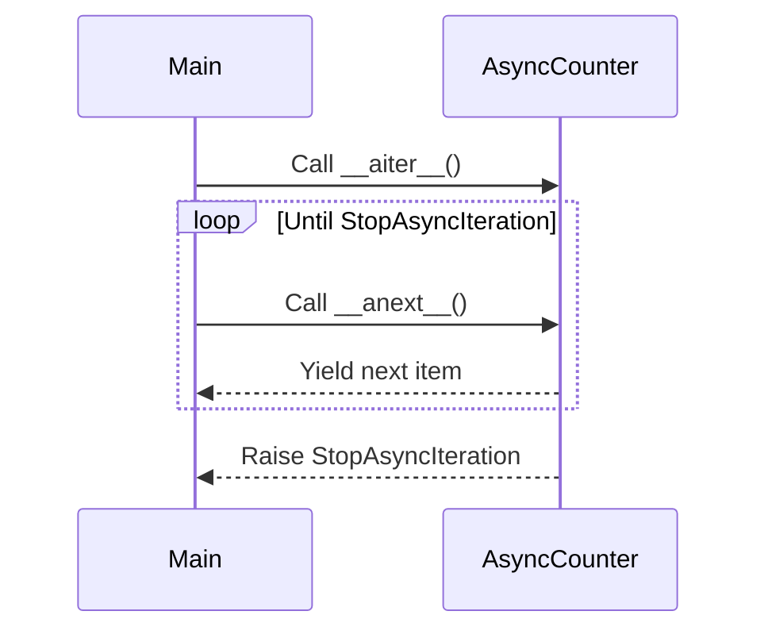

## 6.5.1 Async Iterator Pattern

In the realm of concurrent programming, the ability to efficiently handle asynchronous data streams is crucial. The Async Iterator Pattern in Python provides a robust mechanism to iterate over asynchronous data sources using the `async for` construct. This pattern is particularly useful in scenarios where data is fetched from asynchronous sources such as network sockets or event-driven systems. In this section, we will delve into the intricacies of async iterators, explore their implementation, and discuss best practices for their use.

### Understanding Async Iterators

Async iterators are a fundamental component of asynchronous programming in Python, allowing developers to iterate over data that is produced asynchronously. Unlike traditional iterators, which use the `__iter__` and `__next__` methods, async iterators rely on the `__aiter__` and `__anext__` methods. These methods enable the use of `async for` loops to consume data in an asynchronous manner.

#### The `__aiter__` Method

The `__aiter__` method is responsible for returning the asynchronous iterator object itself. It is analogous to the `__iter__` method in synchronous iterators. When an `async for` loop is initiated, Python calls the `__aiter__` method to obtain the iterator.

#### The `__anext__` Method

The `__anext__` method is the asynchronous counterpart to the `__next__` method. It is a coroutine that returns the next item in the iteration. If there are no more items to yield, it raises a `StopAsyncIteration` exception, signaling the end of the iteration.

### Implementing Async Iterators

To implement an async iterator, you need to define a class with the `__aiter__` and `__anext__` methods. Let's explore an example to illustrate this process.

```python
import asyncio

class AsyncCounter:
    def __init__(self, start, end):
        self.current = start
        self.end = end

    async def __aiter__(self):
        return self

    async def __anext__(self):
        if self.current < self.end:
            await asyncio.sleep(1)  # Simulate an asynchronous operation
            self.current += 1
            return self.current
        else:
            raise StopAsyncIteration

async def main():
    async for number in AsyncCounter(1, 5):
        print(number)

asyncio.run(main())
```

In this example, `AsyncCounter` is an async iterator that counts from a start value to an end value. The `__anext__` method simulates an asynchronous operation using `await asyncio.sleep(1)`, which pauses execution for one second before yielding the next number.

### Consuming Async Iterators

The `async for` loop is used to consume async iterators. It automatically handles the asynchronous nature of the iteration, allowing you to focus on processing the data.

```python
async def main():
    async for number in AsyncCounter(1, 5):
        print(f"Received number: {number}")

asyncio.run(main())
```

In this snippet, the `async for` loop iterates over the `AsyncCounter`, printing each number as it is received.

### Use Cases for Async Iterators

Async iterators are particularly useful in scenarios where data is fetched or processed asynchronously. Here are some common use cases:

#### Reading Data from Asynchronous Streams

Async iterators can be used to read data from asynchronous streams, such as network sockets or file streams. This allows you to process incoming data without blocking the main execution thread.

```python
async def read_stream(stream):
    async for data in stream:
        process(data)
```

#### Handling Events in Event-Driven Applications

In event-driven applications, async iterators can be employed to handle events as they occur. This is particularly useful in GUI applications or systems that rely on real-time data.

```python
async def handle_events(event_source):
    async for event in event_source:
        handle(event)
```

### Best Practices for Async Iterators

When working with async iterators, it is important to follow best practices to ensure efficient and error-free execution.

#### Managing Exceptions

Ensure that exceptions within the iterator are handled appropriately. Use try-except blocks to catch and manage exceptions, preventing them from propagating and causing unintended behavior.

```python
async def __anext__(self):
    try:
        # Perform asynchronous operation
    except SomeException as e:
        # Handle exception
```

#### Closing Resources

Async iterators often interact with external resources, such as network connections or file handles. It is crucial to close these resources when they are no longer needed to prevent resource leaks.

```python
async def __anext__(self):
    try:
        # Perform asynchronous operation
    finally:
        # Close resources
```

### Visualizing Async Iterators

To better understand the flow of async iterators, let's visualize the process using a sequence diagram.



This diagram illustrates the interaction between the main coroutine and the `AsyncCounter` async iterator. The `__aiter__` method is called to obtain the iterator, followed by repeated calls to `__anext__` until a `StopAsyncIteration` exception is raised.

### Try It Yourself

To deepen your understanding of async iterators, try modifying the `AsyncCounter` example. Experiment with different start and end values, or introduce additional asynchronous operations within the `__anext__` method. Observe how these changes affect the iteration process.

### Knowledge Check

- What is the purpose of the `__aiter__` method in an async iterator?
- How does the `async for` loop differ from a traditional `for` loop?
- What exception is raised to signal the end of an async iteration?

### Embrace the Journey

Remember, mastering async iterators is just one step in your journey to becoming proficient in asynchronous programming with Python. As you continue to explore and experiment, you'll uncover new ways to leverage concurrency patterns to build efficient and responsive applications. Keep pushing the boundaries, stay curious, and enjoy the process!

## Quiz Time!



### What is the primary purpose of the `__aiter__` method in an async iterator?

- [x] To return the asynchronous iterator object itself
- [ ] To yield the next item in the iteration
- [ ] To handle exceptions within the iterator
- [ ] To close resources when the iteration is complete

> **Explanation:** The `__aiter__` method is responsible for returning the asynchronous iterator object itself, similar to the `__iter__` method in synchronous iterators.

### Which method is used to yield the next item in an async iterator?

- [ ] `__iter__`
- [x] `__anext__`
- [ ] `__next__`
- [ ] `__aiter__`

> **Explanation:** The `__anext__` method is a coroutine that yields the next item in an async iterator, analogous to the `__next__` method in synchronous iterators.

### What exception is raised to signal the end of an async iteration?

- [ ] StopIteration
- [x] StopAsyncIteration
- [ ] AsyncStopIteration
- [ ] EndOfIteration

> **Explanation:** The `StopAsyncIteration` exception is raised to signal the end of an async iteration, similar to `StopIteration` in synchronous iterators.

### How does an `async for` loop differ from a traditional `for` loop?

- [x] It handles asynchronous data sources
- [ ] It iterates over synchronous data sources
- [ ] It does not require an iterator
- [ ] It cannot handle exceptions

> **Explanation:** An `async for` loop is designed to handle asynchronous data sources, allowing for non-blocking iteration over data that is produced asynchronously.

### Which of the following is a use case for async iterators?

- [x] Reading data from an asynchronous stream
- [ ] Iterating over a list
- [ ] Sorting a collection
- [ ] Calculating a sum

> **Explanation:** Async iterators are particularly useful for reading data from asynchronous streams, such as network sockets or file streams.

### What is a best practice when working with async iterators?

- [x] Manage exceptions within the iterator
- [ ] Ignore exceptions to maintain performance
- [ ] Use synchronous operations within the iterator
- [ ] Avoid closing resources

> **Explanation:** Managing exceptions within the iterator is a best practice to ensure efficient and error-free execution.

### What should you do to prevent resource leaks in async iterators?

- [x] Close resources when they are no longer needed
- [ ] Keep resources open for future use
- [ ] Use global variables to manage resources
- [ ] Avoid using external resources

> **Explanation:** Closing resources when they are no longer needed is crucial to prevent resource leaks in async iterators.

### Which method is analogous to `__iter__` in synchronous iterators?

- [x] `__aiter__`
- [ ] `__anext__`
- [ ] `__next__`
- [ ] `__async__`

> **Explanation:** The `__aiter__` method is analogous to the `__iter__` method in synchronous iterators, returning the iterator object itself.

### True or False: Async iterators can be used to handle events in event-driven applications.

- [x] True
- [ ] False

> **Explanation:** True. Async iterators can be employed to handle events as they occur in event-driven applications, allowing for real-time data processing.

### True or False: The `async for` loop automatically handles the asynchronous nature of the iteration.

- [x] True
- [ ] False

> **Explanation:** True. The `async for` loop automatically manages the asynchronous nature of the iteration, allowing developers to focus on processing the data.


