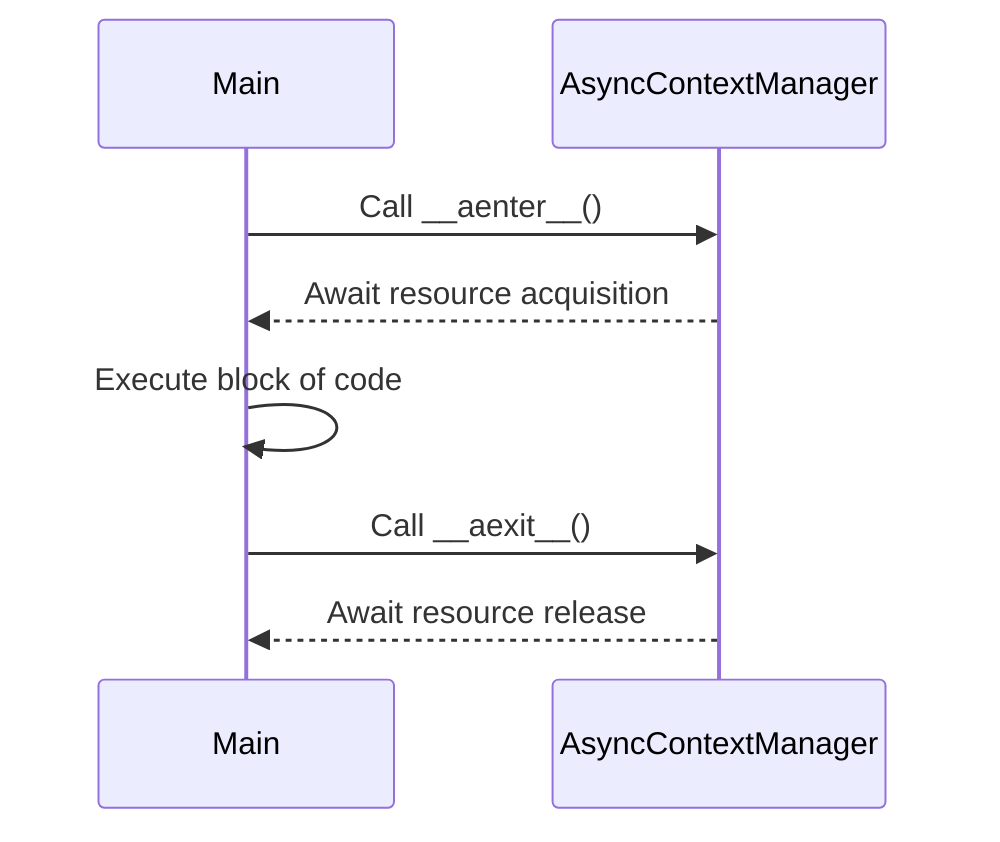

## 6.5.2 Async Context Managers

In the realm of Python programming, managing resources efficiently is crucial, especially when dealing with asynchronous operations. Async context managers provide a robust mechanism to handle resources that require asynchronous setup and teardown, ensuring that resources are properly managed even in the face of exceptions. This section delves into the intricacies of async context managers, illustrating their functionality, benefits, and correct usage with practical examples.

### Understanding Async Context Managers

Async context managers are designed to work with asynchronous code, allowing you to manage resources that require asynchronous setup and teardown. They are implemented using the `async with` statement, which ensures that resources are properly acquired and released.

#### The `__aenter__` and `__aexit__` Methods

Async context managers are defined by implementing two special methods: `__aenter__` and `__aexit__`. These methods are analogous to the `__enter__` and `__exit__` methods used in regular context managers, but they are asynchronous, meaning they return awaitable objects.

- **`__aenter__` Method**: This method is called when the execution flow enters the context of the `async with` statement. It is responsible for acquiring the resource and should return an awaitable object. Once awaited, it typically returns the resource itself.

- **`__aexit__` Method**: This method is invoked when the execution flow exits the context, whether normally or due to an exception. It is responsible for releasing the resource and should also return an awaitable object. The method receives three arguments: the exception type, value, and traceback, which allows it to handle exceptions gracefully.

```python
class AsyncResourceManager:
    async def __aenter__(self):
        # Asynchronously acquire the resource
        print("Acquiring resource asynchronously")
        return self

    async def __aexit__(self, exc_type, exc_value, traceback):
        # Asynchronously release the resource
        print("Releasing resource asynchronously")
```

### Code Example: Connecting to an Asynchronous Database

Let's explore a practical example of using an async context manager to connect to an asynchronous database. This example demonstrates how to manage a database connection using the `async with` statement, ensuring that the connection is properly closed even if an error occurs.

```python
import asyncio

class AsyncDatabaseConnection:
    async def __aenter__(self):
        # Simulate establishing a database connection
        print("Connecting to the database...")
        await asyncio.sleep(1)  # Simulate an asynchronous operation
        print("Connected to the database")
        return self

    async def __aexit__(self, exc_type, exc_value, traceback):
        # Simulate closing the database connection
        print("Closing the database connection...")
        await asyncio.sleep(1)  # Simulate an asynchronous operation
        print("Database connection closed")

async def main():
    async with AsyncDatabaseConnection() as db:
        print("Performing database operations...")

asyncio.run(main())
```

In this example, the `AsyncDatabaseConnection` class implements the `__aenter__` and `__aexit__` methods to manage the lifecycle of a database connection. The `async with` statement ensures that the connection is established before the block of code is executed and closed afterward, regardless of whether an exception occurs.

### Benefits of Using Async Context Managers

Async context managers offer several advantages, particularly when dealing with resources that require asynchronous handling:

1. **Cleaner Syntax**: The `async with` statement provides a clean and concise syntax for managing resources, reducing boilerplate code and improving readability.

2. **Automatic Resource Cleanup**: By ensuring that resources are properly released, even in the presence of exceptions, async context managers help prevent resource leaks and ensure the stability of your application.

3. **Error Handling**: The `__aexit__` method receives exception information, allowing you to handle errors gracefully and perform any necessary cleanup.

4. **Consistency**: Async context managers provide a consistent interface for managing resources, making it easier to reason about resource management in asynchronous code.

### Correct Usage of Async Context Managers

When working with resources that require asynchronous initialization or cleanup, it is advisable to use async context managers. Here are some guidelines for their correct usage:

- **Use `async with` for Asynchronous Resources**: Whenever you need to manage resources that involve asynchronous operations, such as network connections or file I/O, prefer using `async with` to ensure proper resource management.

- **Implement `__aenter__` and `__aexit__` Methods**: Define these methods in your async context manager classes to handle resource acquisition and release. Ensure that they return awaitable objects.

- **Handle Exceptions Gracefully**: Use the exception information provided to the `__aexit__` method to handle errors and perform necessary cleanup operations.

- **Test Your Async Context Managers**: Thoroughly test your async context managers to ensure that resources are correctly managed and that exceptions are handled appropriately.

### Visualizing Async Context Managers

To better understand how async context managers work, let's visualize the flow of execution using a sequence diagram. This diagram illustrates the interaction between the `async with` statement and the async context manager methods.



In this sequence diagram, the `Main` participant represents the code that uses the `async with` statement, while the `AsyncContextManager` participant represents the async context manager. The diagram shows the flow of execution, from entering the context and acquiring the resource to executing the block of code and finally releasing the resource.

### Try It Yourself

To deepen your understanding of async context managers, try modifying the code example provided earlier. Here are some suggestions for experimentation:

- **Add Exception Handling**: Introduce an exception within the `async with` block and observe how the `__aexit__` method handles it.

- **Simulate Multiple Resources**: Extend the `AsyncDatabaseConnection` class to manage multiple resources, such as a file and a network connection, within the same context manager.

- **Measure Performance**: Use the `time` module to measure the time taken to acquire and release resources, and compare it with synchronous resource management.

### Knowledge Check

Before we conclude, let's reinforce your understanding of async context managers with a few questions:

1. What are the two special methods that define an async context manager?
2. How does the `async with` statement ensure resource cleanup?
3. What are the benefits of using async context managers over traditional context managers?
4. How can you handle exceptions within an async context manager?
5. Why is it important to test async context managers thoroughly?

### Summary

Async context managers are a powerful tool for managing resources in asynchronous Python code. By implementing the `__aenter__` and `__aexit__` methods, you can ensure that resources are properly acquired and released, even in the presence of exceptions. The `async with` statement provides a clean and concise syntax for resource management, reducing boilerplate code and improving readability. By following best practices and thoroughly testing your async context managers, you can ensure the stability and reliability of your asynchronous applications.

Remember, this is just the beginning. As you continue to explore asynchronous programming in Python, you'll discover more advanced techniques and patterns that will help you build efficient and scalable applications. Keep experimenting, stay curious, and enjoy the journey!

## Quiz Time!



### What are the two special methods that define an async context manager?

- [x] `__aenter__` and `__aexit__`
- [ ] `__enter__` and `__exit__`
- [ ] `__init__` and `__del__`
- [ ] `__async__` and `__await__`

> **Explanation:** Async context managers are defined by implementing the `__aenter__` and `__aexit__` methods, which handle resource acquisition and release asynchronously.

### How does the `async with` statement ensure resource cleanup?

- [x] By automatically calling `__aexit__` even if an exception occurs
- [ ] By using a try-except block inside the context manager
- [ ] By requiring manual cleanup in the code block
- [ ] By ignoring exceptions during resource management

> **Explanation:** The `async with` statement ensures that `__aexit__` is called to release resources, even if an exception occurs within the block.

### What is a key benefit of using async context managers?

- [x] They provide cleaner syntax for managing asynchronous resources
- [ ] They eliminate the need for exception handling
- [ ] They automatically optimize resource usage
- [ ] They are faster than traditional context managers

> **Explanation:** Async context managers offer cleaner syntax for managing resources that require asynchronous handling, reducing boilerplate code.

### How can exceptions be handled within an async context manager?

- [x] By using the exception information provided to `__aexit__`
- [ ] By wrapping the `async with` block in a try-except
- [ ] By using a separate error handler function
- [ ] By ignoring exceptions

> **Explanation:** The `__aexit__` method receives exception information, allowing you to handle errors gracefully within the context manager.

### Why is it important to test async context managers thoroughly?

- [x] To ensure resources are correctly managed and exceptions are handled
- [ ] To verify that they are faster than synchronous managers
- [ ] To confirm they work with all types of resources
- [ ] To check compatibility with different Python versions

> **Explanation:** Thorough testing ensures that async context managers manage resources correctly and handle exceptions appropriately, maintaining application stability.

### What does the `__aenter__` method return?

- [x] An awaitable object
- [ ] A resource identifier
- [ ] A boolean value
- [ ] A synchronous object

> **Explanation:** The `__aenter__` method returns an awaitable object, which is awaited to acquire the resource.

### What is the role of the `__aexit__` method?

- [x] To release the resource asynchronously
- [ ] To initialize the resource
- [ ] To log resource usage
- [ ] To create a new resource

> **Explanation:** The `__aexit__` method is responsible for releasing the resource asynchronously, ensuring proper cleanup.

### What happens if an exception occurs in the `async with` block?

- [x] The `__aexit__` method is called with exception details
- [ ] The program terminates immediately
- [ ] The exception is ignored
- [ ] The `__aenter__` method is called again

> **Explanation:** If an exception occurs, the `__aexit__` method is called with the exception details, allowing for graceful handling and cleanup.

### Can async context managers be used for synchronous resources?

- [ ] Yes, they are interchangeable
- [x] No, they are designed for asynchronous resources
- [ ] Yes, but only with modifications
- [ ] No, they are incompatible with synchronous code

> **Explanation:** Async context managers are specifically designed for managing resources that require asynchronous handling.

### True or False: Async context managers can improve code readability.

- [x] True
- [ ] False

> **Explanation:** True. Async context managers provide a clean and concise syntax for managing resources, improving code readability.


