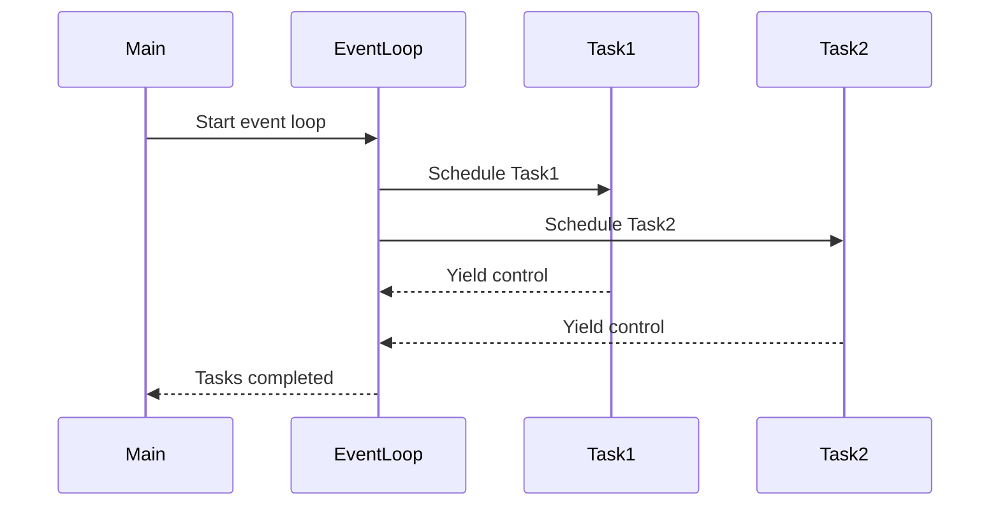

## 6.5.3 Event Loop Patterns

In the realm of modern software development, asynchronous programming has become a cornerstone of building efficient and responsive applications. At the heart of asynchronous programming in Python lies the event loop, a powerful construct that orchestrates the execution of coroutines and manages asynchronous tasks. In this section, we will delve into the intricacies of event loop patterns, exploring how they can be used to manage and schedule tasks effectively. We will also discuss best practices for handling events, timeouts, and cancellations, ensuring that your asynchronous applications are robust and performant.

### Understanding the Event Loop

The event loop is the core component of asynchronous programming in Python, particularly when using the `asyncio` library. It is responsible for managing the execution of asynchronous tasks, scheduling them, and handling events as they occur. The event loop continuously runs, checking for tasks that are ready to be executed and dispatching them accordingly. This allows for non-blocking execution, enabling applications to remain responsive even when performing I/O-bound operations.

#### Role of the Event Loop

The primary role of the event loop is to coordinate the execution of coroutines, which are functions defined with the `async` keyword and can be paused and resumed. The event loop ensures that these coroutines are executed in a non-blocking manner, allowing other tasks to run concurrently. This is achieved through the use of cooperative multitasking, where tasks voluntarily yield control back to the event loop, allowing it to schedule other tasks.

```python
import asyncio

async def say_hello():
    print("Hello, World!")
    await asyncio.sleep(1)
    print("Hello again!")

async def main():
    await say_hello()

asyncio.run(main())
```

In the example above, the `say_hello` coroutine is executed by the event loop, which pauses its execution during the `await asyncio.sleep(1)` call, allowing other tasks to run.

### Scheduling Tasks with `asyncio.create_task()`

One of the key features of the event loop is its ability to schedule tasks for execution. The `asyncio.create_task()` function is used to schedule a coroutine for execution, returning an `asyncio.Task` object that represents the scheduled task. This allows for concurrent execution of multiple tasks, improving the efficiency and responsiveness of applications.

```python
import asyncio

async def fetch_data():
    print("Fetching data...")
    await asyncio.sleep(2)
    print("Data fetched!")

async def main():
    task1 = asyncio.create_task(fetch_data())
    task2 = asyncio.create_task(fetch_data())
    
    await task1
    await task2

asyncio.run(main())
```

In this example, two tasks are scheduled concurrently using `asyncio.create_task()`, allowing them to run simultaneously.

### Gathering Results with `asyncio.gather()`

The `asyncio.gather()` function is a powerful tool for managing multiple asynchronous tasks. It allows you to run multiple coroutines concurrently and gather their results once they have completed. This is particularly useful when you need to perform several asynchronous operations and collect their outcomes.

```python
import asyncio

async def fetch_data(id):
    print(f"Fetching data for ID: {id}")
    await asyncio.sleep(2)
    return f"Data for ID: {id}"

async def main():
    results = await asyncio.gather(
        fetch_data(1),
        fetch_data(2),
        fetch_data(3)
    )
    print(results)

asyncio.run(main())
```

Here, `asyncio.gather()` is used to run three `fetch_data` coroutines concurrently, and their results are collected in a list once all tasks have completed.

### Patterns for Handling Events

Handling events effectively is crucial for building robust asynchronous applications. This involves managing timeouts, cancellations, and choosing between callbacks and `await` syntax.

#### Handling Timeouts and Cancellations

In asynchronous programming, it's important to handle situations where tasks may take longer than expected or need to be cancelled. The `asyncio.wait_for()` function can be used to impose a timeout on a coroutine, raising a `TimeoutError` if the task does not complete within the specified time.

```python
import asyncio

async def long_running_task():
    await asyncio.sleep(5)
    return "Task completed"

async def main():
    try:
        result = await asyncio.wait_for(long_running_task(), timeout=3)
        print(result)
    except asyncio.TimeoutError:
        print("Task timed out!")

asyncio.run(main())
```

In this example, the `long_running_task` coroutine is given a timeout of 3 seconds. If it does not complete within this time, a `TimeoutError` is raised.

Cancellations can be handled using the `Task.cancel()` method, which requests the cancellation of a task. It's important to handle `asyncio.CancelledError` within the coroutine to perform any necessary cleanup.

```python
import asyncio

async def cancellable_task():
    try:
        await asyncio.sleep(10)
    except asyncio.CancelledError:
        print("Task was cancelled!")
        raise

async def main():
    task = asyncio.create_task(cancellable_task())
    await asyncio.sleep(1)
    task.cancel()
    try:
        await task
    except asyncio.CancelledError:
        print("Handled task cancellation.")

asyncio.run(main())
```

Here, the `cancellable_task` is cancelled after 1 second, and the cancellation is handled gracefully within the coroutine.

#### Using Callbacks vs. `await` Syntax

In asynchronous programming, you can choose between using callbacks or the `await` syntax to handle task completion. While callbacks provide a way to execute a function once a task is complete, the `await` syntax offers a more readable and intuitive approach.

**Callbacks Example:**

```python
import asyncio

def on_complete(task):
    print(f"Task completed with result: {task.result()}")

async def some_task():
    await asyncio.sleep(2)
    return "Task result"

async def main():
    task = asyncio.create_task(some_task())
    task.add_done_callback(on_complete)
    await task

asyncio.run(main())
```

**Await Syntax Example:**

```python
import asyncio

async def some_task():
    await asyncio.sleep(2)
    return "Task result"

async def main():
    result = await some_task()
    print(f"Task completed with result: {result}")

asyncio.run(main())
```

The `await` syntax is generally preferred for its simplicity and readability, especially in complex applications.

### Best Practices for Using the Event Loop

To ensure that your asynchronous applications are efficient and maintainable, it's important to follow best practices when working with the event loop.

#### Keep the Event Loop Running Only in the Main Thread

The event loop should be run only in the main thread to avoid potential issues with thread safety. This ensures that all asynchronous tasks are managed consistently and reduces the risk of unexpected behavior.

#### Use Built-in Event Loop Methods for Scheduling and Managing Tasks

Leverage the built-in methods provided by the event loop for scheduling and managing tasks. This includes using `asyncio.create_task()` for scheduling, `asyncio.gather()` for collecting results, and `asyncio.wait_for()` for handling timeouts.

#### Avoid Blocking the Event Loop

Ensure that your coroutines do not perform blocking operations, as this can prevent the event loop from executing other tasks. Use non-blocking I/O operations and `await` syntax to keep the event loop responsive.

#### Handle Exceptions Gracefully

Always handle exceptions within your coroutines to prevent them from propagating and causing the event loop to stop. Use try-except blocks to catch and manage errors effectively.

### Visualizing Event Loop Patterns

To better understand how the event loop coordinates tasks, let's visualize the process using a sequence diagram.



This diagram illustrates how the event loop schedules tasks and manages their execution, allowing them to yield control back to the event loop for concurrent execution.

### Try It Yourself

To deepen your understanding of event loop patterns, try modifying the code examples provided:

1. **Experiment with Timeouts**: Adjust the timeout value in the `asyncio.wait_for()` example to see how it affects task completion.
2. **Create Additional Tasks**: Add more tasks to the `asyncio.gather()` example and observe how the results are collected.
3. **Implement Custom Callbacks**: Write custom callback functions for task completion and explore how they can be used to trigger additional actions.

### Knowledge Check

- What is the primary role of the event loop in asynchronous programming?
- How does `asyncio.create_task()` differ from `asyncio.gather()`?
- What are the advantages of using the `await` syntax over callbacks?
- How can you handle task cancellations in a coroutine?

### Embrace the Journey

As you continue to explore event loop patterns and asynchronous programming in Python, remember that practice is key to mastering these concepts. Experiment with different patterns, build your own asynchronous applications, and embrace the challenges that come with learning new techniques. Keep experimenting, stay curious, and enjoy the journey!

## Quiz Time!



### What is the primary role of the event loop in asynchronous programming?

- [x] To coordinate the execution of coroutines in a non-blocking manner.
- [ ] To execute tasks sequentially.
- [ ] To manage memory allocation for tasks.
- [ ] To handle user input events.

> **Explanation:** The event loop is responsible for coordinating the execution of coroutines in a non-blocking manner, allowing tasks to run concurrently.

### How does `asyncio.create_task()` differ from `asyncio.gather()`?

- [x] `asyncio.create_task()` schedules a single coroutine, while `asyncio.gather()` runs multiple coroutines concurrently.
- [ ] `asyncio.create_task()` is used for blocking tasks, while `asyncio.gather()` is for non-blocking tasks.
- [ ] `asyncio.create_task()` collects results, while `asyncio.gather()` does not.
- [ ] `asyncio.create_task()` is used for I/O-bound tasks, while `asyncio.gather()` is for CPU-bound tasks.

> **Explanation:** `asyncio.create_task()` schedules a single coroutine, whereas `asyncio.gather()` runs multiple coroutines concurrently and collects their results.

### What are the advantages of using the `await` syntax over callbacks?

- [x] Improved readability and simplicity.
- [ ] Faster execution of tasks.
- [ ] Better error handling.
- [ ] Reduced memory usage.

> **Explanation:** The `await` syntax offers improved readability and simplicity, making it easier to understand and maintain asynchronous code.

### How can you handle task cancellations in a coroutine?

- [x] By using try-except blocks to catch `asyncio.CancelledError`.
- [ ] By setting a timeout on the coroutine.
- [ ] By using the `await` keyword.
- [ ] By creating a new event loop.

> **Explanation:** Task cancellations can be handled by using try-except blocks to catch `asyncio.CancelledError` within the coroutine.

### Which of the following is a best practice for using the event loop?

- [x] Keep the event loop running only in the main thread.
- [ ] Use blocking I/O operations within coroutines.
- [ ] Avoid using the `await` syntax.
- [ ] Run the event loop in multiple threads.

> **Explanation:** Keeping the event loop running only in the main thread is a best practice to ensure thread safety and consistent task management.

### What is the purpose of `asyncio.wait_for()`?

- [x] To impose a timeout on a coroutine.
- [ ] To schedule a coroutine for execution.
- [ ] To gather results from multiple coroutines.
- [ ] To cancel a running task.

> **Explanation:** `asyncio.wait_for()` is used to impose a timeout on a coroutine, raising a `TimeoutError` if the task does not complete within the specified time.

### How can you avoid blocking the event loop?

- [x] By using non-blocking I/O operations and the `await` syntax.
- [ ] By using blocking I/O operations.
- [ ] By running the event loop in a separate thread.
- [ ] By avoiding the use of coroutines.

> **Explanation:** To avoid blocking the event loop, use non-blocking I/O operations and the `await` syntax to keep the loop responsive.

### What is the benefit of using `asyncio.gather()`?

- [x] It allows running multiple coroutines concurrently and gathering their results.
- [ ] It schedules a single coroutine for execution.
- [ ] It cancels running tasks.
- [ ] It imposes a timeout on coroutines.

> **Explanation:** `asyncio.gather()` allows running multiple coroutines concurrently and gathering their results in a list once all tasks have completed.

### What should you do to handle exceptions within coroutines?

- [x] Use try-except blocks to catch and manage errors.
- [ ] Avoid using the `await` syntax.
- [ ] Use blocking I/O operations.
- [ ] Run the event loop in multiple threads.

> **Explanation:** To handle exceptions within coroutines, use try-except blocks to catch and manage errors effectively.

### True or False: The event loop should be run in multiple threads to improve performance.

- [ ] True
- [x] False

> **Explanation:** False. The event loop should be run only in the main thread to ensure thread safety and consistent task management.


