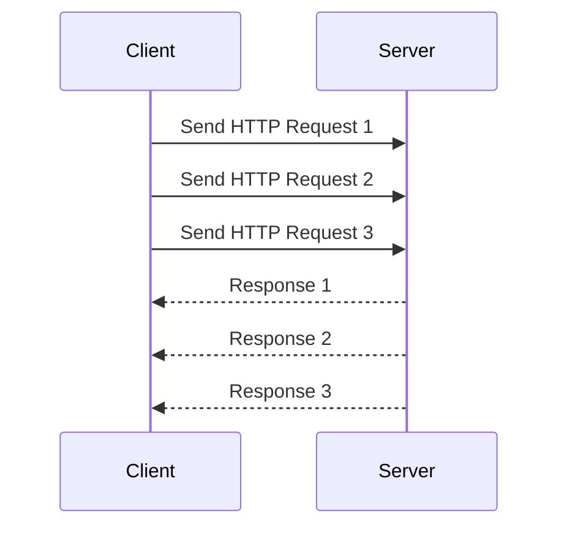

## 6.5.4 Use Cases and Examples

In the realm of software development, asynchronous programming has emerged as a powerful paradigm, especially when it comes to handling tasks that involve waiting for external resources, such as network requests or file I/O operations. By allowing other operations to proceed while waiting, asynchronous programming can significantly improve the performance and responsiveness of applications. In this section, we will delve into practical use cases where asynchronous programming in Python can be a game-changer, focusing on web servers, clients, and network requests. We will also provide code snippets to illustrate these concepts and encourage you to experiment with transforming synchronous code into asynchronous.

### Web Servers and Clients

#### Building High-Performance Web Servers

Web servers are quintessential examples of applications that benefit immensely from asynchronous programming. Traditional synchronous web servers handle each request in a separate thread or process, which can lead to high memory usage and increased latency when dealing with numerous simultaneous connections. Asynchronous web servers, on the other hand, can handle many connections within a single thread, making them more efficient and scalable.

**Example: Asynchronous Web Server Using `aiohttp`**

Let's implement a simple asynchronous web server using the `aiohttp` library, which is designed for building asynchronous HTTP clients and servers in Python.

```python
from aiohttp import web

async def handle(request):
    name = request.match_info.get('name', "Anonymous")
    text = f"Hello, {name}"
    return web.Response(text=text)

app = web.Application()
app.add_routes([web.get('/', handle),
                web.get('/{name}', handle)])

if __name__ == '__main__':
    web.run_app(app)
```

**Explanation:**

- **`aiohttp`**: A library that provides asynchronous HTTP client/server functionality.
- **`web.Application()`**: Creates a new web application instance.
- **`handle(request)`**: An asynchronous function that handles incoming requests.
- **`web.run_app(app)`**: Starts the web server.

This simple server can handle multiple requests concurrently without spawning new threads for each connection, resulting in lower memory usage and faster response times.

#### Outcomes

- **Improved Throughput**: Asynchronous servers can handle more requests per second compared to traditional synchronous servers.
- **Reduced Latency**: By not blocking on I/O operations, asynchronous servers can respond to requests more quickly.
- **Lower Memory Footprint**: Since asynchronous servers do not need to create a new thread for each request, they consume less memory, which is crucial for applications running in resource-constrained environments.

### Scraping and API Consumption

#### Making Concurrent Network Requests

Web scraping and API consumption often involve making multiple network requests, which can be time-consuming if done sequentially. Asynchronous programming allows you to perform these requests concurrently, significantly reducing the total time required.

**Example: Asynchronous HTTP Client Using `aiohttp`**

Let's create an asynchronous HTTP client that fetches data from multiple URLs concurrently using `aiohttp`.

```python
import aiohttp
import asyncio

async def fetch(session, url):
    async with session.get(url) as response:
        return await response.text()

async def main(urls):
    async with aiohttp.ClientSession() as session:
        tasks = [fetch(session, url) for url in urls]
        results = await asyncio.gather(*tasks)
        for result in results:
            print(result)

urls = ['http://example.com', 'http://example.org', 'http://example.net']
asyncio.run(main(urls))
```

**Explanation:**

- **`aiohttp.ClientSession()`**: Manages a pool of connections.
- **`fetch(session, url)`**: An asynchronous function that fetches data from a URL.
- **`asyncio.gather(*tasks)`**: Runs multiple asynchronous tasks concurrently.

By using `asyncio.gather`, we can initiate multiple HTTP requests at once and wait for all of them to complete, which is much faster than waiting for each request to finish before starting the next one.

#### Outcomes

- **Improved Performance**: Asynchronous requests can significantly reduce the time required to fetch data from multiple sources.
- **Efficient Resource Utilization**: By not blocking on network I/O, your application can perform other tasks while waiting for responses.
- **Scalability**: Asynchronous clients can handle a large number of requests without the overhead of managing multiple threads.

### Encouragement to Experiment

Asynchronous programming can seem daunting at first, especially if you're accustomed to synchronous paradigms. However, the benefits it offers in terms of performance and scalability make it worth the effort to learn and apply. Here are some ways you can start experimenting with asynchronous programming in Python:

- **Transform Existing Code**: Take a piece of synchronous code that involves I/O operations and try converting it to use `asyncio` and `aiohttp`. Observe the performance improvements.
- **Small Projects**: Build small projects, such as a web scraper or a simple web server, using asynchronous programming. This hands-on experience will help solidify your understanding.
- **Explore Libraries**: Familiarize yourself with libraries like `aiohttp`, `asyncpg` (for asynchronous PostgreSQL), and `aioredis` (for asynchronous Redis) to see how they can be used in your projects.

### Visualizing Asynchronous Programming

To better understand how asynchronous programming works, let's visualize the flow of an asynchronous HTTP client using a sequence diagram.



**Diagram Explanation:**

- The client sends multiple HTTP requests to the server without waiting for each response.
- The server processes the requests and sends back responses as they are ready.
- The client receives the responses asynchronously, allowing it to handle other tasks in the meantime.

### Try It Yourself

To deepen your understanding of asynchronous programming, try modifying the code examples provided:

- **Change the URLs**: Use different URLs in the HTTP client example and observe how the performance changes.
- **Add Error Handling**: Implement error handling in the `fetch` function to gracefully handle network errors.
- **Measure Performance**: Use Python's `time` module to measure the time taken to complete requests in both synchronous and asynchronous modes.

### Knowledge Check

Before we conclude, let's review some key points:

- **Asynchronous programming** allows tasks to run concurrently, improving performance and resource utilization.
- **`aiohttp`** is a powerful library for building asynchronous HTTP clients and servers in Python.
- **`asyncio.gather`** is used to run multiple asynchronous tasks concurrently.

### Conclusion

Asynchronous programming is a powerful tool in a developer's arsenal, especially for applications that involve I/O-bound tasks. By leveraging libraries like `aiohttp` and `asyncio`, you can build high-performance, scalable applications that handle numerous concurrent tasks efficiently. As you continue to explore asynchronous programming, remember to experiment, measure performance, and apply these concepts to real-world projects.

## Quiz Time!



### What is the primary benefit of using asynchronous programming in web servers?

- [x] Improved throughput and reduced latency
- [ ] Increased memory usage
- [ ] Simplified code structure
- [ ] Enhanced security

> **Explanation:** Asynchronous programming allows web servers to handle more requests concurrently, improving throughput and reducing latency.

### Which Python library is commonly used for asynchronous HTTP clients and servers?

- [ ] requests
- [x] aiohttp
- [ ] urllib
- [ ] socket

> **Explanation:** `aiohttp` is a library designed for building asynchronous HTTP clients and servers in Python.

### What function is used to run multiple asynchronous tasks concurrently in Python?

- [ ] asyncio.run
- [x] asyncio.gather
- [ ] asyncio.sleep
- [ ] asyncio.create_task

> **Explanation:** `asyncio.gather` is used to run multiple asynchronous tasks concurrently.

### What is the main advantage of using `aiohttp.ClientSession()`?

- [x] Manages a pool of connections
- [ ] Simplifies synchronous requests
- [ ] Increases memory usage
- [ ] Provides built-in error handling

> **Explanation:** `aiohttp.ClientSession()` manages a pool of connections, allowing for efficient resource utilization.

### How does asynchronous programming improve performance in web scraping?

- [x] By making concurrent network requests
- [ ] By simplifying HTML parsing
- [ ] By reducing the number of requests
- [ ] By increasing the number of threads

> **Explanation:** Asynchronous programming allows for concurrent network requests, reducing the total time required for web scraping.

### What is the purpose of using `asyncio.run()` in an asynchronous program?

- [x] To execute the main asynchronous function
- [ ] To create a new thread
- [ ] To block I/O operations
- [ ] To handle exceptions

> **Explanation:** `asyncio.run()` is used to execute the main asynchronous function in an asyncio program.

### Which of the following is NOT a benefit of asynchronous programming?

- [ ] Improved throughput
- [ ] Reduced latency
- [ ] Lower memory footprint
- [x] Increased complexity

> **Explanation:** While asynchronous programming offers many benefits, it can increase the complexity of code.

### What is a common use case for asynchronous programming?

- [ ] CPU-bound tasks
- [x] I/O-bound tasks
- [ ] Memory-bound tasks
- [ ] Disk-bound tasks

> **Explanation:** Asynchronous programming is particularly beneficial for I/O-bound tasks, such as network requests.

### What is the role of `asyncio.gather()` in an asynchronous program?

- [x] To run multiple tasks concurrently
- [ ] To create a new event loop
- [ ] To handle exceptions
- [ ] To block I/O operations

> **Explanation:** `asyncio.gather()` is used to run multiple asynchronous tasks concurrently.

### True or False: Asynchronous programming can help reduce the memory footprint of an application.

- [x] True
- [ ] False

> **Explanation:** Asynchronous programming can reduce the memory footprint by avoiding the need for multiple threads or processes.



Remember, this is just the beginning. As you progress, you'll build more complex and interactive applications. Keep experimenting, stay curious, and enjoy the journey!
