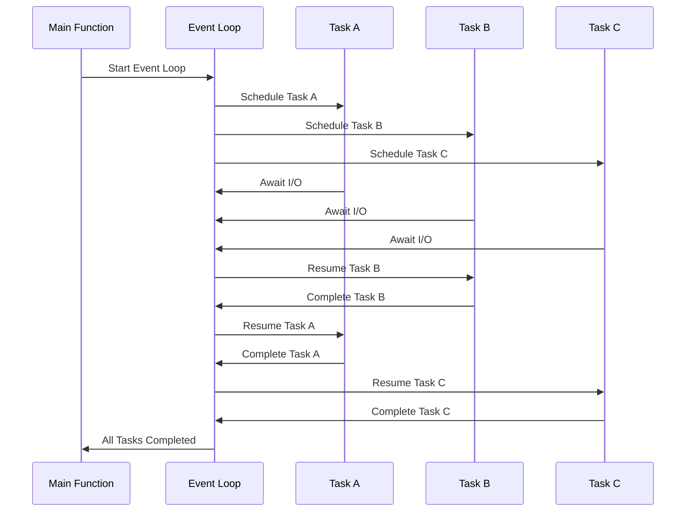

## 6.5 Asynchronous Programming Patterns

In the world of modern software development, the need for efficient and scalable applications is paramount. Asynchronous programming in Python provides a robust solution for handling I/O-bound tasks without the complexity of multi-threading. In this section, we will delve into the concepts and patterns of asynchronous programming using Python's `asyncio` library, explore various asynchronous patterns, and provide practical code examples to illustrate these concepts.

### Introduction to Asynchronous Programming in Python

Asynchronous programming allows programs to perform tasks concurrently, enabling them to handle multiple operations without waiting for each to complete before starting the next. This is particularly useful for I/O-bound tasks, such as network requests or file operations, where waiting for a response can be time-consuming.

#### Evolution of Asynchronous Programming in Python

Python's journey into asynchronous programming began with the introduction of the `asyncio` library in Python 3.3, which provided a framework for writing single-threaded concurrent code using coroutines, event loops, and non-blocking I/O. Over time, Python has evolved to include native support for asynchronous programming with the `async` and `await` keywords, making it easier to write and manage asynchronous code.

#### Key Terms and Concepts

- **Coroutine**: A coroutine is a special type of function that can pause and resume its execution. In Python, coroutines are defined using the `async def` syntax and are the building blocks of asynchronous programming.
  
- **Event Loop**: The event loop is the core of asynchronous programming in Python. It manages the execution of coroutines, scheduling them to run and handling their results. The event loop continuously checks for tasks that are ready to run and executes them.

- **Blocking vs. Non-blocking Code**: Blocking code waits for an operation to complete before proceeding, while non-blocking code allows other operations to run concurrently. Asynchronous programming relies on non-blocking code to improve efficiency.

### Asynchronous Patterns in Python

Python's `asyncio` library provides several patterns for implementing asynchronous programming, including async iterators, async context managers, and event loops. Let's explore these patterns in detail.

#### Async Iterator Pattern

The async iterator pattern allows us to iterate over data sources asynchronously. This is particularly useful when dealing with data streams or large datasets that are fetched incrementally.

```python
import asyncio

class AsyncCounter:
    def __init__(self, start, end):
        self.current = start
        self.end = end

    async def __aiter__(self):
        return self

    async def __anext__(self):
        if self.current < self.end:
            await asyncio.sleep(1)  # Simulate a delay
            self.current += 1
            return self.current
        else:
            raise StopAsyncIteration

async def main():
    async for number in AsyncCounter(1, 5):
        print(number)

asyncio.run(main())
```

In this example, `AsyncCounter` is an asynchronous iterator that yields numbers from `start` to `end`, simulating a delay with `await asyncio.sleep(1)` to mimic an I/O-bound operation.

#### Async Context Managers

Async context managers are used to manage resources that require asynchronous setup and teardown, such as opening and closing network connections.

```python
import asyncio

class AsyncResource:
    async def __aenter__(self):
        print("Acquiring resource")
        await asyncio.sleep(1)  # Simulate resource acquisition
        return self

    async def __aexit__(self, exc_type, exc, tb):
        print("Releasing resource")
        await asyncio.sleep(1)  # Simulate resource release

async def use_resource():
    async with AsyncResource() as resource:
        print("Using resource")

asyncio.run(use_resource())
```

This code demonstrates an async context manager that simulates acquiring and releasing a resource asynchronously.

#### Event Loop Patterns

The event loop is central to asynchronous programming in Python. It schedules and executes asynchronous tasks, allowing them to run concurrently.

```python
import asyncio

async def task(name, delay):
    print(f"Task {name} started")
    await asyncio.sleep(delay)
    print(f"Task {name} completed")

async def main():
    await asyncio.gather(
        task("A", 2),
        task("B", 1),
        task("C", 3)
    )

asyncio.run(main())
```

In this example, `asyncio.gather` is used to run multiple tasks concurrently. The event loop schedules each task, allowing them to execute without blocking each other.

### Advantages and Trade-offs

Asynchronous programming offers several advantages, particularly for I/O-bound tasks and network applications. However, it also comes with trade-offs.

#### Advantages

- **Efficient Handling of I/O-bound Tasks**: Asynchronous programming allows applications to handle multiple I/O operations concurrently, improving efficiency and responsiveness.

- **Better Scalability for Network Applications**: By using non-blocking I/O, asynchronous programming can handle more connections and requests, making it ideal for network applications.

#### Trade-offs

- **Steeper Learning Curve**: Asynchronous programming introduces new concepts and patterns that can be challenging to learn and understand.

- **Potential Complexity in Debugging**: Debugging asynchronous code can be more complex due to the concurrent nature of execution and the use of coroutines.

### Best Practices for Asynchronous Programming

To effectively use asynchronous programming in Python, consider the following best practices:

- **Keep Coroutines Small and Focused**: Write coroutines that perform specific tasks and keep them small to improve readability and maintainability.

- **Avoid Mixing Blocking Code with Asynchronous Code**: Mixing blocking code with asynchronous code can lead to performance issues and should be avoided.

- **Use Tools Like `asyncio.run()`, `await`, and `ensure_future` Properly**: These tools help manage the execution of asynchronous tasks and should be used appropriately to ensure efficient execution.

### Encouraging Application of Asynchronous Programming

Asynchronous programming can significantly improve the performance and scalability of applications. Consider converting I/O-heavy parts of your applications to use asynchronous programming. Additionally, explore asynchronous web frameworks like `aiohttp` or `FastAPI`, which are built on top of `asyncio` and provide powerful tools for building scalable web applications.

### Visualizing Asynchronous Programming

To better understand the flow of asynchronous programming, let's visualize the interaction between coroutines and the event loop.



This diagram illustrates how the event loop schedules and manages the execution of tasks, allowing them to run concurrently without blocking each other.

### Try It Yourself

Experiment with the code examples provided in this section. Try modifying the delay times in the `task` function or adding additional tasks to see how the event loop handles them. You can also create your own async iterators and context managers to manage different resources asynchronously.

### References and Further Reading

- [Python `asyncio` Documentation](https://docs.python.org/3/library/asyncio.html)
- [Real Python: Async IO in Python](https://realpython.com/async-io-python/)
- [FastAPI Documentation](https://fastapi.tiangolo.com/)
- [AIOHTTP Documentation](https://docs.aiohttp.org/en/stable/)

### Knowledge Check

- What is the role of the event loop in asynchronous programming?
- How does an async iterator differ from a regular iterator?
- What are the advantages of using async context managers?

### Embrace the Journey

Asynchronous programming in Python opens up new possibilities for building efficient and scalable applications. Remember, this is just the beginning. As you progress, you'll build more complex and interactive applications. Keep experimenting, stay curious, and enjoy the journey!

## Quiz Time!



### What is a coroutine in Python?

- [x] A special type of function that can pause and resume its execution
- [ ] A function that runs in a separate thread
- [ ] A blocking function that waits for I/O operations
- [ ] A function that is executed by the operating system

> **Explanation:** A coroutine is a special type of function in Python that can pause and resume its execution, allowing for asynchronous programming.

### What is the main purpose of the event loop in asynchronous programming?

- [x] To manage the execution of coroutines and schedule tasks
- [ ] To create new threads for each task
- [ ] To block the execution of tasks until they are completed
- [ ] To handle exceptions in asynchronous code

> **Explanation:** The event loop manages the execution of coroutines and schedules tasks, allowing them to run concurrently without blocking.

### How does an async iterator differ from a regular iterator?

- [x] An async iterator allows iteration over data sources asynchronously
- [ ] An async iterator is faster than a regular iterator
- [ ] An async iterator can only be used with blocking code
- [ ] An async iterator is a type of generator

> **Explanation:** An async iterator allows iteration over data sources asynchronously, making it suitable for handling data streams or large datasets.

### What is the purpose of an async context manager?

- [x] To manage resources that require asynchronous setup and teardown
- [ ] To block the execution of code until resources are available
- [ ] To create new threads for resource management
- [ ] To handle exceptions in resource management

> **Explanation:** An async context manager is used to manage resources that require asynchronous setup and teardown, such as network connections.

### Which of the following is an advantage of asynchronous programming?

- [x] Efficient handling of I/O-bound tasks
- [ ] Easier debugging of code
- [x] Better scalability for network applications
- [ ] Simpler code structure

> **Explanation:** Asynchronous programming allows for efficient handling of I/O-bound tasks and better scalability for network applications.

### What is a trade-off of using asynchronous programming?

- [x] Steeper learning curve
- [ ] Increased memory usage
- [ ] Limited to single-threaded execution
- [ ] Requires more hardware resources

> **Explanation:** Asynchronous programming introduces new concepts and patterns that can be challenging to learn and understand, leading to a steeper learning curve.

### What is the role of `asyncio.gather` in asynchronous programming?

- [x] To run multiple tasks concurrently
- [ ] To block the execution of tasks until they are completed
- [x] To schedule tasks for execution by the event loop
- [ ] To handle exceptions in asynchronous code

> **Explanation:** `asyncio.gather` is used to run multiple tasks concurrently and schedule them for execution by the event loop.

### Why should blocking code be avoided in asynchronous programming?

- [x] It can lead to performance issues
- [ ] It simplifies code structure
- [ ] It improves memory usage
- [ ] It enhances code readability

> **Explanation:** Blocking code should be avoided in asynchronous programming as it can lead to performance issues by preventing other tasks from executing concurrently.

### What is the benefit of using `asyncio.run()`?

- [x] It simplifies the execution of asynchronous code
- [ ] It creates new threads for each task
- [ ] It blocks the execution of tasks until they are completed
- [ ] It handles exceptions in asynchronous code

> **Explanation:** `asyncio.run()` simplifies the execution of asynchronous code by managing the event loop and scheduling tasks.

### True or False: Asynchronous programming is only useful for CPU-bound tasks.

- [ ] True
- [x] False

> **Explanation:** Asynchronous programming is particularly useful for I/O-bound tasks, not CPU-bound tasks, as it allows for efficient handling of multiple I/O operations concurrently.


