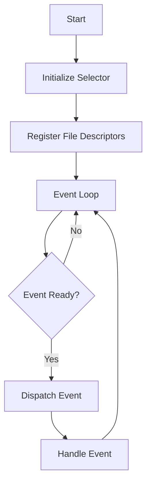

## 6.6.1 Implementing Reactor in Python

The Reactor pattern is a powerful design pattern used to handle service requests delivered concurrently to a service handler by one or more inputs. It efficiently manages multiple service requests that are delivered concurrently to a service handler by one or more inputs. In Python, this pattern can be implemented using the `selectors` module or `asyncio`, both of which provide mechanisms for non-blocking I/O operations. This guide will walk you through implementing the Reactor pattern in Python, focusing on setting up the reactor, creating an event loop, handling events, and scaling the application.

### Understanding the Reactor Pattern

The Reactor pattern is an event-driven architecture pattern that demultiplexes and dispatches service requests that are delivered concurrently to an application. The pattern consists of the following components:

- **Event Demultiplexer**: Waits for events on a set of event sources and delivers them to the appropriate handler.
- **Event Handlers**: Encapsulate the application-specific logic for processing events.
- **Reactor**: Manages the event loop and dispatches events to the appropriate handlers.

### Setting Up the Reactor

To implement the Reactor pattern in Python, we will use the `selectors` module, which provides a high-level I/O multiplexing interface. The `selectors` module allows you to register file descriptors (such as sockets) and associate them with event masks and callback functions.

#### Initializing the Selector

First, we need to initialize a selector object. The `selectors.DefaultSelector()` function returns a platform-specific selector object that can be used to monitor multiple file descriptors.

```python
import selectors

selector = selectors.DefaultSelector()
```

#### Registering File Descriptors

Next, we register file descriptors along with event masks and handler callbacks. Event masks specify the types of events we are interested in, such as `selectors.EVENT_READ` for read events and `selectors.EVENT_WRITE` for write events.

```python
import socket

server_socket = socket.socket(socket.AF_INET, socket.SOCK_STREAM)
server_socket.bind(('localhost', 12345))
server_socket.listen()

selector.register(server_socket, selectors.EVENT_READ, data=None)
```

### Implementing the Event Loop

The core of the Reactor pattern is the event loop, which continuously waits for events and dispatches them to the registered handlers.

#### Creating the Event Loop

The event loop is implemented using a while loop that calls `selector.select()`. This method blocks until at least one registered event is ready, returning a list of (key, events) tuples. Each key contains the file object, event mask, and callback data.

```python
def event_loop():
    while True:
        # Wait for events
        events = selector.select(timeout=None)
        for key, mask in events:
            # Retrieve the callback function
            callback = key.data
            if callback:
                callback(key.fileobj, mask)

event_loop()
```

#### Dispatching Events

When an event is ready, the event loop retrieves the associated callback function and invokes it with the file object and event mask as arguments. This allows the callback to handle the event appropriately.

### Handling Events

In this section, we will demonstrate how to manage connections, read and write data, and handle errors and client disconnections.

#### Accepting Connections

To handle new client connections, we define a callback function that accepts the connection and registers it with the selector for read events.

```python
def accept_connection(server_socket, mask):
    client_socket, addr = server_socket.accept()  # Accept the connection
    print(f"Accepted connection from {addr}")
    client_socket.setblocking(False)
    # Register the client socket for read events
    selector.register(client_socket, selectors.EVENT_READ, data=read_data)

selector.modify(server_socket, selectors.EVENT_READ, data=accept_connection)
```

#### Reading and Writing Data

To echo messages back to clients, we define a callback function that reads data from the client socket and writes it back.

```python
def read_data(client_socket, mask):
    try:
        data = client_socket.recv(1024)  # Read data from the client
        if data:
            print(f"Received data: {data.decode()}")
            client_socket.sendall(data)  # Echo the data back
        else:
            # No data means the client has disconnected
            print("Client disconnected")
            selector.unregister(client_socket)
            client_socket.close()
    except ConnectionResetError:
        # Handle client disconnection
        print("Connection reset by peer")
        selector.unregister(client_socket)
        client_socket.close()
```

### Scaling the Reactor

The Reactor pattern is inherently single-threaded, which means it can only utilize one CPU core. To scale beyond one core, you can use multiple processes or leverage frameworks that handle distribution.

#### Using Multiple Processes

One approach to scaling is to use the `multiprocessing` module to create multiple processes, each running its own instance of the Reactor. This allows you to utilize multiple CPU cores.

```python
from multiprocessing import Process

def start_reactor():
    # Initialize and start the reactor
    event_loop()

processes = [Process(target=start_reactor) for _ in range(4)]
for process in processes:
    process.start()

for process in processes:
    process.join()
```

#### Leveraging Frameworks

Alternatively, you can use frameworks like `Twisted` or `Tornado`, which provide built-in support for scaling and distribution. These frameworks abstract away the complexity of managing multiple processes and threads.

### Try It Yourself

To solidify your understanding of the Reactor pattern, try modifying the code examples to add additional functionality. For example, you could:

- Implement a simple chat server that broadcasts messages to all connected clients.
- Add support for handling multiple types of events, such as timers or signals.
- Experiment with different scaling strategies, such as using threads instead of processes.

### Visualizing the Reactor Pattern

To help you visualize the flow of the Reactor pattern, consider the following diagram:



**Diagram Description**: This flowchart illustrates the main components of the Reactor pattern. The process starts with initializing the selector and registering file descriptors. The event loop continuously waits for events, dispatches them to the appropriate handlers, and handles the events.

### References and Further Reading

- [Python Selectors Module Documentation](https://docs.python.org/3/library/selectors.html)
- [Asyncio: Asynchronous I/O in Python](https://docs.python.org/3/library/asyncio.html)
- [Twisted: An Event-Driven Networking Engine](https://twistedmatrix.com/)
- [Tornado: A Python Web Framework and Asynchronous Networking Library](https://www.tornadoweb.org/en/stable/)

### Knowledge Check

Before moving on, take a moment to review the key concepts covered in this section:

- The Reactor pattern is used for efficient event handling in concurrent applications.
- The `selectors` module provides a high-level interface for I/O multiplexing in Python.
- The event loop is the core of the Reactor pattern, responsible for waiting for events and dispatching them to handlers.
- Scaling the Reactor pattern can be achieved through multiple processes or by using frameworks that handle distribution.

### Embrace the Journey

Remember, mastering the Reactor pattern is just one step in your journey to becoming a proficient Python developer. As you continue to explore design patterns and concurrency in Python, you'll gain the skills needed to build robust, scalable applications. Keep experimenting, stay curious, and enjoy the journey!

## Quiz Time!



### What is the primary purpose of the Reactor pattern?

- [x] To efficiently handle concurrent service requests
- [ ] To manage database connections
- [ ] To simplify user interface design
- [ ] To optimize memory usage

> **Explanation:** The Reactor pattern is designed to efficiently handle concurrent service requests by demultiplexing and dispatching events.

### Which Python module is commonly used to implement the Reactor pattern?

- [x] selectors
- [ ] threading
- [ ] multiprocessing
- [ ] functools

> **Explanation:** The `selectors` module provides a high-level interface for I/O multiplexing, making it suitable for implementing the Reactor pattern.

### What function is used to initialize a selector object in Python?

- [x] selectors.DefaultSelector()
- [ ] selectors.Selector()
- [ ] selectors.EventSelector()
- [ ] selectors.IOSelector()

> **Explanation:** The `selectors.DefaultSelector()` function returns a platform-specific selector object used for I/O multiplexing.

### How can you scale the Reactor pattern beyond one CPU core?

- [x] Use multiple processes
- [ ] Use multiple threads
- [ ] Increase the timeout value
- [ ] Use a single process

> **Explanation:** To scale beyond one CPU core, you can use multiple processes, each running its own instance of the Reactor.

### Which of the following is NOT a component of the Reactor pattern?

- [ ] Event Demultiplexer
- [ ] Event Handlers
- [x] Database Connector
- [ ] Reactor

> **Explanation:** The Reactor pattern consists of the Event Demultiplexer, Event Handlers, and the Reactor itself, but not a Database Connector.

### What is the role of the event loop in the Reactor pattern?

- [x] To wait for events and dispatch them to handlers
- [ ] To manage database transactions
- [ ] To render user interfaces
- [ ] To optimize memory usage

> **Explanation:** The event loop is responsible for waiting for events and dispatching them to the appropriate handlers.

### What is the purpose of registering file descriptors with the selector?

- [x] To associate them with event masks and callbacks
- [ ] To allocate memory for them
- [ ] To establish database connections
- [ ] To render graphics

> **Explanation:** Registering file descriptors with the selector associates them with event masks and callback functions for handling events.

### What happens when no data is received from a client socket?

- [x] The client is considered disconnected
- [ ] The server sends a default response
- [ ] The server closes all connections
- [ ] The server restarts

> **Explanation:** When no data is received, it indicates that the client has disconnected, and the server should close the connection.

### Which framework is NOT mentioned as a way to scale the Reactor pattern?

- [ ] Twisted
- [ ] Tornado
- [x] Flask
- [ ] asyncio

> **Explanation:** Flask is a web framework and is not mentioned as a way to scale the Reactor pattern, unlike Twisted, Tornado, and asyncio.

### True or False: The Reactor pattern is inherently multi-threaded.

- [ ] True
- [x] False

> **Explanation:** The Reactor pattern is inherently single-threaded, but it can be scaled using multiple processes or frameworks.


