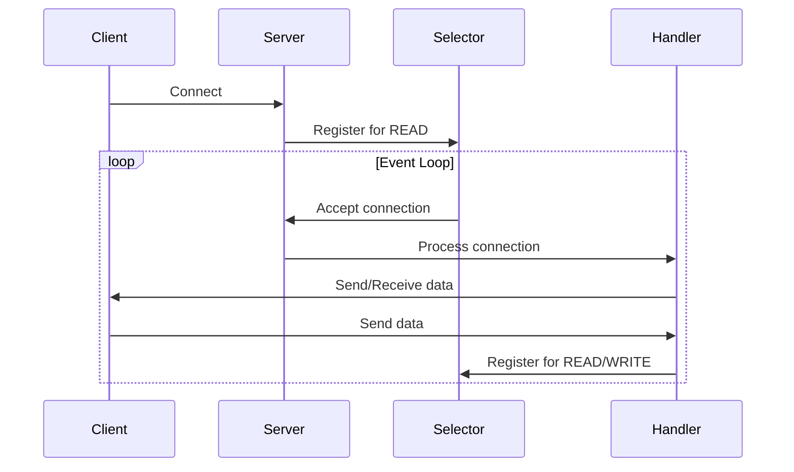

## 6.6.2 Handling Service Requests Efficiently

In modern software development, efficiently handling multiple service requests is crucial, especially in applications requiring high concurrency. The Reactor pattern offers a robust solution for managing numerous I/O-bound operations without the overhead of spawning multiple threads. This section delves into the Reactor pattern, illustrating its efficiency gains, providing practical examples, discussing its limitations, and highlighting scenarios where it excels.

### Understanding the Reactor Pattern

The Reactor pattern is a design pattern used to handle service requests delivered concurrently to a service handler by one or more inputs. It efficiently demultiplexes and dispatches these requests to the appropriate handlers. The core idea is to use a single-threaded event loop to manage multiple I/O operations, reducing the complexity and overhead associated with multi-threading.

#### Efficiency Gains

1. **Reduced Overhead**: By avoiding the creation of multiple threads, the Reactor pattern eliminates the overhead associated with context switching and thread management. This makes it particularly suitable for applications with a high number of concurrent I/O-bound operations.

2. **Simplified Synchronization**: Since the Reactor pattern operates within a single thread, it simplifies the synchronization issues that typically arise in multi-threaded environments. This reduces the risk of race conditions and deadlocks.

3. **Resource Optimization**: The pattern minimizes resource usage, as it does not require multiple threads or processes to handle concurrent requests. This is especially beneficial in environments with limited resources.

### Implementing the Reactor Pattern in Python

To illustrate the Reactor pattern, let's implement a simple multi-client chat server. This server will handle multiple clients using a single-threaded event loop, demonstrating the efficiency of the Reactor pattern in managing I/O-bound operations.

```python
import selectors
import socket

selector = selectors.DefaultSelector()

def accept(sock):
    conn, addr = sock.accept()  # Accept the connection
    print(f"Accepted connection from {addr}")
    conn.setblocking(False)  # Set the connection to non-blocking mode
    selector.register(conn, selectors.EVENT_READ, read)  # Register the connection for reading

def read(conn):
    data = conn.recv(1024)  # Read data from the connection
    if data:
        print(f"Received data: {data.decode()} from {conn.getpeername()}")
        conn.sendall(data)  # Echo the data back to the client
    else:
        print(f"Closing connection to {conn.getpeername()}")
        selector.unregister(conn)  # Unregister the connection
        conn.close()  # Close the connection

server_socket = socket.socket(socket.AF_INET, socket.SOCK_STREAM)
server_socket.bind(('localhost', 65432))
server_socket.listen()
server_socket.setblocking(False)

selector.register(server_socket, selectors.EVENT_READ, accept)

print("Server is running and waiting for connections...")

while True:
    events = selector.select()  # Wait for events
    for key, mask in events:
        callback = key.data  # Retrieve the callback function
        callback(key.fileobj)  # Call the callback function with the file object
```

#### Code Explanation

- **Selector**: We use Python's `selectors` module to manage multiple I/O operations. It provides a high-level interface to monitor multiple file descriptors, making it ideal for implementing the Reactor pattern.
  
- **Non-blocking I/O**: The server socket and client connections are set to non-blocking mode, allowing the event loop to continue processing other events without waiting for I/O operations to complete.

- **Event Loop**: The `while True` loop continuously waits for I/O events using the `selector.select()` method. When an event occurs, it retrieves the associated callback function and executes it.

- **Callback Functions**: The `accept` function handles new client connections, while the `read` function processes incoming data from clients. These functions are registered with the selector to be called when the corresponding events occur.

### Try It Yourself

To experiment with the chat server, try modifying the code to add new features or handle different types of requests. For example, you could:

- Implement a broadcast feature to send messages from one client to all connected clients.
- Add support for handling different types of messages, such as private messages or commands.
- Integrate logging to track client connections and message exchanges.

### Limitations of the Reactor Pattern

While the Reactor pattern offers significant efficiency gains for I/O-bound operations, it has limitations:

1. **CPU-bound Tasks**: Since the Reactor pattern relies on a single-threaded event loop, CPU-bound tasks can block the reactor, affecting the system's responsiveness. This makes it unsuitable for applications requiring significant computation.

2. **Scalability**: Although the pattern excels in handling numerous I/O operations, it may not scale well in scenarios where tasks require extensive processing time. In such cases, a multi-threaded or multi-process approach might be more appropriate.

3. **Complexity in Error Handling**: Managing errors and exceptions in a single-threaded event loop can be challenging, as a single unhandled exception can disrupt the entire loop.

### Conditions Where the Reactor Pattern Excels

The Reactor pattern is particularly effective in scenarios involving high concurrency with I/O-bound operations. It excels in:

- **Network Servers**: Applications like chat servers, web servers, and proxy servers benefit from the pattern's ability to handle multiple connections efficiently.

- **Resource-Constrained Environments**: Systems with limited resources, such as embedded devices, can leverage the pattern's minimal resource usage.

- **Real-time Applications**: Applications requiring low-latency responses, such as gaming servers or financial trading platforms, can benefit from the pattern's efficient event handling.

### Visualizing the Reactor Pattern

To better understand the flow of the Reactor pattern, let's visualize the process using a sequence diagram.



**Diagram Explanation**:

- **Client**: Initiates a connection to the server.
- **Server**: Accepts the connection and registers it with the selector for read events.
- **Selector**: Monitors registered file descriptors for events and notifies the server when an event occurs.
- **Handler**: Processes the connection, sending and receiving data as needed.

### References and Further Reading

To deepen your understanding of the Reactor pattern and its applications, consider exploring the following resources:

- [Python `selectors` Module Documentation](https://docs.python.org/3/library/selectors.html)
- [Reactor Pattern on Wikipedia](https://en.wikipedia.org/wiki/Reactor_pattern)
- [Event-Driven Programming in Python](https://realpython.com/python-sockets/)

### Knowledge Check

To reinforce your understanding of the Reactor pattern, consider the following questions:

- How does the Reactor pattern improve efficiency in handling service requests?
- What are the limitations of using the Reactor pattern for CPU-bound tasks?
- In what scenarios does the Reactor pattern excel?

### Embrace the Journey

Remember, mastering design patterns like the Reactor pattern is a journey. As you continue to explore and experiment, you'll gain deeper insights into building efficient, scalable applications. Keep experimenting, stay curious, and enjoy the process!

## Quiz Time!



### What is the primary efficiency gain of using the Reactor pattern?

- [x] Reduces overhead associated with context switches in threading or forking.
- [ ] Increases the number of threads used.
- [ ] Simplifies the code by using multiple threads.
- [ ] Enhances CPU-bound task performance.

> **Explanation:** The Reactor pattern reduces overhead by using a single-threaded event loop, avoiding the need for context switches associated with threading or forking.

### Which Python module is commonly used to implement the Reactor pattern?

- [x] selectors
- [ ] threading
- [ ] multiprocessing
- [ ] asyncio

> **Explanation:** The `selectors` module in Python provides a high-level interface for monitoring multiple file descriptors, making it ideal for implementing the Reactor pattern.

### What type of tasks can block the Reactor pattern, affecting responsiveness?

- [x] CPU-bound tasks
- [ ] I/O-bound tasks
- [ ] Network-bound tasks
- [ ] Memory-bound tasks

> **Explanation:** CPU-bound tasks can block the single-threaded event loop used in the Reactor pattern, affecting the system's responsiveness.

### In what type of environment does the Reactor pattern excel?

- [x] High concurrency with I/O-bound operations
- [ ] High concurrency with CPU-bound operations
- [ ] Low concurrency with I/O-bound operations
- [ ] Low concurrency with CPU-bound operations

> **Explanation:** The Reactor pattern excels in environments with high concurrency and I/O-bound operations, where it can efficiently handle multiple connections.

### What is a potential limitation of the Reactor pattern?

- [x] Not suitable for tasks requiring significant computation
- [ ] Requires multiple threads to function
- [ ] Increases resource usage
- [ ] Complicates synchronization

> **Explanation:** The Reactor pattern is not suitable for tasks requiring significant computation, as CPU-bound tasks can block the event loop.

### How does the Reactor pattern simplify synchronization?

- [x] By operating within a single thread
- [ ] By using multiple threads
- [ ] By increasing resource usage
- [ ] By enhancing CPU-bound task performance

> **Explanation:** The Reactor pattern simplifies synchronization by operating within a single thread, reducing the risk of race conditions and deadlocks.

### Which function is used to accept new client connections in the example code?

- [x] accept
- [ ] read
- [ ] connect
- [ ] send

> **Explanation:** The `accept` function is used to accept new client connections in the example code, registering them with the selector for read events.

### What is the role of the selector in the Reactor pattern?

- [x] Monitors registered file descriptors for events
- [ ] Handles CPU-bound tasks
- [ ] Increases the number of threads
- [ ] Simplifies synchronization

> **Explanation:** The selector monitors registered file descriptors for events and notifies the server when an event occurs, allowing for efficient event handling.

### What is a suitable scenario for using the Reactor pattern?

- [x] Network servers handling multiple connections
- [ ] Applications requiring significant computation
- [ ] Single-threaded applications with low concurrency
- [ ] Systems with high resource usage

> **Explanation:** The Reactor pattern is suitable for network servers handling multiple connections, where it can efficiently manage I/O-bound operations.

### True or False: The Reactor pattern is ideal for CPU-bound tasks.

- [ ] True
- [x] False

> **Explanation:** False. The Reactor pattern is not ideal for CPU-bound tasks, as they can block the single-threaded event loop and affect responsiveness.


