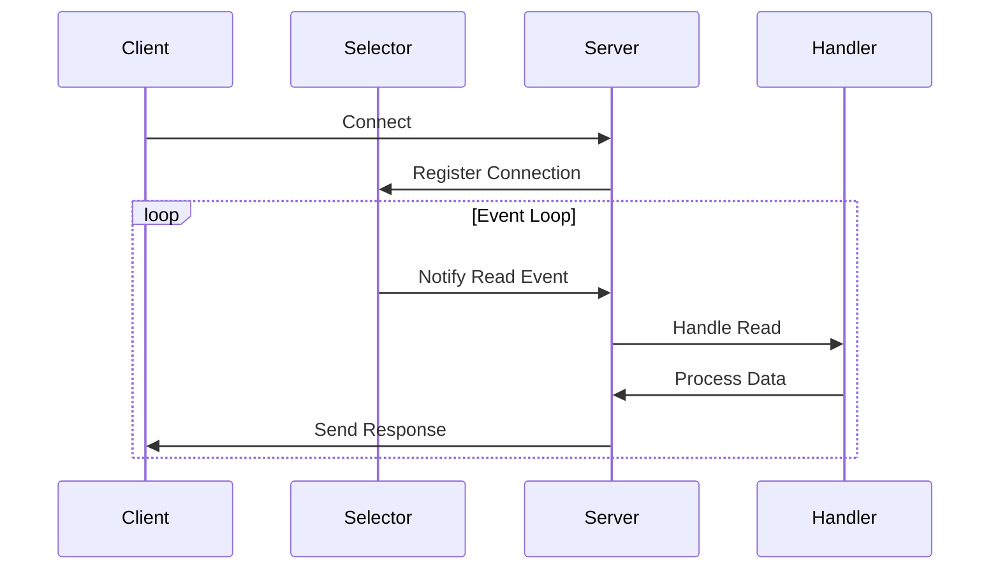

## 6.6.3 Use Cases and Examples

The Reactor pattern is a cornerstone of event-driven programming, particularly useful in scenarios where applications need to handle multiple simultaneous I/O operations efficiently. In this section, we will delve into real-world use cases where the Reactor pattern shines, such as network servers and event-driven applications. We will also provide detailed code examples to illustrate how this pattern can be implemented in Python, highlighting its benefits in terms of scalability and resource efficiency.

### Network Servers

Network servers are a classic example where the Reactor pattern is highly beneficial. Servers like HTTP servers, proxies, or routers often need to handle thousands of concurrent connections. The Reactor pattern allows these servers to manage multiple connections using a single or a few threads, significantly reducing the overhead associated with thread management.

#### Example: Building a Simple HTTP Server

Let's build a simple HTTP server using the Reactor pattern. This server will handle multiple client connections asynchronously, demonstrating the pattern's efficiency.

```python
import selectors
import socket

selector = selectors.DefaultSelector()

def accept(sock):
    conn, addr = sock.accept()  # Accept the connection
    print(f'Accepted connection from {addr}')
    conn.setblocking(False)  # Set the connection to non-blocking mode
    selector.register(conn, selectors.EVENT_READ, read)  # Register the connection for reading

def read(conn):
    data = conn.recv(1024)  # Read data from the connection
    if data:
        print(f'Received data: {data.decode()}')
        conn.send(data)  # Echo the data back to the client
    else:
        print('Closing connection')
        selector.unregister(conn)  # Unregister the connection
        conn.close()  # Close the connection

sock = socket.socket(socket.AF_INET, socket.SOCK_STREAM)
sock.bind(('localhost', 8080))
sock.listen()
sock.setblocking(False)

selector.register(sock, selectors.EVENT_READ, accept)

print('Server is running on http://localhost:8080')

while True:
    events = selector.select()  # Wait for events
    for key, _ in events:
        callback = key.data
        callback(key.fileobj)  # Call the registered callback
```

**Explanation:**

- **Selector**: We use Python's `selectors` module to manage multiple connections. The `DefaultSelector` object allows us to register sockets and specify the events we are interested in (e.g., reading or writing).
- **Non-blocking I/O**: The server uses non-blocking sockets, which means it can handle multiple connections without being blocked by any single one.
- **Event Loop**: The server runs an event loop that waits for events on registered sockets and calls the appropriate callback functions (`accept` or `read`) when an event occurs.

**Benefits:**

- **Scalability**: The server can handle many connections simultaneously without the overhead of creating a new thread for each connection.
- **Resource Efficiency**: Lower memory and CPU usage compared to traditional multi-threaded servers.

### Event-Driven Applications

Event-driven applications, such as GUI applications, benefit greatly from the Reactor pattern. These applications need to respond quickly to user events, such as clicks or key presses, without blocking the main thread.

#### Example: GUI Application with Event Handling

Consider a simple GUI application that uses the Reactor pattern to handle user events efficiently.

```python
import tkinter as tk
from tkinter import messagebox

def on_button_click():
    messagebox.showinfo("Information", "Button clicked!")

root = tk.Tk()
root.title("Reactor Pattern GUI Example")

button = tk.Button(root, text="Click Me", command=on_button_click)
button.pack(pady=20)

root.mainloop()
```

**Explanation:**

- **Event Loop**: The `mainloop()` function in Tkinter is an example of an event loop that waits for events (e.g., button clicks) and dispatches them to the appropriate handlers.
- **Event Handlers**: The `on_button_click` function is registered as an event handler for the button click event.

**Benefits:**

- **Responsiveness**: The application remains responsive to user input, as the event loop efficiently manages event dispatching.
- **Simplicity**: The Reactor pattern simplifies the design of event-driven applications by decoupling event handling from the main application logic.

### Observed Benefits

The Reactor pattern offers several advantages, particularly in scenarios involving I/O-bound workloads:

- **Scalability**: By handling multiple connections or events in a single thread, applications can scale to handle more simultaneous operations without a proportional increase in resource usage.
- **Lower Resource Consumption**: Compared to multi-threaded or multi-process designs, the Reactor pattern typically uses less memory and CPU, as it avoids the overhead associated with context switching and thread management.
- **Simplified Error Handling**: With fewer threads to manage, error handling and debugging become more straightforward.

### Encouragement to Experiment

To truly grasp the power of the Reactor pattern, we encourage you to experiment with small-scale network applications. Try modifying the HTTP server example to handle different types of requests or explore asynchronous frameworks like `Twisted` or `Tornado`, which are built around the Reactor pattern.

#### Example: Using Twisted for Asynchronous Networking

Twisted is a popular Python framework for building asynchronous network applications. Here's a simple example of an echo server using Twisted:

```python
from twisted.internet import reactor, protocol

class Echo(protocol.Protocol):
    def dataReceived(self, data):
        self.transport.write(data)  # Echo the data back to the client

class EchoFactory(protocol.Factory):
    def buildProtocol(self, addr):
        return Echo()

reactor.listenTCP(8000, EchoFactory())
print('Twisted server running on port 8000')
reactor.run()
```

**Explanation:**

- **Twisted Framework**: Twisted provides a robust framework for building network applications using the Reactor pattern.
- **Protocol and Factory**: The `Echo` class defines the protocol for handling incoming data, while the `EchoFactory` class creates instances of the protocol for each connection.

**Benefits of Using Twisted:**

- **High-Level Abstractions**: Twisted provides high-level abstractions for network programming, making it easier to build complex applications.
- **Extensibility**: Twisted's modular design allows for easy extension and customization.

### Visualizing the Reactor Pattern

To better understand the flow of the Reactor pattern, let's visualize it using a sequence diagram:



**Diagram Explanation:**

- **Client-Server Interaction**: The client connects to the server, which registers the connection with the selector.
- **Event Loop**: The selector waits for events and notifies the server when a read event occurs.
- **Event Handling**: The server delegates the handling of the event to a handler, which processes the data and sends a response back to the client.

### Knowledge Check

Before we wrap up, let's reinforce our understanding with a few key takeaways:

- The Reactor pattern is ideal for applications that need to handle multiple simultaneous I/O operations efficiently.
- It is commonly used in network servers and event-driven applications, where responsiveness and scalability are crucial.
- By using non-blocking I/O and an event loop, the Reactor pattern reduces resource consumption and simplifies error handling.

### Try It Yourself

To deepen your understanding, try modifying the examples provided:

- **HTTP Server**: Add support for handling different types of HTTP requests, such as GET and POST.
- **GUI Application**: Implement additional event handlers for different user interactions, such as keyboard input.
- **Twisted Example**: Extend the echo server to include additional functionality, such as logging or authentication.

Remember, this is just the beginning. As you experiment with the Reactor pattern, you'll discover new ways to build efficient, scalable applications. Keep exploring, stay curious, and enjoy the journey!

## Quiz Time!



### What is the primary benefit of using the Reactor pattern in network servers?

- [x] Scalability and efficient handling of multiple connections
- [ ] Simplified data processing
- [ ] Enhanced security features
- [ ] Improved graphical user interface

> **Explanation:** The Reactor pattern allows network servers to handle multiple connections efficiently using a single or few threads, enhancing scalability.

### Which Python module is used in the HTTP server example to manage multiple connections?

- [x] selectors
- [ ] asyncio
- [ ] threading
- [ ] multiprocessing

> **Explanation:** The `selectors` module is used to manage multiple connections in the HTTP server example, allowing for non-blocking I/O operations.

### In the GUI application example, which function is responsible for starting the event loop?

- [x] mainloop()
- [ ] run()
- [ ] start()
- [ ] execute()

> **Explanation:** The `mainloop()` function in Tkinter starts the event loop, which waits for and dispatches events.

### What is a key advantage of using Twisted for network programming?

- [x] High-level abstractions for asynchronous networking
- [ ] Simplified graphical user interface design
- [ ] Enhanced mathematical computation capabilities
- [ ] Improved file handling

> **Explanation:** Twisted provides high-level abstractions for building asynchronous network applications, making it easier to manage complex networking tasks.

### Which of the following is NOT a benefit of the Reactor pattern?

- [ ] Scalability
- [ ] Lower resource consumption
- [x] Improved mathematical computation
- [ ] Simplified error handling

> **Explanation:** The Reactor pattern primarily benefits scalability, resource consumption, and error handling, but not mathematical computation.

### What is the role of the `Selector` in the Reactor pattern?

- [x] To manage and notify events on registered sockets
- [ ] To process data received from clients
- [ ] To handle graphical user interface events
- [ ] To perform mathematical calculations

> **Explanation:** The `Selector` manages and notifies events on registered sockets, allowing the server to handle multiple connections efficiently.

### Which framework is mentioned as an example of using the Reactor pattern for asynchronous networking?

- [x] Twisted
- [ ] Django
- [ ] Flask
- [ ] NumPy

> **Explanation:** Twisted is a framework that uses the Reactor pattern for building asynchronous network applications.

### What is the purpose of non-blocking I/O in the Reactor pattern?

- [x] To allow the server to handle multiple connections without being blocked by any single one
- [ ] To improve mathematical computation speed
- [ ] To enhance graphical rendering
- [ ] To simplify file operations

> **Explanation:** Non-blocking I/O allows the server to handle multiple connections simultaneously without being blocked by any single connection.

### Which function in the Twisted example defines the protocol for handling incoming data?

- [x] dataReceived
- [ ] handleData
- [ ] processData
- [ ] receiveData

> **Explanation:** The `dataReceived` function in the Twisted example defines the protocol for handling incoming data.

### True or False: The Reactor pattern is only useful for network servers.

- [ ] True
- [x] False

> **Explanation:** False. The Reactor pattern is also useful for event-driven applications, such as GUI applications, where responsiveness to user events is crucial.


