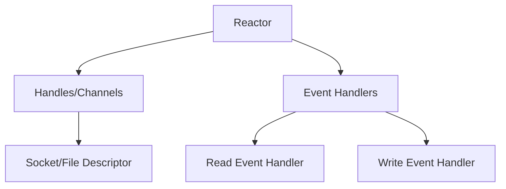
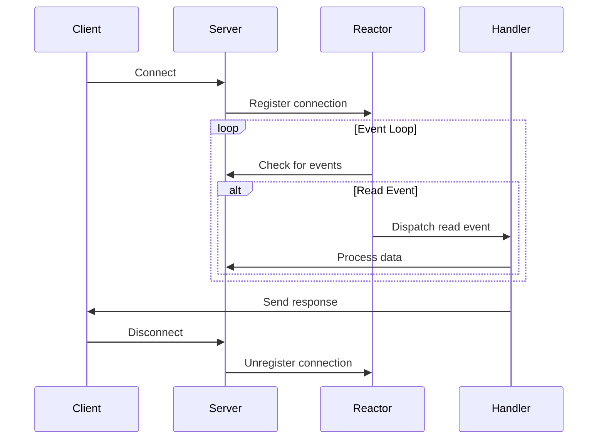

## 6.6 Reactor Pattern

In the realm of concurrent programming, the Reactor Pattern stands out as a powerful design pattern for managing multiple service requests concurrently using a single thread or process. It is particularly well-suited for I/O-bound applications, where the primary bottleneck is waiting for input/output operations to complete. In this section, we will delve into the Reactor Pattern, exploring its intent, structure, implementation in Python, benefits, challenges, and best practices.

### Understanding the Reactor Pattern

The Reactor Pattern is designed to handle service requests by multiplexing input/output over a set of sockets or file descriptors. It enables synchronous demultiplexing of events and dispatches them to appropriate handlers. This pattern is commonly used in network servers and GUI applications to efficiently manage multiple I/O operations without resorting to multi-threading or multi-processing.

#### Intent of the Reactor Pattern

The primary intent of the Reactor Pattern is to provide a mechanism for handling multiple concurrent I/O operations using a single-threaded event loop. By doing so, it allows applications to remain responsive and scalable, even under high load. The pattern achieves this by:

- **Monitoring multiple sources of events** (e.g., sockets, files) for readiness.
- **Dispatching events to appropriate handlers** based on the type of event (e.g., readable, writable).
- **Avoiding blocking operations**, thus keeping the application responsive.

### Structure of the Reactor Pattern

The Reactor Pattern is composed of three main components:

1. **Reactor**: This is the core component that waits for events and dispatches them to the appropriate handlers. It maintains an event loop that continuously checks for I/O readiness on registered file descriptors.

2. **Handles or Channels**: These represent the sources of events, such as sockets or file descriptors. They are registered with the Reactor to be monitored for specific events (e.g., read, write).

3. **Event Handlers**: These contain the logic to be executed when an event occurs. Each handler is associated with a specific type of event and is responsible for processing that event.

#### Diagram: Reactor Pattern Structure



In the diagram above, the Reactor monitors Handles/Channels, which are linked to sockets or file descriptors. When an event occurs, the Reactor dispatches it to the appropriate Event Handler.

### Implementing the Reactor Pattern in Python

Python provides the `selectors` module, which is a high-level I/O multiplexing module built on top of the `select` module. It offers a convenient way to implement the Reactor Pattern by allowing you to register file descriptors and specify the events you are interested in.

#### Setting Up the Event Loop

Let's start by setting up a basic event loop using the `selectors` module. The event loop will monitor registered file descriptors for events and dispatch them to the appropriate handlers.

```python
import selectors
import socket

selector = selectors.DefaultSelector()

def accept(sock):
    conn, addr = sock.accept()  # Accept the connection
    print(f"Accepted connection from {addr}")
    conn.setblocking(False)
    # Register the connection for read events
    selector.register(conn, selectors.EVENT_READ, read)

def read(conn):
    data = conn.recv(1024)  # Read data from the connection
    if data:
        print(f"Received data: {data.decode()}")
        conn.sendall(data)  # Echo the data back
    else:
        print("Closing connection")
        selector.unregister(conn)
        conn.close()

server_socket = socket.socket(socket.AF_INET, socket.SOCK_STREAM)
server_socket.bind(('localhost', 65432))
server_socket.listen()
server_socket.setblocking(False)

selector.register(server_socket, selectors.EVENT_READ, accept)

try:
    while True:
        events = selector.select(timeout=None)
        for key, mask in events:
            callback = key.data
            callback(key.fileobj)
finally:
    selector.close()
```

#### Explanation

- **Selector Creation**: We create a default selector using `selectors.DefaultSelector()`.
- **Socket Setup**: A listening socket is created and set to non-blocking mode.
- **Registration**: The server socket is registered with the selector for read events, with the `accept` function as the callback.
- **Event Loop**: The loop continuously waits for events using `selector.select()`. When an event occurs, it retrieves the callback function and invokes it with the file object.

#### Implementing Handlers for Different Events

In the example above, we have two handlers: `accept` for handling new connections and `read` for processing incoming data. Let's explore how these handlers work:

1. **Accept Handler**: This handler is triggered when the server socket is ready to accept a new connection. It accepts the connection, sets it to non-blocking mode, and registers it with the selector for read events.

2. **Read Handler**: This handler is triggered when a connection is ready for reading. It reads data from the connection, processes it (in this case, echoing it back), and closes the connection if no data is received.

### Benefits of the Reactor Pattern

The Reactor Pattern offers several benefits, particularly for I/O-bound applications:

- **High Scalability**: By handling multiple I/O operations in a single thread, the Reactor Pattern can efficiently manage a large number of connections without the overhead of multiple threads or processes.

- **Efficient Resource Utilization**: The pattern avoids the context-switching overhead associated with multi-threading, leading to better resource utilization.

- **Simplified Concurrency**: Since the pattern uses a single-threaded event loop, it simplifies concurrency management, reducing the risk of race conditions and deadlocks.

### Challenges of the Reactor Pattern

Despite its benefits, the Reactor Pattern also presents some challenges:

- **Complexity for Stateful Protocols**: Implementing the pattern for stateful protocols can be complex, as it requires careful management of state across multiple events.

- **Single CPU Core Limitation**: The pattern is inherently single-threaded, limiting its ability to utilize multiple CPU cores. This can be a bottleneck for CPU-bound tasks.

### Best Practices for Implementing the Reactor Pattern

To effectively implement the Reactor Pattern, consider the following best practices:

- **Encapsulate Event Handling Logic**: Use separate handler classes or functions to encapsulate event handling logic. This promotes modularity and makes the code easier to maintain.

- **Ensure Non-Blocking Operations**: Avoid blocking operations within event handlers to keep the reactor responsive. Use non-blocking I/O and asynchronous operations where possible.

- **Use Timeouts Wisely**: When using `selector.select()`, consider setting a timeout to periodically check for other conditions or perform maintenance tasks.

- **Monitor Resource Usage**: Keep an eye on resource usage, such as file descriptors and memory, to prevent resource exhaustion.

### Encouraging Application of the Reactor Pattern

The Reactor Pattern is particularly well-suited for building lightweight servers or clients, especially in resource-constrained environments. It is commonly used in:

- **Network Servers**: For handling multiple client connections efficiently, such as web servers or chat servers.

- **GUI Applications**: For managing user input and other events without blocking the main thread.

- **Embedded Systems**: Where resources are limited, and efficient I/O handling is crucial.

### Try It Yourself

To deepen your understanding of the Reactor Pattern, try modifying the code example above:

- **Add a Write Handler**: Implement a handler for writable events to send data to clients.
- **Handle Multiple Connections**: Experiment with handling multiple client connections simultaneously.
- **Integrate with Asyncio**: Explore integrating the Reactor Pattern with Python's `asyncio` module for more advanced asynchronous capabilities.

### Visualizing the Reactor Pattern Workflow

To better understand how the Reactor Pattern operates, let's visualize the workflow using a sequence diagram.



In this sequence diagram, the Reactor continuously checks for events on the server. When a read event occurs, it dispatches the event to the appropriate handler, which processes the data and sends a response back to the client.

### References and Further Reading

For more information on the Reactor Pattern and its applications, consider exploring the following resources:

- [Python's `selectors` Module Documentation](https://docs.python.org/3/library/selectors.html)
- [Event-Driven Programming in Python](https://realpython.com/python-sockets/)
- [Design Patterns: Elements of Reusable Object-Oriented Software](https://en.wikipedia.org/wiki/Design_Patterns)

### Knowledge Check

Before we wrap up, let's test your understanding of the Reactor Pattern with a few questions:

- What is the primary intent of the Reactor Pattern?
- How does the Reactor Pattern differ from multi-threading?
- What are the main components of the Reactor Pattern?
- Why is non-blocking I/O important in the Reactor Pattern?

### Embrace the Journey

Remember, mastering the Reactor Pattern is just the beginning of your journey into concurrent programming. As you continue to explore and experiment, you'll discover new ways to build efficient, scalable applications. Keep pushing the boundaries, stay curious, and enjoy the journey!

## Quiz Time!



### What is the primary intent of the Reactor Pattern?

- [x] To handle multiple I/O operations using a single-threaded event loop.
- [ ] To manage multiple threads for concurrent processing.
- [ ] To provide a mechanism for asynchronous computation.
- [ ] To simplify state management in applications.

> **Explanation:** The Reactor Pattern is designed to handle multiple I/O operations using a single-threaded event loop, making it efficient for I/O-bound applications.

### Which module in Python is commonly used to implement the Reactor Pattern?

- [x] `selectors`
- [ ] `asyncio`
- [ ] `threading`
- [ ] `multiprocessing`

> **Explanation:** The `selectors` module in Python provides a high-level interface for I/O multiplexing, making it suitable for implementing the Reactor Pattern.

### What is the role of the Reactor in the Reactor Pattern?

- [x] To wait for events and dispatch them to appropriate handlers.
- [ ] To manage state transitions in an application.
- [ ] To execute tasks asynchronously.
- [ ] To handle database connections.

> **Explanation:** The Reactor is responsible for waiting for events and dispatching them to the appropriate handlers based on the type of event.

### What are Handles or Channels in the Reactor Pattern?

- [x] Sources of events such as sockets or file descriptors.
- [ ] Functions that process data.
- [ ] Threads that execute tasks.
- [ ] Classes that manage state.

> **Explanation:** Handles or Channels represent sources of events, such as sockets or file descriptors, which are monitored by the Reactor.

### Why is non-blocking I/O important in the Reactor Pattern?

- [x] To keep the reactor responsive by avoiding blocking operations.
- [ ] To simplify the implementation of stateful protocols.
- [ ] To utilize multiple CPU cores efficiently.
- [ ] To reduce memory usage in applications.

> **Explanation:** Non-blocking I/O is crucial in the Reactor Pattern to ensure that the reactor remains responsive and can handle multiple events concurrently.

### What is a challenge of using the Reactor Pattern?

- [x] It is limited to a single CPU core due to its single-threaded nature.
- [ ] It requires complex thread management.
- [ ] It cannot handle multiple I/O operations.
- [ ] It is inefficient for I/O-bound applications.

> **Explanation:** The Reactor Pattern is inherently single-threaded, limiting its ability to utilize multiple CPU cores, which can be a challenge for CPU-bound tasks.

### How can you encapsulate event handling logic in the Reactor Pattern?

- [x] By using separate handler classes or functions.
- [ ] By implementing all logic in the Reactor itself.
- [ ] By using global variables for state management.
- [ ] By creating multiple threads for each event type.

> **Explanation:** Encapsulating event handling logic in separate handler classes or functions promotes modularity and maintainability.

### What is a benefit of the Reactor Pattern?

- [x] High scalability for I/O-bound applications.
- [ ] Simplified state management for complex protocols.
- [ ] Efficient CPU utilization for computational tasks.
- [ ] Reduced memory usage in applications.

> **Explanation:** The Reactor Pattern offers high scalability for I/O-bound applications by efficiently managing multiple connections in a single thread.

### Which of the following is a best practice for implementing the Reactor Pattern?

- [x] Ensure non-blocking operations within event handlers.
- [ ] Use blocking I/O to simplify event handling.
- [ ] Implement all logic within the Reactor.
- [ ] Avoid using timeouts in the event loop.

> **Explanation:** Ensuring non-blocking operations within event handlers is a best practice to keep the reactor responsive and efficient.

### True or False: The Reactor Pattern is suitable for CPU-bound tasks.

- [ ] True
- [x] False

> **Explanation:** The Reactor Pattern is not suitable for CPU-bound tasks as it is inherently single-threaded and limited to a single CPU core.


