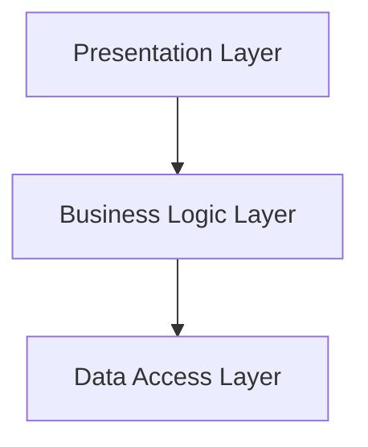

## 7.1 Layered Architecture Pattern

The Layered Architecture Pattern is a widely adopted design approach in software engineering, known for organizing code into distinct layers, each with its own responsibilities. This pattern is particularly beneficial in creating applications that are modular, maintainable, and scalable. In this section, we will delve into the concepts of the Layered Architecture Pattern, explore its implementation in Python, and discuss best practices and common pitfalls.

### Introduction to the Layered Pattern

The Layered Architecture Pattern, also known as the n-tier architecture, is a design pattern that divides an application into layers, each responsible for a specific aspect of the application's functionality. This separation of concerns ensures that each layer can be developed, tested, and maintained independently, leading to a more organized and manageable codebase.

#### Fundamental Concepts

- **Separation of Concerns**: Each layer in the architecture is responsible for a specific part of the application's functionality, reducing dependencies and promoting modularity.
- **Layered Structure**: Typically, applications are divided into three or more layers, such as presentation, business logic, and data access.
- **Inter-layer Communication**: Layers interact with each other through well-defined interfaces, ensuring loose coupling and high cohesion.

### Detailed Explanation of Each Layer

Let's explore the typical layers found in a Layered Architecture and their respective responsibilities.

#### 1. Presentation Layer

The Presentation Layer is the topmost layer of the architecture, responsible for handling user interactions and displaying information to the user. It acts as the interface between the user and the application.

- **Responsibilities**:
  - Displaying data to the user.
  - Capturing user inputs.
  - Communicating with the Business Logic Layer to process user requests.

- **Components**:
  - User interfaces (UI) such as web pages, mobile screens, or desktop applications.
  - Controllers that handle user input and update the UI.

```python

from flask import Flask, request, jsonify

app = Flask(__name__)

@app.route('/greet', methods=['GET'])
def greet_user():
    name = request.args.get('name', 'World')
    return jsonify({'message': f'Hello, {name}!'})

if __name__ == '__main__':
    app.run(debug=True)
```

#### 2. Business Logic Layer

The Business Logic Layer, also known as the Application Layer, contains the core functionality of the application. It processes user inputs, applies business rules, and performs calculations.

- **Responsibilities**:
  - Implementing business rules and logic.
  - Coordinating between the Presentation and Data Access Layers.
  - Ensuring data integrity and consistency.

- **Components**:
  - Services that encapsulate business rules.
  - Business processes and workflows.

```python

def calculate_discount(price, discount_rate):
    if not 0 <= discount_rate <= 1:
        raise ValueError("Discount rate must be between 0 and 1.")
    return price * (1 - discount_rate)
```

#### 3. Data Access Layer

The Data Access Layer is responsible for interacting with the data storage systems, such as databases or file systems. It provides an abstraction over the data sources, allowing the Business Logic Layer to access data without worrying about the underlying storage details.

- **Responsibilities**:
  - Managing data retrieval and storage.
  - Providing an interface for data operations.
  - Handling data connections and transactions.

- **Components**:
  - Repositories or DAOs (Data Access Objects) that abstract data operations.
  - Database connection managers.

```python

from sqlalchemy import create_engine, Column, Integer, String, Sequence
from sqlalchemy.ext.declarative import declarative_base
from sqlalchemy.orm import sessionmaker

Base = declarative_base()

class User(Base):
    __tablename__ = 'users'
    id = Column(Integer, Sequence('user_id_seq'), primary_key=True)
    name = Column(String(50))

engine = create_engine('sqlite:///:memory:')
Base.metadata.create_all(engine)

Session = sessionmaker(bind=engine)
session = Session()

def add_user(name):
    new_user = User(name=name)
    session.add(new_user)
    session.commit()

def get_user(user_id):
    return session.query(User).filter_by(id=user_id).first()
```

### Benefits and Drawbacks

#### Benefits

- **Improved Maintainability**: By separating concerns, each layer can be developed and maintained independently, making the codebase easier to manage.
- **Scalability**: Layers can be scaled independently, allowing for more efficient resource allocation.
- **Reusability**: Components within a layer can be reused across different parts of the application or even in different projects.
- **Testability**: Each layer can be tested independently, leading to more robust and reliable applications.

#### Drawbacks

- **Increased Complexity**: Introducing multiple layers can add complexity to the application, making it harder to understand and navigate.
- **Performance Overhead**: Communication between layers can introduce latency, potentially impacting performance.
- **Rigid Structure**: The layered approach can sometimes lead to a rigid structure, making it challenging to implement cross-cutting concerns.

### Implementation in Python

Implementing a Layered Architecture in Python involves organizing your code into modules or packages that correspond to each layer. Let's explore how to set up a basic layered architecture using Python.

```python

project/
│
├── presentation/
│   ├── __init__.py
│   ├── views.py
│   └── controllers.py
│
├── business_logic/
│   ├── __init__.py
│   ├── services.py
│   └── rules.py
│
└── data_access/
    ├── __init__.py
    ├── repositories.py
    └── models.py
```

#### Presentation Layer

In the `presentation` directory, you would define the components responsible for handling user interactions, such as views and controllers.

```python

def display_greeting(name):
    print(f"Hello, {name}!")


from business_logic.services import get_greeting

def handle_user_input(name):
    greeting = get_greeting(name)
    display_greeting(greeting)
```

#### Business Logic Layer

The `business_logic` directory contains the core functionality of your application, including services and business rules.

```python

def get_greeting(name):
    return f"Hello, {name}!"


def validate_name(name):
    if not name:
        raise ValueError("Name cannot be empty.")
```

#### Data Access Layer

In the `data_access` directory, you would define the components responsible for interacting with the data storage systems.

```python

from .models import User

def find_user_by_name(name):
    # Simulate a database query
    return User(name=name)


class User:
    def __init__(self, name):
        self.name = name
```

### Best Practices

To effectively use the Layered Architecture Pattern, consider the following best practices:

- **Loose Coupling**: Ensure that layers are loosely coupled by defining clear interfaces for inter-layer communication.
- **High Cohesion**: Keep related functionality within the same layer to promote cohesion and reduce dependencies.
- **Encapsulation**: Encapsulate the implementation details within each layer, exposing only the necessary interfaces.
- **Consistent Layering**: Maintain consistency in how layers are defined and interact with each other to avoid confusion and complexity.

### Use Cases and Examples

The Layered Architecture Pattern is widely used in various applications, from web development to enterprise systems. Here are some real-world examples:

- **Web Applications**: Many web frameworks, such as Django and Flask, follow a layered architecture to separate the presentation, business logic, and data access concerns.
- **Enterprise Systems**: Large-scale enterprise systems often use layered architectures to manage complexity and ensure scalability.
- **Microservices**: While microservices are often considered a distinct architectural style, they can also benefit from a layered approach within each service to maintain modularity.

### Visual Aids

To better understand the interaction between layers, let's visualize a typical layered architecture using a diagram.



**Diagram Description**: This diagram illustrates the flow of data and control between the layers in a typical layered architecture. The Presentation Layer interacts with the Business Logic Layer, which in turn communicates with the Data Access Layer.

### Common Pitfalls

When implementing a layered architecture, be aware of the following common pitfalls:

- **Over-Engineering**: Avoid adding unnecessary layers or complexity that do not provide clear benefits.
- **Tight Coupling**: Ensure that layers remain independent and do not rely on specific implementations of other layers.
- **Leaky Abstractions**: Be cautious of exposing implementation details across layers, which can lead to maintenance challenges.

### Conclusion

The Layered Architecture Pattern is a powerful design approach that promotes modularity, maintainability, and scalability in software applications. By organizing code into distinct layers with clear responsibilities, developers can create robust and flexible systems. However, it's essential to balance the benefits of layering with the potential drawbacks, such as increased complexity and performance overhead.

As you implement the Layered Architecture Pattern in your Python projects, remember to follow best practices, avoid common pitfalls, and continually evaluate the architecture to ensure it meets the needs of your application. With careful planning and execution, the Layered Architecture Pattern can significantly enhance the quality and longevity of your software.

## Quiz Time!



### What is the primary purpose of the Layered Architecture Pattern?

- [x] To organize code into distinct layers with separate responsibilities.
- [ ] To increase the complexity of the application.
- [ ] To ensure that all code is written in a single file.
- [ ] To eliminate the need for testing.

> **Explanation:** The Layered Architecture Pattern aims to organize code into distinct layers, each with specific responsibilities, to improve modularity and maintainability.

### Which layer is responsible for handling user interactions in a layered architecture?

- [x] Presentation Layer
- [ ] Business Logic Layer
- [ ] Data Access Layer
- [ ] Network Layer

> **Explanation:** The Presentation Layer is responsible for handling user interactions and displaying information to the user.

### What is a common benefit of using the Layered Architecture Pattern?

- [x] Improved maintainability
- [ ] Increased performance overhead
- [ ] Reduced modularity
- [ ] Elimination of all bugs

> **Explanation:** The Layered Architecture Pattern improves maintainability by separating concerns and allowing each layer to be developed and maintained independently.

### Which of the following is a potential drawback of the Layered Architecture Pattern?

- [x] Increased complexity
- [ ] Improved scalability
- [ ] Enhanced testability
- [ ] Better modularity

> **Explanation:** The Layered Architecture Pattern can introduce increased complexity due to the additional layers and interfaces.

### In a layered architecture, what is the role of the Data Access Layer?

- [x] To manage data retrieval and storage
- [ ] To handle user interactions
- [ ] To implement business rules
- [ ] To display information to the user

> **Explanation:** The Data Access Layer is responsible for managing data retrieval and storage, providing an interface for data operations.

### How can you ensure loose coupling between layers in a layered architecture?

- [x] By defining clear interfaces for inter-layer communication
- [ ] By tightly integrating layers
- [ ] By using global variables
- [ ] By avoiding interfaces

> **Explanation:** Loose coupling can be achieved by defining clear interfaces for communication between layers, ensuring independence.

### What is a common pitfall when implementing a layered architecture?

- [x] Over-engineering
- [ ] Under-engineering
- [ ] Simplifying the architecture
- [ ] Avoiding abstraction

> **Explanation:** Over-engineering, such as adding unnecessary layers, is a common pitfall when implementing a layered architecture.

### Which of the following best describes the Business Logic Layer?

- [x] It contains the core functionality and business rules of the application.
- [ ] It handles user interactions and displays information.
- [ ] It manages data retrieval and storage.
- [ ] It provides network communication.

> **Explanation:** The Business Logic Layer contains the core functionality and business rules of the application, coordinating between other layers.

### What is the purpose of encapsulation in a layered architecture?

- [x] To hide implementation details within each layer
- [ ] To expose all internal details to other layers
- [ ] To reduce modularity
- [ ] To increase dependencies

> **Explanation:** Encapsulation hides implementation details within each layer, exposing only necessary interfaces to promote modularity.

### True or False: The Layered Architecture Pattern eliminates the need for testing.

- [ ] True
- [x] False

> **Explanation:** The Layered Architecture Pattern does not eliminate the need for testing; instead, it enhances testability by allowing each layer to be tested independently.


