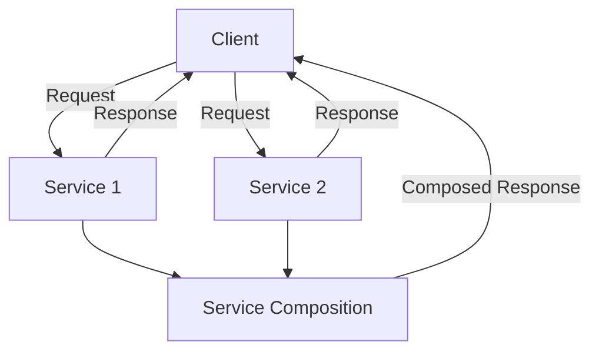

## 7.4 Service-Oriented Architecture

### Introduction to SOA

Service-Oriented Architecture (SOA) is a design paradigm that structures applications as a collection of services. These services are self-contained units of functionality that can be reused across different systems and applications. SOA emphasizes interoperability and reusability, allowing diverse systems to communicate and work together seamlessly.

#### Key Principles of SOA

1. **Loose Coupling**: Services maintain a loose relationship with each other, minimizing dependencies.
2. **Interoperability**: Services can communicate across different platforms and technologies.
3. **Reusability**: Services are designed to be reused in different contexts and applications.
4. **Abstraction**: Services hide the complexities of their implementations from consumers.
5. **Discoverability**: Services are easily discoverable and can be located and invoked dynamically.

#### Differentiating SOA from Other Architectural Styles

- **Monolithic Architecture**: In a monolithic architecture, the entire application is built as a single unit. This can lead to issues with scalability and maintainability as the application grows.
- **Microservices Architecture**: Microservices are a variant of SOA that focuses on small, independently deployable services. While SOA can include larger, more complex services, microservices emphasize simplicity and independence.

### Core Concepts

#### Services

Services are the building blocks of SOA. Each service performs a specific business function and is designed to be reusable and interoperable.

#### Service Contracts

A service contract defines the interface and behavior of a service. It specifies the inputs, outputs, and operations that the service provides, ensuring that consumers know how to interact with it.

#### Service Composition

Service composition involves combining multiple services to create a new, higher-level service. This allows for the creation of complex workflows and business processes.

#### Service Layers

Services are often organized into layers, such as the presentation layer, business logic layer, and data access layer. This separation of concerns enhances modularity and maintainability.

### Benefits and Challenges

#### Advantages of SOA

- **Reusability**: Services can be reused across different applications, reducing development time and costs.
- **Flexibility**: SOA allows for easy integration with new systems and technologies.
- **Alignment with Business Processes**: Services can be aligned with business processes, improving efficiency and responsiveness.

#### Challenges of SOA

- **Complexity**: Designing and managing a large number of services can be complex.
- **Governance Requirements**: Effective governance is needed to manage services, ensure compliance, and maintain quality.

### Implementing SOA with Python

Python is a versatile language that supports the development of services in an SOA environment. Let's explore how to build services using Python.

#### Building Services with Python

To create a service in Python, you can use frameworks like Flask or Django to expose functionality via web APIs.

```python
from flask import Flask, jsonify

app = Flask(__name__)

@app.route('/api/greet/<name>', methods=['GET'])
def greet(name):
    return jsonify({"message": f"Hello, {name}!"})

if __name__ == '__main__':
    app.run(debug=True)
```

This example uses Flask to create a simple greeting service. The service exposes an endpoint that returns a greeting message.

#### Technologies and Standards

- **SOAP (Simple Object Access Protocol)**: A protocol for exchanging structured information in web services.
- **REST (Representational State Transfer)**: An architectural style that uses HTTP requests to access and manipulate resources.
- **XML (eXtensible Markup Language)** and **JSON (JavaScript Object Notation)**: Data formats used for exchanging information between services.

#### Service Creation and Consumption

To consume a service, you can use Python's `requests` library to make HTTP requests.

```python
import requests

response = requests.get('http://localhost:5000/api/greet/World')
print(response.json())
```

This code sends a GET request to the greeting service and prints the response.

### Communication Protocols

#### Common Protocols in SOA

- **HTTP/HTTPS**: Widely used for web services due to its simplicity and ubiquity.
- **Message Queues**: Used for asynchronous communication, allowing services to communicate without waiting for a response.

#### Synchronous vs. Asynchronous Communication

- **Synchronous Communication**: The client waits for the service to respond before continuing.
- **Asynchronous Communication**: The client sends a request and continues processing, handling the response later.

### Best Practices

#### Designing Effective Services

- **Service Granularity**: Ensure services are neither too large nor too small. Aim for a balance that promotes reusability and efficiency.
- **Loose Coupling**: Minimize dependencies between services to enhance flexibility and maintainability.

### Comparison with Microservices

#### SOA vs. Microservices

- **Service Size**: SOA can include larger services, while microservices focus on small, independent units.
- **Deployment**: Microservices are independently deployable, whereas SOA services may be more tightly integrated.

#### Appropriate Scenarios

- **SOA**: Suitable for enterprise environments where services need to integrate with existing systems.
- **Microservices**: Ideal for new applications that require rapid development and deployment.

### Governance and Management

#### Importance of Service Governance

Effective governance ensures that services are reliable, secure, and compliant with standards. It involves managing service versions, ensuring discoverability, and enforcing security policies.

#### Strategies for Versioning, Discovery, and Security

- **Versioning**: Use version numbers in service URLs to manage changes.
- **Discovery**: Implement a service registry to locate and invoke services dynamically.
- **Security**: Use authentication and authorization mechanisms to protect services.

### Real-World Applications

#### SOA in Enterprise Environments

SOA is widely used in enterprise environments to integrate disparate systems and improve interoperability. For example, financial institutions use SOA to connect different banking systems and streamline operations.

#### Case Studies

- **Retail**: A large retailer implemented SOA to integrate its online and in-store systems, improving customer experience and operational efficiency.
- **Healthcare**: A healthcare provider used SOA to connect electronic health records with billing and scheduling systems, enhancing patient care.

### Tools and Frameworks

#### Facilitating SOA Implementation in Python

- **Flask**: A lightweight web framework for building services.
- **Django**: A full-featured web framework with tools for building robust services.
- **FastAPI**: A modern, fast (high-performance) web framework for building APIs with Python 3.7+ based on standard Python type hints.

#### Relevant Standards Bodies and Initiatives

- **OASIS**: An organization that develops open standards for the global information society.
- **W3C**: The World Wide Web Consortium, which develops web standards.

### Visualizing SOA



**Figure 1**: This diagram illustrates a simple SOA setup where a client interacts with multiple services, which can also compose responses from other services.

### Try It Yourself

Experiment with the provided code examples by modifying the service endpoints or adding new services. Try implementing both synchronous and asynchronous communication patterns to see how they affect service interactions.

### Knowledge Check

- What are the key principles of SOA?
- How does SOA differ from microservices architecture?
- What are some common communication protocols used in SOA?
- Why is service governance important in SOA?

### Embrace the Journey

Remember, understanding SOA is just the beginning. As you continue exploring architectural patterns, you'll discover new ways to build scalable and maintainable systems. Keep experimenting, stay curious, and enjoy the journey!

## Quiz Time!



### What is a key principle of Service-Oriented Architecture (SOA)?

- [x] Loose Coupling
- [ ] Tight Integration
- [ ] Monolithic Design
- [ ] Centralized Control

> **Explanation:** Loose coupling is a key principle of SOA, allowing services to interact with minimal dependencies.

### How does SOA differ from microservices architecture?

- [x] SOA can include larger services, while microservices focus on small, independent units.
- [ ] SOA is always cloud-based, while microservices are not.
- [ ] Microservices require SOAP, while SOA uses REST.
- [ ] SOA is only used in legacy systems.

> **Explanation:** SOA can include larger, more complex services, whereas microservices emphasize small, independently deployable units.

### Which protocol is commonly used for web services in SOA?

- [x] HTTP/HTTPS
- [ ] FTP
- [ ] SMTP
- [ ] Telnet

> **Explanation:** HTTP/HTTPS is widely used for web services due to its simplicity and ubiquity.

### What is a benefit of using SOA?

- [x] Reusability
- [ ] Increased Complexity
- [ ] Reduced Flexibility
- [ ] Tight Coupling

> **Explanation:** SOA promotes reusability by allowing services to be reused across different applications.

### What is a challenge associated with SOA?

- [x] Complexity
- [ ] Lack of Standards
- [ ] Inflexibility
- [ ] Poor Performance

> **Explanation:** Designing and managing a large number of services in SOA can be complex.

### What is the role of a service contract in SOA?

- [x] Defines the interface and behavior of a service
- [ ] Manages service deployment
- [ ] Controls service security
- [ ] Monitors service performance

> **Explanation:** A service contract defines the interface and behavior of a service, specifying how consumers should interact with it.

### What is the difference between synchronous and asynchronous communication in SOA?

- [x] Synchronous communication waits for a response, while asynchronous does not.
- [ ] Asynchronous communication is faster than synchronous.
- [ ] Synchronous communication is always more secure.
- [ ] Asynchronous communication requires more bandwidth.

> **Explanation:** In synchronous communication, the client waits for a response before continuing, whereas asynchronous communication allows the client to continue processing.

### Why is service governance important in SOA?

- [x] Ensures services are reliable, secure, and compliant
- [ ] Increases service complexity
- [ ] Reduces service reusability
- [ ] Limits service discoverability

> **Explanation:** Service governance ensures that services are reliable, secure, and compliant with standards.

### What tool can be used to build services in Python for SOA?

- [x] Flask
- [ ] React
- [ ] Angular
- [ ] Node.js

> **Explanation:** Flask is a lightweight web framework that can be used to build services in Python for SOA.

### True or False: SOA and microservices are the same architectural style.

- [ ] True
- [x] False

> **Explanation:** SOA and microservices are different architectural styles. SOA can include larger services, while microservices focus on small, independent units.


