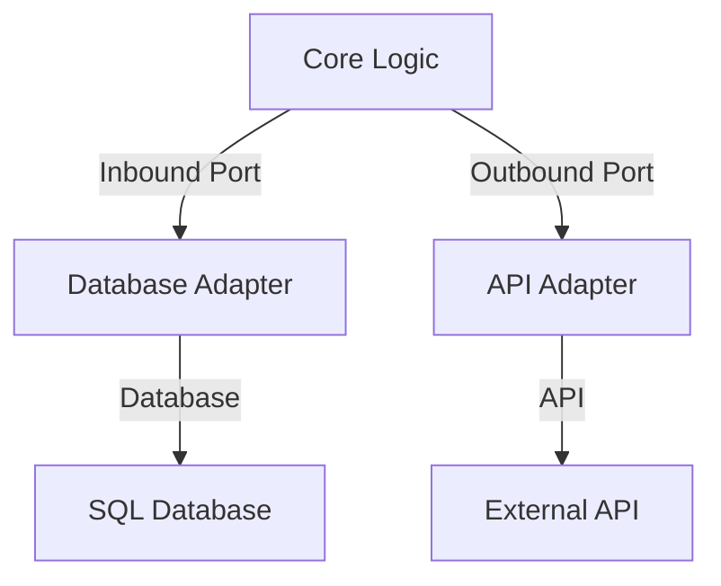

## 7.5 Hexagonal Architecture (Ports and Adapters)

Hexagonal Architecture, also known as Ports and Adapters, is a software design pattern that aims to create a clear separation between the core logic of an application and its external dependencies. This architecture promotes flexibility, testability, and maintainability by isolating the application core from external systems through well-defined interfaces (ports) and their implementations (adapters).

### Origins of Hexagonal Architecture

Hexagonal Architecture was introduced by Alistair Cockburn in the early 2000s. The primary motivation behind this architecture was to address the challenges of integrating applications with various external systems and to simplify testing by decoupling the core business logic from external dependencies. By organizing the application into a hexagonal shape, with the core at the center and ports and adapters forming the outer edges, this architecture facilitates a clean and modular design.

### Key Components

#### 1. The Domain (Core)

The domain, or core, is the heart of the application. It contains the business logic and rules that define the application's behavior. The core is independent of external systems and should not be aware of how data is stored, retrieved, or communicated. This independence allows the core to remain stable and unaffected by changes in external systems.

#### 2. Ports (Interfaces)

Ports are the interfaces that define the communication between the core and the external world. They represent the entry and exit points of the application. Ports can be of two types:

- **Inbound Ports**: These are interfaces through which the application receives input or commands from external systems.
- **Outbound Ports**: These are interfaces through which the application sends output or requests to external systems.

#### 3. Adapters (Implementations)

Adapters are the concrete implementations of the ports. They translate the data and operations between the core and external systems. Adapters can be swapped or modified without affecting the core logic, allowing for flexibility in integrating with different technologies or systems.

### Core Principles

Hexagonal Architecture is built on several core principles that ensure a clean separation between the application's core logic and external concerns:

#### Dependency Inversion

One of the key principles of Hexagonal Architecture is dependency inversion. This principle states that the core should depend on abstractions (ports) rather than concrete implementations (adapters). By inverting the dependencies, the core remains independent and can be easily tested or modified without being affected by changes in external systems.

#### Separation of Concerns

Hexagonal Architecture promotes a clear separation of concerns by isolating the core logic from external dependencies. This separation allows developers to focus on the business logic without being distracted by the complexities of integrating with external systems.

### Benefits

Implementing Hexagonal Architecture in Python offers several benefits:

- **Improved Testability**: By decoupling the core from external systems, the core logic can be tested independently using mock adapters.
- **Flexibility**: Adapters can be easily swapped or modified to integrate with different technologies or systems without affecting the core logic.
- **Ease of Maintenance**: The clear separation between the core and external systems simplifies maintenance and reduces the risk of introducing bugs when making changes.

### Implementing Hexagonal Architecture in Python

To implement Hexagonal Architecture in Python, we need to structure the application into three main layers: the core, ports, and adapters. Let's explore how to achieve this with a practical example.

#### Structuring a Python Application

Consider a simple application that manages a list of tasks. The core logic includes operations such as adding, removing, and listing tasks. The application interacts with an external database to store and retrieve tasks.

1. **Define the Core Logic**

The core logic is implemented in a `TaskManager` class, which contains the business rules for managing tasks.

```python
class TaskManager:
    def __init__(self, task_repository):
        self.task_repository = task_repository

    def add_task(self, task):
        # Business logic for adding a task
        self.task_repository.save(task)

    def remove_task(self, task_id):
        # Business logic for removing a task
        self.task_repository.delete(task_id)

    def list_tasks(self):
        # Business logic for listing tasks
        return self.task_repository.get_all()
```

2. **Define Ports (Interfaces)**

Ports are defined as interfaces that the core logic depends on. In this example, we define a `TaskRepository` interface that represents the operations for storing and retrieving tasks.

```python
from abc import ABC, abstractmethod

class TaskRepository(ABC):
    @abstractmethod
    def save(self, task):
        pass

    @abstractmethod
    def delete(self, task_id):
        pass

    @abstractmethod
    def get_all(self):
        pass
```

3. **Implement Adapters**

Adapters implement the ports and handle the interaction with external systems. In this example, we create a `DatabaseTaskRepository` adapter that interacts with a database.

```python
class DatabaseTaskRepository(TaskRepository):
    def __init__(self, database_connection):
        self.database_connection = database_connection

    def save(self, task):
        # Implementation for saving a task to the database
        pass

    def delete(self, task_id):
        # Implementation for deleting a task from the database
        pass

    def get_all(self):
        # Implementation for retrieving all tasks from the database
        pass
```

### Practical Examples

Hexagonal Architecture proves advantageous in scenarios where the application needs to interact with different external systems. Let's explore a couple of practical examples:

#### Replacing a Database

Suppose the application initially uses a SQL database, but later needs to switch to a NoSQL database. With Hexagonal Architecture, we can create a new adapter for the NoSQL database without modifying the core logic.

```python
class NoSQLTaskRepository(TaskRepository):
    def __init__(self, nosql_connection):
        self.nosql_connection = nosql_connection

    def save(self, task):
        # Implementation for saving a task to the NoSQL database
        pass

    def delete(self, task_id):
        # Implementation for deleting a task from the NoSQL database
        pass

    def get_all(self):
        # Implementation for retrieving all tasks from the NoSQL database
        pass
```

#### Integrating with an External API

If the application needs to interact with an external API, we can create an adapter that handles the API communication.

```python
class ApiTaskRepository(TaskRepository):
    def __init__(self, api_client):
        self.api_client = api_client

    def save(self, task):
        # Implementation for saving a task via the API
        pass

    def delete(self, task_id):
        # Implementation for deleting a task via the API
        pass

    def get_all(self):
        # Implementation for retrieving all tasks via the API
        pass
```

### Design Considerations

When designing a Hexagonal Architecture, it's important to carefully identify and define ports and create flexible adapters.

#### Identifying and Defining Ports

Ports should represent the essential operations that the core logic depends on. They should be defined as abstract interfaces to ensure that the core remains independent of specific implementations.

#### Creating Flexible Adapters

Adapters should be designed to handle the specific requirements of the external systems they interact with. They should implement the ports and provide the necessary translations between the core logic and the external systems.

### Testing the Core

One of the key benefits of Hexagonal Architecture is the ability to test the core logic independently of external systems. This can be achieved by mocking the adapters during testing.

#### Unit Testing the Core

We can use Python's `unittest.mock` module to create mock adapters for testing the core logic.

```python
from unittest.mock import Mock

def test_add_task():
    mock_repository = Mock(TaskRepository)
    task_manager = TaskManager(mock_repository)

    task = {"id": 1, "name": "Test Task"}
    task_manager.add_task(task)

    mock_repository.save.assert_called_once_with(task)
```

### Best Practices

To effectively implement Hexagonal Architecture, consider the following best practices:

- **Maintain Clear Boundaries**: Ensure that the core logic is isolated from external dependencies by defining clear interfaces (ports).
- **Keep the Domain Model Free from External Influences**: The domain model should not depend on external systems or libraries.
- **Use Dependency Injection**: Inject dependencies (adapters) into the core logic to promote flexibility and testability.

### Visual Diagrams

To better understand the flow between the core, ports, and adapters, let's visualize the architecture using a diagram.



**Diagram Description**: This diagram illustrates the Hexagonal Architecture, showing the core logic interacting with external systems through ports and adapters. The core communicates with a SQL database via a database adapter and with an external API via an API adapter.

### Real-World Implementations

Hexagonal Architecture has been successfully applied in various real-world projects. Here are a couple of examples:

#### Case Study: E-commerce Platform

An e-commerce platform implemented Hexagonal Architecture to manage its product catalog and order processing. The core logic handled business rules related to product availability, pricing, and order fulfillment. Adapters were created for different payment gateways, shipping providers, and inventory management systems, allowing the platform to integrate with various external services seamlessly.

#### Case Study: Banking System

A banking system adopted Hexagonal Architecture to manage customer accounts and transactions. The core logic included operations for account creation, balance inquiries, and transaction processing. Adapters were developed for different banking channels, such as ATMs, online banking, and mobile apps, enabling the system to provide a consistent experience across multiple platforms.

### Conclusion

Hexagonal Architecture, or Ports and Adapters, offers a robust approach to designing software applications that are flexible, testable, and maintainable. By isolating the core logic from external systems, developers can focus on the business rules and easily integrate with different technologies. Whether you're building a simple task manager or a complex e-commerce platform, Hexagonal Architecture provides a solid foundation for creating scalable and adaptable applications.

## Quiz Time!



### What is the primary goal of Hexagonal Architecture?

- [x] To create a clear separation between the core logic and external systems
- [ ] To increase the complexity of the application
- [ ] To make the application dependent on specific technologies
- [ ] To reduce the number of interfaces in the application

> **Explanation:** Hexagonal Architecture aims to isolate the core logic from external systems, promoting flexibility and testability.

### What are the two types of ports in Hexagonal Architecture?

- [x] Inbound and Outbound Ports
- [ ] Internal and External Ports
- [ ] Static and Dynamic Ports
- [ ] Open and Closed Ports

> **Explanation:** Inbound ports handle input to the core, while outbound ports handle output from the core.

### What principle does Hexagonal Architecture emphasize to maintain independence of the core?

- [x] Dependency Inversion
- [ ] Single Responsibility
- [ ] Open/Closed Principle
- [ ] Liskov Substitution

> **Explanation:** Dependency inversion ensures the core depends on abstractions, not concrete implementations.

### Which component in Hexagonal Architecture translates data between the core and external systems?

- [x] Adapter
- [ ] Port
- [ ] Core
- [ ] Interface

> **Explanation:** Adapters implement ports and handle data translation between the core and external systems.

### How can you test the core logic independently in Hexagonal Architecture?

- [x] By mocking the adapters
- [ ] By integrating all external systems
- [ ] By using real database connections
- [ ] By ignoring the ports

> **Explanation:** Mocking adapters allows testing the core logic without external dependencies.

### What is a key benefit of Hexagonal Architecture?

- [x] Improved testability
- [ ] Increased dependency on external systems
- [ ] Reduced modularity
- [ ] Increased complexity

> **Explanation:** Hexagonal Architecture improves testability by decoupling the core from external systems.

### In Hexagonal Architecture, what should the core depend on?

- [x] Abstractions (Ports)
- [ ] Concrete implementations (Adapters)
- [ ] External systems
- [ ] Specific technologies

> **Explanation:** The core should depend on abstractions to remain independent of specific implementations.

### What does an adapter do in Hexagonal Architecture?

- [x] Implements ports and handles communication with external systems
- [ ] Defines the core logic of the application
- [ ] Acts as the main entry point to the application
- [ ] Stores business rules and logic

> **Explanation:** Adapters implement ports and manage communication with external systems.

### Which of the following is a real-world application of Hexagonal Architecture?

- [x] Banking system with multiple channels
- [ ] A simple static website
- [ ] A standalone desktop application
- [ ] A command-line utility

> **Explanation:** Hexagonal Architecture is suitable for complex systems like banking with multiple integration points.

### True or False: Hexagonal Architecture makes it difficult to swap out external systems.

- [ ] True
- [x] False

> **Explanation:** Hexagonal Architecture facilitates swapping out external systems by using adapters.


