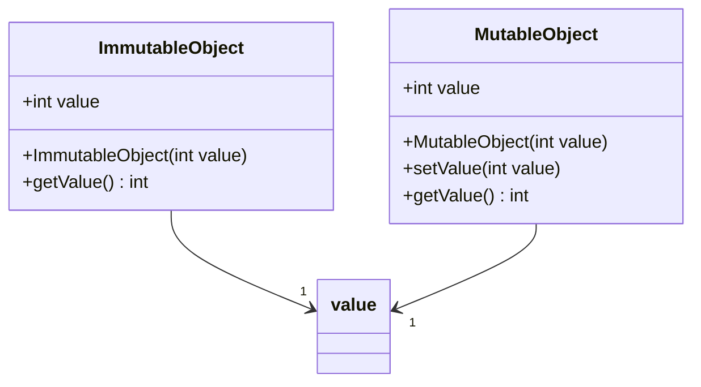

## 8.1 Immutable Objects

In the realm of software development, immutability is a concept that has gained significant traction, especially with the rise of functional programming paradigms. Immutable objects are those whose state cannot be altered after they are created. This seemingly simple concept can have profound implications for the safety, predictability, and maintainability of your code.

### Introduction to Immutability

Immutability refers to the property of an object whose state cannot change after it has been initialized. In programming, immutable objects are those that, once created, cannot be modified. This concept is a cornerstone of functional programming, where functions are expected to have no side effects, and data is treated as immutable.

#### Significance in Programming

The significance of immutability lies in its ability to simplify reasoning about code. When you know that an object cannot change, you can be confident that its state remains consistent throughout its lifetime. This is particularly useful in concurrent programming, where shared mutable state can lead to complex bugs and race conditions.

#### Immutability and Functional Programming

Functional programming emphasizes the use of immutable data structures to avoid side effects. By treating data as immutable, functional programming languages enable developers to write more predictable and reliable code. This approach contrasts with imperative programming, where state changes are common and often necessary.

### Benefits of Immutable Objects

Immutable objects offer several advantages that can lead to more robust and maintainable code.

#### Thread Safety

One of the most significant benefits of immutability is thread safety. In multi-threaded applications, mutable shared state can lead to race conditions, where the outcome of a computation depends on the timing of thread execution. Immutable objects eliminate this problem, as their state cannot change, ensuring consistency across threads.

#### Ease of Reasoning

Immutable objects simplify reasoning about code. When you know that an object's state cannot change, you can be confident in its behavior. This predictability makes it easier to understand and maintain code, reducing the likelihood of bugs.

#### Prevention of Unintended Side Effects

Mutable objects can lead to unintended side effects, where changes to an object in one part of a program affect its behavior in another. Immutable objects prevent this by ensuring that once an object is created, its state remains constant.

#### Robust and Maintainable Code

By eliminating mutable state, immutable objects can lead to more robust and maintainable code. They encourage a declarative style of programming, where the focus is on what the program should accomplish rather than how it should do it.

### Implementing Immutable Objects in Python

Python provides several ways to implement immutable objects, leveraging both built-in data types and custom classes.

#### Using Built-in Data Types

Python's built-in data types, such as `tuple` and `frozenset`, are inherently immutable.

```python
coordinates = (10, 20)
# coordinates[0] = 15  # Uncommenting this line will raise a TypeError

immutable_set = frozenset([1, 2, 3])
# immutable_set.add(4)  # Uncommenting this line will raise an AttributeError
```

#### Custom Immutable Classes with `@dataclass(frozen=True)`

The `dataclasses` module in Python 3.7+ provides a convenient way to create immutable classes using the `@dataclass` decorator with the `frozen=True` parameter.

```python
from dataclasses import dataclass

@dataclass(frozen=True)
class Point:
    x: int
    y: int

point = Point(1, 2)
# point.x = 10  # Uncommenting this line will raise a FrozenInstanceError
```

#### Using `namedtuple` for Simple Immutable Data Structures

The `collections` module provides `namedtuple`, a factory function for creating simple immutable data structures.

```python
from collections import namedtuple

Point = namedtuple('Point', ['x', 'y'])
point = Point(1, 2)
# point.x = 10  # Uncommenting this line will raise an AttributeError
```

#### Preventing Dynamic Attribute Creation with `__slots__`

Using the `__slots__` attribute in a class definition can prevent the dynamic creation of attributes, which can be useful for creating lightweight immutable objects.

```python
class ImmutablePoint:
    __slots__ = ('x', 'y')

    def __init__(self, x, y):
        object.__setattr__(self, 'x', x)
        object.__setattr__(self, 'y', y)

    def __setattr__(self, key, value):
        raise AttributeError("Cannot modify immutable object")

point = ImmutablePoint(1, 2)
# point.x = 10  # Uncommenting this line will raise an AttributeError
```

### Working with Immutable Data Structures

When working with immutable data structures, modifications are handled by creating new instances rather than altering existing ones.

#### Functional Updates

Functional updates involve creating a new instance of an object with the desired changes, leaving the original object unchanged.

```python
from dataclasses import replace

@dataclass(frozen=True)
class Point:
    x: int
    y: int

point = Point(1, 2)
new_point = replace(point, x=10)

print(point)      # Output: Point(x=1, y=2)
print(new_point)  # Output: Point(x=10, y=2)
```

### Performance Considerations

While immutability offers many benefits, it can also impact performance and memory usage.

#### Impact on Performance and Memory Usage

Creating new instances for every modification can lead to increased memory usage and slower performance, especially with large data structures.

#### Strategies to Mitigate Negative Effects

To mitigate the performance impact, consider sharing common data between instances. For example, use tuples or frozensets to store shared data.

```python
common_data = (1, 2, 3)
immutable_data1 = (common_data, 4, 5)
immutable_data2 = (common_data, 6, 7)
```

### Use Cases and Examples

Immutable objects are particularly useful in scenarios where predictable object state is crucial.

#### Multi-threaded Applications

In multi-threaded applications, immutability prevents race conditions by ensuring that shared data cannot be modified.

```python
import threading

@dataclass(frozen=True)
class SharedData:
    value: int

shared_data = SharedData(10)

def worker(data):
    print(f"Worker sees value: {data.value}")

threads = [threading.Thread(target=worker, args=(shared_data,)) for _ in range(5)]
for thread in threads:
    thread.start()
for thread in threads:
    thread.join()
```

#### Data Processing

In data processing, immutable objects ensure that data remains consistent and predictable, reducing the likelihood of errors.

```python
def process_data(data):
    # Perform some processing
    return data

immutable_data = (1, 2, 3)
processed_data = process_data(immutable_data)
```

### Limitations and Challenges

While immutability offers many benefits, it may not be appropriate in all situations.

#### Situations Where Immutability Might Not Be Appropriate

In scenarios where performance is critical, or where objects need to be frequently modified, immutability may not be the best choice.

#### Handling Large Data Structures Efficiently

Handling large data structures efficiently can be challenging with immutable objects. Consider using persistent data structures or libraries designed for immutability.

### Best Practices

When choosing immutability, consider the following best practices.

#### Guidelines on When to Choose Immutability

- Use immutability when thread safety is a concern.
- Prefer immutability for data that should not change once created.
- Consider immutability for objects that are shared across different parts of a program.

#### Emphasizing Clear Documentation

Clearly document that objects are immutable to prevent misuse and ensure that other developers understand the intended usage.

### Comparison with Mutable Objects

Understanding the differences between immutable and mutable objects is crucial for making informed design decisions.

#### Differences Between Immutable and Mutable Objects

- **Immutable Objects**: Cannot be changed after creation. Examples include `tuple` and `frozenset`.
- **Mutable Objects**: Can be changed after creation. Examples include `list` and `set`.

#### Implications for Functions

Functions that expect immutable objects can rely on the consistency of their inputs, while functions that work with mutable objects must account for potential changes.

### Try It Yourself

Experiment with the code examples provided in this section. Try modifying the immutable objects and observe the errors that occur. Consider creating your own immutable classes and explore their behavior in multi-threaded applications.

### Visualizing Immutability

To better understand the concept of immutability, let's visualize the relationship between immutable and mutable objects using a class diagram.



This diagram illustrates how immutable and mutable objects manage their state differently. The `ImmutableObject` class does not provide any methods for modifying its state, while the `MutableObject` class allows its state to be changed.

### Knowledge Check

Before we wrap up, let's reinforce some key concepts:

- What is immutability, and why is it important?
- How can you implement immutable objects in Python?
- What are the benefits and limitations of using immutable objects?
- How do immutable objects differ from mutable objects?

### Embrace the Journey

Remember, immutability is a powerful tool in your programming arsenal. By embracing immutability, you can write safer, more predictable code that is easier to understand and maintain. Keep experimenting with immutable objects, and explore how they can enhance your software development practices.

## Quiz Time!



### What is an immutable object?

- [x] An object whose state cannot change after creation.
- [ ] An object that can be modified after creation.
- [ ] An object that is always thread-safe.
- [ ] An object that is always faster than mutable objects.

> **Explanation:** An immutable object is one whose state cannot change after it is created, ensuring consistency and predictability.

### Which Python built-in data type is immutable?

- [x] Tuple
- [ ] List
- [ ] Dictionary
- [ ] Set

> **Explanation:** Tuples are immutable, meaning their elements cannot be changed after creation, unlike lists, dictionaries, and sets.

### How can you create an immutable class in Python using the `dataclasses` module?

- [x] Use `@dataclass(frozen=True)`
- [ ] Use `@dataclass(immutable=True)`
- [ ] Use `@dataclass(constant=True)`
- [ ] Use `@dataclass(static=True)`

> **Explanation:** The `@dataclass(frozen=True)` decorator creates immutable instances by preventing modification of attributes.

### What is a benefit of using immutable objects in multi-threaded applications?

- [x] They prevent race conditions.
- [ ] They increase memory usage.
- [ ] They make code harder to understand.
- [ ] They require more complex synchronization.

> **Explanation:** Immutable objects prevent race conditions because their state cannot change, ensuring consistency across threads.

### Which module provides `namedtuple` for creating simple immutable data structures?

- [x] collections
- [ ] dataclasses
- [ ] itertools
- [ ] functools

> **Explanation:** The `collections` module provides `namedtuple`, which is a factory function for creating immutable data structures.

### What is a potential drawback of using immutable objects?

- [x] Increased memory usage
- [ ] Decreased code readability
- [ ] Increased risk of race conditions
- [ ] Decreased predictability

> **Explanation:** Creating new instances for every modification can lead to increased memory usage, especially with large data structures.

### How can you prevent dynamic attribute creation in a Python class?

- [x] Use `__slots__`
- [ ] Use `__frozen__`
- [ ] Use `__immutable__`
- [ ] Use `__constant__`

> **Explanation:** The `__slots__` attribute prevents dynamic attribute creation, which can be useful for creating lightweight immutable objects.

### What is a functional update in the context of immutable objects?

- [x] Creating a new instance with the desired changes
- [ ] Modifying the existing instance in place
- [ ] Using a function to change the object's state
- [ ] Using a method to alter the object's attributes

> **Explanation:** A functional update involves creating a new instance with the desired changes, leaving the original object unchanged.

### Why might immutability not be appropriate in some situations?

- [x] Performance is critical
- [ ] Code readability is a priority
- [ ] Predictability is important
- [ ] Thread safety is required

> **Explanation:** In scenarios where performance is critical, or where objects need to be frequently modified, immutability may not be the best choice.

### True or False: Immutable objects can lead to more robust and maintainable code.

- [x] True
- [ ] False

> **Explanation:** Immutable objects can lead to more robust and maintainable code by eliminating mutable state and preventing unintended side effects.


