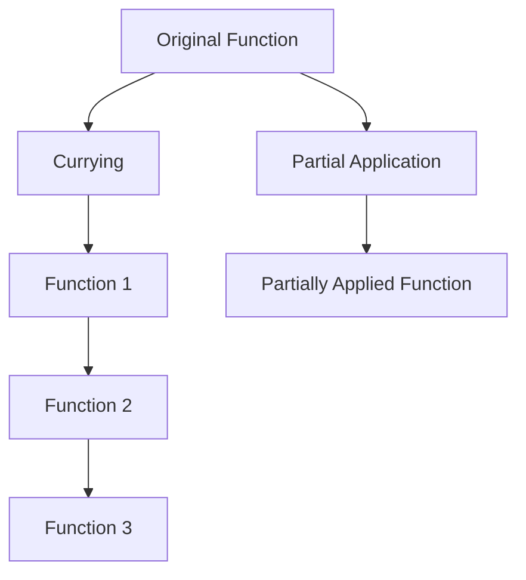

## 8.2 Currying and Partial Application

In the realm of functional programming, currying and partial application are powerful techniques that transform how we think about functions and their arguments. These concepts enable us to create more flexible, reusable, and modular code by breaking down functions into smaller, more manageable pieces. In this section, we will delve into the intricacies of currying and partial application, explore their benefits and use cases, and demonstrate how to implement them in Python.

### Defining Currying

Currying is a technique named after the mathematician Haskell Curry. It involves transforming a function that takes multiple arguments into a sequence of functions, each taking a single argument. This transformation allows for more granular control over function application and can lead to more elegant and concise code.

#### Mathematical Background and Historical Context

Currying has its roots in mathematical logic and lambda calculus, where functions are seen as mappings from arguments to results. In traditional mathematics, a function like `f(x, y)` is typically applied to both arguments simultaneously. Currying, however, transforms this function into `f(x)(y)`, where `f(x)` returns a new function that takes `y` as its argument.

This concept was formalized by Moses Schönfinkel and further developed by Haskell Curry, after whom the technique is named. Currying is a fundamental concept in functional programming languages like Haskell, where functions are curried by default.

### Defining Partial Application

Partial application is a related but distinct concept. It involves fixing a few arguments of a function, producing another function of fewer arguments. This allows us to create specialized versions of general functions by pre-filling some of their parameters.

#### Distinction Between Currying and Partial Application

While both currying and partial application involve transforming functions, they differ in their approach and purpose. Currying always transforms a function into a series of unary functions, whereas partial application fixes some arguments and returns a function that takes the remaining arguments. Currying is about decomposing functions, while partial application is about pre-configuring them.

### Benefits and Use Cases

Currying and partial application offer several benefits that enhance code reusability and abstraction:

- **Code Reusability**: By breaking down functions into smaller components, we can reuse these components in different contexts without rewriting code.
- **Abstraction**: These techniques allow us to abstract complex operations into simpler, more understandable pieces.
- **Default Parameters**: Partial application can be used to set default parameters, creating more specialized functions from general ones.
- **Event Handling**: In scenarios like event handling, where functions need to be configured with specific parameters, partial application can simplify the process.

### Implementing Currying in Python

Python, unlike some functional programming languages, does not support currying by default. However, we can manually implement currying using nested function definitions.

#### Manual Currying with Nested Functions

Let's consider a simple example of a function that adds three numbers:

```python
def add(x, y, z):
    return x + y + z

def curried_add(x):
    def add_y(y):
        def add_z(z):
            return x + y + z
        return add_z
    return add_y

add_one = curried_add(1)
add_one_and_two = add_one(2)
result = add_one_and_two(3)  # Result is 6
```

In this example, `curried_add` is a curried version of the `add` function. It returns a series of functions, each taking one argument, until all arguments are provided.

### Using `functools.partial` for Partial Application

Python's `functools` module provides a convenient way to perform partial application using the `partial` function. This function allows us to fix some arguments of a function, creating a new function with fewer arguments.

#### Introduction to `functools.partial`

The `functools.partial` function is a higher-order function that returns a new function with some arguments pre-filled. Here's how it works:

```python
from functools import partial

def multiply(x, y):
    return x * y

double = partial(multiply, 2)

result = double(5)  # Result is 10
```

In this example, `partial` is used to create a new function `double` that multiplies its argument by 2.

### Higher-Order Functions and Lambda Expressions

Higher-order functions and lambda expressions are essential tools in functional programming. They allow us to create concise and expressive code, especially when combined with currying and partial application.

#### Lambda Functions in Currying and Partial Application

Lambda functions are anonymous functions defined using the `lambda` keyword. They are particularly useful for creating small, throwaway functions in currying and partial application.

```python
curried_add = lambda x: lambda y: lambda z: x + y + z

multiply = lambda x, y: x * y
double = partial(multiply, 2)
```

In these examples, lambda functions provide a concise way to define curried and partially applied functions.

### Practical Examples

Let's explore some practical scenarios where currying and partial application can be beneficial:

#### Event Handling

In event-driven programming, functions often need to be configured with specific parameters. Partial application can simplify this process by pre-filling arguments.

```python
def handle_event(event_type, event_data):
    print(f"Handling {event_type} with data: {event_data}")

handle_click = partial(handle_event, "click")

handle_click({"x": 100, "y": 200})
```

In this example, `handle_click` is a specialized version of `handle_event` that handles click events.

#### Simplifying Callback Functions

Callbacks often require specific parameters. Partial application can help create more specialized callback functions.

```python
def log_message(level, message):
    print(f"[{level}] {message}")

log_error = partial(log_message, "ERROR")

log_error("An error occurred")
```

Here, `log_error` is a specialized version of `log_message` for logging error messages.

### Comparisons with Other Languages

Languages like Haskell support currying by default, which has implications for Python developers. In Haskell, all functions are curried, meaning they take one argument and return a new function for the next argument. This design encourages a functional programming style and can lead to more concise code.

For Python developers, manually implementing currying and using `functools.partial` can achieve similar results, but it requires a more explicit approach.

### Best Practices

When using currying and partial application, consider the following best practices:

- **Readability**: Ensure that your code remains readable and maintainable. Use clear function names and comments to describe the purpose of curried and partially applied functions.
- **Documentation**: Document the behavior and expected inputs of your functions, especially when using currying and partial application.
- **Function Naming**: Use descriptive names for curried and partially applied functions to convey their purpose and behavior.

### Common Pitfalls

While currying and partial application offer many benefits, they can also introduce potential issues:

- **Unintended Argument Binding**: Be cautious of binding the wrong arguments, which can lead to unexpected behavior.
- **Debugging**: Currying and partial application can make debugging more challenging, as the flow of arguments is less explicit. Use logging and debugging tools to trace argument flow.

### Try It Yourself

Experiment with the code examples provided in this section. Try modifying the arguments and observe how currying and partial application affect the behavior of the functions. Consider creating your own curried and partially applied functions to gain a deeper understanding of these concepts.

### Visualizing Currying and Partial Application

To better understand the flow of currying and partial application, let's visualize the process using a flowchart:



In this diagram, the original function is transformed through currying into a series of functions, each taking a single argument. Partial application, on the other hand, produces a new function with some arguments pre-filled.

### References and Links

For further reading on currying and partial application, consider the following resources:

- [Python's `functools` module](https://docs.python.org/3/library/functools.html)
- [Currying in Haskell](https://wiki.haskell.org/Currying)
- [Functional Programming in Python](https://realpython.com/python-functional-programming/)

### Knowledge Check

To reinforce your understanding of currying and partial application, consider the following questions:

- What is the primary difference between currying and partial application?
- How can `functools.partial` be used to create a partially applied function?
- What are some practical use cases for currying and partial application in Python?

### Embrace the Journey

Remember, mastering currying and partial application is just one step in your journey as a Python developer. These techniques can open up new possibilities for writing more flexible and reusable code. Keep experimenting, stay curious, and enjoy the journey!

## Quiz Time!



### What is currying in functional programming?

- [x] Transforming a function with multiple arguments into a sequence of functions each taking a single argument.
- [ ] Fixing a few arguments of a function, producing another function of fewer arguments.
- [ ] Combining multiple functions into one.
- [ ] Converting a function into a lambda expression.

> **Explanation:** Currying transforms a function with multiple arguments into a sequence of functions, each taking one argument.

### What is partial application?

- [ ] Transforming a function with multiple arguments into a sequence of functions each taking a single argument.
- [x] Fixing a few arguments of a function, producing another function of fewer arguments.
- [ ] Combining multiple functions into one.
- [ ] Converting a function into a lambda expression.

> **Explanation:** Partial application involves fixing some arguments of a function, creating a new function with fewer arguments.

### Which Python module provides a function for partial application?

- [ ] itertools
- [ ] operator
- [x] functools
- [ ] collections

> **Explanation:** The `functools` module provides the `partial` function for partial application.

### How does currying differ from partial application?

- [x] Currying transforms a function into unary functions, while partial application fixes some arguments.
- [ ] Currying fixes some arguments, while partial application transforms a function into unary functions.
- [ ] Both are identical in functionality.
- [ ] Currying is used only in Haskell.

> **Explanation:** Currying transforms a function into a series of unary functions, while partial application fixes some arguments and returns a function with fewer arguments.

### What is a common use case for partial application?

- [x] Setting default parameters for functions.
- [ ] Converting functions into lambda expressions.
- [ ] Combining multiple functions into one.
- [ ] Transforming functions into unary functions.

> **Explanation:** Partial application can be used to set default parameters, creating specialized functions from general ones.

### Which of the following is a potential pitfall of currying?

- [x] Unintended argument binding.
- [ ] Increased code readability.
- [ ] Simplified debugging process.
- [ ] Enhanced performance.

> **Explanation:** Unintended argument binding can occur with currying, leading to unexpected behavior.

### What is the purpose of using lambda functions in currying?

- [x] To create concise, anonymous functions for currying.
- [ ] To increase the performance of curried functions.
- [ ] To convert functions into partial applications.
- [ ] To replace all function definitions with lambdas.

> **Explanation:** Lambda functions provide a concise way to define anonymous functions, useful in currying.

### Which of the following is a benefit of currying and partial application?

- [x] Code reusability.
- [ ] Increased code complexity.
- [ ] Reduced function flexibility.
- [ ] Limited abstraction capabilities.

> **Explanation:** Currying and partial application promote code reusability by breaking down functions into smaller components.

### What is the result of using `functools.partial` on a function?

- [x] A new function with some arguments pre-filled.
- [ ] A sequence of unary functions.
- [ ] A lambda expression.
- [ ] A higher-order function.

> **Explanation:** `functools.partial` creates a new function with some arguments pre-filled, reducing the number of required arguments.

### True or False: Currying is supported by default in Python.

- [ ] True
- [x] False

> **Explanation:** Currying is not supported by default in Python; it must be implemented manually using nested functions.


