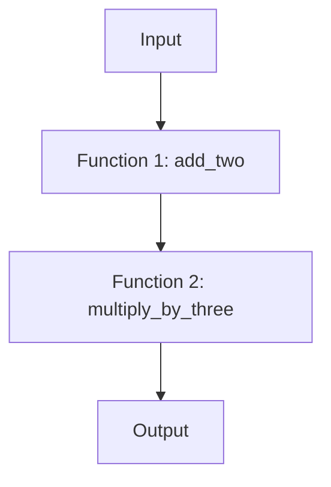

## 8.4 Functional Composition

Functional composition is a fundamental concept in functional programming that involves combining two or more functions to build more complex operations. This technique allows developers to create modular, reusable, and maintainable code by chaining simple functions together, where the output of one function becomes the input of the next. In this section, we will explore the concept of functional composition in Python, its advantages, and how to implement it effectively.

### Defining Functional Composition

Functional composition is the process of combining multiple functions to form a single function. This single function represents the sequential application of the combined functions. In mathematical terms, if we have two functions, `f` and `g`, the composition of these functions is denoted as `f(g(x))`, where the output of `g` becomes the input of `f`.

#### Notation and Terminology

- **Composition Operator**: In many functional programming languages, the composition of functions is denoted by the `∘` operator. In Python, we often use nested function calls or higher-order functions to achieve this.
- **Pipeline**: A sequence of functions applied in a specific order, where the output of one function is passed as input to the next.
- **Higher-Order Function**: A function that takes other functions as arguments or returns a function as its result.

### Advantages of Functional Composition

Functional composition offers several benefits that make it a valuable technique in software development:

1. **Code Reuse**: By composing functions, you can reuse existing functions to create new functionality without rewriting code.
2. **Abstraction**: It allows you to abstract complex operations into simpler, understandable components.
3. **Improved Readability**: Composed functions can make code more readable by clearly defining the flow of data through a series of transformations.
4. **Maintainability**: With clear separation of concerns, composed functions are easier to maintain and modify.

### Implementing Function Composition in Python

Let's explore how to implement function composition in Python using simple functions. We will start by composing functions manually and then introduce higher-order functions to simplify the process.

#### Manual Function Composition

Consider the following simple functions:

```python
def add_two(x):
    return x + 2

def multiply_by_three(x):
    return x * 3

def composed_function(x):
    return multiply_by_three(add_two(x))

result = composed_function(5)
print(result)  # Output: 21
```

In this example, `composed_function` manually applies `add_two` followed by `multiply_by_three`. The output of `add_two` becomes the input for `multiply_by_three`.

#### Higher-Order Function for Composition

We can create a higher-order function to automate the composition process:

```python
def compose(f, g):
    return lambda x: f(g(x))

composed = compose(multiply_by_three, add_two)

result = composed(5)
print(result)  # Output: 21
```

Here, the `compose` function takes two functions, `f` and `g`, and returns a new function that represents their composition.

### Using `functools` and `operator` Modules

Python's `functools` and `operator` modules provide utilities that aid in function composition.

#### `functools.reduce`

`functools.reduce` is a powerful tool for applying a function cumulatively to the items of an iterable, from left to right, to reduce the iterable to a single value.

```python
from functools import reduce

def add(x, y):
    return x + y

numbers = [1, 2, 3, 4]
result = reduce(add, numbers)
print(result)  # Output: 10
```

#### `operator` Methods

The `operator` module provides function equivalents for many built-in operators, which can be used in composition.

```python
from operator import add, mul

result = reduce(add, map(lambda x: mul(x, 3), [1, 2, 3, 4]))
print(result)  # Output: 30
```

### Lambda Functions in Composition

Lambda functions, or anonymous functions, are ideal for simplifying function composition, especially for small, throwaway functions.

```python
composed = lambda x: (lambda y: y * 3)(x + 2)

result = composed(5)
print(result)  # Output: 21
```

Lambda functions make it easy to define quick transformations inline without the need for separate function definitions.

### Practical Examples

Functional composition is particularly useful in data processing pipelines and complex calculations. Let's look at some practical examples.

#### Data Transformation Pipeline

Consider a scenario where we need to process a list of numbers by adding 2, multiplying by 3, and then filtering out numbers greater than 10.

```python
def filter_greater_than_ten(x):
    return x > 10

pipeline = lambda data: filter(filter_greater_than_ten, map(multiply_by_three, map(add_two, data)))

numbers = [1, 2, 3, 4]
result = list(pipeline(numbers))
print(result)  # Output: [12, 15, 18]
```

#### Complex Calculations

Functional composition can simplify complex calculations by breaking them into smaller, manageable functions.

```python
def square(x):
    return x * x

def subtract_five(x):
    return x - 5

complex_calculation = compose(subtract_five, compose(square, add_two))

result = complex_calculation(3)
print(result)  # Output: 4
```

### Error Handling and Exceptions

When composing functions, it's important to handle errors gracefully. Consider using try-except blocks to catch exceptions and ensure the composed function chain doesn't break unexpectedly.

```python
def safe_divide(x, y):
    try:
        return x / y
    except ZeroDivisionError:
        return float('inf')

composed_safe = lambda x: safe_divide(multiply_by_three(add_two(x)), 0)

result = composed_safe(5)
print(result)  # Output: inf
```

### Best Practices

To make the most of functional composition, consider the following best practices:

- **Keep Functions Pure**: Ensure functions have no side effects and always produce the same output for the same input.
- **Name Functions Meaningfully**: Use descriptive names to improve code clarity and maintainability.
- **Document Function Chains**: Provide comments or documentation to explain the purpose and flow of composed functions.

### Performance Considerations

While functional composition promotes clean and modular code, it can introduce performance overhead due to multiple function calls. To optimize performance:

- **Profile Code**: Use profiling tools to identify bottlenecks.
- **Inline Simple Functions**: For very small functions, consider inlining them to reduce call overhead.
- **Use Built-in Functions**: Leverage Python's optimized built-in functions and libraries.

### Common Pitfalls

Be aware of potential issues when composing functions:

- **Function Signature Mismatches**: Ensure that the output of one function matches the expected input of the next.
- **Over-Composition**: Avoid overly complex chains that become difficult to understand and maintain.

### Visualizing Functional Composition

To better understand the flow of data through composed functions, let's visualize the process using a simple diagram.



This diagram illustrates how the input data flows through a series of functions, with each function transforming the data before passing it to the next.

### Try It Yourself

Experiment with the code examples provided by modifying the functions or adding new ones to the composition chain. Try creating a new pipeline that performs different transformations or calculations.

### Conclusion

Functional composition is a powerful technique that enhances code modularity, readability, and maintainability. By combining simple functions into complex operations, developers can create clean and efficient codebases. Remember to handle errors gracefully, keep functions pure, and optimize performance where necessary.

## Quiz Time!



### What is functional composition?

- [x] Combining multiple functions to form a single function
- [ ] A method for optimizing code performance
- [ ] A technique for debugging code
- [ ] A way to store data in Python

> **Explanation:** Functional composition involves combining multiple functions to create a single function that represents their sequential application.

### Which Python module provides utilities for function composition?

- [x] functools
- [ ] itertools
- [ ] collections
- [ ] math

> **Explanation:** The `functools` module provides utilities like `reduce` that aid in function composition.

### What is a higher-order function?

- [x] A function that takes other functions as arguments or returns a function
- [ ] A function that performs mathematical operations
- [ ] A function that is defined inside another function
- [ ] A function that only works with numbers

> **Explanation:** A higher-order function is one that takes other functions as arguments or returns a function as its result.

### What is the primary advantage of using lambda functions in composition?

- [x] They simplify the composition of small, throwaway functions
- [ ] They improve code performance
- [ ] They make code more secure
- [ ] They are easier to debug

> **Explanation:** Lambda functions simplify the composition of small, throwaway functions by allowing quick, inline definitions.

### What is a common pitfall of functional composition?

- [x] Function signature mismatches
- [ ] Increased code security
- [ ] Improved readability
- [ ] Enhanced performance

> **Explanation:** A common pitfall is function signature mismatches, where the output of one function does not match the expected input of the next.

### How can you handle errors in a composed function chain?

- [x] Use try-except blocks
- [ ] Ignore errors
- [ ] Use global variables
- [ ] Print error messages

> **Explanation:** Using try-except blocks allows you to catch exceptions and handle errors gracefully in a composed function chain.

### What is the purpose of the `compose` function in Python?

- [x] To automate the process of composing two functions
- [ ] To perform mathematical calculations
- [ ] To store data in a list
- [ ] To create a new class

> **Explanation:** The `compose` function automates the process of composing two functions by returning a new function that represents their composition.

### What is the output of the following composed function: `compose(subtract_five, compose(square, add_two))(3)`?

- [x] 4
- [ ] 9
- [ ] 16
- [ ] 1

> **Explanation:** The composed function first adds 2 to 3, squares the result, and then subtracts 5, resulting in 4.

### What should you do to optimize performance in function composition?

- [x] Profile code and inline simple functions
- [ ] Use more lambda functions
- [ ] Increase the number of composed functions
- [ ] Use global variables

> **Explanation:** Profiling code and inlining simple functions can help optimize performance by reducing function call overhead.

### True or False: Functional composition can lead to over-complexity if not managed properly.

- [x] True
- [ ] False

> **Explanation:** True. Over-complexity can arise if function chains become too long or difficult to understand, making maintenance challenging.



Remember, this is just the beginning. As you progress, you'll build more complex and interactive applications using functional composition. Keep experimenting, stay curious, and enjoy the journey!
