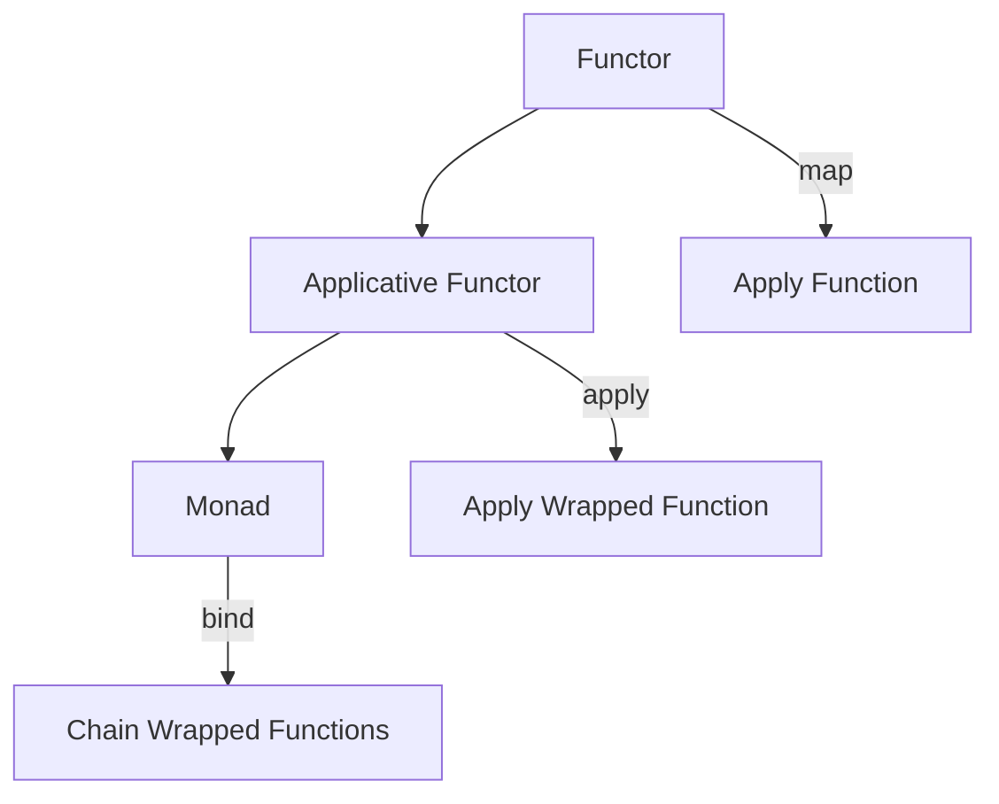

## 8.6 Functor and Applicative Patterns

In the realm of functional programming, functors and applicative functors are powerful abstractions that allow us to work with values wrapped in a context. These patterns enable us to apply functions to values that are not directly accessible, thus promoting modularity and expressiveness in our code. In this section, we will delve into the concepts of functors and applicative functors, their implementation in Python, and their practical applications.

### Understanding Functors

#### What is a Functor?

In category theory, a functor is a mapping between categories that preserves their structure. In programming, a functor is an abstraction that allows you to apply a function to a value wrapped in a context, such as a list or an optional value. The key operation associated with functors is `map`, which applies a function to each element within the context.

#### Functors in Python

Python's built-in types, such as lists, exhibit functor-like behavior. Consider the `map` function, which applies a given function to each item of an iterable (like a list) and returns a map object.

```python
numbers = [1, 2, 3, 4]
squared_numbers = map(lambda x: x ** 2, numbers)
print(list(squared_numbers))  # Output: [1, 4, 9, 16]
```

Here, the list acts as a functor, allowing us to apply a function to each of its elements.

#### Creating Custom Functor Classes

Let's create a custom functor class in Python. We'll define a class `Box` that wraps a value and provides a `map` method to apply functions to the wrapped value.

```python
class Box:
    def __init__(self, value):
        self.value = value

    def map(self, func):
        return Box(func(self.value))

box = Box(5)
result = box.map(lambda x: x * 2)
print(result.value)  # Output: 10
```

In this example, `Box` is a simple functor that allows us to apply a function to its contained value using the `map` method.

### Introducing Applicative Functors

#### What is an Applicative Functor?

Applicative functors extend the concept of functors by allowing functions that are themselves wrapped in a context to be applied to values in a context. This is achieved through an `apply` or `ap` method. Applicative functors enable more complex operations involving multiple wrapped values.

#### Implementing Applicatives in Python

Let's implement an applicative functor in Python. We'll extend our `Box` class to support applicative operations.

```python
class ApplicativeBox(Box):
    def apply(self, box_with_func):
        return ApplicativeBox(box_with_func.value(self.value))

box_value = ApplicativeBox(5)
box_func = ApplicativeBox(lambda x: x + 3)
result = box_value.apply(box_func)
print(result.value)  # Output: 8
```

In this example, `ApplicativeBox` allows us to apply a function wrapped in a `Box` to a value wrapped in another `Box`.

### Use Cases for Functors and Applicatives

#### Chaining Operations on Optional Values

Consider a scenario where we want to perform a series of operations on a value that might be `None`. Functors and applicatives can help us chain these operations without constantly checking for `None`.

```python
class Maybe:
    def __init__(self, value):
        self.value = value

    def map(self, func):
        if self.value is None:
            return Maybe(None)
        return Maybe(func(self.value))

maybe_value = Maybe(5)
result = maybe_value.map(lambda x: x * 2).map(lambda x: x + 3)
print(result.value)  # Output: 13
```

Here, `Maybe` acts as a functor, allowing us to chain operations without worrying about `None` values.

#### Simplifying Code with Applicatives

Applicatives can simplify code involving multiple independent computations. For example, consider a scenario where we have two independent computations that we want to combine.

```python
class ApplicativeMaybe(Maybe):
    def apply(self, maybe_func):
        if self.value is None or maybe_func.value is None:
            return ApplicativeMaybe(None)
        return ApplicativeMaybe(maybe_func.value(self.value))

maybe_value = ApplicativeMaybe(5)
maybe_func = ApplicativeMaybe(lambda x: x * 2)
result = maybe_value.apply(maybe_func)
print(result.value)  # Output: 10
```

In this example, `ApplicativeMaybe` allows us to apply a function wrapped in a `Maybe` to a value wrapped in another `Maybe`.

### Benefits of Using Functors and Applicatives

- **Code Reusability and Composability**: Functors and applicatives promote code reusability by allowing functions to be applied to wrapped values. This composability leads to cleaner and more modular code.
- **Handling Side Effects**: These patterns make handling side effects cleaner by abstracting over the context in which values are wrapped, allowing us to focus on the core logic.

### Third-Party Libraries

Python has libraries like `returns` that provide functor and applicative interfaces, making it easier to work with these patterns.

```python
from returns.maybe import Maybe, Some, Nothing

maybe_value = Some(5)
result = maybe_value.map(lambda x: x * 2).map(lambda x: x + 3)
print(result)  # Output: <Some: 13>
```

The `returns` library simplifies working with functors and applicatives by providing a consistent interface.

### Relation to Monads

Functors and applicatives are closely related to monads. While functors allow mapping functions over wrapped values, applicatives extend this by allowing wrapped functions to be applied to wrapped values. Monads further extend this by allowing functions that return wrapped values to be chained together.

### Challenges and Limitations

- **Abstract Nature**: The abstract nature of functors and applicatives can be challenging to grasp initially. It's important to practice and experiment with these concepts to fully understand them.
- **Learning Curve**: There is a learning curve associated with these patterns, especially for developers new to functional programming.

### Best Practices

- **Integrate Gradually**: Start by using functors and applicatives in small parts of your codebase and gradually expand their use as you become more comfortable with them.
- **Focus on Readability**: Ensure that your use of these patterns enhances code readability and maintainability. Avoid overcomplicating code with unnecessary abstractions.

### Comparative Insights

While Python is not a purely functional language, it supports functional programming concepts, including functors and applicatives. In functional languages like Haskell, these patterns are more deeply integrated into the language's type system. However, Python's flexibility allows us to implement and benefit from these patterns in a way that suits our needs.

### Visualizing Functors and Applicatives

To better understand the relationship between functors, applicatives, and monads, let's visualize their interactions using a diagram.



In this diagram, we see how functors, applicatives, and monads relate to each other, with each building upon the capabilities of the previous.

### Try It Yourself

Experiment with the provided code examples by modifying the functions and values. Try creating your own functor and applicative classes to deepen your understanding. Consider how these patterns can be applied to real-world scenarios in your projects.

### Key Takeaways

- **Functors** allow you to apply functions to values wrapped in a context.
- **Applicative Functors** extend functors by allowing wrapped functions to be applied to wrapped values.
- **Code Reusability** and **Composability** are key benefits of using these patterns.
- **Third-Party Libraries** like `returns` provide convenient interfaces for working with functors and applicatives.

## Quiz Time!



### What is a functor in programming?

- [x] An abstraction that allows you to apply a function to a value wrapped in a context.
- [ ] A data structure that stores multiple values.
- [ ] A function that takes another function as an argument.
- [ ] A type of loop in functional programming.

> **Explanation:** A functor is an abstraction that allows you to apply a function to a value wrapped in a context, such as a list or an optional value.

### How does an applicative functor extend a functor?

- [x] By allowing functions that are themselves wrapped in a context to be applied to values in a context.
- [ ] By providing a method to iterate over elements.
- [ ] By enabling state management within the context.
- [ ] By allowing multiple functions to be applied simultaneously.

> **Explanation:** Applicative functors extend functors by allowing functions that are themselves wrapped in a context to be applied to values in a context.

### Which Python library provides functor and applicative interfaces?

- [x] `returns`
- [ ] `numpy`
- [ ] `pandas`
- [ ] `requests`

> **Explanation:** The `returns` library provides functor and applicative interfaces, making it easier to work with these patterns in Python.

### What method is typically associated with functors?

- [x] `map`
- [ ] `filter`
- [ ] `reduce`
- [ ] `apply`

> **Explanation:** The `map` method is typically associated with functors, allowing functions to be applied to values within a context.

### What is the main benefit of using functors and applicatives?

- [x] Code reusability and composability.
- [ ] Faster execution times.
- [ ] Simplified error handling.
- [ ] Enhanced security.

> **Explanation:** Functors and applicatives promote code reusability and composability, leading to cleaner and more modular code.

### How are functors related to monads?

- [x] Functors are a foundational concept that monads build upon.
- [ ] Functors and monads are unrelated concepts.
- [ ] Functors are more advanced than monads.
- [ ] Functors are used to handle side effects, while monads are not.

> **Explanation:** Functors are a foundational concept that monads build upon, with monads providing additional capabilities for chaining operations.

### What is a common challenge when working with functors and applicatives?

- [x] The abstract nature of these concepts can be challenging to grasp.
- [ ] They require extensive memory resources.
- [ ] They are incompatible with object-oriented programming.
- [ ] They are only applicable to small codebases.

> **Explanation:** The abstract nature of functors and applicatives can be challenging to grasp, especially for developers new to functional programming.

### What is a best practice when integrating functors and applicatives into a codebase?

- [x] Start by using them in small parts of your codebase and gradually expand their use.
- [ ] Immediately refactor the entire codebase to use these patterns.
- [ ] Avoid using them in production code.
- [ ] Only use them in conjunction with monads.

> **Explanation:** It's best to start by using functors and applicatives in small parts of your codebase and gradually expand their use as you become more comfortable with them.

### What is the key operation associated with applicative functors?

- [x] `apply`
- [ ] `filter`
- [ ] `reduce`
- [ ] `map`

> **Explanation:** The `apply` method is key to applicative functors, allowing wrapped functions to be applied to wrapped values.

### True or False: Functors and applicatives are only useful in functional programming languages.

- [ ] True
- [x] False

> **Explanation:** False. While functors and applicatives are rooted in functional programming, they can be implemented and used effectively in languages like Python, which support functional programming concepts.



Remember, this is just the beginning. As you progress, you'll build more complex and interactive applications using these patterns. Keep experimenting, stay curious, and enjoy the journey!
