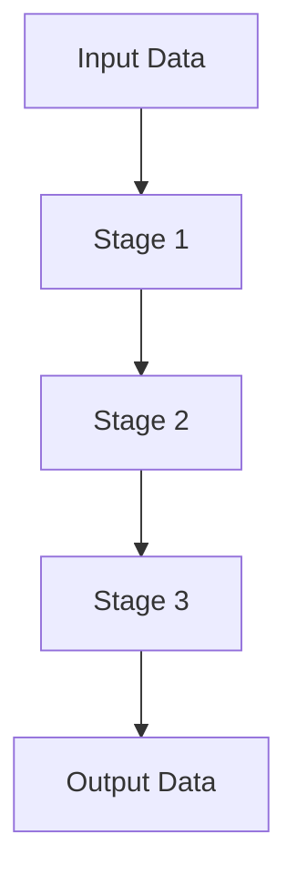

## 8.7 Pipeline Pattern

In the realm of software design, the Pipeline Pattern stands out as a versatile and efficient approach to data processing. By structuring operations as a sequence of stages, each transforming the data before passing it to the next, this pattern promotes modularity, readability, and maintainability. Let's delve into the intricacies of the Pipeline Pattern, its implementation in Python, and its practical applications.

### Introduction to the Pipeline Pattern

The Pipeline Pattern is a design pattern that facilitates systematic data processing by passing data through a series of processing stages. Each stage is responsible for a specific transformation or operation, and the output of one stage becomes the input for the next. This pattern is akin to an assembly line in a factory, where each station performs a specific task to gradually build a product.

**Role in Software Architecture:**

- **Modularity**: Each stage in a pipeline is a self-contained unit, making it easier to manage and understand.
- **Readability**: By breaking down complex processes into smaller, manageable steps, pipelines enhance code clarity.
- **Maintainability**: Changes can be made to individual stages without affecting the entire pipeline, simplifying updates and debugging.

### Benefits of Pipelines

Pipelines offer several advantages that make them an attractive choice for developers:

- **Improved Code Organization**: By separating concerns into distinct stages, pipelines help organize code logically.
- **Ease of Modification**: Individual stages can be modified or replaced without impacting the entire process.
- **Testing Simplicity**: Each stage can be tested independently, ensuring robustness and reliability.
- **Reusability**: Stages can be reused across different pipelines, reducing redundancy and promoting DRY (Don't Repeat Yourself) principles.

### Implementing Pipelines in Python

Python's functional programming capabilities make it an ideal language for implementing pipelines. Let's explore how to create pipelines using function composition and callable objects.

#### Function Composition

Function composition involves combining simple functions to build more complex operations. In Python, this can be achieved using higher-order functions.

```python
def multiply_by_two(x):
    return x * 2

def add_three(x):
    return x + 3

def pipeline(data, functions):
    for function in functions:
        data = function(data)
    return data

functions = [multiply_by_two, add_three]
result = pipeline(5, functions)
print(result)  # Output: 13
```

In this example, we define two simple functions and compose them into a pipeline. The `pipeline` function iterates over a list of functions, applying each to the data sequentially.

#### Using Callable Objects

Callable objects, such as classes implementing the `__call__` method, can also be used to build pipelines.

```python
class MultiplyByTwo:
    def __call__(self, x):
        return x * 2

class AddThree:
    def __call__(self, x):
        return x + 3

pipeline_stages = [MultiplyByTwo(), AddThree()]
result = pipeline(5, pipeline_stages)
print(result)  # Output: 13
```

This approach allows for more complex logic within each stage, leveraging object-oriented principles.

### Using Generators and Coroutines

Generators and coroutines offer a powerful way to implement pipelines, particularly for handling streams of data.

#### Chaining Generators

Generators can be chained together to form pipelines, with each generator yielding data to the next.

```python
def read_numbers():
    for i in range(1, 6):
        yield i

def multiply_by_two(numbers):
    for number in numbers:
        yield number * 2

def add_three(numbers):
    for number in numbers:
        yield number + 3

numbers = read_numbers()
pipeline = add_three(multiply_by_two(numbers))
print(list(pipeline))  # Output: [5, 7, 9, 11, 13]
```

In this example, data flows through a series of generator functions, each performing a transformation.

#### Coroutines with `yield from`

Coroutines, enhanced by the `yield from` syntax, enable more complex interactions within pipelines.

```python
def coroutine_pipeline():
    while True:
        number = yield
        yield number * 2

def main():
    pipeline = coroutine_pipeline()
    next(pipeline)  # Prime the coroutine
    print(pipeline.send(5))  # Output: 10

main()
```

Coroutines allow for bidirectional communication, making them suitable for interactive pipelines.

### Practical Applications

Pipelines are widely used in various domains, from data transformation to image processing. Let's explore some practical applications.

#### Data Transformation

Pipelines are ideal for transforming data, such as converting raw data into a structured format.

```python
def clean_data(data):
    return data.strip().lower()

def split_data(data):
    return data.split(',')

raw_data = "  Apple, Banana, Cherry  "
pipeline = [clean_data, split_data]
result = pipeline(raw_data, pipeline)
print(result)  # Output: ['apple', 'banana', 'cherry']
```

#### ETL Processes

Extract, Transform, Load (ETL) processes benefit from pipelines by separating each phase into distinct stages.

#### Image Processing

In image processing, pipelines can be used to apply a series of filters or transformations to an image.

#### Text Parsing

Text parsing pipelines can process and analyze large volumes of text data efficiently.

### Third-Party Libraries

Several libraries facilitate pipeline implementation in Python, offering additional features and optimizations.

#### Pandas for Data Pipelines

[Pandas](https://pandas.pydata.org/) is a powerful library for data manipulation, providing DataFrame operations that can be chained to form pipelines.

```python
import pandas as pd

data = pd.DataFrame({'A': [1, 2, 3], 'B': [4, 5, 6]})
result = data.assign(C=lambda df: df['A'] + df['B'])
print(result)
```

#### Apache Beam and Luigi

[Apache Beam](https://beam.apache.org/) and [Luigi](https://luigi.readthedocs.io/) are frameworks for building complex data workflows, supporting distributed processing and task orchestration.

### Asynchronous Pipelines

Asynchronous pipelines handle tasks that require non-blocking operations, such as network requests or I/O-bound tasks.

#### Using `asyncio`

Python's `asyncio` module provides tools for building asynchronous pipelines.

```python
import asyncio

async def fetch_data():
    await asyncio.sleep(1)
    return 42

async def process_data(data):
    await asyncio.sleep(1)
    return data * 2

async def main():
    data = await fetch_data()
    result = await process_data(data)
    print(result)  # Output: 84

asyncio.run(main())
```

### Error Handling Strategies

Managing exceptions within a pipeline is crucial to ensure robustness and reliability.

#### Logging Errors

Implement logging to capture and analyze errors without disrupting the pipeline flow.

```python
import logging

def safe_stage(data, function):
    try:
        return function(data)
    except Exception as e:
        logging.error(f"Error in stage: {e}")
        return None
```

#### Continuing Processing

Design pipelines to handle errors gracefully, allowing subsequent stages to continue processing unaffected data.

### Optimization and Performance

Optimizing pipeline stages can significantly enhance performance, especially when dealing with large datasets.

#### Parallel Processing

Leverage parallel processing to execute independent stages concurrently, reducing overall processing time.

#### Lazy Evaluation

Implement lazy evaluation to defer computations until results are needed, improving efficiency.

### Visualization and Documentation

Visualizing pipelines helps communicate their structure and flow, aiding in understanding and maintenance.



This diagram illustrates a simple pipeline with three stages, each transforming the data before passing it to the next.

### Best Practices

Adhering to best practices ensures pipelines are robust, maintainable, and scalable.

- **Keep Stages Independent**: Design stages to operate independently, minimizing dependencies.
- **Use Clear Naming Conventions**: Name stages descriptively to convey their purpose.
- **Document Pipeline Steps**: Provide documentation for each stage, explaining its role and functionality.

### Challenges and Solutions

Pipelines can become complex, posing challenges in debugging and testing.

#### Debugging Complex Pipelines

Use logging and debugging tools to trace data flow and identify issues within the pipeline.

#### Testing Individual Stages

Test each stage independently to ensure correctness, using mock data to simulate real-world scenarios.

### Try It Yourself

Experiment with the provided examples by modifying the functions or adding new stages. Consider creating a pipeline for a specific task, such as data cleaning or image processing, to reinforce your understanding.

### Embrace the Journey

Remember, mastering the Pipeline Pattern is a journey. As you explore its applications and refine your skills, you'll discover new ways to enhance your code's modularity and efficiency. Stay curious, keep experimenting, and enjoy the process!

## Quiz Time!



### What is the primary role of the Pipeline Pattern in software architecture?

- [x] To facilitate systematic data processing through a sequence of stages
- [ ] To replace all loops in a program
- [ ] To enhance user interface design
- [ ] To manage database connections

> **Explanation:** The Pipeline Pattern is designed to process data systematically through a series of stages, each performing a specific transformation.

### Which of the following is NOT a benefit of using pipelines?

- [ ] Improved code organization
- [ ] Ease of modification
- [x] Increased code redundancy
- [ ] Simplicity in testing

> **Explanation:** Pipelines reduce redundancy by promoting the reuse of stages, not increasing it.

### How can function composition be used to implement pipelines in Python?

- [x] By combining simple functions to build complex operations
- [ ] By using only object-oriented programming
- [ ] By avoiding the use of functions
- [ ] By writing all code in a single function

> **Explanation:** Function composition involves combining simple functions to create more complex operations, which is a key aspect of implementing pipelines.

### What is a key advantage of using generators in pipelines?

- [x] They allow for efficient handling of large data streams
- [ ] They eliminate the need for functions
- [ ] They automatically parallelize tasks
- [ ] They require no memory

> **Explanation:** Generators are efficient for handling large data streams because they yield items one at a time, reducing memory usage.

### Which library is commonly used for building complex data workflows in Python?

- [ ] NumPy
- [x] Apache Beam
- [ ] Matplotlib
- [ ] Flask

> **Explanation:** Apache Beam is a framework used for building complex data workflows, supporting distributed processing.

### How does `asyncio` contribute to pipeline implementation?

- [x] By enabling asynchronous task handling
- [ ] By simplifying synchronous operations
- [ ] By removing the need for coroutines
- [ ] By automatically optimizing code

> **Explanation:** `asyncio` provides tools for handling asynchronous tasks, which is beneficial for implementing non-blocking pipelines.

### What is a recommended strategy for error handling in pipelines?

- [x] Logging errors and allowing subsequent stages to continue processing
- [ ] Stopping the entire pipeline on any error
- [ ] Ignoring all errors
- [ ] Only handling errors at the end of the pipeline

> **Explanation:** Logging errors and allowing the pipeline to continue processing unaffected data is a robust error handling strategy.

### What is lazy evaluation in the context of pipelines?

- [x] Deferring computations until results are needed
- [ ] Performing all computations immediately
- [ ] Avoiding computations altogether
- [ ] Using maximum resources for computations

> **Explanation:** Lazy evaluation defers computations until their results are needed, improving efficiency.

### Why is it important to visualize pipelines?

- [x] To aid in understanding and maintaining the pipeline structure
- [ ] To replace documentation
- [ ] To eliminate the need for testing
- [ ] To automatically generate code

> **Explanation:** Visualizing pipelines helps communicate their structure and flow, aiding in understanding and maintenance.

### True or False: In a pipeline, each stage should be dependent on the previous stage.

- [ ] True
- [x] False

> **Explanation:** Each stage in a pipeline should ideally be independent to promote modularity and ease of maintenance.


