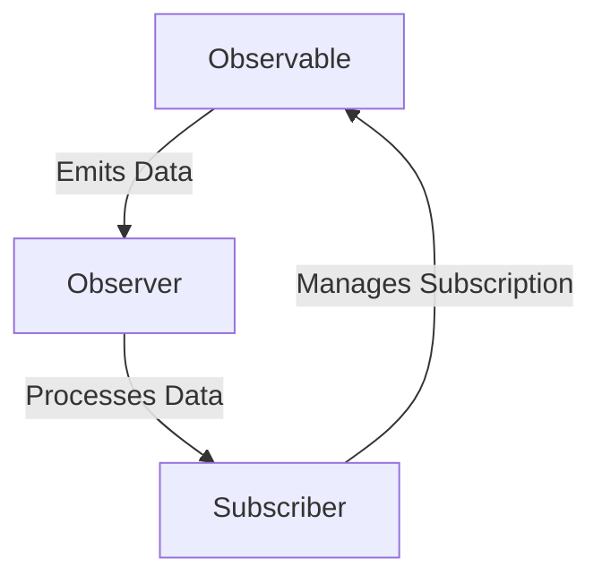
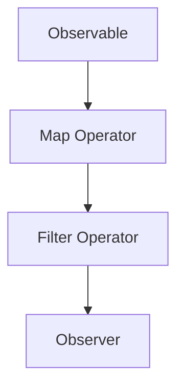

## 9.1 Observer Pattern in Reactive Extensions

Reactive programming is a paradigm that focuses on asynchronous data streams and the propagation of change. At the heart of this paradigm is the Observer pattern, which facilitates communication between components in a system. In this section, we delve into the Observer pattern as implemented in Reactive Extensions (Rx), particularly in Python using the RxPY library. We will explore how this pattern enables efficient handling of asynchronous data flows, enhancing application performance and responsiveness.

### Introduction to Reactive Extensions (Rx)

Reactive Extensions, commonly known as Rx, is a library for composing asynchronous and event-based programs using observable sequences. It provides a robust framework for handling asynchronous data flows, allowing developers to build applications that react to data changes in real-time.

#### What are Reactive Extensions?

Reactive Extensions is a set of libraries that enable reactive programming by providing a unified approach to handling asynchronous data streams. It abstracts the complexities of asynchronous programming, offering a consistent API for dealing with data sequences that can be observed and manipulated.

#### Purpose of Reactive Extensions

The primary purpose of Rx is to simplify the development of applications that require complex event handling and asynchronous data processing. By using observable sequences, Rx allows developers to compose and transform data streams with ease, facilitating the creation of responsive and scalable applications.

### Observer Pattern in Reactive Programming

The Observer pattern is a design pattern that defines a one-to-many dependency between objects. In the context of reactive programming, it is fundamental to the architecture of Reactive Extensions.

#### Roles of Observables, Observers, and Subscribers

- **Observables**: These are the sources of data streams. An Observable emits items over time, which can be observed by multiple Observers.
- **Observers**: These are the entities that subscribe to Observables to receive emitted items. An Observer reacts to the data it receives, performing actions based on the data.
- **Subscribers**: In Rx, a Subscriber is an Observer that also manages the subscription to an Observable, allowing for the control of data flow, including subscription and unsubscription.

### Implementing Reactive Streams in Python

To implement reactive streams in Python, we use the RxPY library, which is a Python implementation of Reactive Extensions. RxPY provides the tools necessary to create and manipulate Observables and Observers.

#### Introducing RxPY

RxPY is a powerful library that brings the capabilities of Reactive Extensions to Python. It allows developers to work with asynchronous data streams using a familiar API, making it easier to build reactive applications.

#### Creating Observables and Observers

Let's explore how to create Observables and Observers in Python using RxPY.

```python
import rx
from rx import operators as ops
from rx.subject import Subject

observable = rx.from_([1, 2, 3, 4, 5])

class PrintObserver:
    def on_next(self, value):
        print(f"Received: {value}")

    def on_error(self, error):
        print(f"Error: {error}")

    def on_completed(self):
        print("Completed")

observable.subscribe(PrintObserver())
```

In this example, we create an Observable from a list of integers and define an Observer that prints each received value. The Observer subscribes to the Observable, receiving and processing each emitted item.

### Asynchronous Data Stream Handling

Handling asynchronous data streams is a core aspect of reactive programming. RxPY provides mechanisms to manage these streams effectively.

#### Subscription and Unsubscription

Subscriptions in RxPY allow Observers to receive data from Observables. It's crucial to manage subscriptions properly to prevent memory leaks and ensure efficient resource usage.

```python
subscription = observable.subscribe(PrintObserver())

subscription.dispose()
```

#### Backpressure

Backpressure is a mechanism to handle situations where data is produced faster than it can be consumed. RxPY provides operators to manage backpressure, ensuring that data flows smoothly without overwhelming the system.

### Operators in Reactive Extensions

Operators are functions that enable the transformation and manipulation of data streams in Rx. They are essential for building complex data pipelines.

#### Common Operators

- **Map**: Transforms each item emitted by an Observable.
- **Filter**: Emits only those items from an Observable that pass a predicate test.
- **Reduce**: Applies a function to each item emitted by an Observable, sequentially, and emits the final value.

#### Chaining Operators

Operators can be chained together to create complex data processing pipelines.

```python
observable.pipe(
    ops.map(lambda x: x * 2),
    ops.filter(lambda x: x > 5)
).subscribe(PrintObserver())
```

In this example, we use the `map` operator to double each value and the `filter` operator to emit only values greater than 5.

### Practical Use Cases

Reactive programming with RxPY can significantly enhance application performance in various scenarios.

#### Real-Time Data Processing

Reactive Extensions are ideal for applications that require real-time data processing, such as financial trading platforms or live data feeds.

#### User Interface Event Handling

In user interfaces, RxPY can manage complex event handling, allowing for responsive and interactive applications.

### Benefits and Challenges

#### Advantages of Using the Observer Pattern in Reactive Programming

- **Scalability**: Reactive programming allows applications to scale efficiently by managing asynchronous data flows.
- **Responsiveness**: Applications can react to data changes in real-time, enhancing user experience.

#### Challenges and Learning Curve

- **Complexity**: The reactive paradigm can be complex to understand and implement, especially for developers new to asynchronous programming.
- **Error Handling**: Proper error handling is crucial in reactive systems to ensure reliability and stability.

### Best Practices

#### Managing Subscriptions

To prevent memory leaks, always manage subscriptions carefully. Use the `dispose` method to unsubscribe when an Observer is no longer needed.

#### Error Handling in Observables

Implement robust error handling in Observables to manage exceptions and ensure system stability.

### Comparison with Traditional Observer Pattern

The Observer pattern in Rx extends the traditional implementation by supporting asynchronous and complex event processing. Reactive Extensions provide a more powerful and flexible framework for managing data flows compared to the traditional Observer pattern.

### Visual Aids

#### Data Flow Diagram



This diagram illustrates the data flow between an Observable, Observer, and Subscriber in Rx.

#### Operator Chain Flowchart



This flowchart depicts a chain of operators applied to an Observable, transforming the data before it reaches the Observer.

### Additional Resources

For further reading on Reactive Extensions in Python, consider exploring the following resources:

- [RxPY Documentation](https://rxpy.readthedocs.io/en/latest/)
- [ReactiveX.io](http://reactivex.io/)
- [Introduction to Reactive Programming](https://www.reactivemanifesto.org/)

## Quiz Time!



### What is the primary purpose of Reactive Extensions?

- [x] To simplify the development of applications requiring complex event handling and asynchronous data processing.
- [ ] To provide a framework for synchronous programming.
- [ ] To replace traditional programming paradigms.
- [ ] To enhance the performance of static applications.

> **Explanation:** Reactive Extensions aim to simplify the development of applications that require complex event handling and asynchronous data processing by providing a unified approach to handling asynchronous data streams.

### In the context of Rx, what is an Observable?

- [x] A source of data streams that emits items over time.
- [ ] An entity that subscribes to receive data.
- [ ] A function that transforms data.
- [ ] A mechanism to handle errors.

> **Explanation:** An Observable is a source of data streams in Rx, responsible for emitting items over time that can be observed by multiple Observers.

### How does the `map` operator function in Rx?

- [x] It transforms each item emitted by an Observable.
- [ ] It filters items based on a condition.
- [ ] It combines multiple Observables into one.
- [ ] It handles errors in the data stream.

> **Explanation:** The `map` operator in Rx is used to transform each item emitted by an Observable, applying a specified function to each item.

### What is the role of a Subscriber in Rx?

- [x] To manage the subscription to an Observable and control data flow.
- [ ] To emit data items over time.
- [ ] To transform data using operators.
- [ ] To handle errors in the data stream.

> **Explanation:** A Subscriber in Rx is responsible for managing the subscription to an Observable, allowing control over data flow, including subscription and unsubscription.

### Which of the following is a benefit of using the Observer pattern in reactive programming?

- [x] Scalability
- [ ] Increased complexity
- [ ] Synchronous processing
- [ ] Reduced responsiveness

> **Explanation:** The Observer pattern in reactive programming enhances scalability by efficiently managing asynchronous data flows, allowing applications to scale effectively.

### What is backpressure in the context of Rx?

- [x] A mechanism to handle situations where data is produced faster than it can be consumed.
- [ ] A method to transform data streams.
- [ ] A way to manage subscriptions.
- [ ] A technique for error handling.

> **Explanation:** Backpressure is a mechanism in Rx to handle situations where data is produced faster than it can be consumed, ensuring smooth data flow without overwhelming the system.

### How can you prevent memory leaks in RxPY?

- [x] By managing subscriptions carefully and using the `dispose` method to unsubscribe.
- [ ] By avoiding the use of Observables.
- [ ] By using synchronous programming techniques.
- [ ] By not handling errors.

> **Explanation:** To prevent memory leaks in RxPY, it is crucial to manage subscriptions carefully and use the `dispose` method to unsubscribe when an Observer is no longer needed.

### What is a challenge associated with reactive programming?

- [x] Complexity and learning curve
- [ ] Lack of scalability
- [ ] Inability to handle asynchronous data
- [ ] Reduced application responsiveness

> **Explanation:** A challenge associated with reactive programming is the complexity and learning curve, especially for developers new to asynchronous programming.

### How does Rx extend the traditional Observer pattern?

- [x] By supporting asynchronous and complex event processing.
- [ ] By simplifying synchronous data handling.
- [ ] By eliminating the need for Observers.
- [ ] By focusing solely on error handling.

> **Explanation:** Rx extends the traditional Observer pattern by supporting asynchronous and complex event processing, providing a more powerful and flexible framework for managing data flows.

### True or False: Reactive Extensions are only useful for handling synchronous data streams.

- [ ] True
- [x] False

> **Explanation:** False. Reactive Extensions are designed to handle asynchronous data streams, providing a framework for composing asynchronous and event-based programs.



Remember, mastering reactive programming with RxPY is a journey. As you continue to explore and experiment with these concepts, you'll unlock new ways to build responsive and efficient applications. Keep learning, stay curious, and enjoy the process!
