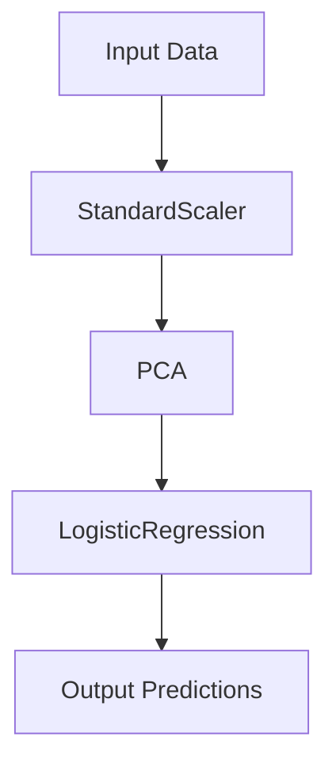

## 9.5.1 Pipeline Pattern for Data Processing

In the realm of machine learning, the Pipeline Pattern is a powerful design strategy that streamlines data transformations and modeling steps. By organizing sequences of data processing tasks into a coherent structure, pipelines enhance code clarity, facilitate parameter management, and promote reproducibility. In this section, we will delve into the intricacies of the Pipeline Pattern, explore its implementation in Python using popular frameworks like scikit-learn, and discuss its customization, extensibility, and practical use cases.

### Understanding the Pipeline Pattern in Machine Learning

The Pipeline Pattern in machine learning refers to the practice of chaining together a sequence of data processing steps, where each step is a transformation or a model. This approach allows for the systematic application of operations to datasets, ensuring that data flows seamlessly from one step to the next. 

#### Key Concepts

- **Sequential Processing**: Pipelines execute a series of transformations and modeling steps in a specific order. Each step takes the output of the previous step as its input.
- **Modularity**: Each step in a pipeline is typically a modular component, such as a data transformer or an estimator, which can be easily replaced or modified.
- **Reproducibility**: Pipelines ensure that the same sequence of operations is applied consistently, aiding in reproducibility of results.
- **Parameter Management**: Pipelines facilitate the management of parameters across different steps, allowing for streamlined hyperparameter tuning.

#### Advantages of Using Pipelines

- **Improved Code Clarity**: By encapsulating the entire data processing workflow in a single structure, pipelines make code more readable and maintainable.
- **Reduced Errors**: Automating the sequence of operations minimizes the risk of human error, such as forgetting to apply a transformation.
- **Ease of Experimentation**: Pipelines allow for easy experimentation with different configurations, as individual steps can be swapped or adjusted without altering the overall structure.
- **Integration with Cross-Validation**: Pipelines integrate seamlessly with cross-validation techniques, ensuring that data transformations are applied consistently across training and test datasets.

### Implementing Pipelines in Python

Python, with its rich ecosystem of libraries, provides robust support for implementing the Pipeline Pattern. One of the most popular libraries for this purpose is scikit-learn, which offers the `Pipeline` and `FeatureUnion` classes for constructing complex workflows.

#### Creating a Simple Pipeline

Let's start by creating a simple pipeline for data preprocessing and model training using scikit-learn.

```python
from sklearn.pipeline import Pipeline
from sklearn.preprocessing import StandardScaler
from sklearn.decomposition import PCA
from sklearn.linear_model import LogisticRegression
from sklearn.datasets import load_iris
from sklearn.model_selection import train_test_split

iris = load_iris()
X_train, X_test, y_train, y_test = train_test_split(iris.data, iris.target, test_size=0.2, random_state=42)

pipeline = Pipeline([
    ('scaler', StandardScaler()),  # Step 1: Standardize features
    ('pca', PCA(n_components=2)),  # Step 2: Reduce dimensionality
    ('classifier', LogisticRegression())  # Step 3: Train a logistic regression model
])

pipeline.fit(X_train, y_train)

score = pipeline.score(X_test, y_test)
print(f"Pipeline Test Accuracy: {score:.2f}")
```

In this example, we construct a pipeline that standardizes the features, reduces dimensionality using PCA, and trains a logistic regression model. The pipeline is then fitted to the training data and evaluated on the test data.

#### Visualizing the Pipeline Workflow

To better understand the flow of data through the pipeline, let's visualize the sequence of operations.



**Figure 1**: The flow of data through a simple pipeline consisting of a `StandardScaler`, `PCA`, and `LogisticRegression`.

### Customization and Extensibility

One of the key strengths of the Pipeline Pattern is its customization and extensibility. You can easily integrate custom transformers and estimators into your pipelines, allowing for tailored data processing workflows.

#### Creating Custom Transformers

To create a custom transformer, you need to implement the `fit` and `transform` methods. Here's an example of a custom transformer that adds polynomial features to the dataset.

```python
from sklearn.base import BaseEstimator, TransformerMixin
import numpy as np

class PolynomialFeaturesAdder(BaseEstimator, TransformerMixin):
    def __init__(self, degree=2):
        self.degree = degree

    def fit(self, X, y=None):
        return self

    def transform(self, X):
        X_poly = np.hstack([X**i for i in range(1, self.degree + 1)])
        return X_poly

pipeline = Pipeline([
    ('polynomial_features', PolynomialFeaturesAdder(degree=3)),
    ('scaler', StandardScaler()),
    ('classifier', LogisticRegression())
])

pipeline.fit(X_train, y_train)
score = pipeline.score(X_test, y_test)
print(f"Pipeline with Polynomial Features Test Accuracy: {score:.2f}")
```

In this example, the `PolynomialFeaturesAdder` transformer generates polynomial features up to a specified degree and integrates them into the pipeline.

#### Experimenting with Different Configurations

Pipelines make it easy to experiment with different configurations by allowing you to modify individual components without altering the overall structure. For instance, you can swap out the classifier in the pipeline to try different models.

```python
from sklearn.svm import SVC

pipeline.set_params(classifier=SVC(kernel='linear'))

pipeline.fit(X_train, y_train)
score = pipeline.score(X_test, y_test)
print(f"Pipeline with SVC Test Accuracy: {score:.2f}")
```

### Use Cases for Pipelines

Pipelines are essential in various machine learning scenarios, particularly in tasks involving cross-validation and hyperparameter tuning.

#### Cross-Validation

When performing cross-validation, it's crucial to ensure that data transformations are applied consistently across different folds. Pipelines automate this process, reducing the risk of data leakage.

```python
from sklearn.model_selection import cross_val_score

cv_scores = cross_val_score(pipeline, iris.data, iris.target, cv=5)
print(f"Cross-Validation Scores: {cv_scores}")
```

In this example, the pipeline is used in conjunction with `cross_val_score` to perform cross-validation, ensuring that the same sequence of transformations is applied to each fold.

#### Hyperparameter Tuning

Pipelines facilitate hyperparameter tuning by allowing you to specify parameter grids for different components. This integration is seamless with tools like `GridSearchCV`.

```python
from sklearn.model_selection import GridSearchCV

param_grid = {
    'pca__n_components': [2, 3],
    'classifier__C': [0.1, 1, 10]
}

grid_search = GridSearchCV(pipeline, param_grid, cv=5)
grid_search.fit(X_train, y_train)

print(f"Best Parameters: {grid_search.best_params_}")
print(f"Best Cross-Validation Score: {grid_search.best_score_:.2f}")
```

In this example, we define a parameter grid for the PCA and classifier components and perform a grid search to find the best combination of parameters.

### Try It Yourself

To deepen your understanding of the Pipeline Pattern, try modifying the code examples provided. Here are some suggestions:

- **Experiment with Different Transformers**: Replace `StandardScaler` with other transformers like `MinMaxScaler` or `Normalizer` and observe the impact on model performance.
- **Add Custom Steps**: Create additional custom transformers and integrate them into the pipeline.
- **Test Different Models**: Swap out `LogisticRegression` with other classifiers such as `RandomForestClassifier` or `KNeighborsClassifier`.
- **Visualize Data Flow**: Use the Mermaid.js diagram to visualize more complex pipelines with additional steps.

### Knowledge Check

Before we conclude, let's reinforce key concepts with a few questions:

- What are the main advantages of using pipelines in machine learning?
- How do pipelines enhance reproducibility in data processing workflows?
- Why is it important to use pipelines in cross-validation?
- How can you integrate custom transformers into a pipeline?

### Conclusion

The Pipeline Pattern is a cornerstone of efficient and effective machine learning workflows. By organizing data processing steps into a structured sequence, pipelines enhance code clarity, facilitate parameter management, and promote reproducibility. With Python's robust libraries like scikit-learn, implementing and customizing pipelines is both straightforward and powerful. As you continue your journey in machine learning, embrace the Pipeline Pattern to streamline your workflows and unlock new possibilities in data processing.

## Quiz Time!



### What is the primary purpose of the Pipeline Pattern in machine learning?

- [x] To organize sequences of data processing steps
- [ ] To increase the speed of data processing
- [ ] To reduce the size of datasets
- [ ] To eliminate the need for data preprocessing

> **Explanation:** The Pipeline Pattern is designed to organize sequences of data processing steps, ensuring that data flows seamlessly from one step to the next.

### Which Python library is commonly used for implementing pipelines in machine learning?

- [x] scikit-learn
- [ ] NumPy
- [ ] Pandas
- [ ] TensorFlow

> **Explanation:** scikit-learn provides robust support for implementing pipelines through its `Pipeline` and `FeatureUnion` classes.

### What is a key advantage of using pipelines in cross-validation?

- [x] They ensure consistent data transformations across folds
- [ ] They automatically increase model accuracy
- [ ] They eliminate the need for hyperparameter tuning
- [ ] They reduce the size of the dataset

> **Explanation:** Pipelines ensure that the same sequence of data transformations is applied consistently across different folds, reducing the risk of data leakage.

### How can custom transformers be integrated into a pipeline?

- [x] By implementing `fit` and `transform` methods
- [ ] By modifying the `Pipeline` class directly
- [ ] By using the `apply` method
- [ ] By creating a new class that inherits from `Pipeline`

> **Explanation:** Custom transformers can be integrated into a pipeline by implementing the `fit` and `transform` methods, allowing them to be used as steps in the pipeline.

### What is the role of `GridSearchCV` in pipeline implementation?

- [x] To perform hyperparameter tuning
- [ ] To visualize data flow
- [ ] To increase the speed of data processing
- [ ] To reduce the size of datasets

> **Explanation:** `GridSearchCV` is used to perform hyperparameter tuning by searching for the best combination of parameters for different components in the pipeline.

### Which of the following is a benefit of using pipelines?

- [x] Improved code clarity
- [ ] Increased dataset size
- [ ] Reduced model accuracy
- [ ] Elimination of data preprocessing

> **Explanation:** Pipelines improve code clarity by encapsulating the entire data processing workflow in a single structure, making it more readable and maintainable.

### How do pipelines facilitate parameter management?

- [x] By allowing streamlined hyperparameter tuning
- [ ] By automatically selecting the best parameters
- [ ] By eliminating the need for parameters
- [ ] By reducing the number of parameters

> **Explanation:** Pipelines facilitate parameter management by allowing for streamlined hyperparameter tuning, enabling easy experimentation with different configurations.

### What is the purpose of the `FeatureUnion` class in scikit-learn?

- [x] To combine multiple feature extraction methods
- [ ] To increase model accuracy
- [ ] To eliminate the need for data preprocessing
- [ ] To reduce the size of datasets

> **Explanation:** The `FeatureUnion` class in scikit-learn is used to combine multiple feature extraction methods, allowing for more complex data processing workflows.

### True or False: Pipelines can only be used for data preprocessing.

- [ ] True
- [x] False

> **Explanation:** Pipelines can be used for both data preprocessing and model training, as they allow for the chaining of any sequence of transformations and estimators.

### What is a common use case for pipelines in machine learning?

- [x] Cross-validation
- [ ] Increasing dataset size
- [ ] Eliminating data preprocessing
- [ ] Reducing model accuracy

> **Explanation:** A common use case for pipelines is cross-validation, where they ensure consistent data transformations across different folds, reducing the risk of data leakage.


