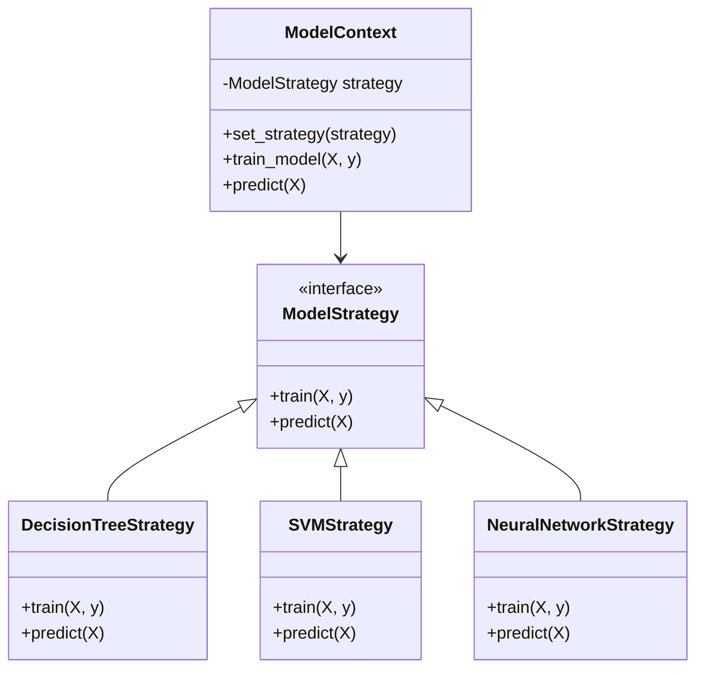

## 9.5.2 Strategy Pattern in Model Selection

In the realm of machine learning, selecting the right model or algorithm can significantly impact the performance and efficiency of a solution. The Strategy Pattern provides a structured approach to dynamically choose algorithms based on specific context or dataset characteristics. This section delves into the Strategy Pattern, its implementation in Python, and its applicability in machine learning scenarios.

### Understanding the Strategy Pattern

The Strategy Pattern is a behavioral design pattern that enables selecting an algorithm's behavior at runtime. It defines a family of algorithms, encapsulates each one, and makes them interchangeable. This pattern is particularly useful in scenarios where multiple algorithms can be applied to solve a problem, and the choice of algorithm depends on the context or specific criteria.

#### Key Concepts of the Strategy Pattern

1. **Strategy Interface**: Defines a common interface for all supported algorithms. Each algorithm implements this interface, allowing them to be interchangeable.
2. **Concrete Strategies**: These are the actual implementations of the strategy interface. Each concrete strategy encapsulates a specific algorithm.
3. **Context**: Maintains a reference to a strategy object and delegates the algorithmic behavior to the strategy object.

### Applicability in Machine Learning

In machine learning, the Strategy Pattern is particularly beneficial for model selection. It allows for dynamically choosing different models based on dataset characteristics, computational resources, or specific performance metrics. This flexibility is crucial for automated model selection processes and ensemble methods, where multiple models are tested and combined.

### Implementing the Strategy Pattern in Python

Let's explore how to implement the Strategy Pattern in Python for model selection. We'll create a strategy interface for different machine learning models and demonstrate how to switch between models like decision trees, support vector machines (SVMs), and neural networks based on specific criteria.

#### Step-by-Step Implementation

1. **Define the Strategy Interface**

   We'll start by defining a common interface for our machine learning models. This interface will have a method `train` for training the model and a method `predict` for making predictions.

   ```python
   from abc import ABC, abstractmethod

   class ModelStrategy(ABC):
       @abstractmethod
       def train(self, X, y):
           pass

       @abstractmethod
       def predict(self, X):
           pass
   ```

2. **Implement Concrete Strategies**

   Next, we'll implement concrete strategies for different machine learning models. Let's consider three models: Decision Tree, SVM, and Neural Network.

   ```python
   from sklearn.tree import DecisionTreeClassifier
   from sklearn.svm import SVC
   from sklearn.neural_network import MLPClassifier

   class DecisionTreeStrategy(ModelStrategy):
       def __init__(self):
           self.model = DecisionTreeClassifier()

       def train(self, X, y):
           self.model.fit(X, y)

       def predict(self, X):
           return self.model.predict(X)

   class SVMStrategy(ModelStrategy):
       def __init__(self):
           self.model = SVC()

       def train(self, X, y):
           self.model.fit(X, y)

       def predict(self, X):
           return self.model.predict(X)

   class NeuralNetworkStrategy(ModelStrategy):
       def __init__(self):
           self.model = MLPClassifier()

       def train(self, X, y):
           self.model.fit(X, y)

       def predict(self, X):
           return self.model.predict(X)
   ```

3. **Create the Context**

   The context will use a strategy object to perform the model training and prediction. It allows the strategy to be changed at runtime.

   ```python
   class ModelContext:
       def __init__(self, strategy: ModelStrategy):
           self._strategy = strategy

       def set_strategy(self, strategy: ModelStrategy):
           self._strategy = strategy

       def train_model(self, X, y):
           self._strategy.train(X, y)

       def predict(self, X):
           return self._strategy.predict(X)
   ```

4. **Using the Strategy Pattern**

   Now, let's see how to use the Strategy Pattern to dynamically select and switch between different models.

   ```python
   # Sample data
   X_train, X_test, y_train, y_test = load_data()

   # Initialize context with a specific strategy
   context = ModelContext(DecisionTreeStrategy())
   context.train_model(X_train, y_train)
   predictions = context.predict(X_test)
   print(f"Decision Tree Predictions: {predictions}")

   # Switch strategy to SVM
   context.set_strategy(SVMStrategy())
   context.train_model(X_train, y_train)
   predictions = context.predict(X_test)
   print(f"SVM Predictions: {predictions}")

   # Switch strategy to Neural Network
   context.set_strategy(NeuralNetworkStrategy())
   context.train_model(X_train, y_train)
   predictions = context.predict(X_test)
   print(f"Neural Network Predictions: {predictions}")
   ```

### Use Cases in Machine Learning

The Strategy Pattern is highly applicable in various machine learning scenarios, particularly in automated model selection and ensemble methods.

#### Automated Model Selection

In automated machine learning (AutoML) systems, selecting the best model for a given dataset is crucial. The Strategy Pattern allows for testing multiple models and selecting the one that performs best based on specific criteria, such as accuracy, precision, or computational efficiency.

#### Ensemble Methods

Ensemble methods, such as bagging and boosting, benefit from the Strategy Pattern by allowing different models to be combined. Each model can be treated as a strategy, and the ensemble method can dynamically select or combine strategies to improve overall performance.

#### Testing Multiple Models Efficiently

When experimenting with different models, the Strategy Pattern provides a clean and efficient way to switch between models without modifying the core logic of the application. This flexibility is essential for rapid prototyping and testing in machine learning projects.

### Visualizing the Strategy Pattern

To better understand the Strategy Pattern in the context of model selection, let's visualize the relationships between the components using a class diagram.



### Try It Yourself

Experiment with the Strategy Pattern by modifying the code examples. Here are a few suggestions:

- **Add More Models**: Implement additional strategies for other models like Random Forest or K-Nearest Neighbors.
- **Optimize Model Parameters**: Modify the strategies to include hyperparameter tuning for each model.
- **Evaluate Performance**: Integrate performance evaluation metrics to compare different strategies.

### Knowledge Check

- **Question**: What is the primary benefit of using the Strategy Pattern in model selection?
- **Question**: How does the Strategy Pattern facilitate testing multiple models efficiently?

### Conclusion

The Strategy Pattern offers a robust framework for dynamic model selection in machine learning. By encapsulating algorithms and allowing them to be interchangeable, it provides the flexibility needed for automated model selection and ensemble methods. As you continue to explore machine learning, consider how the Strategy Pattern can enhance your projects by enabling dynamic and efficient model selection.

### Further Reading

For more information on the Strategy Pattern and its applications in machine learning, consider exploring the following resources:

- [Design Patterns: Elements of Reusable Object-Oriented Software](https://www.amazon.com/Design-Patterns-Elements-Reusable-Object-Oriented/dp/0201633612)
- [Hands-On Machine Learning with Scikit-Learn, Keras, and TensorFlow](https://www.oreilly.com/library/view/hands-on-machine-learning/9781492032632/)

## Quiz Time!



### What is the main purpose of the Strategy Pattern?

- [x] To define a family of algorithms and make them interchangeable.
- [ ] To encapsulate data and behavior in a single class.
- [ ] To create a single instance of a class.
- [ ] To allow objects to communicate with each other.

> **Explanation:** The Strategy Pattern's main purpose is to define a family of algorithms, encapsulate each one, and make them interchangeable.

### How does the Strategy Pattern benefit machine learning model selection?

- [x] It allows for dynamic selection of models based on context.
- [ ] It ensures that only one model is used at a time.
- [ ] It simplifies the data preprocessing steps.
- [ ] It guarantees the best model is always selected.

> **Explanation:** The Strategy Pattern allows for dynamic selection of models based on context or specific criteria, which is beneficial in machine learning model selection.

### Which component in the Strategy Pattern defines the common interface for algorithms?

- [x] Strategy Interface
- [ ] Concrete Strategy
- [ ] Context
- [ ] Algorithm Selector

> **Explanation:** The Strategy Interface defines the common interface for all supported algorithms in the Strategy Pattern.

### What role does the Context play in the Strategy Pattern?

- [x] It maintains a reference to a strategy object and delegates algorithmic behavior.
- [ ] It implements the specific algorithms.
- [ ] It defines the common interface for algorithms.
- [ ] It selects the best algorithm based on performance.

> **Explanation:** The Context maintains a reference to a strategy object and delegates the algorithmic behavior to the strategy object.

### In the provided Python example, which method is used to switch between different strategies?

- [x] set_strategy
- [ ] change_strategy
- [ ] switch_strategy
- [ ] update_strategy

> **Explanation:** The `set_strategy` method is used to switch between different strategies in the provided Python example.

### What is a potential use case for the Strategy Pattern in machine learning?

- [x] Automated model selection
- [ ] Data cleaning
- [ ] Feature extraction
- [ ] Hyperparameter tuning

> **Explanation:** Automated model selection is a potential use case for the Strategy Pattern in machine learning, allowing for dynamic selection of models.

### Which of the following is NOT a benefit of using the Strategy Pattern?

- [ ] It allows for dynamic algorithm selection.
- [ ] It promotes code reusability.
- [x] It guarantees the best performance.
- [ ] It simplifies testing multiple algorithms.

> **Explanation:** The Strategy Pattern does not guarantee the best performance; it allows for dynamic selection and testing of algorithms.

### How can the Strategy Pattern aid in ensemble methods?

- [x] By allowing different models to be combined dynamically.
- [ ] By ensuring only one model is used at a time.
- [ ] By simplifying the data preprocessing steps.
- [ ] By guaranteeing the best model is always selected.

> **Explanation:** The Strategy Pattern aids in ensemble methods by allowing different models to be combined dynamically.

### What is the primary method used to train a model in the Strategy Pattern example?

- [x] train
- [ ] fit
- [ ] learn
- [ ] execute

> **Explanation:** The primary method used to train a model in the Strategy Pattern example is `train`.

### True or False: The Strategy Pattern can only be used with machine learning models.

- [ ] True
- [x] False

> **Explanation:** False. The Strategy Pattern is a general design pattern that can be used in various contexts, not just with machine learning models.


