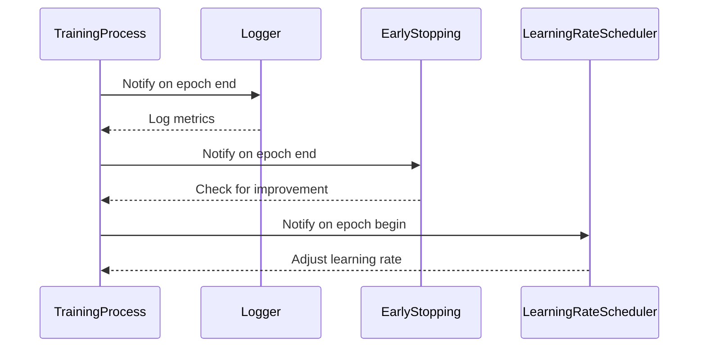

## 9.5.3 Observer Pattern for Model Training Progress

In the realm of machine learning, monitoring and responding to model training events is crucial for optimizing performance and ensuring efficient use of resources. The Observer Pattern, a fundamental design pattern, provides a structured way to achieve this by allowing objects to subscribe to and receive updates about changes in the state of another object. In this section, we will delve into how the Observer Pattern can be applied to model training processes, enabling functionalities such as logging progress, early stopping, and dynamic hyperparameter adjustment.

### Understanding the Observer Pattern in Machine Learning Context

The Observer Pattern is a behavioral design pattern that defines a one-to-many dependency between objects. When the state of one object (the subject) changes, all its dependents (observers) are notified and updated automatically. In the context of machine learning, the subject is typically the training process, and the observers are various components that need to react to changes during training.

#### Key Concepts

- **Subject**: The training process or model that generates events.
- **Observers**: Components that subscribe to the subject and react to events, such as logging, adjusting hyperparameters, or implementing early stopping.
- **Events**: Changes in the state of the subject, such as the completion of an epoch or a change in validation accuracy.

By implementing the Observer Pattern, we can decouple the training logic from the components that respond to training events, leading to a more modular and maintainable codebase.

### Implementation in Python

Python's rich ecosystem of machine learning frameworks, such as TensorFlow, Keras, and PyTorch, provides built-in support for the Observer Pattern through callback functions or hooks. Let's explore how to implement custom observers for various purposes.

#### Using Callbacks in Keras

Keras, a high-level neural networks API, offers a straightforward way to implement the Observer Pattern using callbacks. Callbacks are objects that can perform actions at various stages of training (e.g., at the start or end of an epoch).

**Example: Custom Callback for Logging**

```python
from keras.callbacks import Callback

class TrainingLogger(Callback):
    def on_epoch_end(self, epoch, logs=None):
        logs = logs or {}
        print(f"Epoch {epoch + 1}: Loss = {logs.get('loss')}, Accuracy = {logs.get('accuracy')}")

model.fit(X_train, y_train, epochs=10, callbacks=[TrainingLogger()])
```

In this example, `TrainingLogger` is a custom callback that logs the loss and accuracy at the end of each epoch. By using callbacks, we can easily extend the functionality of the training process without modifying the core training loop.

#### Early Stopping with Callbacks

Early stopping is a technique used to prevent overfitting by halting training when a monitored metric stops improving. Keras provides a built-in `EarlyStopping` callback, but we can also implement our own.

**Example: Custom Early Stopping Callback**

```python
class CustomEarlyStopping(Callback):
    def __init__(self, patience=0):
        super(CustomEarlyStopping, self).__init__()
        self.patience = patience
        self.best_weights = None
        self.wait = 0
        self.best = float('inf')

    def on_epoch_end(self, epoch, logs=None):
        current_loss = logs.get('val_loss')
        if current_loss < self.best:
            self.best = current_loss
            self.best_weights = self.model.get_weights()
            self.wait = 0
        else:
            self.wait += 1
            if self.wait >= self.patience:
                self.model.stop_training = True
                self.model.set_weights(self.best_weights)

model.fit(X_train, y_train, validation_data=(X_val, y_val), epochs=100, callbacks=[CustomEarlyStopping(patience=5)])
```

This custom callback stops training if the validation loss does not improve for a specified number of epochs (`patience`).

#### Dynamic Learning Rate Adjustment

Adjusting the learning rate dynamically during training can lead to faster convergence and better performance. We can implement a callback to modify the learning rate based on training progress.

**Example: Learning Rate Scheduler Callback**

```python
class LearningRateScheduler(Callback):
    def __init__(self, schedule):
        super(LearningRateScheduler, self).__init__()
        self.schedule = schedule

    def on_epoch_begin(self, epoch, logs=None):
        lr = self.schedule(epoch)
        print(f"Epoch {epoch + 1}: Learning rate is {lr}")
        self.model.optimizer.lr = lr

def schedule(epoch):
    return 0.001 * (0.1 ** (epoch // 10))

model.fit(X_train, y_train, epochs=30, callbacks=[LearningRateScheduler(schedule)])
```

In this example, the learning rate is reduced by a factor of 10 every 10 epochs. This approach can be tailored to suit different training scenarios.

#### Hooks in PyTorch

PyTorch, a popular deep learning framework, provides hooks that allow us to monitor and modify the training process. Hooks can be attached to various parts of a model, such as layers or the optimizer.

**Example: Hook for Monitoring Gradients**

```python
import torch

def print_gradients(module, grad_input, grad_output):
    print(f"Gradient for {module}: {grad_output}")

model = torch.nn.Linear(10, 1)

hook = model.register_backward_hook(print_gradients)

input = torch.randn(1, 10)
output = model(input)
output.backward()

hook.remove()
```

In this example, a backward hook is registered to print the gradients of the model during backpropagation. Hooks provide a powerful way to inspect and modify the training process in PyTorch.

### Benefits of Using the Observer Pattern

Implementing the Observer Pattern in model training offers several advantages:

- **Modularity**: Observers can be added or removed without altering the core training logic, making the system more modular and easier to maintain.
- **Flexibility**: Different observers can be used for different tasks, such as logging, monitoring, and adjusting hyperparameters, allowing for flexible experimentation.
- **Separation of Concerns**: By decoupling the training process from the components that respond to training events, we achieve a clear separation of concerns, leading to cleaner and more organized code.

### Visualizing the Observer Pattern

To better understand how the Observer Pattern operates in the context of model training, let's visualize the interactions between the subject (training process) and observers (callbacks or hooks).



In this sequence diagram, the `TrainingProcess` notifies its observers (`Logger`, `EarlyStopping`, `LearningRateScheduler`) at different stages of training. Each observer performs its designated task in response to these notifications.

### Try It Yourself

To deepen your understanding of the Observer Pattern in model training, try modifying the code examples provided:

- **Experiment with Different Callbacks**: Create additional custom callbacks to perform tasks such as saving model checkpoints or visualizing training metrics.
- **Implement Hooks in PyTorch**: Use hooks to monitor other aspects of the training process, such as activation values or weight updates.
- **Combine Multiple Observers**: Use multiple observers in a single training process to see how they interact and complement each other.

### Knowledge Check

Before we conclude, let's review some key points:

- **What is the Observer Pattern?**: A design pattern that establishes a one-to-many dependency between objects, allowing observers to receive updates from a subject.
- **How is it used in model training?**: Observers monitor training events and perform actions such as logging, early stopping, or adjusting hyperparameters.
- **What are the benefits?**: The Observer Pattern enhances modularity, flexibility, and separation of concerns in the training process.

### Embrace the Journey

Remember, mastering design patterns like the Observer Pattern is a journey. As you continue to explore and apply these patterns, you'll gain deeper insights into building efficient and scalable machine learning systems. Keep experimenting, stay curious, and enjoy the journey!

## Quiz Time!



### What is the primary role of the Observer Pattern in model training?

- [x] To monitor training events and respond accordingly
- [ ] To optimize the training algorithm
- [ ] To increase model accuracy
- [ ] To reduce training time

> **Explanation:** The Observer Pattern is used to monitor and respond to training events, such as logging progress or adjusting hyperparameters.

### Which Python library provides built-in support for callbacks in model training?

- [x] Keras
- [ ] NumPy
- [ ] SciPy
- [ ] Matplotlib

> **Explanation:** Keras provides built-in support for callbacks, allowing users to perform actions at various stages of training.

### What is a key benefit of using the Observer Pattern?

- [x] Modularity
- [ ] Increased complexity
- [ ] Reduced flexibility
- [ ] Hard-coded logic

> **Explanation:** The Observer Pattern enhances modularity by decoupling the training process from the components that respond to events.

### In the context of Keras, what is a callback?

- [x] An object that performs actions at specific stages of training
- [ ] A function that optimizes the model
- [ ] A method for data preprocessing
- [ ] A type of neural network layer

> **Explanation:** In Keras, a callback is an object that can perform actions at specific stages of the training process, such as at the end of an epoch.

### How can early stopping be implemented in Keras?

- [x] Using a custom callback
- [x] Using the built-in EarlyStopping callback
- [ ] Modifying the optimizer
- [ ] Changing the loss function

> **Explanation:** Early stopping can be implemented using either a custom callback or the built-in EarlyStopping callback in Keras.

### What is a hook in PyTorch?

- [x] A mechanism to monitor or modify the training process
- [ ] A type of neural network layer
- [ ] A data augmentation technique
- [ ] A loss function

> **Explanation:** In PyTorch, a hook is a mechanism that allows users to monitor or modify the training process by attaching functions to model components.

### Which of the following is NOT a benefit of the Observer Pattern?

- [ ] Modularity
- [ ] Flexibility
- [ ] Separation of concerns
- [x] Increased coupling

> **Explanation:** The Observer Pattern reduces coupling by decoupling the training process from the components that respond to events.

### What is the purpose of a learning rate scheduler?

- [x] To adjust the learning rate during training
- [ ] To increase the model's complexity
- [ ] To preprocess the input data
- [ ] To change the model architecture

> **Explanation:** A learning rate scheduler adjusts the learning rate during training to improve convergence and performance.

### How can you visualize the interactions in the Observer Pattern?

- [x] Using a sequence diagram
- [ ] Using a pie chart
- [ ] Using a bar graph
- [ ] Using a scatter plot

> **Explanation:** A sequence diagram is an effective way to visualize the interactions between the subject and observers in the Observer Pattern.

### True or False: The Observer Pattern is only applicable to machine learning.

- [ ] True
- [x] False

> **Explanation:** The Observer Pattern is a general design pattern applicable to various domains, not just machine learning.


