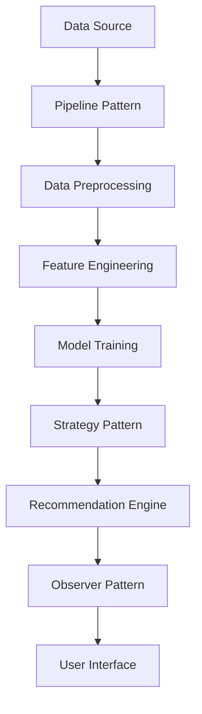

## 9.5.4 Use Cases and Examples

In the rapidly evolving field of machine learning (ML), design patterns play a crucial role in creating scalable, maintainable, and efficient systems. This section explores real-world applications of design patterns in ML, offering insights into how these patterns can be leveraged to solve complex problems across various industries. We will delve into case studies, discuss lessons learned, and highlight best practices for integrating multiple patterns to enhance the robustness of ML solutions.

### Real-World Applications

Design patterns have been instrumental in transforming ML projects across different sectors. Let's explore some notable case studies:

#### Case Study 1: Financial Fraud Detection

In the finance industry, detecting fraudulent transactions is a critical task. A leading bank implemented a machine learning system to identify potential fraud in real-time. By employing the **Pipeline Pattern**, the bank was able to streamline data preprocessing, feature extraction, and model training into a cohesive workflow.

**Implementation Details:**

- **Pipeline Pattern**: The bank used a pipeline to automate the sequence of data transformations and model training. This approach ensured consistency and reproducibility across different datasets and models.
  
- **Strategy Pattern**: Different algorithms were encapsulated as strategies, allowing the system to switch between models based on the transaction type and historical data patterns.

- **Observer Pattern**: Real-time monitoring was implemented using the observer pattern, enabling the system to alert analysts when suspicious activity was detected.

**Outcome**: The implementation reduced false positives by 30% and improved the speed of fraud detection, saving the bank millions in potential losses.

#### Case Study 2: Healthcare Predictive Analytics

A healthcare provider aimed to predict patient readmissions to improve care and reduce costs. The project involved integrating multiple data sources, including electronic health records and patient surveys.

**Implementation Details:**

- **Model-View-Controller (MVC) Pattern**: The system was structured using MVC to separate data handling, business logic, and user interface, facilitating easier maintenance and updates.

- **Decorator Pattern**: Feature engineering was enhanced using decorators to add new attributes to patient data dynamically, improving model accuracy.

- **Command Pattern**: The system used command pattern to encapsulate various data processing tasks, making it easier to manage and execute complex workflows.

**Outcome**: The predictive model achieved a 15% increase in accuracy, enabling the healthcare provider to proactively manage patient care and reduce readmissions.

#### Case Study 3: E-commerce Recommendation Engine

An e-commerce platform sought to enhance its recommendation engine to increase customer engagement and sales. By leveraging design patterns, the platform developed a robust and flexible system.

**Implementation Details:**

- **Observer Pattern**: Customer interactions were tracked using the observer pattern, allowing the system to update recommendations in real-time based on user behavior.

- **Strategy Pattern**: Different recommendation algorithms were implemented as strategies, enabling the platform to tailor suggestions based on user preferences and browsing history.

- **Chain of Responsibility Pattern**: The system used a chain of responsibility to handle different types of recommendation requests, ensuring that the most relevant suggestions were presented to users.

**Outcome**: The enhanced recommendation engine led to a 20% increase in sales and a 25% improvement in customer retention.

### Lessons Learned

Implementing design patterns in machine learning projects presents unique challenges. Here are some insights gained from the case studies:

1. **Scalability and Flexibility**: Design patterns like the pipeline and strategy patterns provide scalability and flexibility, allowing systems to adapt to changing requirements and data volumes.

2. **Maintainability**: Patterns such as MVC and decorator enhance code maintainability by promoting separation of concerns and modularity, making it easier to update and extend systems.

3. **Real-Time Processing**: Patterns like the observer and chain of responsibility are crucial for real-time data processing, enabling systems to respond quickly to new information.

4. **Integration Challenges**: Combining multiple patterns requires careful planning to avoid complexity and ensure seamless integration. It's essential to document the architecture and interactions between components.

5. **Performance Optimization**: While design patterns improve structure and maintainability, they can introduce overhead. It's important to balance design elegance with performance considerations.

### Integrating Multiple Patterns

Combining design patterns can lead to more robust and efficient ML solutions. Here are some strategies for effective integration:

- **Layered Architecture**: Use a layered approach to organize patterns, with each layer responsible for specific tasks (e.g., data preprocessing, model training, and deployment).

- **Pattern Synergy**: Identify patterns that complement each other. For example, the pipeline pattern can be combined with the strategy pattern to streamline model selection and training.

- **Modular Design**: Ensure that each pattern is implemented as a modular component, allowing for easy replacement or extension without affecting the entire system.

- **Documentation and Communication**: Clearly document the architecture and interactions between patterns. Regular communication among team members is crucial to ensure alignment and understanding.

### General Best Practices

To maximize the benefits of design patterns in ML projects, consider the following best practices:

1. **Clean, Maintainable Code**: Prioritize code readability and maintainability. Use design patterns to structure code logically and consistently.

2. **Documentation**: Maintain comprehensive documentation of the system architecture, design patterns used, and their interactions. This aids in onboarding new team members and facilitates future updates.

3. **Version Control**: Use version control systems (e.g., Git) to track changes and manage different versions of the codebase. This is essential for collaboration and reproducibility.

4. **Reproducibility**: Ensure that experiments and results are reproducible. Use design patterns to create consistent workflows and document the steps involved in data processing and model training.

5. **Adherence to Design Principles**: Follow established design principles (e.g., SOLID principles) to guide the implementation of design patterns and ensure a robust architecture.

6. **Continuous Learning**: Stay updated with the latest developments in design patterns and ML techniques. Encourage a culture of continuous learning and experimentation within the team.

By applying these best practices, ML teams can create systems that are not only effective but also sustainable and adaptable to future challenges.

### Try It Yourself

To deepen your understanding of design patterns in machine learning, try implementing a simple recommendation engine using the patterns discussed. Experiment with different strategies and observe how they affect the system's performance and flexibility.

### Visualizing Design Patterns in ML

To better understand how these patterns interact within a machine learning system, let's visualize a typical architecture using a combination of patterns.

**Diagram Description**: This diagram illustrates a machine learning system architecture using the pipeline, strategy, and observer patterns. Data flows from the source through preprocessing and feature engineering stages, followed by model training. The strategy pattern is used to select the appropriate model, and the observer pattern updates the user interface based on user interactions.

### Knowledge Check

Before moving on, consider these questions to reinforce your understanding:

- How can the pipeline pattern improve reproducibility in ML workflows?
- What are the advantages of using the strategy pattern for model selection?
- How does the observer pattern facilitate real-time updates in ML systems?

### Embrace the Journey

Remember, mastering design patterns in machine learning is a journey. As you continue to explore and apply these patterns, you'll discover new ways to enhance your systems and tackle complex challenges. Stay curious, keep experimenting, and enjoy the process of learning and growth!

## Quiz Time!



### How does the Pipeline Pattern benefit machine learning workflows?

- [x] It streamlines data transformations and model training.
- [ ] It increases the complexity of the system.
- [ ] It reduces the need for data preprocessing.
- [ ] It eliminates the need for model validation.

> **Explanation:** The Pipeline Pattern helps streamline the sequence of data transformations and model training, ensuring consistency and reproducibility.

### Which pattern is used to encapsulate different algorithms for model selection?

- [ ] Observer Pattern
- [x] Strategy Pattern
- [ ] Command Pattern
- [ ] Chain of Responsibility Pattern

> **Explanation:** The Strategy Pattern is used to encapsulate different algorithms, allowing for dynamic selection based on the context.

### What is a key advantage of using the Observer Pattern in ML systems?

- [ ] It simplifies data preprocessing.
- [x] It facilitates real-time updates based on user interactions.
- [ ] It reduces the number of models needed.
- [ ] It eliminates the need for feature engineering.

> **Explanation:** The Observer Pattern allows systems to update in real-time based on changes, such as user interactions, enhancing responsiveness.

### In the healthcare case study, which pattern was used to enhance feature engineering?

- [ ] MVC Pattern
- [ ] Strategy Pattern
- [x] Decorator Pattern
- [ ] Command Pattern

> **Explanation:** The Decorator Pattern was used to dynamically add new attributes to patient data, improving model accuracy.

### What challenge is addressed by combining multiple design patterns in ML systems?

- [x] Complexity and integration
- [ ] Reducing the number of data sources
- [ ] Eliminating the need for real-time processing
- [ ] Simplifying user interfaces

> **Explanation:** Combining multiple patterns requires careful planning to manage complexity and ensure seamless integration.

### Which best practice emphasizes the importance of code readability and maintainability?

- [x] Clean, Maintainable Code
- [ ] Version Control
- [ ] Reproducibility
- [ ] Continuous Learning

> **Explanation:** Prioritizing clean, maintainable code ensures that systems are easy to update and extend.

### How does version control contribute to ML projects?

- [x] It tracks changes and manages different code versions.
- [ ] It eliminates the need for documentation.
- [ ] It reduces the number of experiments needed.
- [ ] It simplifies data preprocessing.

> **Explanation:** Version control systems like Git help track changes and manage different versions, facilitating collaboration and reproducibility.

### What is a benefit of using the Chain of Responsibility Pattern in recommendation systems?

- [ ] It simplifies data preprocessing.
- [ ] It reduces the number of algorithms needed.
- [x] It ensures relevant suggestions are presented to users.
- [ ] It eliminates the need for real-time updates.

> **Explanation:** The Chain of Responsibility Pattern helps handle different types of recommendation requests, ensuring relevant suggestions are made.

### Which pattern is crucial for structuring code with separation of concerns?

- [x] MVC Pattern
- [ ] Observer Pattern
- [ ] Strategy Pattern
- [ ] Command Pattern

> **Explanation:** The MVC Pattern separates data handling, business logic, and user interface, facilitating easier maintenance and updates.

### True or False: The Strategy Pattern can be used to dynamically select different models based on transaction types.

- [x] True
- [ ] False

> **Explanation:** The Strategy Pattern allows for dynamic selection of algorithms, making it suitable for choosing models based on transaction types.


