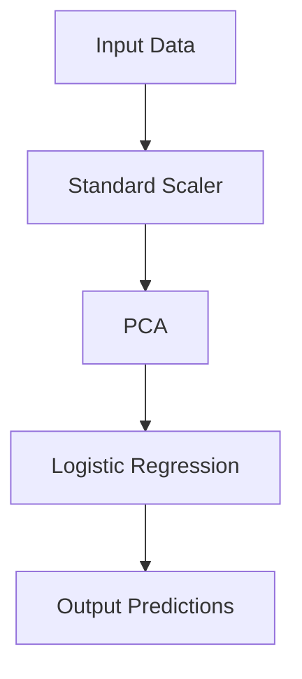
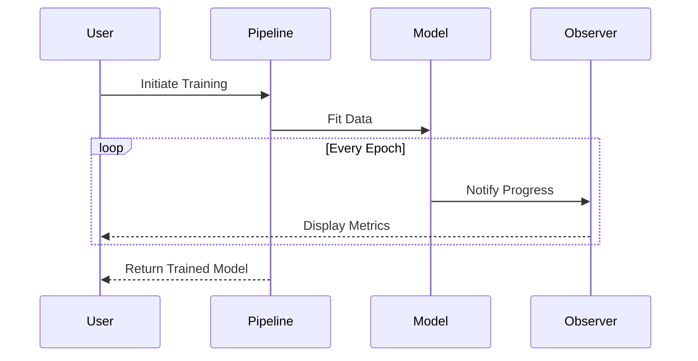

## 9.5 Design Patterns in Machine Learning

In the rapidly evolving field of machine learning (ML), the application of design patterns can significantly enhance the modularity, reusability, and maintainability of code. By leveraging these patterns, developers can create robust and scalable ML applications that are easier to understand and extend. In this section, we will explore several design patterns that are particularly useful in the context of machine learning, providing clear explanations, code examples, and visual aids to facilitate understanding.

### Introduction to Machine Learning Design Patterns

Machine learning design patterns are specialized solutions to common problems encountered in ML projects. These patterns help in structuring code, managing data flow, and ensuring that the ML models are both efficient and adaptable to changes. Let's delve into some of the most impactful design patterns in machine learning.

### 9.5.1 Pipeline Pattern for Data Processing

The Pipeline pattern is a fundamental design pattern in machine learning, used to streamline data processing and model training workflows. It allows for the sequential execution of data transformations and model training steps, ensuring a clear and organized flow of operations.

#### Implementing the Pipeline Pattern in Python

In Python, the `scikit-learn` library provides a convenient `Pipeline` class that can be used to chain together multiple processing steps. Here's a simple example:

```python
from sklearn.pipeline import Pipeline
from sklearn.preprocessing import StandardScaler
from sklearn.decomposition import PCA
from sklearn.linear_model import LogisticRegression

pipeline = Pipeline([
    ('scaler', StandardScaler()),
    ('pca', PCA(n_components=2)),
    ('classifier', LogisticRegression())
])

pipeline.fit(X_train, y_train)

predictions = pipeline.predict(X_test)
```

In this example, the pipeline consists of three steps: scaling the data, applying PCA for dimensionality reduction, and training a logistic regression model. This pattern ensures that each step is executed in sequence, maintaining a clean and modular code structure.

#### Visualizing the Pipeline Pattern



*Figure 1: A simple pipeline for data processing and model training.*

### 9.5.2 Strategy Pattern in Model Selection

The Strategy pattern is useful for dynamically selecting algorithms based on specific criteria or conditions. In machine learning, this pattern can be applied to choose different models or preprocessing techniques depending on the dataset characteristics or performance metrics.

#### Implementing the Strategy Pattern in Python

Consider a scenario where we want to select between different classifiers based on the dataset size:

```python
class ModelStrategy:
    def select_model(self, dataset_size):
        if dataset_size < 1000:
            return LogisticRegression()
        else:
            return RandomForestClassifier()

strategy = ModelStrategy()
model = strategy.select_model(len(X_train))
model.fit(X_train, y_train)
```

In this example, the `ModelStrategy` class encapsulates the logic for selecting a model based on the dataset size, allowing for flexibility and easy modification of the selection criteria.

### 9.5.3 Observer Pattern for Model Training Progress

The Observer pattern is ideal for monitoring and reacting to changes in the state of an object. In machine learning, it can be used to track the progress of model training and trigger actions based on specific events, such as logging metrics or early stopping.

#### Implementing the Observer Pattern in Python

Here's an example of using the Observer pattern to monitor training progress:

```python
class TrainingObserver:
    def update(self, epoch, loss):
        print(f"Epoch {epoch}: Loss = {loss}")

class ModelTrainer:
    def __init__(self):
        self.observers = []

    def add_observer(self, observer):
        self.observers.append(observer)

    def notify_observers(self, epoch, loss):
        for observer in self.observers:
            observer.update(epoch, loss)

    def train(self, epochs):
        for epoch in range(epochs):
            # Simulate training
            loss = self._simulate_training(epoch)
            self.notify_observers(epoch, loss)

    def _simulate_training(self, epoch):
        return 1.0 / (epoch + 1)

trainer = ModelTrainer()
observer = TrainingObserver()
trainer.add_observer(observer)
trainer.train(5)
```

In this example, the `ModelTrainer` class manages a list of observers and notifies them of the training progress, allowing for flexible monitoring and response to training events.

### 9.5.4 Use Cases and Examples

#### Real-World Scenarios in ML Systems

1. **Data Preprocessing Pipelines**: Use the Pipeline pattern to automate data cleaning, feature extraction, and transformation processes, ensuring consistency and repeatability across experiments.

2. **Algorithm Selection**: Apply the Strategy pattern to dynamically choose algorithms based on dataset characteristics, such as size, feature types, or target variable distribution.

3. **Training Monitoring**: Implement the Observer pattern to track training metrics, log progress, and trigger early stopping or model checkpointing based on performance thresholds.

### Try It Yourself

Experiment with the provided code examples by modifying the parameters, adding new steps to the pipeline, or implementing additional strategies for model selection. Consider integrating these patterns into your own machine learning projects to enhance code organization and flexibility.

### Visualizing Design Patterns in Machine Learning

To further illustrate the application of design patterns in machine learning, let's visualize the interaction between different components using a sequence diagram.



*Figure 2: Sequence diagram illustrating the interaction between components in a machine learning workflow.*

### Knowledge Check

1. **What is the primary benefit of using the Pipeline pattern in machine learning?**
   - [x] Streamlining data processing and model training workflows.
   - [ ] Increasing the complexity of code.
   - [ ] Reducing the need for data validation.
   - [ ] Eliminating the need for model evaluation.

2. **How does the Strategy pattern enhance model selection in machine learning?**
   - [x] By allowing dynamic selection of algorithms based on specific criteria.
   - [ ] By hardcoding the choice of algorithms.
   - [ ] By reducing the number of available algorithms.
   - [ ] By simplifying the data preprocessing steps.

3. **In the Observer pattern, what role does the observer play in a machine learning context?**
   - [x] Monitoring and reacting to changes in model training progress.
   - [ ] Modifying the training data.
   - [ ] Selecting the best model.
   - [ ] Reducing the training time.

4. **Which design pattern would you use to automate data cleaning and feature extraction processes?**
   - [x] Pipeline Pattern
   - [ ] Observer Pattern
   - [ ] Strategy Pattern
   - [ ] Singleton Pattern

5. **What is a key advantage of using design patterns in machine learning projects?**
   - [x] Enhancing code modularity and reusability.
   - [ ] Increasing the complexity of the codebase.
   - [ ] Reducing the need for documentation.
   - [ ] Eliminating the need for testing.

### Conclusion

Design patterns provide a structured approach to solving common problems in machine learning projects. By applying patterns such as Pipeline, Strategy, and Observer, developers can create more modular, reusable, and maintainable code. As you continue to explore machine learning, consider how these patterns can be integrated into your workflows to enhance the efficiency and scalability of your applications. Remember, this is just the beginning. Keep experimenting, stay curious, and enjoy the journey!

## Quiz Time!



### What is the primary benefit of using the Pipeline pattern in machine learning?

- [x] Streamlining data processing and model training workflows.
- [ ] Increasing the complexity of code.
- [ ] Reducing the need for data validation.
- [ ] Eliminating the need for model evaluation.

> **Explanation:** The Pipeline pattern helps in organizing and automating data processing and model training steps, making workflows more efficient and manageable.


### How does the Strategy pattern enhance model selection in machine learning?

- [x] By allowing dynamic selection of algorithms based on specific criteria.
- [ ] By hardcoding the choice of algorithms.
- [ ] By reducing the number of available algorithms.
- [ ] By simplifying the data preprocessing steps.

> **Explanation:** The Strategy pattern enables flexibility by allowing the selection of different algorithms based on runtime conditions or dataset characteristics.


### In the Observer pattern, what role does the observer play in a machine learning context?

- [x] Monitoring and reacting to changes in model training progress.
- [ ] Modifying the training data.
- [ ] Selecting the best model.
- [ ] Reducing the training time.

> **Explanation:** Observers in machine learning can be used to track training progress and respond to specific events, such as logging metrics or stopping training early.


### Which design pattern would you use to automate data cleaning and feature extraction processes?

- [x] Pipeline Pattern
- [ ] Observer Pattern
- [ ] Strategy Pattern
- [ ] Singleton Pattern

> **Explanation:** The Pipeline pattern is ideal for automating sequential data processing tasks, ensuring consistency and repeatability.


### What is a key advantage of using design patterns in machine learning projects?

- [x] Enhancing code modularity and reusability.
- [ ] Increasing the complexity of the codebase.
- [ ] Reducing the need for documentation.
- [ ] Eliminating the need for testing.

> **Explanation:** Design patterns help in organizing code in a way that promotes modularity and reusability, making it easier to maintain and extend.


### Which pattern is best suited for monitoring training metrics and triggering actions based on performance thresholds?

- [x] Observer Pattern
- [ ] Pipeline Pattern
- [ ] Strategy Pattern
- [ ] Factory Pattern

> **Explanation:** The Observer pattern is used to monitor changes and trigger actions based on specific events or conditions.


### How can the Strategy pattern be applied to preprocessing techniques in machine learning?

- [x] By selecting different preprocessing methods based on dataset characteristics.
- [ ] By hardcoding preprocessing steps.
- [ ] By reducing the number of preprocessing methods.
- [ ] By simplifying model training.

> **Explanation:** The Strategy pattern allows for dynamic selection of preprocessing techniques, adapting to the needs of the dataset.


### What is the role of the Pipeline pattern in model evaluation?

- [x] Ensuring that data transformations are consistently applied during evaluation.
- [ ] Selecting the best model for evaluation.
- [ ] Reducing the evaluation time.
- [ ] Eliminating the need for cross-validation.

> **Explanation:** The Pipeline pattern ensures that the same data transformations are applied during both training and evaluation, maintaining consistency.


### How does the Observer pattern contribute to early stopping in model training?

- [x] By monitoring training metrics and stopping when a condition is met.
- [ ] By selecting the best model.
- [ ] By reducing training data.
- [ ] By simplifying model architecture.

> **Explanation:** Observers can track metrics during training and trigger early stopping when a predefined condition is met, such as no improvement in loss.


### True or False: The Pipeline pattern can be used to chain together multiple models for ensemble learning.

- [x] True
- [ ] False

> **Explanation:** The Pipeline pattern can be extended to include multiple models, allowing for ensemble learning by chaining together different models and processing steps.


