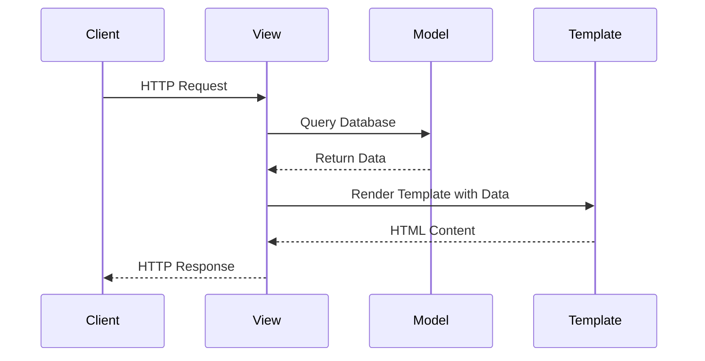
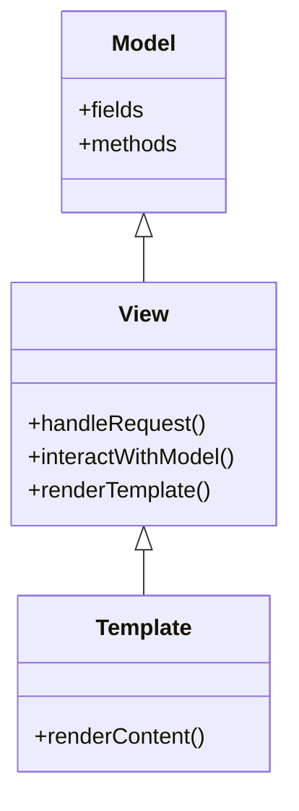

## 9.6.1 Django’s MTV Architecture

Django, a high-level Python web framework, is renowned for its simplicity and efficiency in building web applications. At the heart of Django's design philosophy is the Model-Template-View (MTV) architecture, which provides a clean and organized way to separate concerns within an application. In this section, we'll delve into the MTV pattern, compare it with the traditional MVC pattern, and explore best practices for implementing and organizing Django projects.

### Understanding the MTV Pattern

The MTV pattern is a variant of the Model-View-Controller (MVC) architecture, tailored specifically for web development. It divides an application into three interconnected components: Models, Templates, and Views. Each component has a distinct responsibility, contributing to a clean separation of concerns.

#### Models: The Data Layer

Models in Django represent the data structure of your application. They define the schema of your database and provide an interface for interacting with the data. Models are typically defined as Python classes, with each class corresponding to a table in the database.

- **Defining Models**: Models are defined in the `models.py` file of a Django app. Each model class inherits from `django.db.models.Model` and includes fields representing the columns of the database table.

```python
from django.db import models

class Book(models.Model):
    title = models.CharField(max_length=200)
    author = models.CharField(max_length=100)
    published_date = models.DateField()
    isbn = models.CharField(max_length=13, unique=True)

    def __str__(self):
        return self.title
```

- **Interacting with Models**: Django provides a powerful ORM (Object-Relational Mapping) that allows you to interact with the database using Python code. You can perform CRUD (Create, Read, Update, Delete) operations seamlessly.

```python
new_book = Book(title="Django for Beginners", author="John Doe", published_date="2024-01-01", isbn="1234567890123")
new_book.save()

books = Book.objects.all()
book = Book.objects.get(id=1)
```

#### Templates: The Presentation Layer

Templates in Django are responsible for rendering the HTML content that is sent to the client's browser. They define the structure and layout of the web pages, separating the presentation logic from the business logic.

- **Creating Templates**: Templates are typically stored in the `templates` directory within a Django app. They use Django's templating language, which allows you to embed dynamic content within HTML.

```html
<!-- templates/book_detail.html -->
<!DOCTYPE html>
<html lang="en">
<head>
    <meta charset="UTF-8">
    <title>{{ book.title }}</title>
</head>
<body>
    <h1>{{ book.title }}</h1>
    <p>Author: {{ book.author }}</p>
    <p>Published Date: {{ book.published_date }}</p>
    <p>ISBN: {{ book.isbn }}</p>
</body>
</html>
```

- **Rendering Templates**: Templates are rendered in views, where the context data is passed to them. This allows for dynamic content generation based on the data retrieved from the models.

#### Views: The Business Logic Layer

Views in Django handle the business logic of your application. They process HTTP requests, interact with models to fetch or manipulate data, and return HTTP responses, often rendering templates in the process.

- **Defining Views**: Views are defined as Python functions or classes in the `views.py` file. They receive HTTP requests and return HTTP responses.

```python
from django.shortcuts import render, get_object_or_404
from .models import Book

def book_detail(request, book_id):
    book = get_object_or_404(Book, id=book_id)
    return render(request, 'book_detail.html', {'book': book})
```

- **Handling Requests and Responses**: Views use Django's built-in functions like `render` to generate responses. They can also handle form submissions, redirect users, and more.

### Interaction Between Components

The MTV components interact seamlessly to handle HTTP requests and responses. When a request is made, the view processes it, interacts with the model to retrieve data, and renders the appropriate template to generate the response.



### Comparison with MVC

While MTV and MVC share similar principles, there are key differences in their implementation, particularly in how they handle the presentation layer.

- **Controller vs. View**: In MVC, the controller handles the business logic and user input, while the view is responsible for rendering the output. In MTV, the view takes on the role of the controller, handling both the business logic and rendering the output.

- **Template vs. View**: In MVC, the view is the presentation layer, whereas in MTV, the template serves this purpose. Templates in MTV are purely for presentation, with no business logic.

### Implementation Examples

Let's explore a simple Django project to see how models, views, and templates work together.

#### Setting Up a Django Project

1. **Create a Django Project**: Use the Django management command to create a new project.

```bash
django-admin startproject mysite
```

2. **Create a Django App**: Within the project, create a new app to encapsulate your application's functionality.

```bash
python manage.py startapp library
```

3. **Define Models**: In `library/models.py`, define your data models.

```python
from django.db import models

class Author(models.Model):
    name = models.CharField(max_length=100)

    def __str__(self):
        return self.name

class Book(models.Model):
    title = models.CharField(max_length=200)
    author = models.ForeignKey(Author, on_delete=models.CASCADE)
    published_date = models.DateField()

    def __str__(self):
        return self.title
```

4. **Create and Apply Migrations**: Use Django's migration system to create and apply database migrations.

```bash
python manage.py makemigrations library
python manage.py migrate
```

5. **Define Views**: In `library/views.py`, create views to handle HTTP requests.

```python
from django.shortcuts import render
from .models import Book

def book_list(request):
    books = Book.objects.all()
    return render(request, 'library/book_list.html', {'books': books})
```

6. **Create Templates**: In `library/templates/library`, create HTML templates to render the views.

```html
<!-- templates/library/book_list.html -->
<!DOCTYPE html>
<html lang="en">
<head>
    <meta charset="UTF-8">
    <title>Book List</title>
</head>
<body>
    <h1>Book List</h1>
    <ul>
        
        <li>{{ book.title }} by {{ book.author.name }}</li>
        
    </ul>
</body>
</html>
```

7. **Configure URLs**: In `library/urls.py`, map URLs to views.

```python
from django.urls import path
from . import views

urlpatterns = [
    path('books/', views.book_list, name='book_list'),
]
```

8. **Include App URLs**: In `mysite/urls.py`, include the app's URLs.

```python
from django.contrib import admin
from django.urls import include, path

urlpatterns = [
    path('admin/', admin.site.urls),
    path('library/', include('library.urls')),
]
```

### Best Practices for MTV Architecture

Adhering to best practices in Django's MTV architecture ensures that your projects remain scalable, maintainable, and efficient.

#### Organizing Django Projects

- **Modular Structure**: Break down your application into multiple apps, each responsible for a specific functionality. This modular approach makes it easier to manage and scale your project.

- **Consistent Naming Conventions**: Use consistent and descriptive names for models, views, templates, and URLs. This enhances code readability and maintainability.

- **Separation of Concerns**: Strictly adhere to the separation of concerns principle. Keep business logic in views, data logic in models, and presentation logic in templates.

#### Scalability Considerations

- **Database Optimization**: Use Django's ORM effectively to optimize database queries. Avoid n+1 query problems by using `select_related` and `prefetch_related`.

- **Caching**: Implement caching strategies to reduce database load and improve response times. Django provides built-in caching mechanisms that can be easily configured.

- **Load Balancing**: For large-scale applications, consider using load balancers to distribute traffic across multiple servers.

#### Importance of MTV Separation of Concerns

The MTV architecture's separation of concerns is crucial for maintaining a clean and organized codebase. It allows developers to work on different components independently, facilitates testing, and makes it easier to introduce changes without affecting other parts of the application.

### Try It Yourself

To get hands-on experience with Django's MTV architecture, try modifying the code examples provided. Here are a few suggestions:

- **Add a New Model**: Create a new model for `Publisher` and establish a relationship with the `Book` model.

- **Enhance the Template**: Modify the `book_list.html` template to display additional information, such as the book's published date.

- **Create a New View**: Implement a view to display the details of a specific author, including all books written by them.

### Visualizing Django's MTV Architecture

To further enhance your understanding of Django's MTV architecture, let's visualize the interaction between models, views, and templates using a class diagram.



### References and Links

For further reading and a deeper dive into Django's MTV architecture, consider exploring the following resources:

- [Django Official Documentation](https://docs.djangoproject.com/en/stable/)
- [Django for Beginners](https://djangoforbeginners.com/)
- [Django Design Patterns and Best Practices](https://www.packtpub.com/product/django-design-patterns-and-best-practices-second-edition/9781788831345)

### Knowledge Check

To reinforce your understanding of Django's MTV architecture, consider the following questions:

- How does the MTV pattern differ from the traditional MVC pattern?
- What are the responsibilities of models, views, and templates in Django?
- How can you optimize database queries in a Django application?
- Why is it important to adhere to the separation of concerns in the MTV architecture?

### Embrace the Journey

Remember, mastering Django's MTV architecture is a journey. As you continue to build and refine your web applications, you'll discover new ways to leverage this powerful pattern. Stay curious, keep experimenting, and enjoy the process of creating efficient and scalable web applications with Django!

## Quiz Time!



### What is the primary role of models in Django's MTV architecture?

- [x] Define the data structure and interact with the database
- [ ] Handle HTTP requests and responses
- [ ] Render HTML templates
- [ ] Manage user authentication

> **Explanation:** Models in Django define the data structure and provide an interface to interact with the database.

### In Django's MTV pattern, what component is responsible for rendering HTML content?

- [ ] Model
- [ ] View
- [x] Template
- [ ] Controller

> **Explanation:** Templates in Django are responsible for rendering HTML content, separating presentation logic from business logic.

### How does Django's MTV pattern differ from the traditional MVC pattern?

- [x] The view in MTV handles both business logic and rendering
- [ ] The model in MTV handles HTTP requests
- [ ] The template in MTV manages user input
- [ ] The controller in MTV is responsible for data storage

> **Explanation:** In MTV, the view handles both business logic and rendering, whereas in MVC, the controller handles business logic, and the view handles rendering.

### What is a best practice for organizing Django projects?

- [x] Use a modular structure with multiple apps
- [ ] Store all logic in a single file
- [ ] Combine models, views, and templates in one module
- [ ] Avoid using Django's ORM

> **Explanation:** Using a modular structure with multiple apps helps manage and scale Django projects effectively.

### Which Django component is responsible for handling HTTP requests and responses?

- [ ] Model
- [x] View
- [ ] Template
- [ ] Middleware

> **Explanation:** Views in Django handle HTTP requests and responses, processing data and rendering templates.

### What is the purpose of Django's ORM?

- [x] To interact with the database using Python code
- [ ] To render HTML templates
- [ ] To manage user sessions
- [ ] To handle HTTP requests

> **Explanation:** Django's ORM allows developers to interact with the database using Python code, facilitating CRUD operations.

### What is the advantage of using Django's templating language?

- [x] It allows embedding dynamic content within HTML
- [ ] It handles database migrations
- [ ] It manages user authentication
- [ ] It processes HTTP requests

> **Explanation:** Django's templating language allows developers to embed dynamic content within HTML, separating presentation from business logic.

### How can you optimize database queries in Django?

- [x] Use `select_related` and `prefetch_related`
- [ ] Store all data in memory
- [ ] Avoid using models
- [ ] Use raw SQL queries exclusively

> **Explanation:** Using `select_related` and `prefetch_related` helps optimize database queries by reducing the number of queries executed.

### What is a key benefit of adhering to the MTV separation of concerns?

- [x] It allows developers to work on different components independently
- [ ] It combines all logic into a single module
- [ ] It eliminates the need for templates
- [ ] It requires less code to be written

> **Explanation:** Adhering to the MTV separation of concerns allows developers to work on different components independently, facilitating testing and maintenance.

### True or False: In Django's MTV architecture, the template is responsible for handling business logic.

- [ ] True
- [x] False

> **Explanation:** In Django's MTV architecture, the template is responsible for rendering HTML content, not handling business logic.


