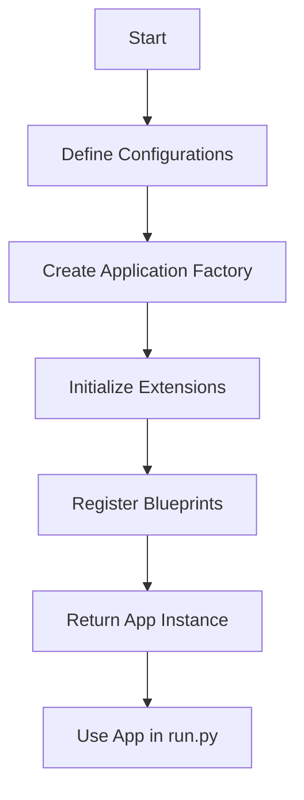

## 9.6.2 Flask’s Application Factories

In the realm of web development, organizing your application for scalability and maintainability is crucial. Flask, a popular micro web framework for Python, offers a design pattern called the "Application Factory" that helps achieve these goals. This pattern is especially beneficial for larger applications or those requiring multiple configurations, such as development, testing, and production environments. In this section, we will delve into the concept of application factories, their implementation, advantages, and best practices for structuring Flask projects.

### Defining Application Factories

An **application factory** is a function that creates and returns a new instance of a Flask application. This approach allows you to configure the application dynamically and is particularly useful for setting up different configurations for various environments. By using an application factory, you can defer the creation of the application object until runtime, which provides flexibility in how the application is configured and initialized.

#### Why Use Application Factories?

1. **Extensibility**: Application factories allow you to easily extend your application by adding or modifying components without altering the core application logic.
2. **Maintainability**: By organizing your application into modular components, you can manage and update parts of your application independently.
3. **Ease of Testing**: Application factories enable the creation of multiple application instances with different configurations, facilitating testing across various environments.

### Implementation

Let's walk through the process of setting up an application factory in a Flask project. We'll cover the basic structure, configuration of extensions, and registration of blueprints.

#### Step 1: Setting Up the Project Structure

A well-organized project structure is essential for maintainability. Here's a typical layout for a Flask application using an application factory:

```
my_flask_app/
│
├── app/
│   ├── __init__.py
│   ├── config.py
│   ├── models.py
│   ├── views.py
│   └── templates/
│       └── ...
│
├── instance/
│   └── config.py
│
└── run.py
```

- **`app/__init__.py`**: This is where the application factory function resides.
- **`app/config.py`**: Contains configuration classes for different environments.
- **`app/models.py`**: Defines database models.
- **`app/views.py`**: Contains view functions or blueprints.
- **`instance/config.py`**: Holds instance-specific configuration, such as secrets.

#### Step 2: Creating the Application Factory

In `app/__init__.py`, define the application factory function:

```python
from flask import Flask
from .config import Config
from .views import main_blueprint
from flask_sqlalchemy import SQLAlchemy

db = SQLAlchemy()

def create_app(config_class=Config):
    """Create and configure the Flask application."""
    app = Flask(__name__, instance_relative_config=True)
    app.config.from_object(config_class)
    app.config.from_pyfile('config.py', silent=True)

    # Initialize extensions
    db.init_app(app)

    # Register blueprints
    app.register_blueprint(main_blueprint)

    return app
```

- **Initialize Extensions**: Extensions like SQLAlchemy are initialized with the app instance using `init_app()`.
- **Register Blueprints**: Blueprints allow you to organize your application into modules. Here, `main_blueprint` is registered with the app.

#### Step 3: Configuring Extensions and Blueprints

In `app/views.py`, define a simple blueprint:

```python
from flask import Blueprint, render_template

main_blueprint = Blueprint('main', __name__)

@main_blueprint.route('/')
def index():
    return render_template('index.html')
```

In `app/config.py`, define configuration classes:

```python
class Config:
    SECRET_KEY = 'your_secret_key'
    SQLALCHEMY_DATABASE_URI = 'sqlite:///site.db'
    SQLALCHEMY_TRACK_MODIFICATIONS = False

class DevelopmentConfig(Config):
    DEBUG = True

class TestingConfig(Config):
    TESTING = True
    SQLALCHEMY_DATABASE_URI = 'sqlite:///test.db'

class ProductionConfig(Config):
    DEBUG = False
```

### Advantages of Using Application Factories

#### Facilitating Testing

Application factories make it easy to create multiple instances of your application with different configurations. This is particularly useful for testing, where you might want to use a different database or enable certain features only during tests.

```python
import unittest
from app import create_app, db
from app.config import TestingConfig

class MyTestCase(unittest.TestCase):
    def setUp(self):
        self.app = create_app(TestingConfig)
        self.client = self.app.test_client()
        with self.app.app_context():
            db.create_all()

    def tearDown(self):
        with self.app.app_context():
            db.drop_all()

    def test_example(self):
        response = self.client.get('/')
        self.assertEqual(response.status_code, 200)
```

#### Supporting Larger Applications

For larger applications, application factories promote modularity by allowing you to break down your application into smaller, manageable components. This modular approach makes it easier to maintain and extend the application over time.

### Best Practices

#### Structuring the Project Directory

- **Organize by Feature**: Group related files together, such as models, views, and templates for a specific feature.
- **Use Blueprints**: Blueprints help organize your application into distinct modules, making it easier to manage and scale.

#### Managing Configurations

- **Use Environment Variables**: Store sensitive information, such as database URIs and secret keys, in environment variables.
- **Separate Configurations**: Keep different configurations for development, testing, and production environments.

### Visualizing Flask Application Factory

To better understand the flow of creating and configuring a Flask application using an application factory, let's visualize the process:



**Description**: This diagram illustrates the steps involved in setting up a Flask application using an application factory. Starting from defining configurations, creating the factory, initializing extensions, registering blueprints, and finally returning the app instance for use in `run.py`.

### Try It Yourself

To reinforce your understanding, try modifying the code examples:

1. **Add a New Blueprint**: Create a new blueprint for handling user authentication.
2. **Configure a New Extension**: Integrate Flask-Migrate for database migrations.
3. **Experiment with Configurations**: Add a new configuration class for staging environments.

### References and Links

- [Flask Documentation](https://flask.palletsprojects.com/en/2.0.x/)
- [Flask Blueprints](https://flask.palletsprojects.com/en/2.0.x/blueprints/)
- [Flask-SQLAlchemy](https://flask-sqlalchemy.palletsprojects.com/en/2.x/)

### Knowledge Check

Before we wrap up, let's test your understanding with a few questions:

1. What is the primary purpose of an application factory in Flask?
2. How do you initialize extensions in a Flask application factory?
3. Why are blueprints beneficial in a Flask application?
4. How can application factories facilitate testing?
5. What is the advantage of using environment variables for configurations?

### Embrace the Journey

Remember, mastering Flask's application factories is just the beginning. As you continue to build more complex applications, you'll find that this pattern provides a solid foundation for scalability and maintainability. Keep experimenting, stay curious, and enjoy the journey!

## Quiz Time!



### What is an application factory in Flask?

- [x] A function that creates and returns a new Flask application instance
- [ ] A class that manages database connections
- [ ] A module for handling HTTP requests
- [ ] A template engine for rendering HTML

> **Explanation:** An application factory is a function that creates and returns a new instance of a Flask application, allowing for dynamic configuration and initialization.

### Why are application factories beneficial?

- [x] They allow for dynamic configuration of Flask applications
- [x] They facilitate testing by enabling multiple instances with different configurations
- [ ] They are required for all Flask applications
- [ ] They replace the need for blueprints

> **Explanation:** Application factories provide flexibility in configuring Flask applications and are particularly useful for testing and modularity.

### How do you initialize extensions in a Flask application factory?

- [x] By calling `init_app(app)` on the extension instance
- [ ] By importing the extension in `run.py`
- [ ] By defining the extension in `config.py`
- [ ] By registering the extension as a blueprint

> **Explanation:** Extensions are initialized in a Flask application factory by calling `init_app(app)` on the extension instance, passing the application instance as an argument.

### What is the role of blueprints in a Flask application?

- [x] To organize the application into modules
- [ ] To handle database migrations
- [ ] To manage application configurations
- [ ] To replace the need for templates

> **Explanation:** Blueprints help organize a Flask application into distinct modules, making it easier to manage and scale.

### How can application factories facilitate testing?

- [x] By allowing the creation of multiple application instances with different configurations
- [ ] By providing built-in testing tools
- [ ] By eliminating the need for test databases
- [ ] By automatically generating test cases

> **Explanation:** Application factories facilitate testing by allowing the creation of multiple application instances with different configurations, enabling isolated testing environments.

### What is a best practice for managing configurations in a Flask application?

- [x] Use environment variables for sensitive information
- [ ] Hard-code configurations in `run.py`
- [ ] Store configurations in a database
- [ ] Use a single configuration for all environments

> **Explanation:** Using environment variables for sensitive information, such as database URIs and secret keys, is a best practice for managing configurations in a Flask application.

### What is the advantage of using blueprints in a Flask application?

- [x] They promote modularity and organization
- [ ] They eliminate the need for application factories
- [ ] They automatically handle HTTP requests
- [ ] They provide built-in security features

> **Explanation:** Blueprints promote modularity and organization by allowing developers to break down a Flask application into smaller, manageable components.

### What is the purpose of the `instance` folder in a Flask project?

- [x] To store instance-specific configuration files
- [ ] To hold static files like images and CSS
- [ ] To contain database models
- [ ] To manage application templates

> **Explanation:** The `instance` folder is used to store instance-specific configuration files, such as secrets and environment-specific settings.

### How can you extend a Flask application using an application factory?

- [x] By adding new blueprints and configuring extensions
- [ ] By modifying the `run.py` file
- [ ] By changing the Flask version
- [ ] By using a different template engine

> **Explanation:** You can extend a Flask application using an application factory by adding new blueprints and configuring extensions, allowing for modular growth.

### True or False: Application factories are only useful for large Flask applications.

- [ ] True
- [x] False

> **Explanation:** Application factories are beneficial for both small and large Flask applications, as they provide flexibility, modularity, and ease of testing, regardless of the application's size.


