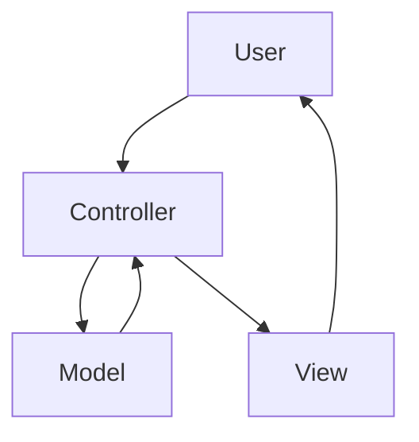
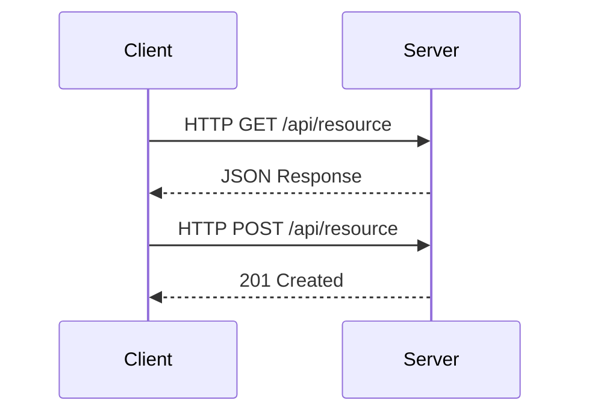

## 9.6 Design Patterns in Web Development Frameworks

In the realm of web development, design patterns play a pivotal role in crafting applications that are not only robust and scalable but also maintainable and efficient. By leveraging design patterns, developers can solve common problems in a standardized way, ensuring consistency and reliability across projects. In this section, we'll explore how popular web development frameworks utilize design patterns to achieve these goals, with a focus on Python-based frameworks like Django and Flask.

### Understanding Design Patterns in Web Development

Design patterns are essentially blueprints for solving recurring design problems in software development. They provide a proven template that developers can follow to address specific challenges, ensuring that solutions are both efficient and effective. In web development, design patterns help manage complexity, improve code readability, and facilitate collaboration among team members.

#### Key Benefits of Using Design Patterns

- **Reusability**: Patterns provide reusable solutions that can be applied across different projects.
- **Scalability**: They help design systems that can grow and adapt to increased demands.
- **Maintainability**: Patterns promote clean, organized code that is easier to maintain and extend.
- **Consistency**: Using patterns ensures a consistent approach to solving similar problems.

### Popular Design Patterns in Web Frameworks

Web frameworks often incorporate a variety of design patterns to streamline development and enhance application performance. Let's delve into some of the most common patterns used in frameworks like Django and Flask.

#### Model-View-Controller (MVC) Pattern

The MVC pattern is a cornerstone of web application architecture. It divides an application into three interconnected components:

- **Model**: Manages the data and business logic.
- **View**: Handles the user interface and presentation.
- **Controller**: Acts as an intermediary between the Model and View, processing user input and updating the Model.

##### Implementing MVC in Django

Django, a high-level Python web framework, follows the Model-Template-View (MTV) pattern, which is a variant of MVC. Here's how it works:

- **Model**: Defined using Django's ORM (Object-Relational Mapping) to interact with the database.
- **Template**: Responsible for rendering the HTML output.
- **View**: Contains the logic to process requests and return responses.

```python
from django.db import models

class Article(models.Model):
    title = models.CharField(max_length=100)
    content = models.TextField()

from django.shortcuts import render
from .models import Article

def article_list(request):
    articles = Article.objects.all()
    return render(request, 'articles/list.html', {'articles': articles})


  <h2>{{ article.title }}</h2>
  <p>{{ article.content }}</p>

```

In this example, the `Article` model defines the data structure, the view `article_list` retrieves data from the model, and the template displays it.

##### Visualizing MVC Pattern



**Description**: This diagram illustrates the flow of data in the MVC pattern, where the Controller mediates between the Model and the View.

#### Model-View-Template (MVT) Pattern in Django

Django's MVT pattern is similar to MVC but with a focus on templates for rendering views. This pattern emphasizes the separation of concerns, allowing developers to manage data, logic, and presentation independently.

- **Model**: Manages the data and business logic.
- **View**: Handles the logic for processing requests and returning responses.
- **Template**: Responsible for rendering the HTML output.

The MVT pattern enhances maintainability by clearly delineating responsibilities within the application.

#### Flask's Microservice Architecture

Flask, a lightweight Python web framework, is often used to build microservices. It follows a more flexible approach compared to Django, allowing developers to structure applications as needed. Flask's design encourages the use of several patterns:

- **Blueprints**: For organizing application components into modules.
- **Factory Pattern**: For creating application instances with specific configurations.

##### Implementing Blueprints in Flask

Blueprints in Flask allow developers to organize routes and handlers into modules, promoting modularity and reusability.

```python
from flask import Flask

def create_app():
    app = Flask(__name__)

    from .main import main as main_blueprint
    app.register_blueprint(main_blueprint)

    return app

from flask import Blueprint

main = Blueprint('main', __name__)

from . import views

from . import main

@main.route('/')
def index():
    return "Welcome to the main page!"
```

In this example, the application is structured using blueprints, allowing for a clean separation of concerns.

#### RESTful API Patterns

REST (Representational State Transfer) is an architectural style for designing networked applications. It relies on stateless communication and standard HTTP methods. Web frameworks like Django and Flask provide tools to build RESTful APIs efficiently.

##### Implementing RESTful APIs in Flask

Flask-RESTful is an extension for Flask that simplifies the creation of RESTful APIs.

```python
from flask import Flask
from flask_restful import Api, Resource

app = Flask(__name__)
api = Api(app)

class HelloWorld(Resource):
    def get(self):
        return {'hello': 'world'}

api.add_resource(HelloWorld, '/')

if __name__ == '__main__':
    app.run(debug=True)
```

This code defines a simple RESTful API with a single endpoint that returns a JSON response.

#### Django's MTV Architecture

Django's MTV architecture is a testament to the power of design patterns in web development. By separating data handling, logic, and presentation, Django enables developers to build scalable and maintainable applications.

##### Implementing MTV in Django

The MTV pattern in Django is implemented through models, views, and templates. Here's a quick overview:

- **Models**: Define the structure of the data.
- **Views**: Process incoming requests and return responses.
- **Templates**: Render the final HTML output.

```python
from django.db import models

class BlogPost(models.Model):
    title = models.CharField(max_length=200)
    body = models.TextField()

from django.shortcuts import render
from .models import BlogPost

def blog_list(request):
    posts = BlogPost.objects.all()
    return render(request, 'blog/list.html', {'posts': posts})


  <h2>{{ post.title }}</h2>
  <p>{{ post.body }}</p>

```

This example demonstrates how Django's MTV architecture facilitates the development of a simple blog application.

#### Flask’s Application Factories

Flask's application factory pattern is a powerful tool for creating application instances with specific configurations. This pattern is particularly useful for testing and deploying applications in different environments.

##### Implementing Application Factories in Flask

The application factory pattern allows developers to create instances of a Flask application with specific settings.

```python
from flask import Flask

def create_app(config_name):
    app = Flask(__name__)
    app.config.from_object(config_name)

    # Initialize extensions and register blueprints
    from .main import main as main_blueprint
    app.register_blueprint(main_blueprint)

    return app
```

In this example, the `create_app` function creates a new Flask application with a specific configuration, promoting flexibility and reusability.

#### RESTful API Patterns

RESTful APIs are a cornerstone of modern web applications, enabling communication between different services and clients. Design patterns play a crucial role in structuring RESTful APIs for scalability and maintainability.

##### Implementing RESTful APIs in Django

Django REST Framework (DRF) is a powerful toolkit for building RESTful APIs in Django. It provides a range of features, including serialization, authentication, and viewsets.

```python
from rest_framework import serializers
from .models import BlogPost

class BlogPostSerializer(serializers.ModelSerializer):
    class Meta:
        model = BlogPost
        fields = '__all__'

from rest_framework import viewsets
from .models import BlogPost
from .serializers import BlogPostSerializer

class BlogPostViewSet(viewsets.ModelViewSet):
    queryset = BlogPost.objects.all()
    serializer_class = BlogPostSerializer
```

This code demonstrates how DRF simplifies the creation of RESTful APIs by providing tools for serialization and view management.

### Try It Yourself

To deepen your understanding of these patterns, try modifying the code examples provided. For instance, add new fields to the Django models or create additional routes in the Flask application. Experiment with different configurations in Flask's application factory pattern to see how it affects the application's behavior.

### Visualizing RESTful API Architecture



**Description**: This sequence diagram illustrates the interaction between a client and server in a RESTful API, highlighting the use of HTTP methods for communication.

### Knowledge Check

- **Question**: What are the main components of the MVC pattern?
- **Question**: How do Django's models interact with the database?
- **Question**: What is the purpose of Flask's application factory pattern?

### Summary

In this section, we've explored how design patterns are integral to web development frameworks like Django and Flask. By understanding and applying these patterns, developers can create web applications that are not only robust and scalable but also maintainable and efficient. As you continue your journey in web development, remember to leverage design patterns to solve common challenges and enhance your applications' architecture.

## Quiz Time!



### What is the primary purpose of design patterns in web development?

- [x] To provide reusable solutions to common problems
- [ ] To increase the complexity of the code
- [ ] To make the code harder to read
- [ ] To eliminate the need for testing

> **Explanation:** Design patterns offer reusable solutions to common design problems, promoting consistency and efficiency in web development.

### Which pattern does Django primarily use?

- [ ] MVC
- [x] MTV
- [ ] MVVM
- [ ] MVP

> **Explanation:** Django uses the Model-Template-View (MTV) pattern, which is a variant of the MVC pattern.

### In Flask, what is the purpose of blueprints?

- [x] To organize application components into modules
- [ ] To increase the application's complexity
- [ ] To eliminate the need for routes
- [ ] To make the application slower

> **Explanation:** Blueprints in Flask help organize routes and handlers into modules, promoting modularity and reusability.

### What does REST stand for?

- [ ] Representational State Transfer
- [x] Representational State Transfer
- [ ] Remote State Transfer
- [ ] Representational System Transfer

> **Explanation:** REST stands for Representational State Transfer, an architectural style for designing networked applications.

### What is the main advantage of using the application factory pattern in Flask?

- [x] It allows for creating application instances with specific configurations
- [ ] It makes the application slower
- [ ] It increases the complexity of the code
- [ ] It eliminates the need for testing

> **Explanation:** The application factory pattern in Flask allows developers to create application instances with specific configurations, promoting flexibility and reusability.

### Which HTTP method is typically used to retrieve data from a RESTful API?

- [x] GET
- [ ] POST
- [ ] PUT
- [ ] DELETE

> **Explanation:** The GET method is used to retrieve data from a RESTful API.

### What is the role of serializers in Django REST Framework?

- [x] To convert complex data types to native Python data types
- [ ] To increase the complexity of the code
- [ ] To make the application slower
- [ ] To eliminate the need for models

> **Explanation:** Serializers in Django REST Framework convert complex data types, like querysets, to native Python data types, making them easy to render into JSON or XML.

### Which component of the MVC pattern handles user input?

- [x] Controller
- [ ] Model
- [ ] View
- [ ] Template

> **Explanation:** The Controller component of the MVC pattern handles user input and updates the Model accordingly.

### What is the main benefit of using design patterns in web development?

- [x] They promote code reusability and maintainability
- [ ] They make the code harder to read
- [ ] They increase the complexity of the code
- [ ] They eliminate the need for testing

> **Explanation:** Design patterns promote code reusability and maintainability by providing standardized solutions to common problems.

### True or False: Flask is a heavyweight web framework.

- [ ] True
- [x] False

> **Explanation:** Flask is a lightweight web framework, known for its simplicity and flexibility.



Remember, this is just the beginning. As you progress, you'll build more complex and interactive web applications. Keep experimenting, stay curious, and enjoy the journey!
