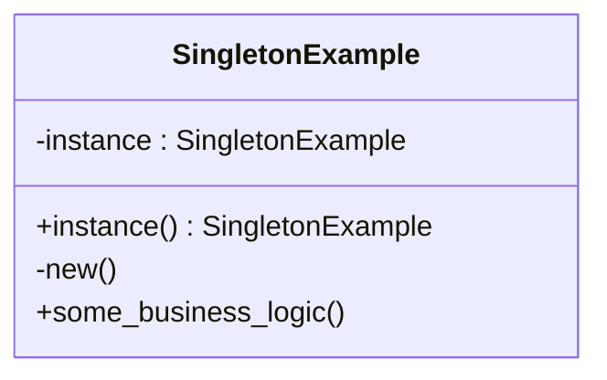

## 1.1 What Are Design Patterns?

In the realm of software engineering, design patterns are a crucial concept that every developer should understand. They represent tried-and-true solutions to common problems that arise during software design. By leveraging design patterns, developers can create scalable, maintainable, and robust applications. In this section, we will delve into what design patterns are, their significance in software development, and how they can be applied effectively in Ruby programming.

### What Are Design Patterns?

Design patterns are general, reusable solutions to recurring problems in software design. They are not finished designs that can be directly transformed into code but rather templates that guide developers in solving specific design issues. The concept of design patterns was popularized by the "Gang of Four" (GoF) in their seminal book, "Design Patterns: Elements of Reusable Object-Oriented Software," which categorized patterns into three main types: creational, structural, and behavioral.

### The Role of Design Patterns in Software Development

Design patterns play a pivotal role in software development by providing a shared language and framework for developers to communicate complex design concepts. They encapsulate best practices and offer a blueprint for solving design problems efficiently. By using design patterns, developers can:

- **Enhance Code Reusability**: Patterns provide a proven solution that can be reused across different projects, reducing the need to reinvent the wheel.
- **Improve Code Maintainability**: By following established patterns, code becomes easier to understand and modify, which is crucial for long-term maintenance.
- **Facilitate Communication**: Patterns serve as a common vocabulary among developers, making it easier to discuss and document design decisions.
- **Promote Best Practices**: Patterns encourage the use of best practices in software design, leading to more robust and reliable applications.

### Illustrating Design Patterns with Examples

To better understand how design patterns encapsulate best practices, let's explore a simple example using the Singleton pattern in Ruby. The Singleton pattern ensures that a class has only one instance and provides a global point of access to it.

```ruby
class SingletonExample
  @instance = new

  private_class_method :new

  def self.instance
    @instance
  end

  def some_business_logic
    # Implement business logic here
  end
end

# Usage
singleton = SingletonExample.instance
singleton.some_business_logic
```

In this example, the `SingletonExample` class restricts the instantiation of the class to a single object. The `instance` method provides a global point of access to the instance, ensuring that only one instance of the class exists.

### The Problem-Solving Aspect of Design Patterns

Design patterns are fundamentally about problem-solving. They provide a structured approach to addressing common design challenges, allowing developers to focus on the unique aspects of their applications. By understanding and applying design patterns, developers can:

- **Identify the Right Pattern**: Recognize the problem at hand and select the appropriate pattern to address it.
- **Adapt Patterns to Specific Needs**: Customize patterns to fit the specific requirements of a project while maintaining the core principles of the pattern.
- **Avoid Common Pitfalls**: Leverage the collective wisdom encapsulated in patterns to avoid common design mistakes.

### Key Categories of Design Patterns

Design patterns are typically categorized into three main types, each serving a distinct purpose in software design:

1. **Creational Patterns**: These patterns focus on object creation mechanisms, optimizing the process of object instantiation. Examples include the Singleton, Factory Method, and Builder patterns.

2. **Structural Patterns**: These patterns deal with object composition, ensuring that objects are structured in a way that enhances flexibility and efficiency. Examples include the Adapter, Composite, and Decorator patterns.

3. **Behavioral Patterns**: These patterns address object interaction and communication, defining how objects collaborate to achieve a specific behavior. Examples include the Observer, Strategy, and Command patterns.

### Visualizing Design Patterns

To further illustrate the concept of design patterns, let's visualize the Singleton pattern using a class diagram.



In this diagram, the `SingletonExample` class has a private `instance` variable and a public `instance()` method that returns the single instance of the class. The `new()` method is private, preventing direct instantiation.

### Ruby's Unique Features and Design Patterns

Ruby's dynamic nature and powerful features make it an excellent language for implementing design patterns. Some unique aspects of Ruby that enhance the application of design patterns include:

- **Dynamic Typing**: Ruby's dynamic typing allows for flexible and adaptable pattern implementations.
- **Metaprogramming**: Ruby's metaprogramming capabilities enable the creation of more sophisticated and dynamic patterns.
- **Blocks and Procs**: These features facilitate the implementation of behavioral patterns by allowing functions to be passed as arguments.

### Differences and Similarities with Other Languages

While design patterns are universal concepts, their implementation can vary across different programming languages. In Ruby, patterns are often more concise and expressive due to the language's syntax and features. For instance, the Singleton pattern in Ruby is simpler to implement compared to languages like Java or C++.

### Try It Yourself

To deepen your understanding of design patterns, try modifying the Singleton pattern example above. Experiment with adding additional methods or changing the access control of the `instance` method. Observe how these changes affect the behavior of the pattern.

### Knowledge Check

- What are the three main categories of design patterns?
- How does the Singleton pattern ensure a class has only one instance?
- Why are design patterns important in software development?
- How does Ruby's dynamic typing influence the implementation of design patterns?

### Embrace the Journey

Remember, understanding design patterns is just the beginning of your journey towards mastering software design. As you progress, you'll encounter more complex patterns and scenarios. Keep experimenting, stay curious, and enjoy the journey!

### References and Links

- [Design Patterns: Elements of Reusable Object-Oriented Software](https://en.wikipedia.org/wiki/Design_Patterns)
- [Ruby Documentation](https://www.ruby-lang.org/en/documentation/)
- [Gang of Four Design Patterns](https://refactoring.guru/design-patterns)

## Quiz: What Are Design Patterns?



### What is the primary purpose of design patterns in software development?

- [x] To provide reusable solutions to common design problems
- [ ] To replace the need for coding
- [ ] To make software development more complex
- [ ] To eliminate the need for testing

> **Explanation:** Design patterns offer reusable solutions to common design problems, enhancing code maintainability and communication among developers.

### Which of the following is a category of design patterns?

- [x] Creational
- [ ] Destructive
- [x] Structural
- [ ] Redundant

> **Explanation:** Design patterns are categorized into Creational, Structural, and Behavioral patterns.

### How does the Singleton pattern ensure a class has only one instance?

- [x] By restricting instantiation and providing a global access point
- [ ] By allowing multiple instances but only using one
- [ ] By using a static method to create instances
- [ ] By implementing a destructor

> **Explanation:** The Singleton pattern restricts instantiation and provides a global access point to ensure only one instance exists.

### What is a key benefit of using design patterns?

- [x] Improved code maintainability
- [ ] Increased code complexity
- [ ] Reduced code readability
- [ ] Elimination of bugs

> **Explanation:** Design patterns improve code maintainability by providing a structured approach to solving design problems.

### Which feature of Ruby enhances the implementation of design patterns?

- [x] Metaprogramming
- [ ] Static typing
- [ ] Manual memory management
- [ ] Lack of object-oriented support

> **Explanation:** Ruby's metaprogramming capabilities allow for more dynamic and flexible pattern implementations.

### What is the role of design patterns in communication among developers?

- [x] They provide a common vocabulary for discussing design solutions
- [ ] They replace the need for documentation
- [ ] They make communication more complex
- [ ] They eliminate the need for meetings

> **Explanation:** Design patterns provide a common vocabulary, facilitating communication and understanding among developers.

### In which book were design patterns popularized?

- [x] Design Patterns: Elements of Reusable Object-Oriented Software
- [ ] The Pragmatic Programmer
- [ ] Clean Code
- [ ] The Art of Computer Programming

> **Explanation:** The book "Design Patterns: Elements of Reusable Object-Oriented Software" by the Gang of Four popularized design patterns.

### What is a common misconception about design patterns?

- [x] They are finished designs ready to be coded
- [ ] They are templates for solving design problems
- [ ] They improve code reusability
- [ ] They enhance code readability

> **Explanation:** Design patterns are not finished designs but templates that guide developers in solving design problems.

### How do design patterns promote best practices?

- [x] By encapsulating proven solutions to common problems
- [ ] By increasing code complexity
- [ ] By reducing code readability
- [ ] By eliminating the need for testing

> **Explanation:** Design patterns encapsulate proven solutions, promoting best practices in software design.

### True or False: Design patterns are only applicable to object-oriented programming.

- [x] True
- [ ] False

> **Explanation:** While design patterns are most commonly associated with object-oriented programming, they can be adapted to other paradigms.


