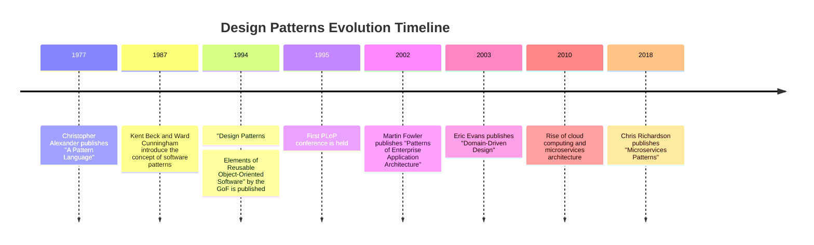

## 1.2 History and Evolution of Design Patterns

Design patterns have become an integral part of software engineering, providing developers with proven solutions to common problems. Understanding their history and evolution not only enriches our knowledge but also enhances our ability to apply these patterns effectively. In this section, we will explore the origins of design patterns, their evolution, and the key contributors who have shaped this field.

### Origins of Design Patterns

The concept of design patterns originated in the field of architecture, thanks to the pioneering work of Christopher Alexander. In the 1970s, Alexander introduced the idea of patterns in his book "A Pattern Language: Towns, Buildings, Construction." He proposed that architectural patterns could be used to solve recurring problems in building design, creating environments that are both functional and aesthetically pleasing.

Alexander's work laid the foundation for the application of patterns in other fields, including software engineering. His approach emphasized the importance of context and the relationships between patterns, which resonated with software developers seeking to create more maintainable and scalable systems.

### The "Gang of Four" and Their Impact

The term "design patterns" became widely recognized in the software engineering community with the publication of "Design Patterns: Elements of Reusable Object-Oriented Software" in 1994. This seminal book, authored by Erich Gamma, Richard Helm, Ralph Johnson, and John Vlissides—collectively known as the "Gang of Four" (GoF)—introduced 23 design patterns that addressed common challenges in object-oriented software design.

The GoF book had a profound impact on software engineering, providing a common vocabulary for developers and establishing a framework for discussing design solutions. It emphasized the importance of encapsulation, inheritance, and polymorphism, and demonstrated how these principles could be applied to create flexible and reusable software components.

### Evolution of Design Patterns Over Time

Since the publication of the GoF book, the field of design patterns has continued to evolve. New patterns have emerged, and existing patterns have been refined to address the changing needs of software development. The rise of agile methodologies, microservices architecture, and cloud computing has influenced the development and application of design patterns.

#### Key Milestones in the Evolution of Design Patterns

- **1977**: Christopher Alexander publishes "A Pattern Language," introducing the concept of patterns in architecture.
- **1994**: The "Gang of Four" publish "Design Patterns: Elements of Reusable Object-Oriented Software," popularizing design patterns in software engineering.
- **1995**: The first Pattern Languages of Programs (PLoP) conference is held, fostering collaboration and discussion among pattern enthusiasts.
- **2000s**: The rise of agile methodologies leads to the development of patterns for agile software development, such as the "Agile Patterns" by James O. Coplien.
- **2010s**: The growth of cloud computing and microservices architecture prompts the creation of patterns for distributed systems, such as the "Microservices Patterns" by Chris Richardson.

### Influential Works and Contributors

In addition to the GoF, several other authors and publications have made significant contributions to the field of design patterns:

- **Martin Fowler**: Known for his work on enterprise application patterns, Fowler's book "Patterns of Enterprise Application Architecture" provides valuable insights into designing scalable and maintainable enterprise systems.
- **Kent Beck**: A pioneer of agile development, Beck's work on "Test-Driven Development" and "Extreme Programming" has influenced the development of patterns for agile practices.
- **Eric Evans**: His book "Domain-Driven Design: Tackling Complexity in the Heart of Software" introduces patterns for modeling complex domains, emphasizing the importance of a shared language between developers and domain experts.

### Timeline of Important Milestones

Below is a brief timeline highlighting key milestones in the history and evolution of design patterns:

### Conclusion

The history and evolution of design patterns demonstrate their enduring relevance and adaptability in the ever-changing landscape of software development. From their origins in architecture to their widespread adoption in software engineering, design patterns have provided developers with a powerful toolset for building scalable and maintainable applications.

As we continue to explore design patterns in Ruby, we will build upon this rich history, leveraging the insights and solutions developed by pioneers in the field. Remember, this is just the beginning. As you progress, you'll discover new patterns and techniques that will enhance your ability to create robust and efficient software systems.

## Quiz: History and Evolution of Design Patterns



### Who introduced the concept of patterns in architecture?

- [x] Christopher Alexander
- [ ] Erich Gamma
- [ ] Martin Fowler
- [ ] Kent Beck

> **Explanation:** Christopher Alexander introduced the concept of patterns in architecture with his book "A Pattern Language."

### What is the "Gang of Four" known for?

- [x] Publishing "Design Patterns: Elements of Reusable Object-Oriented Software"
- [ ] Introducing agile methodologies
- [ ] Developing microservices architecture
- [ ] Creating the first programming language

> **Explanation:** The "Gang of Four" is known for publishing the seminal book on design patterns in software engineering.

### Which book popularized design patterns in software engineering?

- [x] "Design Patterns: Elements of Reusable Object-Oriented Software"
- [ ] "Patterns of Enterprise Application Architecture"
- [ ] "Domain-Driven Design"
- [ ] "A Pattern Language"

> **Explanation:** "Design Patterns: Elements of Reusable Object-Oriented Software" by the GoF popularized design patterns in software engineering.

### When was the first PLoP conference held?

- [x] 1995
- [ ] 1987
- [ ] 2002
- [ ] 2010

> **Explanation:** The first Pattern Languages of Programs (PLoP) conference was held in 1995.

### Who is known for their work on enterprise application patterns?

- [x] Martin Fowler
- [ ] Eric Evans
- [ ] Christopher Alexander
- [ ] Kent Beck

> **Explanation:** Martin Fowler is known for his work on enterprise application patterns.

### What influenced the development of patterns for agile practices?

- [x] Kent Beck's work on "Test-Driven Development" and "Extreme Programming"
- [ ] Christopher Alexander's architectural patterns
- [ ] The rise of cloud computing
- [ ] The publication of "Microservices Patterns"

> **Explanation:** Kent Beck's work on "Test-Driven Development" and "Extreme Programming" influenced the development of patterns for agile practices.

### Which book introduces patterns for modeling complex domains?

- [x] "Domain-Driven Design" by Eric Evans
- [ ] "Design Patterns: Elements of Reusable Object-Oriented Software"
- [ ] "Patterns of Enterprise Application Architecture"
- [ ] "A Pattern Language"

> **Explanation:** "Domain-Driven Design" by Eric Evans introduces patterns for modeling complex domains.

### What prompted the creation of patterns for distributed systems?

- [x] The growth of cloud computing and microservices architecture
- [ ] The publication of "A Pattern Language"
- [ ] The introduction of agile methodologies
- [ ] The first PLoP conference

> **Explanation:** The growth of cloud computing and microservices architecture prompted the creation of patterns for distributed systems.

### Who published "Microservices Patterns"?

- [x] Chris Richardson
- [ ] Martin Fowler
- [ ] Eric Evans
- [ ] Kent Beck

> **Explanation:** Chris Richardson published "Microservices Patterns."

### True or False: Design patterns originated in software engineering.

- [ ] True
- [x] False

> **Explanation:** Design patterns originated in architecture, thanks to the work of Christopher Alexander, before being adopted in software engineering.



