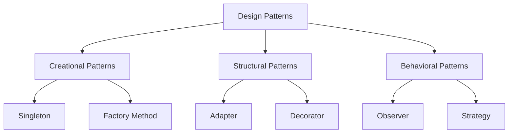

## 1.3 Importance of Design Patterns in Ruby

Design patterns are a fundamental aspect of software engineering, providing time-tested solutions to common problems in software design. In Ruby, a language known for its dynamic and expressive nature, design patterns play a crucial role in building scalable and maintainable applications. This section delves into why design patterns are particularly significant in Ruby programming, how Ruby's features influence their implementation, and the benefits they bring to Ruby applications.

### Understanding Ruby's Unique Features

Before we explore the importance of design patterns in Ruby, let's briefly review some of the language's unique features that influence how these patterns are implemented:

- **Dynamic Typing**: Ruby's dynamic typing allows for flexibility in code, enabling developers to write more generic and reusable components. This flexibility, however, can lead to challenges in maintaining code consistency and reliability, which design patterns can help address.

- **Duck Typing**: Ruby's duck typing philosophy allows objects to be used interchangeably if they have the same methods. This feature supports polymorphism and can simplify the implementation of certain design patterns, such as the Strategy or Observer patterns.

- **Metaprogramming**: Ruby's powerful metaprogramming capabilities allow developers to write code that writes code. This feature can be leveraged to implement design patterns in a more concise and expressive manner.

- **Blocks and Procs**: These constructs enable functional programming paradigms within Ruby, allowing for elegant implementations of patterns like the Command or Template Method patterns.

- **Modules and Mixins**: Ruby's module system allows for the inclusion of shared behavior across classes, facilitating the implementation of patterns like the Decorator or Adapter patterns.

### The Role of Design Patterns in Ruby

Design patterns provide a structured approach to solving common design problems, offering several benefits that are particularly valuable in Ruby development:

#### Enhancing Code Readability and Maintainability

One of the primary benefits of using design patterns in Ruby is the enhancement of code readability and maintainability. By applying well-known patterns, developers can create code that is easier to understand and modify. This is especially important in Ruby, where the language's flexibility can sometimes lead to code that is difficult to follow.

**Example: Singleton Pattern**

The Singleton pattern ensures that a class has only one instance and provides a global point of access to it. In Ruby, this pattern can be implemented using a simple module:

```ruby
class Logger
  include Singleton

  def log(message)
    puts message
  end
end

# Usage
logger = Logger.instance
logger.log("This is a log message.")
```

In this example, the Singleton pattern makes it clear that the `Logger` class should only have one instance, improving code readability and preventing potential bugs related to multiple instances.

#### Solving Common Ruby Development Challenges

Design patterns offer solutions to common challenges faced by Ruby developers, such as managing dependencies, organizing code, and ensuring scalability.

**Example: Observer Pattern**

The Observer pattern is useful for implementing a publish-subscribe mechanism, where changes in one object are automatically reflected in others. This pattern is particularly useful in Ruby applications that require real-time updates.

```ruby
class Subject
  def initialize
    @observers = []
  end

  def add_observer(observer)
    @observers << observer
  end

  def notify_observers
    @observers.each(&:update)
  end
end

class Observer
  def update
    puts "Observer has been notified!"
  end
end

# Usage
subject = Subject.new
observer = Observer.new
subject.add_observer(observer)
subject.notify_observers
```

In this example, the Observer pattern allows for a clean separation of concerns, where the `Subject` class is responsible for notifying observers without needing to know their specific implementations.

#### Encouraging Reusability and Flexibility

Design patterns promote reusability and flexibility by providing a blueprint for solving design problems that can be adapted to different contexts. This is particularly beneficial in Ruby, where the language's dynamic nature allows for highly flexible and adaptable code.

**Example: Strategy Pattern**

The Strategy pattern enables selecting an algorithm at runtime, promoting flexibility and reusability.

```ruby
class Context
  def initialize(strategy)
    @strategy = strategy
  end

  def execute_strategy
    @strategy.execute
  end
end

class ConcreteStrategyA
  def execute
    puts "Executing Strategy A"
  end
end

class ConcreteStrategyB
  def execute
    puts "Executing Strategy B"
  end
end

# Usage
context = Context.new(ConcreteStrategyA.new)
context.execute_strategy

context = Context.new(ConcreteStrategyB.new)
context.execute_strategy
```

In this example, the Strategy pattern allows for different strategies to be swapped in and out at runtime, enhancing the flexibility and reusability of the code.

### Visualizing Design Patterns in Ruby

To further illustrate the importance of design patterns in Ruby, let's visualize how these patterns fit into the broader context of software design.



In this diagram, we see how design patterns are categorized into creational, structural, and behavioral patterns, each addressing different aspects of software design. Ruby's features, such as dynamic typing and metaprogramming, influence how these patterns are implemented and utilized.

### Applying Design Patterns in Ruby Applications

When applying design patterns in Ruby applications, it's essential to consider the language's idioms and best practices. Here are some tips for effectively using design patterns in Ruby:

- **Embrace Ruby's Expressiveness**: Leverage Ruby's expressive syntax and features, such as blocks and metaprogramming, to implement design patterns in a concise and readable manner.

- **Focus on Readability**: Prioritize code readability by using design patterns to create clear and understandable code structures.

- **Adapt Patterns to Ruby's Features**: Modify traditional design patterns to take advantage of Ruby's unique features, such as duck typing and modules.

- **Encourage Collaboration**: Use design patterns as a common language among developers, facilitating collaboration and knowledge sharing.

### Encouraging Experimentation

To truly understand the importance of design patterns in Ruby, it's crucial to experiment with different patterns and see how they can be applied to solve real-world problems. Here are some suggestions for experimenting with design patterns in Ruby:

- **Try It Yourself**: Implement the Singleton, Observer, and Strategy patterns in a small Ruby project. Experiment with modifying the patterns to suit your specific needs.

- **Explore Other Patterns**: Investigate other design patterns, such as the Factory Method or Decorator patterns, and consider how they can be applied to your projects.

- **Reflect on Your Code**: After implementing a design pattern, reflect on how it improved your code's readability, maintainability, and scalability.

### Conclusion

Design patterns are an essential tool for Ruby developers, offering solutions to common design challenges and enhancing code readability, maintainability, and scalability. By understanding and applying design patterns, developers can create robust and flexible Ruby applications that are easier to understand and modify. As you continue your journey in Ruby development, remember to embrace the language's unique features and experiment with different design patterns to find the best solutions for your projects.

## Quiz: Importance of Design Patterns in Ruby



### Why are design patterns important in Ruby?

- [x] They enhance code readability and maintainability.
- [ ] They make code execution faster.
- [ ] They are required by the Ruby language.
- [ ] They are only useful for large applications.

> **Explanation:** Design patterns enhance code readability and maintainability by providing structured solutions to common design problems.

### Which Ruby feature allows for flexible implementation of design patterns?

- [x] Dynamic Typing
- [ ] Static Typing
- [ ] Strong Typing
- [ ] Weak Typing

> **Explanation:** Ruby's dynamic typing allows for flexibility in implementing design patterns, enabling more generic and reusable components.

### What is a benefit of using the Singleton pattern in Ruby?

- [x] It ensures a class has only one instance.
- [ ] It allows multiple instances of a class.
- [ ] It speeds up code execution.
- [ ] It is used for error handling.

> **Explanation:** The Singleton pattern ensures that a class has only one instance, providing a global point of access to it.

### How does the Observer pattern benefit Ruby applications?

- [x] It allows for real-time updates between objects.
- [ ] It speeds up database queries.
- [ ] It simplifies error handling.
- [ ] It is used for data encryption.

> **Explanation:** The Observer pattern allows for real-time updates between objects, making it useful for applications that require such functionality.

### What is a key advantage of the Strategy pattern?

- [x] It allows selecting an algorithm at runtime.
- [ ] It speeds up code execution.
- [ ] It is used for error handling.
- [ ] It simplifies database interactions.

> **Explanation:** The Strategy pattern enables selecting an algorithm at runtime, promoting flexibility and reusability.

### How can design patterns improve collaboration among developers?

- [x] By providing a common language for design solutions.
- [ ] By making code execution faster.
- [ ] By reducing the need for documentation.
- [ ] By eliminating code reviews.

> **Explanation:** Design patterns provide a common language for design solutions, facilitating collaboration and knowledge sharing among developers.

### What is an example of a structural design pattern in Ruby?

- [x] Adapter Pattern
- [ ] Observer Pattern
- [ ] Strategy Pattern
- [ ] Singleton Pattern

> **Explanation:** The Adapter pattern is an example of a structural design pattern, used to allow incompatible interfaces to work together.

### Which feature of Ruby supports the implementation of the Command pattern?

- [x] Blocks and Procs
- [ ] Static Typing
- [ ] Strong Typing
- [ ] Weak Typing

> **Explanation:** Ruby's blocks and procs support the implementation of the Command pattern by enabling functional programming paradigms.

### How do design patterns contribute to code scalability?

- [x] By providing structured solutions that can be adapted to different contexts.
- [ ] By making code execution faster.
- [ ] By reducing the need for testing.
- [ ] By eliminating the need for documentation.

> **Explanation:** Design patterns provide structured solutions that can be adapted to different contexts, contributing to code scalability.

### True or False: Design patterns are only useful for large Ruby applications.

- [ ] True
- [x] False

> **Explanation:** Design patterns are useful for applications of all sizes, providing benefits such as enhanced readability, maintainability, and scalability.



Remember, this is just the beginning. As you progress, you'll discover more patterns and techniques that will help you build even more robust and scalable Ruby applications. Keep experimenting, stay curious, and enjoy the journey!
