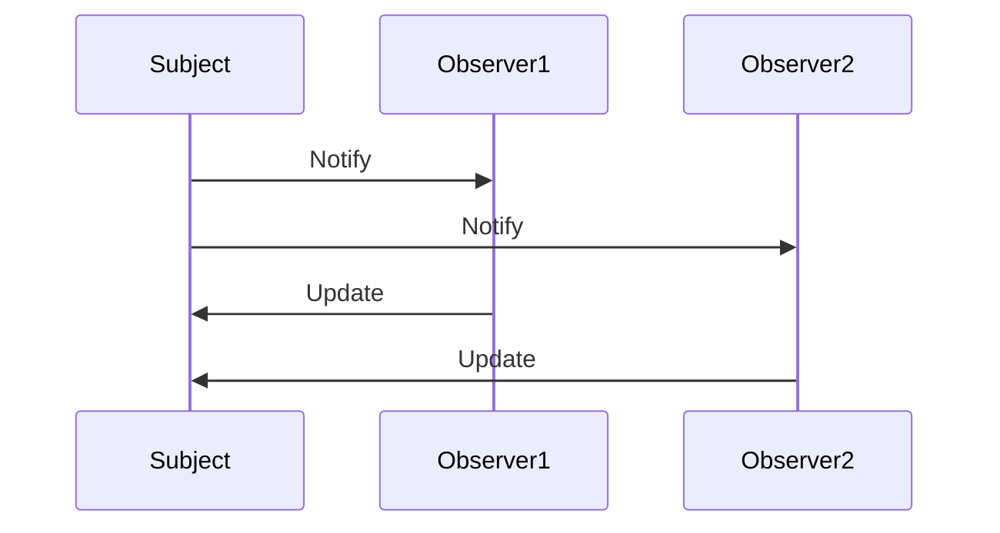

## 1.4 Benefits of Using Design Patterns in Ruby

Design patterns are a crucial aspect of software development, offering tried-and-tested solutions to common design problems. In the context of Ruby, a dynamic and object-oriented language, design patterns can significantly enhance the quality and robustness of your applications. Let's delve into the myriad benefits of using design patterns in Ruby, focusing on improved code maintainability, scalability, and reuse, as well as their role in facilitating team collaboration and solving complex design issues.

### Improved Code Maintainability

One of the primary benefits of using design patterns in Ruby is the enhancement of code maintainability. Design patterns provide a structured approach to solving recurring design problems, making the codebase more predictable and easier to manage. By adhering to established patterns, developers can ensure that their code is organized and follows a consistent structure, which simplifies the process of updating and modifying the code over time.

#### Example: Singleton Pattern

The Singleton pattern ensures that a class has only one instance and provides a global point of access to it. This pattern is particularly useful in scenarios where a single object is needed to coordinate actions across the system.

```ruby
class SingletonExample
  @instance = new

  private_class_method :new

  def self.instance
    @instance
  end
end

# Usage
singleton = SingletonExample.instance
```

In this example, the Singleton pattern helps maintain a single instance of the class, reducing the complexity of managing multiple instances and ensuring consistent behavior across the application.

### Scalability and Reuse

Design patterns also play a pivotal role in enhancing the scalability and reuse of code. By abstracting common solutions, patterns allow developers to apply the same solution across different parts of the application or even in different projects. This not only saves time but also ensures that the code is scalable and can handle increased loads or additional features with minimal changes.

#### Example: Factory Method Pattern

The Factory Method pattern defines an interface for creating an object but allows subclasses to alter the type of objects that will be created. This pattern is instrumental in promoting code reuse and scalability.

```ruby
class Product
  def initialize(name)
    @name = name
  end

  def details
    "Product: #{@name}"
  end
end

class ProductFactory
  def self.create_product(name)
    Product.new(name)
  end
end

# Usage
product = ProductFactory.create_product("Gadget")
puts product.details
```

The Factory Method pattern allows for the creation of objects without specifying the exact class of object that will be created, promoting flexibility and reuse.

### Facilitating Team Collaboration and Communication

Design patterns serve as a common language among developers, facilitating better collaboration and communication within teams. By using well-known patterns, team members can quickly understand the design and architecture of the application, reducing the learning curve for new developers and improving overall productivity.

#### Case Study: Observer Pattern in a Team Project

In a team project where multiple developers were working on a notification system, the Observer pattern was employed to manage the subscription and notification of events. This pattern allowed different components to subscribe to events and be notified when those events occurred, without tightly coupling the components.

```ruby
class EventManager
  def initialize
    @observers = []
  end

  def subscribe(observer)
    @observers << observer
  end

  def notify(event)
    @observers.each { |observer| observer.update(event) }
  end
end

class Observer
  def update(event)
    puts "Received event: #{event}"
  end
end

# Usage
manager = EventManager.new
observer = Observer.new
manager.subscribe(observer)
manager.notify("New Event")
```

By using the Observer pattern, the team was able to work on different components independently while ensuring seamless integration, thereby enhancing collaboration and communication.

### Solving Complex Design Issues

Design patterns are invaluable in solving complex design issues by providing a blueprint for addressing specific problems. They encapsulate best practices and solutions that have been refined over time, enabling developers to tackle challenging design problems with confidence.

#### Example: Strategy Pattern for Algorithm Selection

The Strategy pattern defines a family of algorithms, encapsulates each one, and makes them interchangeable. This pattern is particularly useful in scenarios where multiple algorithms are available for a specific task, and the best one needs to be selected at runtime.

```ruby
class Context
  def initialize(strategy)
    @strategy = strategy
  end

  def execute_strategy(data)
    @strategy.execute(data)
  end
end

class ConcreteStrategyA
  def execute(data)
    "Strategy A executed with #{data}"
  end
end

class ConcreteStrategyB
  def execute(data)
    "Strategy B executed with #{data}"
  end
end

# Usage
context = Context.new(ConcreteStrategyA.new)
puts context.execute_strategy("input data")

context = Context.new(ConcreteStrategyB.new)
puts context.execute_strategy("input data")
```

The Strategy pattern allows for the dynamic selection of algorithms, providing a flexible solution to complex design issues.

### Encouraging the Adoption of Patterns

Adopting design patterns in Ruby projects is a step towards writing better, more efficient code. Patterns not only improve the quality of the code but also make it more understandable and maintainable. By incorporating design patterns, developers can leverage the collective wisdom of the software engineering community, ensuring that their applications are robust and scalable.

### Try It Yourself

To fully grasp the benefits of design patterns, try modifying the provided code examples. For instance, experiment with adding new strategies to the Strategy pattern example or creating additional product types in the Factory Method example. This hands-on approach will deepen your understanding and highlight the versatility of design patterns in Ruby.

### Visualizing Design Patterns

To further illustrate the benefits of design patterns, let's visualize the interaction between different components in a system using the Observer pattern.



**Diagram Description:** This sequence diagram represents the Observer pattern, where the `Subject` notifies multiple `Observers` of an event, and each `Observer` updates itself accordingly.

### References and Links

- [Design Patterns: Elements of Reusable Object-Oriented Software](https://en.wikipedia.org/wiki/Design_Patterns) - A foundational book on design patterns.
- [Ruby Design Patterns](https://www.rubyguides.com/2018/02/ruby-design-patterns/) - A guide to implementing design patterns in Ruby.
- [Refactoring Guru: Design Patterns](https://refactoring.guru/design-patterns) - A comprehensive resource on design patterns.

### Knowledge Check

- What are the key benefits of using design patterns in Ruby?
- How does the Singleton pattern improve code maintainability?
- In what scenarios is the Factory Method pattern particularly useful?
- How do design patterns facilitate team collaboration?
- Why is the Strategy pattern beneficial for algorithm selection?

### Embrace the Journey

Remember, adopting design patterns is just the beginning of your journey towards writing better Ruby code. As you continue to explore and implement these patterns, you'll discover new ways to enhance the quality and scalability of your applications. Keep experimenting, stay curious, and enjoy the journey!

## Quiz: Benefits of Using Design Patterns in Ruby



### What is one of the primary benefits of using design patterns in Ruby?

- [x] Improved code maintainability
- [ ] Increased code complexity
- [ ] Reduced code readability
- [ ] Limited code flexibility

> **Explanation:** Design patterns enhance code maintainability by providing structured solutions to common design problems.

### How does the Singleton pattern help in Ruby applications?

- [x] Ensures a class has only one instance
- [ ] Creates multiple instances of a class
- [ ] Increases code redundancy
- [ ] Reduces code efficiency

> **Explanation:** The Singleton pattern ensures that a class has only one instance, providing a global point of access to it.

### What role do design patterns play in team collaboration?

- [x] Facilitate better communication and understanding
- [ ] Increase the learning curve for new developers
- [ ] Complicate the design process
- [ ] Limit the flexibility of the code

> **Explanation:** Design patterns serve as a common language among developers, facilitating better collaboration and communication.

### Which pattern is useful for selecting algorithms at runtime?

- [x] Strategy Pattern
- [ ] Singleton Pattern
- [ ] Factory Method Pattern
- [ ] Observer Pattern

> **Explanation:** The Strategy pattern allows for the dynamic selection of algorithms, providing flexibility in algorithm selection.

### How do design patterns contribute to code reuse?

- [x] By abstracting common solutions
- [ ] By increasing code redundancy
- [ ] By limiting code flexibility
- [ ] By complicating the design process

> **Explanation:** Design patterns abstract common solutions, allowing developers to apply the same solution across different parts of the application.

### What is a benefit of the Factory Method pattern?

- [x] Promotes code reuse and scalability
- [ ] Increases code complexity
- [ ] Limits the flexibility of object creation
- [ ] Reduces code readability

> **Explanation:** The Factory Method pattern promotes code reuse and scalability by defining an interface for creating objects.

### How do design patterns solve complex design issues?

- [x] By providing a blueprint for addressing specific problems
- [ ] By increasing code complexity
- [ ] By limiting code flexibility
- [ ] By complicating the design process

> **Explanation:** Design patterns provide a blueprint for addressing specific problems, encapsulating best practices and solutions.

### What is the benefit of using the Observer pattern in team projects?

- [x] Allows independent work on different components
- [ ] Increases code redundancy
- [ ] Limits the flexibility of the code
- [ ] Complicates the integration process

> **Explanation:** The Observer pattern allows different components to subscribe to events and be notified independently, enhancing collaboration.

### Why should developers adopt design patterns in Ruby projects?

- [x] To write better, more efficient code
- [ ] To increase code complexity
- [ ] To limit code flexibility
- [ ] To complicate the design process

> **Explanation:** Adopting design patterns helps developers write better, more efficient code by leveraging established solutions.

### True or False: Design patterns only benefit large-scale applications.

- [ ] True
- [x] False

> **Explanation:** Design patterns benefit applications of all sizes by improving code maintainability, scalability, and reuse.




