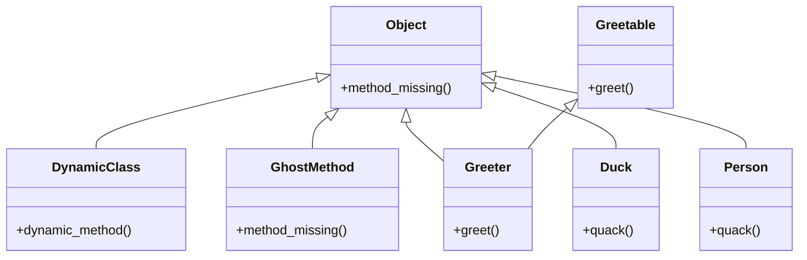

## 1.5 Overview of Ruby Features Relevant to Design Patterns

In this section, we will delve into the unique features of Ruby that make it an ideal language for implementing design patterns. Ruby's dynamic nature, combined with its powerful features such as metaprogramming, blocks, mixins, and duck typing, allows developers to create flexible and maintainable code. Understanding these features will not only enhance your ability to implement design patterns effectively but also prepare you for the advanced topics covered in later chapters.

### Metaprogramming in Ruby

Metaprogramming is one of Ruby's most powerful features, allowing you to write code that writes code. This capability is particularly useful in implementing design patterns that require dynamic behavior, such as the Proxy or Decorator patterns.

#### Dynamic Method Definition

Ruby allows you to define methods at runtime, which can be particularly useful for creating flexible APIs or implementing patterns like the Factory Method.

```ruby
class DynamicClass
  define_method(:dynamic_method) do |arg|
    puts "Dynamic method called with argument: #{arg}"
  end
end

obj = DynamicClass.new
obj.dynamic_method("Hello, Ruby!") # Output: Dynamic method called with argument: Hello, Ruby!
```

In this example, `define_method` is used to create a method on the fly. This flexibility is a cornerstone of Ruby's metaprogramming capabilities.

#### `method_missing` and Dynamic Dispatch

The `method_missing` hook is another powerful tool in Ruby's metaprogramming arsenal. It allows you to intercept calls to undefined methods, which can be used to implement patterns like Proxy or Null Object.

```ruby
class GhostMethod
  def method_missing(method_name, *args, &block)
    puts "You tried to call #{method_name} with arguments: #{args.join(', ')}"
  end
end

ghost = GhostMethod.new
ghost.any_method("arg1", "arg2") # Output: You tried to call any_method with arguments: arg1, arg2
```

By overriding `method_missing`, you can handle undefined method calls gracefully, providing a dynamic and flexible interface.

### Blocks, Procs, and Lambdas

Blocks are a fundamental part of Ruby, providing a way to pass chunks of code to methods. They are essential for implementing patterns like the Template Method or Strategy.

#### Using Blocks

Blocks are often used in Ruby to implement callbacks or to iterate over collections.

```ruby
def execute_block
  yield if block_given?
end

execute_block { puts "Block executed!" } # Output: Block executed!
```

The `yield` keyword allows you to call a block passed to a method, enabling flexible and reusable code structures.

#### Procs and Lambdas

Procs and lambdas are objects that encapsulate blocks of code, allowing you to store and pass them around like any other object.

```ruby
my_proc = Proc.new { |name| puts "Hello, #{name}!" }
my_proc.call("Ruby") # Output: Hello, Ruby!

my_lambda = ->(name) { puts "Hello, #{name} from lambda!" }
my_lambda.call("Ruby") # Output: Hello, Ruby from lambda!
```

Procs and lambdas provide more control over block execution, making them suitable for implementing complex design patterns.

### Mixins and Modules

Ruby's module system allows you to include shared behavior across classes, which is particularly useful for implementing patterns like the Adapter or Decorator.

#### Using Mixins

Mixins allow you to add functionality to classes without using inheritance, promoting code reuse and flexibility.

```ruby
module Greetable
  def greet
    puts "Hello from the module!"
  end
end

class Greeter
  include Greetable
end

greeter = Greeter.new
greeter.greet # Output: Hello from the module!
```

By including the `Greetable` module, the `Greeter` class gains access to the `greet` method, demonstrating how mixins can be used to share behavior across classes.

### Duck Typing

Duck typing is a concept where the suitability of an object is determined by the presence of certain methods and properties, rather than the object's class. This is a key feature in Ruby, allowing for more flexible and interchangeable code.

#### Implementing Duck Typing

Duck typing is often used in Ruby to implement patterns like Strategy or Observer, where objects are expected to respond to certain methods.

```ruby
class Duck
  def quack
    puts "Quack!"
  end
end

class Person
  def quack
    puts "I'm quacking like a duck!"
  end
end

def make_it_quack(duck_like)
  duck_like.quack
end

make_it_quack(Duck.new)    # Output: Quack!
make_it_quack(Person.new)  # Output: I'm quacking like a duck!
```

In this example, both `Duck` and `Person` can be passed to `make_it_quack` because they both implement the `quack` method, illustrating the power of duck typing.

### Preparing for Design Patterns

Understanding these Ruby features is crucial for effectively implementing design patterns. As we progress through this guide, you'll see how these features are utilized in various patterns to create scalable and maintainable applications.

### Try It Yourself

Experiment with the code examples provided in this section. Try modifying the `method_missing` example to log method calls to a file, or extend the `Greetable` module with additional methods. This hands-on approach will deepen your understanding of Ruby's capabilities.

### Visualizing Ruby's Features

To better understand how these features interact, let's visualize the relationships between objects, methods, and modules in Ruby using a class diagram.



This diagram illustrates how classes and modules relate to each other, highlighting the use of `method_missing`, mixins, and duck typing.

### Further Reading

For more information on Ruby's features, consider exploring the following resources:

- [Ruby Metaprogramming](https://ruby-doc.org/core-2.7.0/doc/syntax/miscellaneous_rdoc.html#label-Metaprogramming)
- [Understanding Blocks, Procs, and Lambdas](https://www.rubyguides.com/2016/02/ruby-procs-and-lambdas/)
- [Modules and Mixins in Ruby](https://www.rubyguides.com/2018/10/ruby-modules/)
- [Duck Typing in Ruby](https://www.rubyguides.com/2019/04/duck-typing/)

### Knowledge Check

Before moving on, consider these questions to test your understanding:

1. How does `method_missing` enhance Ruby's flexibility?
2. What are the differences between blocks, procs, and lambdas?
3. How do mixins promote code reuse in Ruby?
4. Why is duck typing important in implementing design patterns?

### Summary

In this section, we've explored key Ruby features that are particularly relevant to design patterns. Metaprogramming, blocks, mixins, and duck typing provide the flexibility and power needed to implement complex patterns effectively. As you continue through this guide, you'll see these features in action, helping you build scalable and maintainable applications.

Remember, this is just the beginning. As you progress, you'll build more complex and interactive applications. Keep experimenting, stay curious, and enjoy the journey!

## Quiz: Overview of Ruby Features Relevant to Design Patterns



### What is metaprogramming in Ruby?

- [x] Writing code that writes code
- [ ] Writing code that compiles faster
- [ ] Writing code with fewer lines
- [ ] Writing code that is more readable

> **Explanation:** Metaprogramming allows you to write code that generates other code, providing flexibility and dynamic behavior.

### How does `method_missing` enhance Ruby's flexibility?

- [x] By intercepting calls to undefined methods
- [ ] By defining methods at compile time
- [ ] By optimizing method calls
- [ ] By reducing method call overhead

> **Explanation:** `method_missing` allows you to handle calls to undefined methods, enabling dynamic method handling.

### What is the primary use of blocks in Ruby?

- [x] Passing chunks of code to methods
- [ ] Defining classes and modules
- [ ] Optimizing performance
- [ ] Handling exceptions

> **Explanation:** Blocks are used to pass executable code to methods, allowing for flexible and reusable code structures.

### What is a mixin in Ruby?

- [x] A module included in a class to add functionality
- [ ] A subclass of another class
- [ ] A type of lambda function
- [ ] A method that returns multiple values

> **Explanation:** Mixins are modules that can be included in classes to share functionality without using inheritance.

### How does duck typing benefit Ruby developers?

- [x] By allowing objects to be used based on their methods
- [ ] By enforcing strict type checking
- [x] By enabling flexible and interchangeable code
- [ ] By optimizing memory usage

> **Explanation:** Duck typing allows objects to be used based on their methods, not their class, promoting flexibility.

### What is the difference between a proc and a lambda in Ruby?

- [x] Lambdas check the number of arguments, procs do not
- [ ] Procs are faster than lambdas
- [ ] Lambdas are more memory efficient
- [ ] Procs cannot be passed as arguments

> **Explanation:** Lambdas enforce argument checking, while procs do not, which affects how they handle arguments.

### How can metaprogramming be used in design patterns?

- [x] By creating dynamic and flexible APIs
- [ ] By reducing code duplication
- [x] By implementing patterns like Proxy or Decorator
- [ ] By optimizing algorithm performance

> **Explanation:** Metaprogramming allows for dynamic behavior, which is useful in implementing patterns that require flexibility.

### What is the purpose of the `yield` keyword in Ruby?

- [x] To call a block passed to a method
- [ ] To define a new method
- [ ] To handle exceptions
- [ ] To optimize performance

> **Explanation:** `yield` is used to execute a block passed to a method, enabling flexible method behavior.

### How do modules differ from classes in Ruby?

- [x] Modules cannot be instantiated
- [ ] Modules are faster than classes
- [ ] Modules can inherit from other modules
- [ ] Modules are used for exception handling

> **Explanation:** Modules cannot be instantiated and are used to share functionality across classes.

### True or False: Duck typing in Ruby relies on the object's class.

- [ ] True
- [x] False

> **Explanation:** Duck typing relies on the presence of methods, not the object's class, allowing for flexible code usage.


