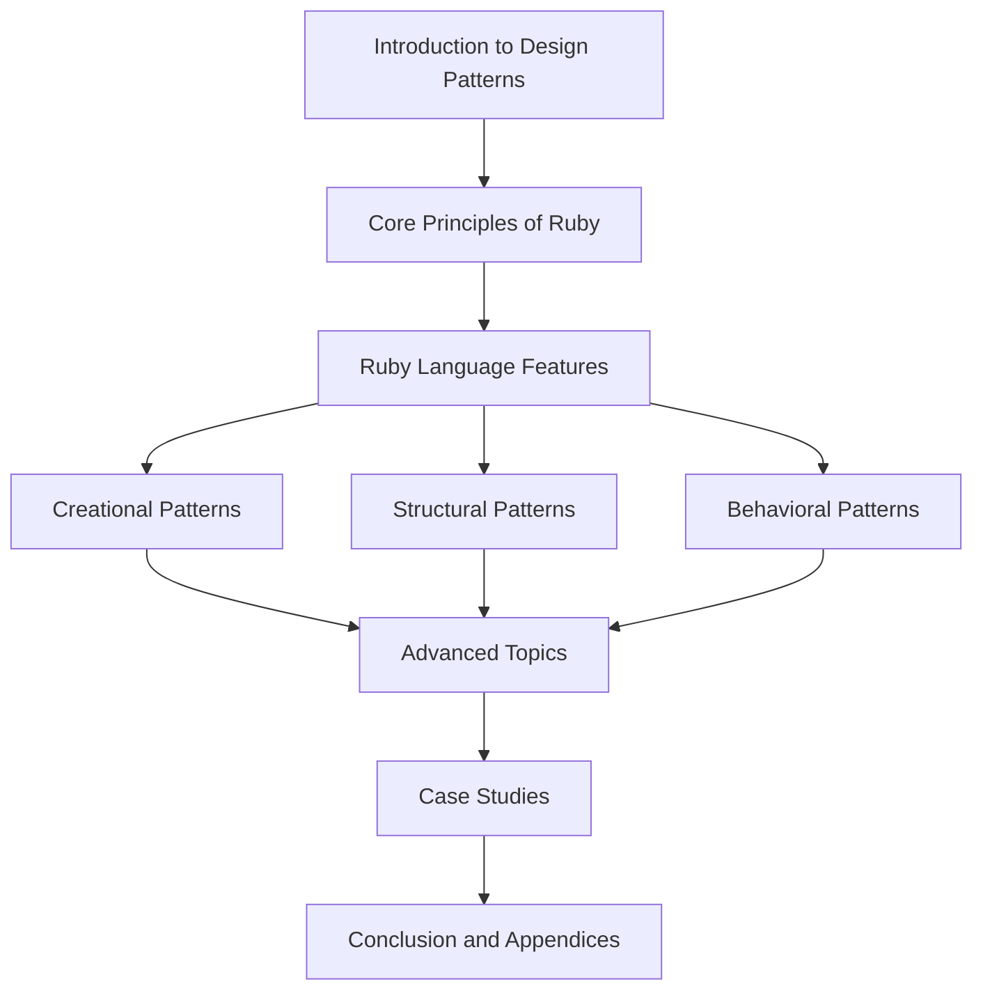

## 1.6 How to Use This Guide

Welcome to "The Ultimate Guide to Ruby Design Patterns: Build Scalable and Maintainable Applications." This guide is designed to be your comprehensive resource for mastering design patterns in Ruby, enabling you to write clean, efficient, and scalable code. Whether you are a beginner eager to learn or an experienced developer looking to refine your skills, this guide offers valuable insights and practical examples tailored to your needs.

### Navigating the Guide

This guide is structured to provide a logical progression through the world of Ruby design patterns. Here's a roadmap to help you navigate the content effectively:

1. **Introduction to Design Patterns in Ruby**: Start here to understand the fundamentals of design patterns, their history, and their importance in Ruby development. This section sets the stage for the more detailed discussions that follow.

2. **Core Principles of Ruby Programming**: Familiarize yourself with the essential concepts of Ruby programming, such as dynamic typing, metaprogramming, and modules. These principles are crucial for understanding how design patterns are implemented in Ruby.

3. **Ruby Language Features and Best Practices**: Dive into Ruby's syntax, semantics, and best practices. This section will equip you with the knowledge needed to write idiomatic Ruby code and leverage the language's unique features.

4. **Creational, Structural, and Behavioral Design Patterns**: Explore the three main categories of design patterns, each with its own set of patterns tailored for Ruby. These sections provide detailed explanations, code examples, and practical applications.

5. **Advanced Topics and Emerging Trends**: Stay ahead of the curve by exploring advanced topics such as functional programming, concurrency, and reactive programming in Ruby. This section also covers emerging trends and technologies.

6. **Case Studies and Practical Applications**: Learn from real-world examples and case studies that demonstrate how design patterns are applied in various scenarios, from web development to microservices.

7. **Conclusion and Appendices**: Recap key concepts, explore additional resources, and find answers to frequently asked questions. The appendices include a glossary, pattern reference cheat sheet, and more.

### Strategies for Different Readers

#### Beginners

- **Start with the Basics**: Begin with the introductory sections to build a solid foundation in design patterns and Ruby programming principles.
- **Focus on Core Patterns**: Concentrate on understanding the core creational, structural, and behavioral patterns before moving on to advanced topics.
- **Practice with Code Examples**: Use the provided code examples to practice and reinforce your understanding. Modify the examples to see how changes affect the outcome.

#### Experienced Developers

- **Dive into Advanced Topics**: Explore the advanced sections to deepen your understanding of complex patterns and emerging trends.
- **Apply Patterns to Real Projects**: Use the case studies as inspiration to apply design patterns to your own projects, enhancing scalability and maintainability.
- **Contribute to the Community**: Share your insights and experiences with the Ruby community, contributing to open-source projects or writing about your learnings.

### Tips for Practicing Concepts

- **Hands-On Coding**: Engage with the code examples by running them in your development environment. Experiment with modifications to see how they impact the functionality.
- **Build Small Projects**: Create small projects or components using the patterns you learn. This practical application will reinforce your understanding and highlight the benefits of each pattern.
- **Participate in Code Reviews**: Collaborate with peers to review each other's code, focusing on the use of design patterns and best practices.

### Engaging with Examples and Exercises

- **Interactive Examples**: Many sections include interactive examples that you can modify and run. Use these to test your understanding and explore different scenarios.
- **Exercises and Challenges**: At the end of each chapter, you'll find exercises designed to test your knowledge and encourage deeper exploration of the topics covered.
- **Knowledge Checks**: Periodically, you'll encounter questions or challenges within the text. Use these as opportunities to reflect on what you've learned and identify areas for further study.

### Supplementary Materials and Resources

- **External Links**: Throughout the guide, you'll find hyperlinks to reputable external resources for further reading and exploration.
- **Code Repository**: Access a repository of code snippets and examples used throughout the guide. This resource is invaluable for hands-on practice and experimentation.
- **Community Forums**: Join discussions with other readers and developers in community forums. Share your experiences, ask questions, and learn from others.

### Embrace the Journey

Remember, learning design patterns is a journey, not a destination. As you progress through this guide, you'll build a deeper understanding of Ruby and its capabilities. Stay curious, experiment with new ideas, and enjoy the process of becoming a more skilled and confident developer.

### Visualizing the Guide's Structure

To help you visualize the structure of this guide, we've included a flowchart that outlines the main sections and their relationships:

This diagram illustrates the logical flow of the guide, helping you understand how each section builds upon the previous ones.

### Summary of Key Takeaways

- **Structured Learning**: Follow the guide's structure to build a comprehensive understanding of Ruby design patterns.
- **Tailored Strategies**: Use the suggested strategies based on your experience level to maximize your learning.
- **Hands-On Practice**: Engage with code examples and exercises to reinforce your understanding.
- **Community and Resources**: Leverage supplementary materials and community resources to enhance your learning experience.

## Quiz: How to Use This Guide



### What is the primary purpose of this guide?

- [x] To provide a comprehensive resource for mastering Ruby design patterns
- [ ] To teach basic Ruby syntax
- [ ] To focus solely on web development with Ruby
- [ ] To provide a history of Ruby programming

> **Explanation:** The guide is designed to help readers master Ruby design patterns, enabling them to build scalable and maintainable applications.

### Which section should beginners focus on first?

- [x] Introduction to Design Patterns in Ruby
- [ ] Advanced Topics and Emerging Trends
- [ ] Case Studies and Practical Applications
- [ ] Conclusion and Appendices

> **Explanation:** Beginners should start with the introductory sections to build a solid foundation in design patterns and Ruby programming principles.

### How can experienced developers benefit from this guide?

- [x] By exploring advanced topics and applying patterns to real projects
- [ ] By focusing only on the basics
- [ ] By avoiding community involvement
- [ ] By skipping code examples

> **Explanation:** Experienced developers can deepen their understanding by exploring advanced topics and applying patterns to real projects.

### What is a recommended strategy for practicing concepts?

- [x] Engage with code examples and build small projects
- [ ] Only read the text without coding
- [ ] Focus solely on theoretical knowledge
- [ ] Avoid modifying code examples

> **Explanation:** Practicing with code examples and building small projects helps reinforce understanding and highlights the benefits of each pattern.

### What supplementary materials are provided with this guide?

- [x] External links, code repository, community forums
- [ ] Only external links
- [ ] Only a code repository
- [ ] Only community forums

> **Explanation:** The guide provides external links, a code repository, and community forums to enhance the learning experience.

### How should readers approach interactive examples?

- [x] Modify and run them to test understanding
- [ ] Ignore them
- [ ] Only read the comments
- [ ] Avoid running them

> **Explanation:** Interactive examples should be modified and run to test understanding and explore different scenarios.

### What is the benefit of participating in code reviews?

- [x] Collaborating with peers to focus on design patterns and best practices
- [ ] Only receiving feedback without giving any
- [ ] Avoiding collaboration
- [ ] Focusing solely on syntax errors

> **Explanation:** Code reviews allow collaboration with peers, focusing on design patterns and best practices.

### What is the role of the flowchart in this guide?

- [x] To visualize the structure and relationships of the guide's sections
- [ ] To provide a detailed history of Ruby
- [ ] To list all Ruby syntax rules
- [ ] To show only the advanced topics

> **Explanation:** The flowchart helps visualize the structure and relationships of the guide's sections.

### What is the tone of this guide?

- [x] Encouraging and supportive
- [ ] Critical and demanding
- [ ] Neutral and indifferent
- [ ] Pessimistic and discouraging

> **Explanation:** The guide maintains an encouraging and supportive tone to motivate readers.

### True or False: This guide is only for experienced developers.

- [ ] True
- [x] False

> **Explanation:** The guide is designed for both beginners and experienced developers, offering tailored strategies for each.



Remember, this guide is a tool to help you grow as a Ruby developer. Embrace the journey, and enjoy the process of mastering design patterns to build scalable and maintainable applications.
