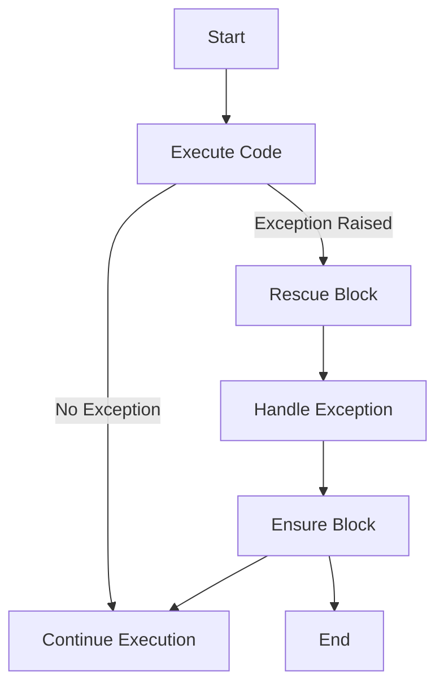

## 10.1 Principles of Error Handling in Ruby

Error handling is a crucial aspect of software development, ensuring that applications can gracefully manage unexpected situations and continue to function correctly. In Ruby, error handling is primarily managed through exceptions, which provide a structured way to handle errors and maintain the flow of the program. In this section, we will delve into the principles of error handling in Ruby, exploring how to effectively manage exceptions and failures to build robust applications.

### Importance of Robust Error Handling

Robust error handling is essential for several reasons:

- **User Experience**: Proper error handling ensures that users receive clear and informative messages when something goes wrong, enhancing their experience.
- **Application Stability**: By managing exceptions effectively, applications can avoid crashes and continue to operate smoothly.
- **Debugging and Maintenance**: Well-structured error handling makes it easier to identify and fix issues, reducing maintenance costs and time.
- **Security**: Proper error handling can prevent the exposure of sensitive information, protecting the application from potential security vulnerabilities.

### Ruby's Approach to Error Handling

Ruby uses exceptions as its primary mechanism for error handling. An exception is an event that disrupts the normal flow of a program. When an exception occurs, Ruby creates an exception object and passes it to the program. If the program does not handle the exception, Ruby will terminate the program and print a stack trace.

#### Raising Exceptions

In Ruby, you can raise exceptions using the `raise` keyword. This is useful when you want to signal that an error has occurred. Here's a simple example:

```ruby
def divide(a, b)
  raise "Division by zero error" if b == 0
  a / b
end

begin
  puts divide(10, 0)
rescue => e
  puts "An error occurred: #{e.message}"
end
```

In this example, the `divide` method raises an exception if the divisor `b` is zero. The `begin` block attempts to execute the division, and the `rescue` block catches the exception, printing an error message.

#### Rescuing Exceptions

To handle exceptions, Ruby provides the `begin`, `rescue`, `ensure`, and `else` constructs. These allow you to catch exceptions and define how your program should respond. Here's a breakdown of these constructs:

- **`begin`**: Marks the start of a block of code that may raise an exception.
- **`rescue`**: Specifies the code to run if an exception is raised.
- **`ensure`**: Contains code that will always run, regardless of whether an exception was raised.
- **`else`**: Executes if no exceptions are raised in the `begin` block.

Here's an example demonstrating these constructs:

```ruby
def read_file(file_path)
  file = File.open(file_path, "r")
  data = file.read
  puts data
rescue Errno::ENOENT => e
  puts "File not found: #{e.message}"
ensure
  file.close if file
end
```

In this example, the `read_file` method attempts to open and read a file. If the file is not found, an `Errno::ENOENT` exception is raised and caught by the `rescue` block. The `ensure` block ensures that the file is closed, whether an exception occurred or not.

### Handling vs. Suppressing Errors

It's important to distinguish between handling exceptions and suppressing errors. Handling exceptions involves taking appropriate action to address the error, such as logging the error, retrying the operation, or providing a fallback mechanism. Suppressing errors, on the other hand, means ignoring them, which can lead to hidden bugs and unstable applications.

#### Example of Suppressing Errors

```ruby
begin
  # Code that may raise an exception
rescue
  # Do nothing
end
```

In this example, the `rescue` block is empty, effectively suppressing any exceptions that occur. This is generally considered bad practice, as it can make debugging difficult and lead to unexpected behavior.

### Providing Clear and Informative Error Messages

When handling exceptions, it's crucial to provide clear and informative error messages. This helps users understand what went wrong and aids developers in diagnosing and fixing issues. Here are some tips for crafting effective error messages:

- **Be Specific**: Clearly state what went wrong and why.
- **Provide Context**: Include relevant information, such as the operation being performed or the data involved.
- **Avoid Technical Jargon**: Use language that is understandable to the intended audience.
- **Suggest Solutions**: If possible, provide guidance on how to resolve the issue.

### Code Examples and Exercises

Let's explore some additional examples and exercises to reinforce these concepts.

#### Example: Handling Multiple Exceptions

```ruby
def process_file(file_path)
  file = File.open(file_path, "r")
  data = file.read
  puts data
rescue Errno::ENOENT => e
  puts "File not found: #{e.message}"
rescue IOError => e
  puts "IO error occurred: #{e.message}"
ensure
  file.close if file
end
```

In this example, we handle multiple exceptions by providing separate `rescue` blocks for each exception type.

#### Exercise: Implement Custom Error Handling

Try creating a custom exception class and using it in your code. Here's a starting point:

```ruby
class CustomError < StandardError; end

def risky_operation
  # Your code here
  raise CustomError, "Something went wrong" if some_condition
end

begin
  risky_operation
rescue CustomError => e
  puts "Custom error handled: #{e.message}"
end
```

### Visualizing Error Handling Flow

To better understand the flow of error handling in Ruby, let's visualize it using a flowchart.



This flowchart illustrates the typical flow of error handling in Ruby, showing how the program moves from executing code to handling exceptions and ensuring cleanup.

### Knowledge Check

Before we conclude, let's review some key points:

- What is the primary mechanism for error handling in Ruby?
- How do you raise an exception in Ruby?
- What is the difference between handling and suppressing errors?
- Why is it important to provide clear and informative error messages?

### Embrace the Journey

Remember, mastering error handling is a journey. As you continue to develop your skills, you'll encounter more complex scenarios and learn to handle them with confidence. Keep experimenting, stay curious, and enjoy the process of building robust and resilient applications.

## Quiz: Principles of Error Handling in Ruby



### What is the primary mechanism for error handling in Ruby?

- [x] Exceptions
- [ ] Return codes
- [ ] Error objects
- [ ] Error flags

> **Explanation:** Ruby uses exceptions as its primary mechanism for error handling, allowing for structured management of errors.

### How do you raise an exception in Ruby?

- [x] Using the `raise` keyword
- [ ] Using the `throw` keyword
- [ ] Using the `error` keyword
- [ ] Using the `exception` keyword

> **Explanation:** The `raise` keyword is used to raise exceptions in Ruby, signaling that an error has occurred.

### What is the purpose of the `ensure` block in Ruby's error handling?

- [x] To execute code regardless of whether an exception was raised
- [ ] To catch exceptions
- [ ] To suppress errors
- [ ] To log errors

> **Explanation:** The `ensure` block is used to execute code that should run regardless of whether an exception was raised, such as cleanup operations.

### What is the difference between handling and suppressing errors?

- [x] Handling involves taking action; suppressing ignores errors
- [ ] Handling ignores errors; suppressing takes action
- [ ] Both involve ignoring errors
- [ ] Both involve taking action

> **Explanation:** Handling errors involves taking appropriate action, while suppressing errors means ignoring them, which can lead to hidden bugs.

### Why is it important to provide clear and informative error messages?

- [x] To help users understand issues and aid in debugging
- [ ] To confuse users
- [ ] To hide technical details
- [ ] To make the application look complex

> **Explanation:** Clear and informative error messages help users understand what went wrong and assist developers in diagnosing and fixing issues.

### Which of the following is a bad practice in error handling?

- [x] Suppressing errors
- [ ] Handling exceptions
- [ ] Logging errors
- [ ] Providing informative messages

> **Explanation:** Suppressing errors is considered bad practice as it can lead to hidden bugs and unstable applications.

### What should you include in an error message to make it effective?

- [x] Specific details and context
- [ ] Technical jargon
- [ ] Confusing language
- [ ] Irrelevant information

> **Explanation:** Effective error messages should be specific, provide context, and avoid technical jargon to be understandable to the intended audience.

### How can you handle multiple exceptions in Ruby?

- [x] By using multiple `rescue` blocks
- [ ] By using a single `rescue` block
- [ ] By using the `ensure` block
- [ ] By using the `else` block

> **Explanation:** Multiple `rescue` blocks can be used to handle different types of exceptions separately.

### What is the role of the `else` block in Ruby's error handling?

- [x] To execute code if no exceptions are raised
- [ ] To catch exceptions
- [ ] To suppress errors
- [ ] To log errors

> **Explanation:** The `else` block executes if no exceptions are raised in the `begin` block, providing a way to run code only when everything goes smoothly.

### True or False: The `rescue` block is used to execute code that should run regardless of whether an exception was raised.

- [ ] True
- [x] False

> **Explanation:** The `rescue` block is used to catch and handle exceptions, not to execute code regardless of exceptions. The `ensure` block serves that purpose.



By understanding and applying these principles of error handling in Ruby, you can build applications that are not only robust but also user-friendly and maintainable. Keep practicing and refining your skills, and you'll become proficient in managing errors effectively in your Ruby applications.
