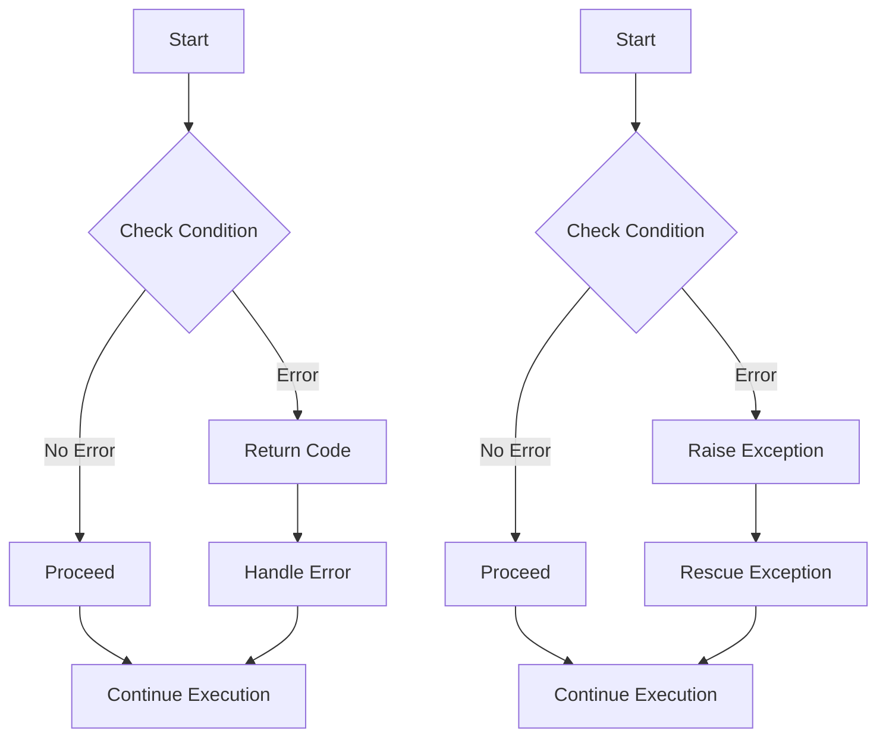

## 10.2 Using Exceptions vs. Return Codes

In the realm of software development, error handling is a crucial aspect that can significantly impact the robustness and maintainability of an application. In Ruby, as in many other programming languages, developers have two primary mechanisms for handling errors: exceptions and return codes. This section delves into these two approaches, comparing their advantages and disadvantages, and explaining why exceptions are generally preferred in Ruby.

### Understanding Return Codes

Return codes are a traditional method of error handling where functions return a specific value to indicate success or failure. This approach is common in languages like C, where functions often return integers, with zero indicating success and non-zero values indicating various error conditions.

#### How Return Codes Work

When using return codes, a function will return a specific value that the caller must check to determine if an error occurred. Here's a simple example in Ruby:

```ruby
def divide(a, b)
  return :error if b == 0
  a / b
end

result = divide(10, 0)
if result == :error
  puts "Division by zero error!"
else
  puts "Result: #{result}"
end
```

In this example, the `divide` function returns `:error` if the denominator is zero, signaling an error condition to the caller.

#### Disadvantages of Return Codes

While return codes can be straightforward, they come with several drawbacks:

1. **Error-Prone Checks**: Developers must remember to check the return value after every function call, which can easily be overlooked, leading to undetected errors.

2. **Convoluted Code**: The need to constantly check for errors can clutter the code, making it harder to read and maintain.

3. **Limited Information**: Return codes often provide limited information about the error, making it difficult to diagnose and fix issues.

4. **Inconsistent Usage**: Different functions might use different conventions for return codes, leading to inconsistency and confusion.

### Embracing Exceptions in Ruby

Ruby, being a modern and expressive language, encourages the use of exceptions for error handling. Exceptions provide a more robust and flexible mechanism compared to return codes.

#### How Exceptions Work

Exceptions allow you to separate error handling code from regular code, making your programs cleaner and more maintainable. When an error occurs, an exception is raised, which can be caught and handled by the surrounding code.

Here's how you can handle the same division operation using exceptions:

```ruby
def divide(a, b)
  raise "Division by zero error!" if b == 0
  a / b
end

begin
  result = divide(10, 0)
  puts "Result: #{result}"
rescue => e
  puts "An error occurred: #{e.message}"
end
```

In this example, the `divide` function raises an exception if the denominator is zero. The `begin...rescue` block catches the exception and handles it gracefully.

#### Advantages of Using Exceptions

1. **Cleaner Code**: Exceptions allow you to separate error handling from regular logic, resulting in cleaner and more readable code.

2. **Comprehensive Error Information**: Exceptions can carry detailed information about the error, including stack traces, which aids in debugging.

3. **Consistent Handling**: Ruby provides a consistent mechanism for raising and handling exceptions, reducing confusion and errors.

4. **Control Flow**: Exceptions provide a way to alter the normal flow of execution, allowing you to handle errors at different levels of your application.

#### Idiomatic Use of Exceptions in Ruby

Ruby developers are encouraged to use exceptions as the primary method of error handling. This idiomatic approach aligns with Ruby's philosophy of making code intuitive and expressive.

### Comparing Return Codes and Exceptions

To better understand the differences between return codes and exceptions, let's compare them through a more complex example.

#### Return Codes Example

```ruby
def open_file(filename)
  return :file_not_found unless File.exist?(filename)
  file = File.open(filename, "r")
  return :file_open_error unless file
  file
end

file = open_file("nonexistent.txt")
case file
when :file_not_found
  puts "File not found!"
when :file_open_error
  puts "Could not open file!"
else
  puts "File opened successfully!"
end
```

#### Exceptions Example

```ruby
def open_file(filename)
  raise "File not found!" unless File.exist?(filename)
  file = File.open(filename, "r")
  raise "Could not open file!" unless file
  file
end

begin
  file = open_file("nonexistent.txt")
  puts "File opened successfully!"
rescue => e
  puts "An error occurred: #{e.message}"
end
```

In the exceptions example, the error handling is more centralized and easier to manage, while the return codes example requires checking the return value at each step.

### When to Use Return Codes

While exceptions are generally preferred in Ruby, there are scenarios where return codes might still be appropriate:

1. **Performance-Critical Code**: In performance-critical sections, avoiding exceptions can be beneficial, as raising and rescuing exceptions can be costly.

2. **Simple Functions**: For simple functions where the error conditions are minimal and well-defined, return codes can be a straightforward solution.

3. **Interfacing with Other Languages**: When interfacing with languages or systems that use return codes, it might be necessary to adopt a similar approach for consistency.

### Visualizing Error Handling

To further illustrate the differences between return codes and exceptions, let's use a flowchart to visualize the error handling process.



In the flowchart, the left side represents the return codes approach, where errors are handled immediately after checking conditions. The right side represents the exceptions approach, where errors are raised and handled separately, leading to cleaner and more maintainable code.

### Key Takeaways

- **Exceptions are preferred in Ruby** for error handling due to their ability to separate error logic from regular code, providing cleaner and more maintainable solutions.
- **Return codes can be error-prone** and lead to convoluted code, making them less desirable in most Ruby applications.
- **Use exceptions idiomatically** in Ruby to align with the language's philosophy of expressiveness and readability.
- **Consider return codes** in specific scenarios where performance is critical or when interfacing with systems that use them.

### Try It Yourself

Experiment with the examples provided by modifying the conditions and error messages. Try introducing new error conditions and handling them using both return codes and exceptions. Observe how the code structure and readability change with each approach.

## Quiz: Using Exceptions vs. Return Codes



### Which of the following is a disadvantage of using return codes for error handling?

- [x] Error-prone checks
- [ ] Comprehensive error information
- [ ] Consistent handling
- [ ] Cleaner code

> **Explanation:** Return codes require manual checks after each function call, which can be easily overlooked, leading to undetected errors.

### What is a primary advantage of using exceptions over return codes?

- [x] Cleaner code
- [ ] Limited error information
- [ ] Inconsistent usage
- [ ] Error-prone checks

> **Explanation:** Exceptions allow you to separate error handling from regular logic, resulting in cleaner and more readable code.

### In Ruby, what is the idiomatic way to handle errors?

- [x] Using exceptions
- [ ] Using return codes
- [ ] Ignoring errors
- [ ] Using global variables

> **Explanation:** Ruby encourages the use of exceptions as the primary method of error handling, aligning with its philosophy of making code intuitive and expressive.

### When might return codes be appropriate in Ruby?

- [x] Performance-critical code
- [ ] Complex error handling
- [ ] When detailed error information is needed
- [ ] When interfacing with Ruby libraries

> **Explanation:** In performance-critical sections, avoiding exceptions can be beneficial, as raising and rescuing exceptions can be costly.

### What is a common issue with return codes?

- [x] They provide limited information about the error.
- [ ] They are always slower than exceptions.
- [ ] They are not supported in Ruby.
- [ ] They automatically handle errors.

> **Explanation:** Return codes often provide limited information about the error, making it difficult to diagnose and fix issues.

### How do exceptions improve control flow in Ruby?

- [x] By allowing errors to be handled at different levels of the application
- [ ] By requiring manual checks after each function call
- [ ] By using global variables for error states
- [ ] By ignoring errors

> **Explanation:** Exceptions provide a way to alter the normal flow of execution, allowing you to handle errors at different levels of your application.

### What is a benefit of using exceptions in Ruby?

- [x] Comprehensive error information
- [ ] Limited error information
- [ ] Inconsistent handling
- [ ] Error-prone checks

> **Explanation:** Exceptions can carry detailed information about the error, including stack traces, which aids in debugging.

### Which of the following is true about exceptions in Ruby?

- [x] They separate error handling from regular code.
- [ ] They are slower than return codes in all cases.
- [ ] They are not idiomatic in Ruby.
- [ ] They require global variables.

> **Explanation:** Exceptions allow you to separate error handling from regular logic, resulting in cleaner and more readable code.

### What is a scenario where return codes might be used?

- [x] Interfacing with other languages that use return codes
- [ ] When detailed error information is needed
- [ ] When handling complex errors
- [ ] When using Ruby libraries

> **Explanation:** When interfacing with languages or systems that use return codes, it might be necessary to adopt a similar approach for consistency.

### True or False: Exceptions are generally preferred over return codes in Ruby.

- [x] True
- [ ] False

> **Explanation:** Exceptions are generally preferred in Ruby for error handling due to their ability to separate error logic from regular code, providing cleaner and more maintainable solutions.



Remember, mastering error handling is a journey. As you continue to develop your Ruby skills, keep experimenting with different approaches and stay curious about the best practices in the language. Happy coding!
