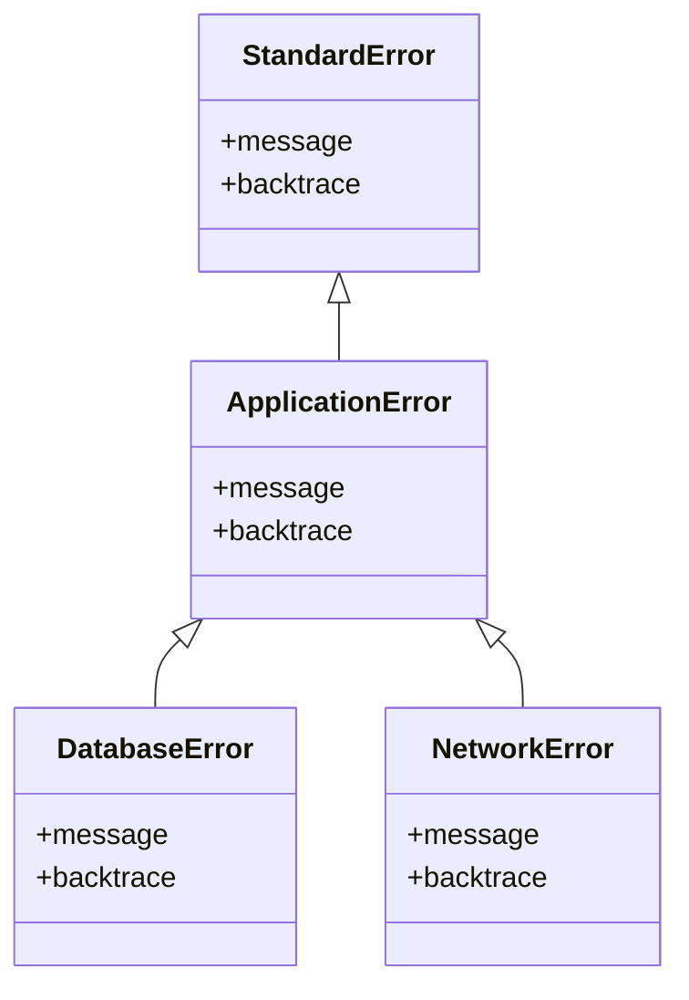

## 10.3 Creating Custom Exceptions

In Ruby, exceptions are a powerful mechanism for handling errors and unexpected conditions in your code. While Ruby provides a rich set of built-in exceptions, there are times when you need more specificity in your error handling. This is where custom exceptions come into play. By creating custom exceptions, you can represent specific error conditions, improve the granularity of your error handling, and enhance the clarity and maintainability of your code.

### Why Create Custom Exceptions?

Before diving into the how, let's explore the why. Creating custom exceptions is beneficial for several reasons:

1. **Specificity**: Custom exceptions allow you to represent specific error conditions that are unique to your application or domain. This specificity makes it easier to identify and handle different types of errors.

2. **Clarity**: By using descriptive names for your custom exceptions, you can make your code more readable and self-documenting. This clarity helps other developers (and your future self) understand the purpose of the exception.

3. **Maintainability**: Custom exceptions can improve the maintainability of your code by providing a clear structure for error handling. When errors are well-defined and organized, it's easier to modify and extend your codebase.

4. **Granularity**: With custom exceptions, you can handle different error conditions with varying levels of granularity. This flexibility allows you to implement more nuanced error handling strategies.

5. **Hierarchical Organization**: Custom exceptions can be organized into hierarchies, allowing you to group related errors and handle them collectively or individually as needed.

### Defining a Custom Exception Class

In Ruby, defining a custom exception class is straightforward. You typically create a new class that inherits from `StandardError` or another built-in exception class. Here's a basic example:

```ruby
# Define a custom exception class
class MyCustomError < StandardError
end

# Raise the custom exception
def risky_operation
  raise MyCustomError, "Something went wrong!"
end

begin
  risky_operation
rescue MyCustomError => e
  puts "Caught a custom exception: #{e.message}"
end
```

#### Key Points:

- **Inheritance**: Custom exceptions should inherit from `StandardError` or another appropriate exception class. This inheritance ensures that your custom exceptions behave like standard exceptions and can be rescued using the same mechanisms.

- **Message Customization**: When raising a custom exception, you can provide a message that describes the error condition. This message can be accessed using the `message` method on the exception object.

### Naming Conventions and Message Customization

When creating custom exceptions, it's important to follow naming conventions and consider message customization:

- **Naming Conventions**: Use descriptive names for your custom exceptions that clearly convey the error condition they represent. A common convention is to use the suffix `Error` in the class name (e.g., `InvalidInputError`, `ConnectionTimeoutError`).

- **Message Customization**: Customize the error message to provide additional context about the error condition. This context can be invaluable for debugging and troubleshooting.

```ruby
class InvalidInputError < StandardError
  def initialize(input)
    super("Invalid input provided: #{input}")
  end
end

def process_input(input)
  raise InvalidInputError.new(input) unless valid_input?(input)
  # Process the input...
end
```

### Benefits of Custom Exceptions

Custom exceptions offer several benefits that contribute to the overall quality of your code:

- **Improved Error Handling**: By defining specific exceptions for different error conditions, you can implement more precise error handling strategies. This precision reduces the risk of unhandled exceptions and improves the robustness of your application.

- **Enhanced Debugging**: Custom exceptions provide detailed information about the error condition, making it easier to diagnose and fix issues. The additional context provided by custom messages can significantly speed up the debugging process.

- **Code Organization**: Custom exceptions help organize your code by clearly delineating different types of errors. This organization makes it easier to understand the flow of your application and identify potential problem areas.

### Exception Hierarchies

In complex applications, it's often useful to organize custom exceptions into hierarchies. An exception hierarchy allows you to group related errors and handle them collectively or individually as needed. Here's an example:

```ruby
# Base exception class for all application-specific errors
class ApplicationError < StandardError
end

# Specific exception classes
class DatabaseError < ApplicationError
end

class NetworkError < ApplicationError
end

def perform_database_operation
  # Simulate a database error
  raise DatabaseError, "Failed to connect to the database"
end

def perform_network_operation
  # Simulate a network error
  raise NetworkError, "Network connection lost"
end

begin
  perform_database_operation
rescue DatabaseError => e
  puts "Database error: #{e.message}"
rescue NetworkError => e
  puts "Network error: #{e.message}"
rescue ApplicationError => e
  puts "General application error: #{e.message}"
end
```

#### Key Points:

- **Base Class**: Define a base exception class (e.g., `ApplicationError`) that all custom exceptions inherit from. This base class allows you to handle all application-specific errors collectively if needed.

- **Specific Classes**: Define specific exception classes for different error conditions (e.g., `DatabaseError`, `NetworkError`). These classes allow you to handle specific errors individually.

- **Rescue Order**: When rescuing exceptions, order matters. Specific exceptions should be rescued before more general ones to ensure that the most appropriate handler is invoked.

### Try It Yourself

To get hands-on experience with custom exceptions, try modifying the code examples provided. Here are a few suggestions:

1. **Add More Specific Exceptions**: Extend the exception hierarchy by adding more specific exceptions (e.g., `TimeoutError`, `AuthenticationError`) and implement corresponding error handling logic.

2. **Customize Messages**: Experiment with customizing the error messages for different exceptions to provide more detailed context.

3. **Simulate Different Error Conditions**: Modify the `perform_database_operation` and `perform_network_operation` methods to simulate different error conditions and observe how the error handling logic responds.

### Visualizing Exception Hierarchies

To better understand how exception hierarchies work, let's visualize the relationship between different exception classes using a class diagram.



**Diagram Description**: This class diagram illustrates the hierarchy of custom exceptions in our example. `ApplicationError` inherits from `StandardError`, and both `DatabaseError` and `NetworkError` inherit from `ApplicationError`. This hierarchy allows for flexible error handling strategies.

### References and Links

For further reading on Ruby exceptions and error handling, consider the following resources:

- [Ruby Exception Handling](https://ruby-doc.org/core-3.0.0/Exception.html) - Ruby documentation on exceptions.
- [Effective Ruby: 48 Specific Ways to Write Better Ruby](https://www.oreilly.com/library/view/effective-ruby-48/9780133846973/) - A book with insights on writing better Ruby code, including error handling.
- [Ruby Style Guide](https://rubystyle.guide/) - A comprehensive guide to Ruby coding conventions and best practices.

### Knowledge Check

To reinforce your understanding of custom exceptions, consider the following questions:

1. Why is it beneficial to create custom exceptions in Ruby?
2. How do you define a custom exception class in Ruby?
3. What are some naming conventions for custom exceptions?
4. How can custom exceptions improve the maintainability of your code?
5. What is the purpose of organizing custom exceptions into hierarchies?

### Embrace the Journey

Remember, creating custom exceptions is just one aspect of building robust and maintainable Ruby applications. As you continue your journey, keep experimenting with different error handling strategies, stay curious, and enjoy the process of refining your skills.

## Quiz: Creating Custom Exceptions



### Why is it beneficial to create custom exceptions in Ruby?

- [x] To represent specific error conditions
- [x] To improve code clarity and maintainability
- [ ] To make the code run faster
- [ ] To avoid using built-in exceptions

> **Explanation:** Custom exceptions allow you to represent specific error conditions and improve the clarity and maintainability of your code.

### How do you define a custom exception class in Ruby?

- [x] By inheriting from `StandardError`
- [ ] By inheriting from `Object`
- [ ] By inheriting from `Exception`
- [ ] By inheriting from `Kernel`

> **Explanation:** Custom exceptions should inherit from `StandardError` or another appropriate exception class.

### What is a common naming convention for custom exceptions?

- [x] Use the suffix `Error` in the class name
- [ ] Use the prefix `Exception` in the class name
- [ ] Use all uppercase letters
- [ ] Use underscores between words

> **Explanation:** A common convention is to use the suffix `Error` in the class name (e.g., `InvalidInputError`).

### How can custom exceptions improve the maintainability of your code?

- [x] By providing a clear structure for error handling
- [ ] By making the code more complex
- [ ] By reducing the number of lines of code
- [ ] By eliminating the need for error handling

> **Explanation:** Custom exceptions provide a clear structure for error handling, making the code easier to modify and extend.

### What is the purpose of organizing custom exceptions into hierarchies?

- [x] To group related errors
- [x] To handle errors collectively or individually
- [ ] To make the code more difficult to understand
- [ ] To avoid using built-in exceptions

> **Explanation:** Exception hierarchies allow you to group related errors and handle them collectively or individually as needed.

### What should you consider when customizing error messages for exceptions?

- [x] Provide additional context about the error condition
- [ ] Use generic messages for all exceptions
- [ ] Avoid providing any context
- [ ] Use random messages

> **Explanation:** Customizing error messages provides additional context about the error condition, aiding in debugging and troubleshooting.

### What is the benefit of using descriptive names for custom exceptions?

- [x] It makes the code more readable and self-documenting
- [ ] It makes the code run faster
- [ ] It reduces the number of exceptions
- [ ] It eliminates the need for comments

> **Explanation:** Descriptive names for custom exceptions make the code more readable and self-documenting.

### What is the role of the base exception class in an exception hierarchy?

- [x] To serve as a common ancestor for all custom exceptions
- [ ] To provide default error messages
- [ ] To eliminate the need for specific exceptions
- [ ] To make the code more complex

> **Explanation:** The base exception class serves as a common ancestor for all custom exceptions, allowing for collective error handling.

### How does the order of rescue clauses affect exception handling?

- [x] Specific exceptions should be rescued before more general ones
- [ ] General exceptions should be rescued before specific ones
- [ ] The order does not matter
- [ ] Only one rescue clause is allowed

> **Explanation:** Specific exceptions should be rescued before more general ones to ensure the most appropriate handler is invoked.

### True or False: Custom exceptions can only inherit from `StandardError`.

- [ ] True
- [x] False

> **Explanation:** While it's common to inherit from `StandardError`, custom exceptions can inherit from other appropriate exception classes as well.


