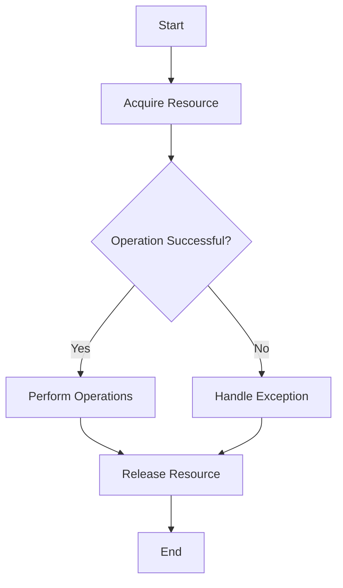

## 10.4 Ensuring Resource Cleanup

In the realm of software development, resource management is a critical aspect that can significantly impact the performance and reliability of applications. Resources such as files, network connections, and memory must be properly managed to prevent leaks and ensure optimal application performance. In Ruby, ensuring resource cleanup is essential, especially when exceptions occur. This section delves into techniques and best practices for managing resources effectively in Ruby applications.

### Importance of Resource Management and Cleanup

Resource management is crucial for several reasons:

- **Performance**: Properly managed resources ensure that your application runs efficiently without unnecessary consumption of system resources.
- **Reliability**: Ensuring resources are released prevents resource leaks, which can lead to application crashes or degraded performance over time.
- **Security**: Proper cleanup of resources can prevent unauthorized access to sensitive data that might be left in memory or open files.

### Using `ensure` Blocks for Guaranteed Cleanup

In Ruby, the `ensure` block is a powerful construct that guarantees the execution of cleanup code, regardless of whether an exception is raised. This makes it an ideal tool for resource management.

#### Example: Managing File IO with `ensure`

When working with files, it is crucial to close them after use to free up system resources. Here's how you can use an `ensure` block to guarantee that a file is closed:

```ruby
begin
  file = File.open('example.txt', 'r')
  # Perform file operations
  puts file.read
rescue IOError => e
  puts "An error occurred: #{e.message}"
ensure
  file.close if file
end
```

In this example, the `ensure` block ensures that the file is closed, even if an exception occurs during file operations.

### Block Forms of Resource Management Methods

Ruby provides a more idiomatic way to handle resources using block forms of methods. These methods automatically manage resource cleanup, reducing the risk of resource leaks.

#### Example: Using `File.open` with a Block

The block form of `File.open` automatically closes the file when the block exits, whether normally or due to an exception:

```ruby
File.open('example.txt', 'r') do |file|
  # Perform file operations
  puts file.read
end
```

This approach is not only cleaner but also safer, as it eliminates the need for explicit resource cleanup code.

### Finalizers and Garbage Collection Considerations

Ruby's garbage collector automatically manages memory, but there are times when you need to perform specific cleanup actions when an object is about to be destroyed. Finalizers can be used for this purpose.

#### Example: Using Finalizers

You can define a finalizer for an object using the `ObjectSpace.define_finalizer` method:

```ruby
class Resource
  def initialize
    puts "Resource acquired"
  end

  def release
    puts "Resource released"
  end
end

resource = Resource.new
ObjectSpace.define_finalizer(resource, proc { resource.release })
```

In this example, the `release` method is called when the `resource` object is about to be garbage collected.

### Best Practices to Prevent Resource Leaks

To prevent resource leaks and ensure efficient resource management, consider the following best practices:

- **Use Block Forms**: Whenever possible, use block forms of methods that manage resources, such as `File.open`, `IO.popen`, etc.
- **Leverage `ensure` Blocks**: Use `ensure` blocks to guarantee cleanup actions, especially when dealing with resources that do not have block forms.
- **Avoid Long-Lived Resources**: Minimize the lifespan of resources by acquiring them as late as possible and releasing them as early as possible.
- **Monitor Resource Usage**: Regularly monitor your application's resource usage to identify potential leaks or inefficiencies.
- **Test for Resource Leaks**: Implement tests to check for resource leaks, especially in long-running applications.

### Visualizing Resource Management

To better understand the flow of resource management in Ruby, let's visualize the process using a flowchart:



This flowchart illustrates the typical process of acquiring, using, and releasing a resource, with exception handling to ensure cleanup.

### Try It Yourself

Experiment with the following code example by modifying the file operations or introducing intentional errors to see how the `ensure` block handles cleanup:

```ruby
begin
  file = File.open('example.txt', 'r')
  # Try modifying the file operations here
  puts file.read
  raise "Intentional error" # Introduce an error
rescue IOError => e
  puts "An error occurred: #{e.message}"
ensure
  file.close if file
end
```

### Knowledge Check

- Explain the purpose of the `ensure` block in Ruby.
- Describe how block forms of methods help in resource management.
- What are finalizers, and when should they be used?
- List some best practices for preventing resource leaks.

### Embrace the Journey

Remember, mastering resource management is a journey. As you continue to develop Ruby applications, keep experimenting with different techniques and stay curious about new ways to optimize resource usage. Enjoy the process of building efficient and reliable applications!

## Quiz: Ensuring Resource Cleanup



### What is the primary purpose of the `ensure` block in Ruby?

- [x] To guarantee that cleanup code is executed regardless of exceptions
- [ ] To handle exceptions that occur in the code
- [ ] To initialize resources before use
- [ ] To log errors that occur during execution

> **Explanation:** The `ensure` block is used to ensure that cleanup code is executed regardless of whether an exception occurs, making it ideal for resource management.

### Which method form in Ruby automatically handles resource cleanup?

- [x] Block form methods like `File.open`
- [ ] Regular method calls without blocks
- [ ] Methods that raise exceptions
- [ ] Methods that return nil

> **Explanation:** Block form methods, such as `File.open`, automatically handle resource cleanup by closing the resource when the block exits.

### What is a finalizer in Ruby?

- [x] A method that performs cleanup when an object is about to be garbage collected
- [ ] A method that initializes an object
- [ ] A method that raises exceptions
- [ ] A method that logs errors

> **Explanation:** A finalizer is a method that is called when an object is about to be garbage collected, allowing for specific cleanup actions.

### Why is it important to close files after use?

- [x] To free up system resources and prevent resource leaks
- [ ] To ensure the file is saved correctly
- [ ] To prevent exceptions from being raised
- [ ] To log the file operations

> **Explanation:** Closing files after use is crucial to free up system resources and prevent resource leaks, which can degrade application performance.

### What is a best practice for managing resources in Ruby?

- [x] Use block forms of methods whenever possible
- [ ] Avoid using exceptions
- [x] Use `ensure` blocks for cleanup
- [ ] Keep resources open for as long as possible

> **Explanation:** Using block forms of methods and `ensure` blocks are best practices for managing resources and ensuring cleanup.

### What does the `ObjectSpace.define_finalizer` method do?

- [x] Defines a finalizer for an object to perform cleanup
- [ ] Initializes an object
- [ ] Raises an exception
- [ ] Logs errors

> **Explanation:** The `ObjectSpace.define_finalizer` method defines a finalizer for an object, allowing specific cleanup actions when the object is garbage collected.

### How can you test for resource leaks in Ruby applications?

- [x] Implement tests to check for resource leaks
- [ ] Avoid using exceptions
- [x] Monitor resource usage regularly
- [ ] Keep resources open for as long as possible

> **Explanation:** Implementing tests to check for resource leaks and regularly monitoring resource usage are effective ways to identify potential leaks.

### What happens if a file is not closed after use?

- [x] It can lead to resource leaks and degraded performance
- [ ] The file will be automatically closed
- [ ] An exception will be raised
- [ ] The file will be saved incorrectly

> **Explanation:** Not closing a file after use can lead to resource leaks and degraded performance, as system resources remain occupied.

### What is the benefit of using block forms of methods?

- [x] They automatically handle resource cleanup
- [ ] They prevent exceptions from being raised
- [ ] They log errors automatically
- [ ] They initialize resources before use

> **Explanation:** Block forms of methods automatically handle resource cleanup by ensuring the resource is closed when the block exits.

### True or False: Finalizers should be used for all resource cleanup in Ruby.

- [ ] True
- [x] False

> **Explanation:** Finalizers should be used sparingly, as they can introduce complexity and are not always the best solution for resource cleanup. Block forms and `ensure` blocks are often more appropriate.


