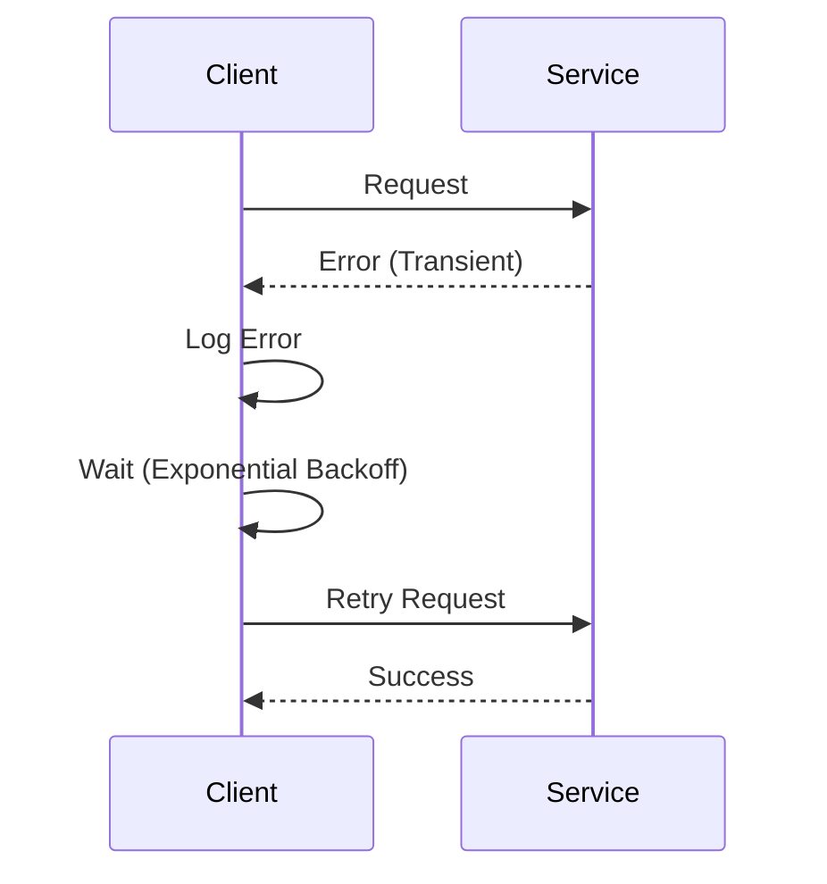

## 10.5 Retry Patterns and Resilience

In the world of software development, building resilient applications is crucial. Resilience refers to the ability of a system to handle failures gracefully and continue operating. One of the key strategies to achieve resilience is implementing retry patterns, especially when dealing with transient errors. In this section, we will explore the concept of retry patterns in Ruby, discuss when and how to use them, and provide practical examples to help you build robust applications.

### Understanding Transient Errors

Transient errors are temporary issues that can occur in a system, often due to network instability, temporary unavailability of a service, or resource contention. These errors are typically short-lived and can be resolved by retrying the operation after a short delay. Examples include:

- Network timeouts
- Temporary database unavailability
- Rate limiting by external services

Retrying an operation can often resolve these transient errors, allowing the application to recover without manual intervention.

### When to Use Retry Patterns

Retry patterns are appropriate when:

- The error is known to be transient and likely to resolve itself.
- The operation is idempotent, meaning it can be safely retried without causing unintended side effects.
- There is a reasonable expectation that retrying will succeed within a limited number of attempts.

However, retries should be used judiciously. Retrying indefinitely can lead to resource exhaustion and degraded performance. It's important to implement retries with limits and backoff strategies to avoid these pitfalls.

### Using the `retry` Keyword in Ruby

Ruby provides a simple mechanism for retrying operations using the `retry` keyword within exception handling blocks. Here's a basic example:

```ruby
attempts = 0

begin
  # Simulate an operation that may fail
  raise 'Temporary error' if attempts < 3

  puts 'Operation succeeded'
rescue => e
  attempts += 1
  puts "Attempt #{attempts}: #{e.message}"
  retry if attempts < 5
end
```

In this example, the operation is retried up to five times if it encounters a temporary error. The `retry` keyword restarts the `begin` block, allowing the operation to be attempted again.

### Implementing Exponential Backoff

Exponential backoff is a strategy where the wait time between retries increases exponentially. This approach helps reduce the load on the system and increases the chances of success by allowing more time for transient issues to resolve. Here's how you can implement exponential backoff in Ruby:

```ruby
require 'timeout'

max_attempts = 5
attempts = 0
base_delay = 1 # seconds

begin
  Timeout.timeout(10) do
    # Simulate an operation that may fail
    raise 'Temporary error' if attempts < 3

    puts 'Operation succeeded'
  end
rescue => e
  attempts += 1
  delay = base_delay * (2 ** attempts)
  puts "Attempt #{attempts}: #{e.message}. Retrying in #{delay} seconds..."
  sleep(delay)
  retry if attempts < max_attempts
end
```

In this example, the delay between retries doubles with each attempt, starting from 1 second. The `Timeout` module is used to ensure that the operation does not hang indefinitely.

### Avoiding Infinite Loops

One of the common pitfalls of retry patterns is the risk of creating infinite loops, especially if the error condition is not transient. To avoid this, always set a maximum number of retry attempts and implement logging to track the retry behavior. Here's an example:

```ruby
require 'logger'

logger = Logger.new(STDOUT)
max_attempts = 5
attempts = 0

begin
  # Simulate an operation that may fail
  raise 'Temporary error' if attempts < 3

  puts 'Operation succeeded'
rescue => e
  attempts += 1
  logger.error("Attempt #{attempts}: #{e.message}")
  retry if attempts < max_attempts
end

logger.info("Operation failed after #{attempts} attempts") if attempts == max_attempts
```

### Advanced Retry Patterns with Gems

For more advanced retry patterns, consider using gems like [retryable](https://github.com/nfedyashev/retryable). This gem provides a flexible and configurable way to implement retries with features like exponential backoff, customizable exceptions, and logging.

```ruby
require 'retryable'

Retryable.retryable(tries: 5, on: [StandardError], sleep: lambda { |n| 4**n }) do
  # Simulate an operation that may fail
  raise 'Temporary error' if rand > 0.5

  puts 'Operation succeeded'
end
```

In this example, the `retryable` gem is used to retry the operation up to five times, with the delay between retries increasing exponentially.

### Logging Retries and Failure Conditions

Logging is an essential part of implementing retry patterns. It helps you monitor the behavior of your application and diagnose issues when retries fail. Ensure that you log:

- The number of retry attempts
- The error message and stack trace
- The delay between retries
- The final outcome of the operation

### Visualizing Retry Patterns

To better understand the flow of retry patterns, let's visualize the process using a sequence diagram:



This diagram illustrates the interaction between a client and a service, where the client retries the request after encountering a transient error.

### Key Takeaways

- **Transient Errors**: Understand when errors are likely to be transient and suitable for retries.
- **Retry Logic**: Use the `retry` keyword and implement exponential backoff to manage retries effectively.
- **Avoid Infinite Loops**: Set limits on retry attempts and log retry behavior to avoid infinite loops.
- **Advanced Patterns**: Use gems like `retryable` for more sophisticated retry mechanisms.
- **Logging**: Always log retries and failure conditions to aid in monitoring and troubleshooting.

### Try It Yourself

Experiment with the code examples provided. Try modifying the number of retry attempts, the delay strategy, or the conditions under which retries are attempted. Observe how these changes affect the behavior of the application.

### References and Further Reading

- [Ruby Exception Handling](https://ruby-doc.org/core-2.7.0/Exception.html)
- [Retryable Gem Documentation](https://github.com/nfedyashev/retryable)
- [Exponential Backoff and Jitter](https://aws.amazon.com/blogs/architecture/exponential-backoff-and-jitter/)

Remember, implementing retry patterns is just one aspect of building resilient applications. Continue exploring other error handling and resilience strategies to enhance the robustness of your Ruby applications.

## Quiz: Retry Patterns and Resilience



### What is a transient error?

- [x] A temporary issue that can resolve itself
- [ ] A permanent failure in the system
- [ ] An error caused by user input
- [ ] An error that requires manual intervention

> **Explanation:** Transient errors are temporary issues that often resolve themselves without intervention.

### When should retry patterns be used?

- [x] When the error is transient
- [ ] For all types of errors
- [ ] Only for network-related errors
- [ ] When the operation is non-idempotent

> **Explanation:** Retry patterns are appropriate for transient errors, especially when operations are idempotent.

### What is exponential backoff?

- [x] Increasing wait time between retries exponentially
- [ ] Decreasing wait time between retries exponentially
- [ ] A fixed delay between retries
- [ ] Random wait time between retries

> **Explanation:** Exponential backoff involves increasing the wait time between retries exponentially to reduce system load.

### How can infinite loops be avoided in retry patterns?

- [x] By setting a maximum number of retry attempts
- [ ] By using random delays
- [ ] By retrying indefinitely
- [ ] By ignoring errors

> **Explanation:** Setting a maximum number of retry attempts prevents infinite loops.

### Which gem can be used for advanced retry patterns in Ruby?

- [x] retryable
- [ ] rails
- [ ] sinatra
- [ ] nokogiri

> **Explanation:** The `retryable` gem provides advanced retry mechanisms in Ruby.

### What should be logged during retries?

- [x] Number of attempts and error messages
- [ ] Only the final success
- [ ] Only the initial error
- [ ] Nothing

> **Explanation:** Logging the number of attempts, error messages, and delay times is crucial for monitoring retries.

### What is the purpose of the `retry` keyword in Ruby?

- [x] To restart the `begin` block
- [ ] To exit the program
- [ ] To ignore errors
- [ ] To log errors

> **Explanation:** The `retry` keyword restarts the `begin` block, allowing the operation to be retried.

### What is the main benefit of using retry patterns?

- [x] Enhancing application resilience
- [ ] Reducing code complexity
- [ ] Increasing error rates
- [ ] Decreasing application performance

> **Explanation:** Retry patterns enhance application resilience by handling transient errors gracefully.

### What is an idempotent operation?

- [x] An operation that can be repeated without side effects
- [ ] An operation that always fails
- [ ] An operation that requires user input
- [ ] An operation that cannot be retried

> **Explanation:** Idempotent operations can be repeated without causing unintended side effects.

### True or False: Exponential backoff always uses a fixed delay between retries.

- [ ] True
- [x] False

> **Explanation:** Exponential backoff increases the delay between retries exponentially, not fixed.



Remember, this is just the beginning. As you progress, you'll build more resilient and robust applications. Keep experimenting, stay curious, and enjoy the journey!
