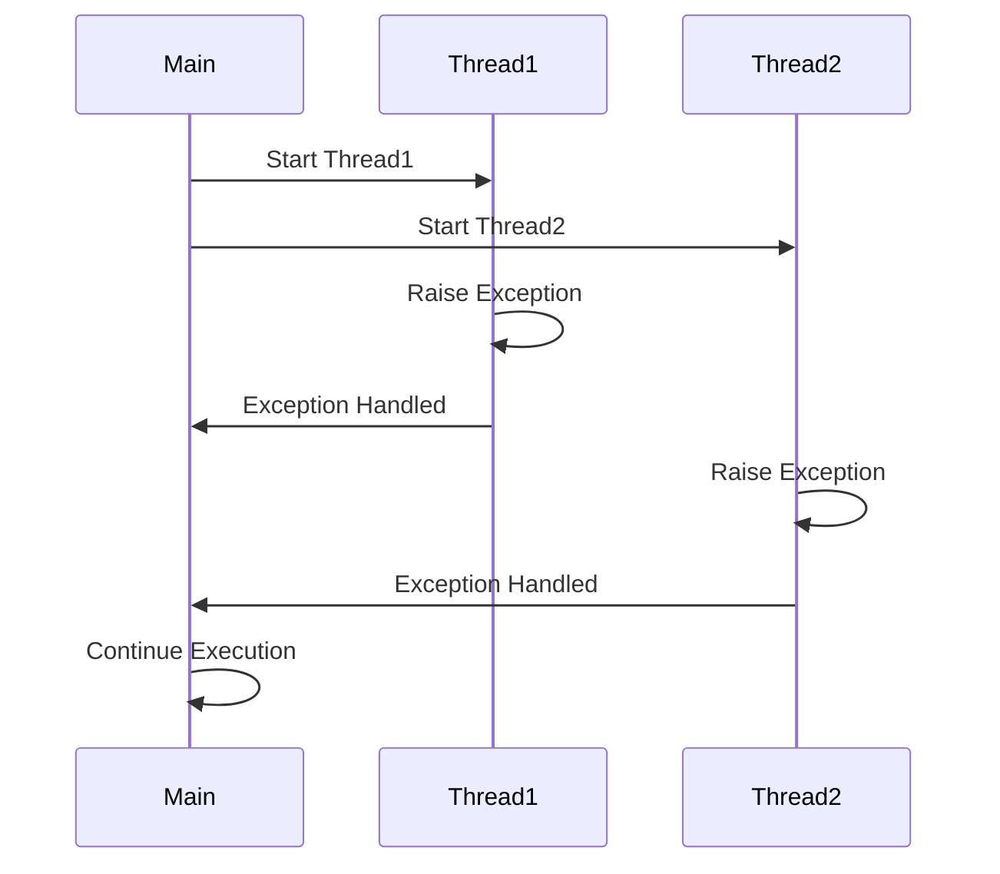

## 10.6 Handling Exceptions in Concurrent Code

In the realm of concurrent programming, handling exceptions effectively is crucial to building robust and reliable applications. Ruby, with its support for threads, fibers, and the newer Ractors, offers multiple concurrency models. However, each comes with its own set of challenges when it comes to exception handling. In this section, we will explore how exceptions propagate in concurrent Ruby code, how they can be silently lost, and strategies to capture and handle them effectively.

### Understanding Exception Propagation in Threads and Fibers

In Ruby, exceptions are a way to signal that something has gone wrong. When an exception is raised, Ruby looks for a rescue block to handle it. If no such block is found, the program terminates. However, in concurrent programming, the behavior of exceptions can be more complex.

#### Threads

In Ruby, each thread runs independently, and exceptions raised in one thread do not propagate to other threads. This means that if an exception occurs in a thread and is not handled, it can be silently lost, potentially leaving the application in an inconsistent state.

```ruby
thread = Thread.new do
  raise "An error occurred"
end

# Main thread continues execution
puts "Main thread continues..."
```

In the example above, the exception raised in the thread does not affect the main thread, and the message "Main thread continues..." is printed. The exception is silently lost unless explicitly handled.

#### Fibers

Fibers are a lightweight concurrency primitive in Ruby, allowing for cooperative multitasking. Unlike threads, fibers do not run concurrently but rather yield control back to the calling code. Exceptions in fibers behave similarly to those in threads, where they do not propagate to the calling context unless explicitly handled.

```ruby
fiber = Fiber.new do
  raise "Fiber error"
end

begin
  fiber.resume
rescue => e
  puts "Caught exception: #{e.message}"
end
```

In this example, the exception raised in the fiber is caught in the calling context, demonstrating how you can handle exceptions from fibers.

### Capturing and Handling Exceptions in Threads

To ensure that exceptions in threads are not lost, you can wrap the thread's execution block in a begin-rescue-end construct. This allows you to capture exceptions and handle them appropriately.

```ruby
thread = Thread.new do
  begin
    raise "An error occurred in the thread"
  rescue => e
    puts "Caught exception in thread: #{e.message}"
  end
end

thread.join
```

By using a rescue block within the thread, you can capture exceptions and take corrective actions, such as logging the error or retrying the operation.

### Using Thread Pools and Exception Handling Strategies

Thread pools are a common pattern in concurrent programming, allowing you to manage a pool of worker threads to perform tasks. When using thread pools, it's important to ensure that exceptions are handled properly to prevent the entire pool from being disrupted by a single error.

```ruby
require 'concurrent-ruby'

pool = Concurrent::FixedThreadPool.new(5)

5.times do |i|
  pool.post do
    begin
      raise "Error in task #{i}"
    rescue => e
      puts "Handled exception in task #{i}: #{e.message}"
    end
  end
end

pool.shutdown
pool.wait_for_termination
```

In this example, we use the `concurrent-ruby` gem to create a fixed thread pool. Each task is wrapped in a begin-rescue block to handle exceptions individually, ensuring that one task's failure does not affect others.

### Exception Handling with Ractors

Ractors, introduced in Ruby 3, provide a way to achieve true parallelism by isolating memory between concurrent units of execution. Exceptions in Ractors are isolated, meaning an exception in one Ractor does not affect others.

```ruby
ractor = Ractor.new do
  raise "Ractor error"
end

begin
  ractor.take
rescue => e
  puts "Caught exception from Ractor: #{e.message}"
end
```

In this example, the exception raised in the Ractor is captured when attempting to retrieve its result with `ractor.take`. This demonstrates how exceptions can be handled when working with Ractors.

### Best Practices for Exception Handling in Concurrent Code

To ensure that exceptions in concurrent code are not missed, consider the following best practices:

- **Wrap Thread Execution**: Always wrap the execution block of threads and fibers in a begin-rescue-end construct to capture exceptions.
- **Use Logging**: Log exceptions to provide visibility into errors that occur in concurrent code.
- **Graceful Shutdown**: Implement mechanisms to gracefully shut down threads and Ractors in case of unhandled exceptions.
- **Monitor and Alert**: Use monitoring tools to detect and alert on exceptions in concurrent code.
- **Test Concurrent Code**: Thoroughly test concurrent code to ensure that exceptions are handled as expected.

### Visualizing Exception Propagation

To better understand how exceptions propagate in concurrent Ruby code, let's visualize the flow using a sequence diagram.



This diagram illustrates how exceptions in threads are handled independently and do not affect the main thread's execution.

### Try It Yourself

To deepen your understanding, try modifying the code examples above. Experiment with different exception types, add logging, or implement a retry mechanism. Observe how exceptions are handled and how they affect the flow of concurrent code.

### References and Further Reading

- [Ruby Threads and Concurrency](https://ruby-doc.org/core-3.0.0/Thread.html)
- [Concurrent Ruby Gem](https://github.com/ruby-concurrency/concurrent-ruby)
- [Ractors in Ruby 3](https://www.ruby-lang.org/en/news/2020/12/25/ruby-3-0-0-released/)

### Knowledge Check

Before moving on, consider the following questions to reinforce your understanding:

- How do exceptions propagate in Ruby threads?
- What is the difference between exception handling in threads and fibers?
- How can you ensure exceptions in a thread pool are handled properly?
- What are the benefits of using Ractors for exception isolation?

### Embrace the Journey

Remember, mastering exception handling in concurrent code is a journey. As you continue to explore Ruby's concurrency models, you'll gain a deeper understanding of how to build resilient and robust applications. Keep experimenting, stay curious, and enjoy the journey!

## Quiz: Handling Exceptions in Concurrent Code



### How do exceptions propagate in Ruby threads?

- [x] They do not propagate to other threads.
- [ ] They propagate to the main thread.
- [ ] They propagate to all threads.
- [ ] They are automatically logged.

> **Explanation:** Exceptions in Ruby threads do not propagate to other threads, including the main thread.

### What is the primary difference between exception handling in threads and fibers?

- [x] Fibers allow exceptions to be caught in the calling context.
- [ ] Threads automatically log exceptions.
- [ ] Fibers propagate exceptions to all threads.
- [ ] Threads and fibers handle exceptions identically.

> **Explanation:** Exceptions in fibers can be caught in the calling context, unlike threads where they are isolated.

### How can you ensure exceptions in a thread pool are handled properly?

- [x] Wrap each task in a begin-rescue block.
- [ ] Use a global exception handler.
- [ ] Ignore exceptions in thread pools.
- [ ] Use a single rescue block for the entire pool.

> **Explanation:** Wrapping each task in a begin-rescue block ensures exceptions are handled individually.

### What is a benefit of using Ractors for exception isolation?

- [x] Exceptions in one Ractor do not affect others.
- [ ] Ractors automatically retry failed operations.
- [ ] Ractors log exceptions by default.
- [ ] Ractors propagate exceptions to all threads.

> **Explanation:** Ractors provide exception isolation, meaning exceptions in one Ractor do not affect others.

### Which of the following is a best practice for handling exceptions in concurrent code?

- [x] Use logging to track exceptions.
- [ ] Ignore exceptions to improve performance.
- [x] Implement graceful shutdown mechanisms.
- [ ] Avoid using rescue blocks.

> **Explanation:** Logging and implementing graceful shutdown mechanisms are best practices for handling exceptions.

### What tool can be used to manage a pool of worker threads in Ruby?

- [x] Concurrent::FixedThreadPool
- [ ] Ruby::ThreadManager
- [ ] FiberPool
- [ ] Thread::PoolManager

> **Explanation:** The `Concurrent::FixedThreadPool` from the `concurrent-ruby` gem is used to manage worker threads.

### How can you capture an exception raised in a Ractor?

- [x] Use ractor.take to retrieve and handle the exception.
- [ ] Use a global exception handler.
- [ ] Ractors do not support exception handling.
- [ ] Exceptions in Ractors are automatically logged.

> **Explanation:** Using `ractor.take` allows you to capture and handle exceptions raised in a Ractor.

### What is the role of a begin-rescue-end construct in threads?

- [x] It captures and handles exceptions within the thread.
- [ ] It logs exceptions automatically.
- [ ] It propagates exceptions to the main thread.
- [ ] It prevents exceptions from occurring.

> **Explanation:** The begin-rescue-end construct is used to capture and handle exceptions within a thread.

### Why is it important to test concurrent code for exception handling?

- [x] To ensure exceptions are handled as expected.
- [ ] To improve code performance.
- [ ] To avoid using rescue blocks.
- [ ] To propagate exceptions to all threads.

> **Explanation:** Testing concurrent code ensures that exceptions are handled as expected and do not disrupt application flow.

### True or False: Exceptions in Ruby threads automatically propagate to the main thread.

- [ ] True
- [x] False

> **Explanation:** False. Exceptions in Ruby threads do not automatically propagate to the main thread.


