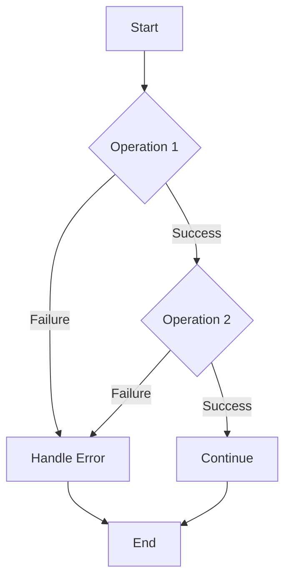

## 10.7 Functional Error Handling with Monads

In the realm of functional programming, monads offer a powerful way to handle errors without resorting to traditional exception mechanisms. In this section, we will explore how monads, specifically the `Result` and `Maybe` (or `Option`) monads, can be used for error handling in Ruby. We'll delve into the benefits of using monadic error handling, provide practical examples, and compare this approach to the conventional exception handling paradigm.

### Understanding Monads

Monads are a fundamental concept in functional programming, often described as a design pattern for handling side effects, including errors. They encapsulate computations and provide a way to chain operations while managing context, such as error handling or state.

#### The Role of Monads in Functional Programming

Monads serve several purposes in functional programming:

- **Encapsulation**: They encapsulate values and computations, allowing for a clean separation of concerns.
- **Chaining**: Monads provide a mechanism to chain operations, enabling a sequence of computations to be composed together.
- **Context Management**: They manage context, such as error states or optional values, without disrupting the flow of the program.

### Introducing `Result` and `Maybe` Monads

Two common monads used for error handling are `Result` and `Maybe`. Let's explore each of these in detail.

#### The `Result` Monad

The `Result` monad represents computations that can either succeed or fail. It typically has two variants:

- **Success**: Represents a successful computation with a value.
- **Failure**: Represents a failed computation with an error.

Here's a simple implementation of the `Result` monad in Ruby:

```ruby
class Result
  def self.success(value)
    Success.new(value)
  end

  def self.failure(error)
    Failure.new(error)
  end

  class Success < Result
    attr_reader :value

    def initialize(value)
      @value = value
    end

    def bind
      yield(value)
    end
  end

  class Failure < Result
    attr_reader :error

    def initialize(error)
      @error = error
    end

    def bind
      self
    end
  end
end
```

#### The `Maybe` Monad

The `Maybe` monad is used to represent computations that might return a value or nothing at all. It has two variants:

- **Some**: Represents a computation with a value.
- **None**: Represents a computation with no value.

Here's a basic implementation of the `Maybe` monad:

```ruby
class Maybe
  def self.some(value)
    Some.new(value)
  end

  def self.none
    None.new
  end

  class Some < Maybe
    attr_reader :value

    def initialize(value)
      @value = value
    end

    def bind
      yield(value)
    end
  end

  class None < Maybe
    def bind
      self
    end
  end
end
```

### Using Monadic Error Handling in Ruby

Let's explore how we can use these monads for error handling in Ruby applications.

#### Example: Using the `Result` Monad

Consider a scenario where we need to perform a series of operations that might fail. Using the `Result` monad, we can chain these operations and handle errors gracefully.

```ruby
def divide(a, b)
  return Result.failure("Division by zero") if b == 0

  Result.success(a / b)
end

def add(a, b)
  Result.success(a + b)
end

result = divide(10, 2).bind do |quotient|
  add(quotient, 5)
end

if result.is_a?(Result::Success)
  puts "Success: #{result.value}"
else
  puts "Error: #{result.error}"
end
```

In this example, the `divide` and `add` functions return `Result` objects. We use the `bind` method to chain operations, propagating errors automatically.

#### Example: Using the `Maybe` Monad

The `Maybe` monad is useful when dealing with optional values. Let's see how it can be applied.

```ruby
def find_user(id)
  # Simulate a user lookup
  id == 1 ? Maybe.some("User 1") : Maybe.none
end

def greet_user(user)
  Maybe.some("Hello, #{user}!")
end

result = find_user(1).bind do |user|
  greet_user(user)
end

if result.is_a?(Maybe::Some)
  puts result.value
else
  puts "User not found"
end
```

In this example, we use the `Maybe` monad to handle the possibility of a user not being found, avoiding the need for explicit nil checks.

### Benefits of Monadic Error Handling

Using monads for error handling offers several advantages:

- **Explicit Error Propagation**: Errors are propagated explicitly, making the flow of error handling clear and predictable.
- **Composability**: Monads allow for the composition of operations, enabling complex workflows to be built from simple functions.
- **Reduced Boilerplate**: Monadic error handling reduces the need for repetitive error-checking code, leading to cleaner and more maintainable codebases.

### Libraries Supporting Monadic Constructs

Ruby has several libraries that provide support for monadic constructs, making it easier to integrate monadic error handling into your applications. One such library is [dry-monads](https://dry-rb.org/gems/dry-monads/1.3/).

#### Using `dry-monads`

The `dry-monads` library offers a rich set of monadic constructs, including `Result` and `Maybe`. Here's how you can use it:

```ruby
require 'dry/monads'

include Dry::Monads[:result, :maybe]

def divide(a, b)
  return Failure("Division by zero") if b == 0

  Success(a / b)
end

def add(a, b)
  Success(a + b)
end

result = divide(10, 2).bind do |quotient|
  add(quotient, 5)
end

case result
when Success
  puts "Success: #{result.value!}"
when Failure
  puts "Error: #{result.failure}"
end
```

The `dry-monads` library simplifies the implementation of monadic patterns, providing a robust and flexible framework for functional error handling.

### Comparing Monadic and Traditional Exception Handling

Monadic error handling offers a different approach compared to traditional exception handling. Let's compare the two:

- **Control Flow**: Monadic error handling uses explicit control flow, whereas exceptions rely on implicit control flow through try-catch blocks.
- **Error Propagation**: Monads propagate errors through return values, while exceptions propagate errors through the call stack.
- **Composability**: Monads excel in composability, allowing for seamless chaining of operations, whereas exceptions can disrupt the flow of a program.

### Visualizing Monadic Error Handling

To better understand how monadic error handling works, let's visualize the process using a flowchart.



This flowchart illustrates how operations are chained using monads, with errors being handled explicitly at each step.

### Try It Yourself

Experiment with the code examples provided in this section. Try modifying the operations to see how errors are propagated and handled. For instance, change the divisor in the `divide` function to zero and observe how the error is handled.

### Knowledge Check

- What are the key benefits of using monads for error handling?
- How does the `Result` monad differ from the `Maybe` monad?
- What are the advantages of using libraries like `dry-monads`?

### Embrace the Journey

Remember, adopting functional error handling with monads is a journey. As you explore this approach, you'll discover new ways to write clean, efficient, and maintainable Ruby code. Keep experimenting, stay curious, and enjoy the process!

### Quiz: Functional Error Handling with Monads



### What is a primary benefit of using monads for error handling?

- [x] Explicit error propagation
- [ ] Implicit error handling
- [ ] Increased boilerplate code
- [ ] Reduced code readability

> **Explanation:** Monads provide explicit error propagation, making error handling clear and predictable.

### Which monad is used to represent computations that might return a value or nothing?

- [ ] Result
- [x] Maybe
- [ ] Either
- [ ] List

> **Explanation:** The `Maybe` monad is used to represent computations that might return a value or nothing.

### What is a key feature of the `Result` monad?

- [x] It represents computations that can succeed or fail.
- [ ] It only represents successful computations.
- [ ] It is used for state management.
- [ ] It is used for logging.

> **Explanation:** The `Result` monad represents computations that can either succeed or fail.

### How do monads handle errors compared to traditional exception handling?

- [x] Through return values
- [ ] Through the call stack
- [ ] By logging errors
- [ ] By ignoring errors

> **Explanation:** Monads handle errors through return values, whereas traditional exception handling uses the call stack.

### Which library provides support for monadic constructs in Ruby?

- [x] dry-monads
- [ ] ActiveRecord
- [ ] RSpec
- [ ] Sinatra

> **Explanation:** The `dry-monads` library provides support for monadic constructs in Ruby.

### What is a benefit of using the `dry-monads` library?

- [x] Simplifies the implementation of monadic patterns
- [ ] Increases code complexity
- [ ] Reduces code readability
- [ ] Provides logging capabilities

> **Explanation:** The `dry-monads` library simplifies the implementation of monadic patterns, making it easier to integrate them into applications.

### How does the `bind` method function in monadic error handling?

- [x] It chains operations and propagates errors.
- [ ] It logs errors.
- [ ] It ignores errors.
- [ ] It raises exceptions.

> **Explanation:** The `bind` method chains operations and propagates errors in monadic error handling.

### What is a key difference between monadic and traditional exception handling?

- [x] Monadic handling uses explicit control flow.
- [ ] Monadic handling uses implicit control flow.
- [ ] Traditional handling uses explicit control flow.
- [ ] Traditional handling uses no control flow.

> **Explanation:** Monadic error handling uses explicit control flow, while traditional exception handling relies on implicit control flow.

### What does the `Maybe` monad help avoid?

- [x] Explicit nil checks
- [ ] Error propagation
- [ ] Successful computations
- [ ] Logging

> **Explanation:** The `Maybe` monad helps avoid explicit nil checks by encapsulating optional values.

### True or False: Monads can disrupt the flow of a program.

- [ ] True
- [x] False

> **Explanation:** Monads do not disrupt the flow of a program; they provide a structured way to handle computations and errors.


