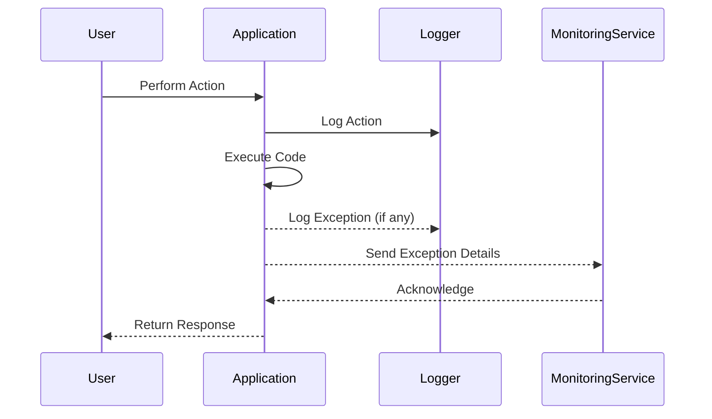

## 10.8 Logging and Monitoring Exceptions

In the realm of software development, especially when building scalable and maintainable applications, logging and monitoring exceptions play a crucial role. They not only help in diagnosing issues but also in maintaining the overall health of the application. In this section, we will explore the importance of logging exceptions, how to effectively log them using Ruby's built-in tools, and how to integrate with modern monitoring services like Sentry and Rollbar.

### Importance of Logging Exceptions

Logging exceptions is vital for several reasons:

1. **Diagnosing Issues**: When an application encounters an error, logging provides the necessary context to understand what went wrong.
2. **Tracking Application Health**: Continuous monitoring of logs helps in identifying patterns that might indicate underlying issues.
3. **Compliance and Auditing**: In some industries, maintaining logs is a regulatory requirement.
4. **Improving User Experience**: By understanding and fixing errors quickly, you can enhance the user experience.

### Logging Exceptions with Ruby's `Logger` Class

Ruby provides a built-in `Logger` class that is part of the standard library. It is a simple yet powerful tool for logging messages, including exceptions.

#### Basic Usage of `Logger`

To start logging in Ruby, you first need to require the `logger` library and create a new logger instance:

```ruby
require 'logger'

# Create a new logger instance
logger = Logger.new(STDOUT)

# Log messages of various severity levels
logger.debug("This is a debug message")
logger.info("This is an info message")
logger.warn("This is a warning message")
logger.error("This is an error message")
logger.fatal("This is a fatal message")
```

#### Logging Exceptions

When logging exceptions, it's important to capture the exception message and backtrace to provide context:

```ruby
begin
  # Code that may raise an exception
  raise StandardError, "An unexpected error occurred"
rescue StandardError => e
  logger.error("Exception: #{e.message}")
  logger.error("Backtrace: #{e.backtrace.join("\n")}")
end
```

#### Structured Logging and Log Formats

Structured logging involves logging data in a consistent, machine-readable format, such as JSON. This makes it easier to parse and analyze logs programmatically.

```ruby
require 'json'

# Create a logger that outputs JSON
logger = Logger.new(STDOUT)
logger.formatter = proc do |severity, datetime, progname, msg|
  { severity: severity, time: datetime, message: msg }.to_json + "\n"
end

begin
  # Code that may raise an exception
  raise StandardError, "An unexpected error occurred"
rescue StandardError => e
  logger.error({ exception: e.message, backtrace: e.backtrace }.to_json)
end
```

### Integrating Exception Tracking Services

While logging is crucial, integrating with exception tracking services like Sentry and Rollbar can provide additional insights and alerting capabilities.

#### Sentry

[Sentry](https://sentry.io/) is a popular error tracking tool that provides real-time error monitoring and alerting.

##### Integrating Sentry with Ruby

To integrate Sentry into your Ruby application, you need to install the `sentry-ruby` gem:

```bash
gem install sentry-ruby
```

Then, configure Sentry in your application:

```ruby
require 'sentry-ruby'

Sentry.init do |config|
  config.dsn = 'your_sentry_dsn'
  config.breadcrumbs_logger = [:active_support_logger, :http_logger]
end

begin
  # Code that may raise an exception
  raise StandardError, "An unexpected error occurred"
rescue StandardError => e
  Sentry.capture_exception(e)
end
```

#### Rollbar

[Rollbar](https://rollbar.com/) is another robust tool for error tracking and monitoring.

##### Integrating Rollbar with Ruby

To use Rollbar, first install the `rollbar` gem:

```bash
gem install rollbar
```

Then, configure Rollbar in your application:

```ruby
require 'rollbar'

Rollbar.configure do |config|
  config.access_token = 'your_rollbar_access_token'
end

begin
  # Code that may raise an exception
  raise StandardError, "An unexpected error occurred"
rescue StandardError => e
  Rollbar.error(e)
end
```

### Best Practices for Monitoring and Alerting on Exceptions

1. **Log with Context**: Always include relevant context with your logs, such as user ID, request ID, or session data.
2. **Use Structured Logging**: Adopt structured logging to facilitate easier parsing and analysis.
3. **Set Up Alerts**: Configure alerts for critical exceptions to ensure timely responses.
4. **Monitor Trends**: Regularly review logs and exception reports to identify trends or recurring issues.
5. **Automate Responses**: Where possible, automate responses to certain types of exceptions to reduce manual intervention.

### Visualizing Exception Handling Flow

To better understand the flow of exception handling and logging, let's visualize it using a sequence diagram:



This diagram illustrates how an exception is logged and reported to a monitoring service, ensuring that the development team is alerted to any issues.

### Try It Yourself

Experiment with the provided code examples by:

- Modifying the log format to include additional context.
- Integrating both Sentry and Rollbar to see how they handle exceptions differently.
- Creating custom loggers that output to different destinations (e.g., files, external logging services).

### Knowledge Check

- Why is it important to log exceptions with adequate context?
- How does structured logging benefit log analysis?
- What are the steps to integrate Sentry with a Ruby application?
- How can you automate responses to certain types of exceptions?

### Embrace the Journey

Remember, mastering logging and monitoring is a journey. As you progress, you'll develop a deeper understanding of your application's behavior and how to maintain its health. Keep experimenting, stay curious, and enjoy the process!

## Quiz: Logging and Monitoring Exceptions



### What is the primary purpose of logging exceptions in a Ruby application?

- [x] To diagnose issues and track application health
- [ ] To increase application performance
- [ ] To reduce code complexity
- [ ] To enhance user interface design

> **Explanation:** Logging exceptions helps in diagnosing issues and tracking the health of the application, which is crucial for maintaining robust software.

### Which Ruby class is commonly used for logging messages and exceptions?

- [ ] File
- [x] Logger
- [ ] IO
- [ ] Exception

> **Explanation:** The `Logger` class in Ruby's standard library is commonly used for logging messages and exceptions.

### How can structured logging be achieved in Ruby?

- [x] By using a consistent, machine-readable format like JSON
- [ ] By logging messages to a file
- [ ] By using the `puts` method
- [ ] By writing logs in plain text

> **Explanation:** Structured logging involves using a consistent, machine-readable format such as JSON, which facilitates easier parsing and analysis.

### What is the benefit of integrating exception tracking services like Sentry?

- [x] Real-time error monitoring and alerting
- [ ] Improved application speed
- [ ] Enhanced user interface
- [ ] Reduced memory usage

> **Explanation:** Exception tracking services like Sentry provide real-time error monitoring and alerting, helping teams respond to issues promptly.

### Which gem is required to integrate Rollbar into a Ruby application?

- [ ] sentry-ruby
- [x] rollbar
- [ ] logger
- [ ] json

> **Explanation:** The `rollbar` gem is required to integrate Rollbar into a Ruby application for error tracking.

### What should be included in logs to provide adequate context?

- [x] User ID, request ID, or session data
- [ ] Only the exception message
- [ ] Application version
- [ ] Server uptime

> **Explanation:** Including user ID, request ID, or session data provides adequate context in logs, making it easier to diagnose issues.

### What is a key advantage of using structured logging?

- [x] Easier parsing and analysis of logs
- [ ] Faster log writing
- [ ] Reduced log file size
- [ ] Enhanced security

> **Explanation:** Structured logging makes it easier to parse and analyze logs programmatically, which is a key advantage.

### How can you automate responses to certain types of exceptions?

- [x] By setting up automated alerts and scripts
- [ ] By manually checking logs daily
- [ ] By disabling exception logging
- [ ] By using a different programming language

> **Explanation:** Setting up automated alerts and scripts allows for automated responses to certain types of exceptions.

### What is the role of a monitoring service in exception handling?

- [x] To provide real-time alerts and insights
- [ ] To increase application speed
- [ ] To enhance user interface design
- [ ] To reduce code complexity

> **Explanation:** Monitoring services provide real-time alerts and insights, helping teams respond to exceptions efficiently.

### True or False: Logging exceptions is only necessary for debugging during development.

- [ ] True
- [x] False

> **Explanation:** Logging exceptions is crucial not only for debugging during development but also for monitoring application health in production.




