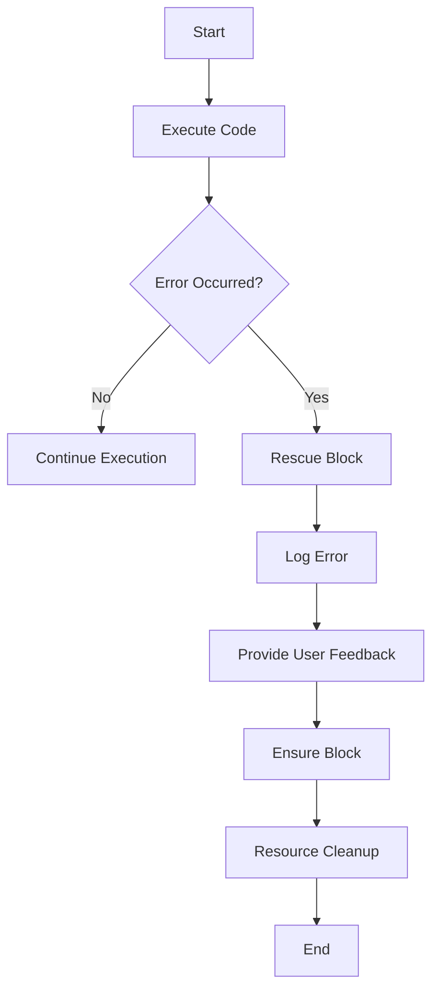

## 10.9 Best Practices for Robust Error Handling

Error handling is a critical aspect of software development, ensuring that applications can gracefully handle unexpected situations and provide meaningful feedback to users and developers. In Ruby, effective error handling involves a combination of strategies that promote maintainability, readability, and user-friendliness. This section consolidates best practices for robust error handling in Ruby applications, emphasizing key strategies and providing real-world examples.

### Understanding Error Handling in Ruby

Before diving into best practices, let's briefly review how error handling works in Ruby. Ruby uses exceptions to handle errors, which are objects that represent an error condition. When an error occurs, Ruby raises an exception, which can be rescued using a `begin...rescue...end` block.

```ruby
begin
  # Code that might raise an exception
  result = 10 / 0
rescue ZeroDivisionError => e
  puts "Error: #{e.message}"
end
```

In this example, a `ZeroDivisionError` is raised when attempting to divide by zero. The `rescue` block catches the exception and prints an error message.

### Key Strategies for Robust Error Handling

#### 1. Avoid Rescuing Generic Exceptions

One of the most common pitfalls in error handling is rescuing generic exceptions like `Exception` or `StandardError` without good reason. This practice can mask other errors and make debugging difficult. Instead, rescue specific exceptions that you expect might occur.

```ruby
begin
  # Code that might raise an exception
rescue SpecificErrorType => e
  # Handle specific error
end
```

#### 2. Fail Fast and Provide Meaningful Error Messages

The fail-fast principle encourages applications to detect and report errors as soon as they occur. This approach helps identify issues early in the development process and prevents cascading failures. When raising exceptions, provide meaningful error messages that describe the problem and suggest possible solutions.

```ruby
raise ArgumentError, "Invalid input: expected a positive number" if input <= 0
```

#### 3. Use Logging and Notifications

Logging is an essential part of error handling, providing a record of errors that occur in production environments. Use logging libraries like `Logger` to capture error details, including stack traces and context information. Additionally, consider integrating notification systems to alert developers of critical errors.

```ruby
require 'logger'

logger = Logger.new('application.log')
begin
  # Code that might raise an exception
rescue StandardError => e
  logger.error("Error: #{e.message}")
  logger.error(e.backtrace.join("\n"))
end
```

#### 4. Provide User Feedback

When errors occur in user-facing applications, provide clear and concise feedback to users. Avoid technical jargon and focus on actionable information. For example, instead of displaying a stack trace, show a user-friendly error message and suggest steps to resolve the issue.

```ruby
begin
  # Code that might raise an exception
rescue UserInputError => e
  puts "Oops! Something went wrong. Please check your input and try again."
end
```

#### 5. Document Error Handling Strategies

Documentation is crucial for maintaining code readability and understanding error handling strategies. Clearly document the types of exceptions that can be raised and how they are handled. This practice helps new developers understand the codebase and ensures consistency across the team.

#### 6. Use Custom Exceptions

Define custom exception classes for specific error conditions in your application. This approach improves code clarity and allows for more granular error handling.

```ruby
class CustomError < StandardError; end

begin
  # Code that might raise a CustomError
rescue CustomError => e
  puts "Custom error occurred: #{e.message}"
end
```

#### 7. Ensure Resource Cleanup

When exceptions occur, it's important to ensure that resources are properly cleaned up. Use the `ensure` block to execute cleanup code, such as closing files or releasing network connections, regardless of whether an exception was raised.

```ruby
file = File.open('example.txt', 'r')
begin
  # Code that might raise an exception
rescue IOError => e
  puts "IO error: #{e.message}"
ensure
  file.close if file
end
```

#### 8. Handle Exceptions in Concurrent Code

Handling exceptions in concurrent code can be challenging. Use thread-safe data structures and synchronization mechanisms to manage exceptions in multi-threaded applications. Consider using libraries like `Concurrent-Ruby` for managing concurrency.

```ruby
require 'concurrent'

future = Concurrent::Future.execute do
  # Code that might raise an exception
end

begin
  future.value!
rescue StandardError => e
  puts "Error in concurrent task: #{e.message}"
end
```

#### 9. Test Error Handling Code

Testing error handling code is essential to ensure that exceptions are properly managed. Use testing frameworks like RSpec to write tests that simulate error conditions and verify that exceptions are handled as expected.

```ruby
RSpec.describe 'Error handling' do
  it 'raises an error for invalid input' do
    expect { some_method(-1) }.to raise_error(ArgumentError, "Invalid input")
  end
end
```

### Real-World Examples of Effective Error Handling

Let's explore some real-world examples that illustrate effective error handling practices in Ruby applications.

#### Example 1: Web Application Error Handling

In a web application, it's important to handle errors gracefully and provide meaningful feedback to users. Consider using a framework like Rails, which provides built-in error handling mechanisms.

```ruby
class ApplicationController < ActionController::Base
  rescue_from ActiveRecord::RecordNotFound, with: :record_not_found

  private

  def record_not_found
    render plain: "404 Not Found", status: 404
  end
end
```

In this example, the `rescue_from` method is used to handle `ActiveRecord::RecordNotFound` exceptions and render a custom 404 error page.

#### Example 2: API Error Handling

When building APIs, it's important to return consistent and meaningful error responses. Use HTTP status codes and structured error messages to communicate errors to clients.

```ruby
class ApiController < ActionController::API
  rescue_from ActiveRecord::RecordInvalid, with: :render_unprocessable_entity

  private

  def render_unprocessable_entity(exception)
    render json: { error: exception.message }, status: :unprocessable_entity
  end
end
```

In this example, the `rescue_from` method is used to handle `ActiveRecord::RecordInvalid` exceptions and return a JSON error response with a 422 status code.

### Visualizing Error Handling Workflow

To better understand the flow of error handling in Ruby applications, let's visualize the process using a flowchart.



This flowchart illustrates the typical workflow of error handling in a Ruby application, from executing code to handling errors and ensuring resource cleanup.

### Knowledge Check

Before we wrap up, let's reinforce what we've learned with a few questions:

- Why is it important to avoid rescuing generic exceptions?
- How can logging and notifications improve error handling?
- What is the purpose of the `ensure` block in error handling?
- How can custom exceptions improve code clarity?

### Embrace the Journey

Remember, mastering error handling is a journey. As you continue to develop Ruby applications, keep experimenting with different strategies and refining your approach. Stay curious, learn from real-world examples, and enjoy the process of building robust and maintainable software.

## Quiz: Best Practices for Robust Error Handling



### Why should you avoid rescuing generic exceptions like `Exception` or `StandardError`?

- [x] It can mask other errors and make debugging difficult.
- [ ] It is not allowed in Ruby.
- [ ] It makes the code run slower.
- [ ] It is considered bad syntax.

> **Explanation:** Rescuing generic exceptions can hide other errors and make it challenging to identify the root cause of issues.

### What is the fail-fast principle in error handling?

- [x] Detecting and reporting errors as soon as they occur.
- [ ] Ignoring errors to improve performance.
- [ ] Delaying error handling until the end of the program.
- [ ] Using only one type of exception for all errors.

> **Explanation:** The fail-fast principle involves detecting and reporting errors immediately to prevent cascading failures.

### How can logging improve error handling?

- [x] By providing a record of errors for debugging and analysis.
- [ ] By making the code run faster.
- [ ] By automatically fixing errors.
- [ ] By preventing errors from occurring.

> **Explanation:** Logging provides a record of errors, which is useful for debugging and understanding the context of issues.

### What is the purpose of the `ensure` block in Ruby?

- [x] To execute cleanup code regardless of whether an exception was raised.
- [ ] To catch all exceptions.
- [ ] To improve code performance.
- [ ] To define custom exceptions.

> **Explanation:** The `ensure` block is used to execute code that should run regardless of whether an exception occurred, such as resource cleanup.

### How can custom exceptions improve code clarity?

- [x] By allowing more granular error handling and improving readability.
- [ ] By making the code run faster.
- [ ] By reducing the number of lines of code.
- [ ] By preventing errors from occurring.

> **Explanation:** Custom exceptions allow developers to define specific error conditions, making the code more readable and easier to maintain.

### What should you include in user feedback for errors?

- [x] Clear and concise information that is actionable.
- [ ] Technical jargon and stack traces.
- [ ] Detailed code snippets.
- [ ] Personal opinions.

> **Explanation:** User feedback should be clear, concise, and actionable, avoiding technical jargon.

### Why is it important to document error handling strategies?

- [x] To ensure consistency and help new developers understand the codebase.
- [ ] To make the code run faster.
- [ ] To reduce the number of lines of code.
- [ ] To prevent errors from occurring.

> **Explanation:** Documentation helps maintain consistency and aids new developers in understanding the error handling strategies used in the codebase.

### How can testing frameworks like RSpec help with error handling?

- [x] By allowing you to write tests that simulate error conditions and verify exception handling.
- [ ] By automatically fixing errors.
- [ ] By making the code run faster.
- [ ] By preventing errors from occurring.

> **Explanation:** Testing frameworks like RSpec enable developers to write tests that simulate error conditions and verify that exceptions are handled correctly.

### What is a benefit of using notification systems in error handling?

- [x] Alerting developers of critical errors in real-time.
- [ ] Automatically fixing errors.
- [ ] Making the code run faster.
- [ ] Preventing errors from occurring.

> **Explanation:** Notification systems can alert developers of critical errors in real-time, allowing for quicker response and resolution.

### True or False: The `rescue_from` method in Rails can be used to handle specific exceptions and render custom error pages.

- [x] True
- [ ] False

> **Explanation:** The `rescue_from` method in Rails is used to handle specific exceptions and can render custom error pages or responses.



By following these best practices, you'll be well-equipped to handle errors effectively in your Ruby applications, ensuring a robust and maintainable codebase. Keep experimenting, stay curious, and enjoy the journey of mastering error handling in Ruby!
